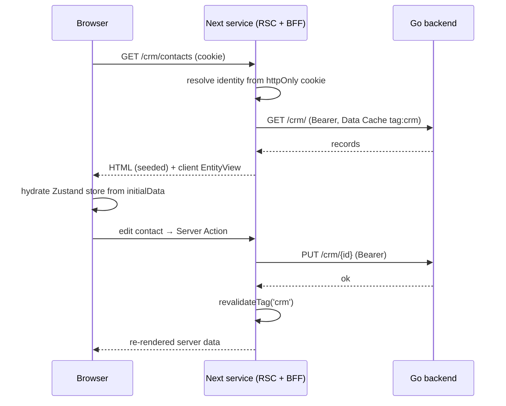
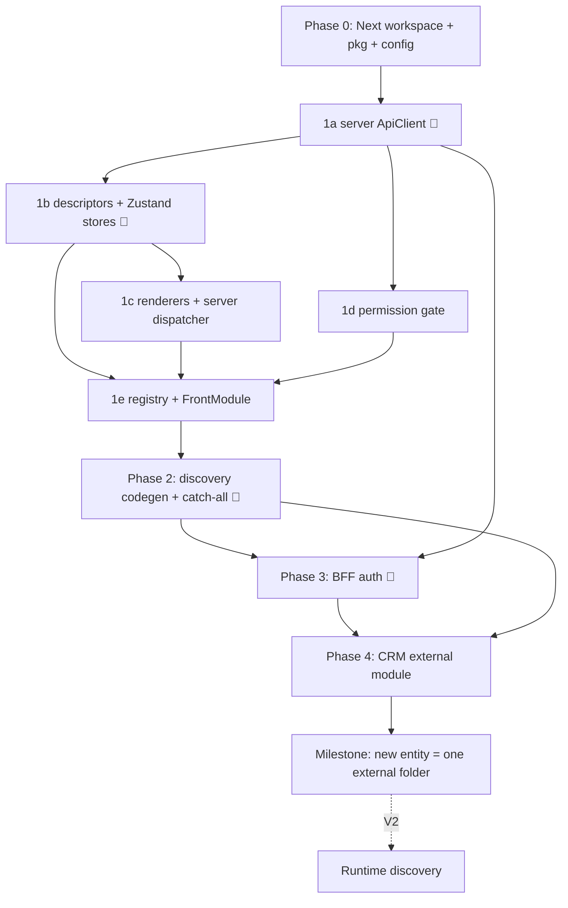

# EERP Frontend Roadmap — Claude Code Build Plan

> **Framework:** React 19 + **Next.js (App Router)** + TypeScript + MUI (MUI X for grid/tree). **Zustand** for client state + persistence. Chosen over Svelte/Vue on familiarity + ERP widget ecosystem; Next chosen so the server does the data work (SSR + caching) and the frontend ships as its own service.
> **Action item (not Claude Code):** revise **ADR-004** — "SvelteKit CSR" → "**React + Next.js App Router, server-rendered (RSC/SSR), running as a standalone service**". The frontend is no longer a CSR bundle stuck to the backend.

## Architecture model (read first)

The frontend is a **standalone Next.js service**. It runs as its own process (its own port / Dockerfile / lifecycle) and talks to the Go backend **only over HTTP** — never its filesystem or process. It may live in the same monorepo and even the same machine; "independent service" is a **runtime** property, not a repo or host one.

Three pillars:

1. **Server does the work (RSC + SSR + Data Cache).** Route data is fetched and rendered on the **server** (React Server Components), cached in Next's Data Cache, and shipped as HTML. The browser hydrates and ships less JS. One fetch is reused across reloads and users — same result, less power. The Next server is a **BFF**: the browser talks only to Next; Next holds the session and calls Go.
2. **Zustand owns client state + storage.** The server owns *data*, *caching*, *session*, and *authorization*. The client owns *interaction state* — per-view stores (records seeded from the server, selection, draft, dirty, expanded) plus cross-cutting UI (theme, sidebar, last route) and a **session mirror** for UI gating. Cross-cutting + session state persists via Zustand `persist` (localStorage). There is **no** `useSyncExternalStore` controller layer — Zustand is the state manager.
3. **Modules are self-contained folders that can live anywhere on disk** and own their frontend, declared in `module.json` → `static_files.views`. At **build time** the frontend reads the **shared `eerp-config.json` at the repo root** (the same file the Go backend uses), scans its `module_root` paths, and compiles each module's views into the Next app. "Module lives anywhere" is build-time wiring, not a runtime filesystem concern.

This mirrors the backend split, but the frontend is now its own deployable:

| Backend | Frontend equivalent | Loading |
|---|---|---|
| Go service (compiled into the monolith) | **v1: build-time aggregation** | build scans module roots, compiles views into the Next service |
| WASM module (Wasmtime, loaded at runtime) | **v2: runtime discovery** | the running service fetches module bundles from `GET /modules`, `import()`s them |

**We build v1 now.** Modules anywhere, self-describing, developed/tested standalone — without federation machinery. Cost: adding/updating a module needs a frontend rebuild + redeploy of the service (fine for an internal authenticated ERP). v2 is captured at the end; the `FrontModule` contract is identical in both, so nothing here is thrown away.

**Two deliberate departures from backend purity — flagged on purpose:**
1. **Modules import a shared package.** Backend forbids modules importing core (ABI boundary for the WASM sandbox + language-agnosticism). The frontend has neither — all TS, one React tree, no sandbox. So the contract is a shared typed package, **`@eerp/core-front`**, exporting descriptors, the Zustand store factories, renderers, server loaders, and `ApiClient`. That package *is* the frontend ABI.
2. **Frontend modules are trusted code, not sandboxed plugins.** A view rendering in your tree (server or client) has full reach. "Portable module" means *your own modules, relocatable and developed in isolation* — not untrusted third-party plugins.

## How to use this doc

Phases are **sequential**; tasks inside a phase are mostly parallel unless noted. Each task has a paste-ready Claude Code prompt and references the **Conventions** block (single source of truth — kept at `packages/core-front/CONVENTIONS.md`).

**Model routing:** lightweight model by default. Escalate (🔺) for: ApiClient auth/refresh, store factories, discovery codegen, the BFF auth layer — security + shared-infra surfaces.

**Test rule (non-negotiable):** every file ships with tests. Unit tests mock `ApiClient`/Server Actions (no network). Integration tests run against MSW or a live backend, are named `*.integration.test.ts`, and are skipped unless `TEST_API_BASE` is set.

---

## Conventions (contracts — source of truth)

| Concern | Contract |
| --- | --- |
| Backend base URL | `{API_BASE}/api/v{API_VERSION}` — **server-side env** (`API_BASE`, `API_VERSION`, default `1`). Never exposed to the browser; the browser calls Next, Next calls Go. |
| Module routes (Go) | `/{module}/` (list, create) + `/{module}/{id}` (get, update, delete). CRM contacts → `/crm/` + `/crm/{id}` |
| Core routes (Go) | `GET /health`, `GET /ready`, `GET /modules` |
| Auth (Go) | `POST /auth/login {email, password}`; `POST /auth/refresh` |
| Session transport | **BFF**: Next exchanges credentials with Go, stores the token in an **HttpOnly cookie on the Next domain**, and resolves identity **server-side** (`next/headers` `cookies()`). The token never reaches client JS. Client holds only a non-secret **session mirror** (identity + permissions) for UI gating. |
| Token TTLs | access **1h**, refresh **7d**, refresh **single-use** (rotation). Reusing a spent refresh = theft → Go kills session → Next clears the cookie → redirect to `/login`. |
| Error envelope (Go) | `{ "error": { "code": "UPPER_SNAKE", "message": "...", "request_id": "01J..." } }` |
| Status map | 400 validation · 401 unauthenticated · 403 forbidden · 404 not found · 409 conflict · 500 `INTERNAL_ERROR` |
| Permissions | DSL `module:resource:action` (`crm:contacts:` then `read` / `write` / `delete`). Wildcards `*:*:read`, `crm:*:read`. **Server** authorizes (RSC/route guard); **client** `<Can>` gates UI off the session mirror. |
| Delete | Soft-delete by default (ADR-003). `remove` archives; add `restore` when backend exposes it. |
| View types (v1) | `form`, `tree`, `dashboard`. New entity = a descriptor; new view type = one store factory + one renderer + one server loader path. |
| Data + mutations | **Reads** server-side via the server `ApiClient` (Next Data Cache, `tags:[entity]`). **Writes** via Server Actions that call Go then `revalidateTag(entity)` — no client→Go calls. |
| **Module FE contract** | `module.json.static_files.views` lists `.ts` files under the module's `views/`. Each file default-exports a **`FrontModule`** ( `{ name; routes:[{ path; descriptor: ViewDescriptor; permission? }] }` ) registered with the engine. A module contributes **descriptors only** — the engine derives the server loader, the Zustand store, and the renderer. Modules import the engine from `@eerp/core-front`. |

## Module discovery (build-time, shared config)

At build time the frontend reads the **shared `eerp-config.json` at the repo root** (`EERP/` — the same file the Go backend uses) and walks each path in its `module_root` array for `module.json`, reads `static_files.views`, and resolves each to `<module_dir>/views/<file>`. Reusing the backend config keeps a single source of truth for module roots; the read is **build-time only**, so the running frontend service never touches the backend's config or filesystem at runtime (BFF boundary preserved). A module is authored once and consumed by both sides via its own `module.json`.

## Translations (i18n — build-time discovery, server-owned language preference)

Gettext-based, **source string = msgid** (`useT()` / `t('Save')`; untranslated text renders verbatim). A module ships translations in an **`i18n/` folder** next to its `module.json`: `<name>.pot` declares its translatable source strings, each `<locale>.po` translates them (`fr.po` → locale `fr`); the shell's own chrome strings sit in `apps/shell/i18n/`. The discovery walk that finds views also finds these folders — **no module.json field, the folder is the contract** (mirrors `.wasm` auto-discovery). The codegen parses every catalog to JSON and writes `src/generated/generated-translations.ts`, which registers them with the engine's shared `translationRegistry`; same-locale catalogs merge across modules (last wins per msgid), and the browser never ships a gettext parser. Adding a language = drop a `.po` in a module's `i18n/` + rebuild.

**Which language renders is server state, resolved per user:** each user's `preferred_locale` lives on their user record (`PUT /api/v1/me/preferences`; `null` = inherit the workspace default, the reserved `"source"` = force the untranslated source language), and the **workspace default** lives in the tenant's `app_settings` (`PUT /api/v1/settings/i18n`, key `i18n.default_locale`, permission `settings:i18n:write`). Both calls go through Server Actions in `apps/shell/src/lib/preferences.ts` over the engine's generic `apiRequest` (BFF, never cached — per-user data must not enter the shared Data Cache). On load the root layout reads `GET /me/preferences` and `<LocaleSync>` applies the resolved locale (`resolveEffectiveLocale` in `src/lib/locale.ts`: preferred wins over default; a locale the build no longer ships falls back) to `useI18nStore` — the client mirror `useT` renders from, updated optimistically by the settings UIs and reconciled on the next load. The store's `enabledLocales` set stays client-owned curation: it decides which shipped translations the Account page offers.

**Settings → Translations** (workspace level) lists the discovered pool (coverage vs `.pot`, contributing modules), lets the user **add/remove** translations from the enabled set, and — for holders of `settings:i18n:write` — sets the **workspace default language**. **Settings → Account** (personal) is where each user picks their own **display language**: workspace default, source, or any enabled translation. The Translations page also **exports** translation files: pick a target language, and it downloads one `.po` per module containing every string that module declares translatable (its `.pot` keys + already-translated msgids), pre-filled with the target language's existing translations and blank where untranslated (`renderModulePo` in the engine) — save the file as `i18n/<locale>.po` in the module folder and rebuild; that is how a new language starts.

## State model (server vs client)

- **Server owns:** data fetching, the Next Data Cache, the session (httpOnly cookie → identity resolved server-side), and authorization.
- **Client (Zustand) owns:** per-view interaction stores seeded from server `initialData` (records, selected, draft, dirty, expanded); a `useSessionStore` (`persist`) mirroring identity/permissions for UI gating; a `useUiStore` (`persist`) for theme/sidebar/last-route.
- **Mutations:** Server Actions → Go → `revalidateTag` → server re-render. The client store updates optimistically, then reconciles with the revalidated server data.

## Testing

Every file ships with tests. Unit tests mock `ApiClient`/Server Actions (no network). Integration tests run against MSW or a live backend, are named `*.integration.test.ts`, and are skipped unless `TEST_API_BASE` is set.

---

## Repo layout

`core-front/` is the **frontend service** — a pnpm workspace holding the **engine package** + the **Next.js host app**. Business modules live **outside the frontend**, under the roots listed in the repo-root `eerp-config.json` (`module_root`) — anywhere on disk those paths point.

```
<repo>/eerp-config.json              # shared backend+frontend config: module_root (paths)
core-front/                          # frontend SERVICE (Next.js) — own process, own Dockerfile
├── package.json                     # pnpm workspace root
├── Dockerfile                       # builds + runs `next start` as a standalone service
├── packages/
│   └── core-front/                  # @eerp/core-front — the engine (publishable/linkable)
│       ├── src/
│       │   ├── api/                 # server ApiClient (BFF) + errors + server-action helpers
│       │   ├── views/               # descriptors, Zustand store factories, renderers, server loader/dispatcher
│       │   ├── auth/                # permission primitives (hasPermission, <Can>, usePermission) + session store
│       │   └── registry/            # FrontModule contract + ModuleRegistry (build-time)
│       ├── index.ts                 # public CLIENT barrel (the "ABI")
│       ├── server.ts                # public SERVER-ONLY barrel ('server-only'): ApiClient, loaders, guards
│       └── CONVENTIONS.md           # the Conventions block above
└── apps/shell/                      # the Next.js App Router service (host)
    ├── next.config.js               # discovery codegen + resolve/transpile external module dirs
    ├── app/
    │   ├── layout.tsx               # RootLayout: MUI AppRouterCacheProvider + ThemeProvider + providers
    │   ├── page.tsx + Menu.tsx      # landing menu: requireAuth (anon → /login), else installed apps + views (permission-filtered)
    │   ├── (auth)/login/page.tsx    # login page (BFF)
    │   ├── api/auth/                # BFF route handlers: login / logout / refresh (proxy to Go, set cookie)
    │   └── [...module]/page.tsx     # catch-all: matches registry → server-fetch → client renderer
    ├── src/
    │   ├── lib/                     # server session (cookies → identity), server ApiClient factory
    │   └── generated/               # generated-modules.ts — GITIGNORED, regenerated at build
    └── ...

<repo>/core/modules/crm/             # a business module — discovered via module_root, relocatable
├── module.json                      # static_files.views: ["CrmViews.ts"]
├── module.go · internal/crm.go      # Go service
└── views/
    └── CrmViews.ts                  # default-exports a FrontModule (descriptors only)
```

`module_root` paths may point anywhere on disk, so a module folder is relocatable — `core/modules/crm` is just the current default. Each module is self-describing via `module.json`; `static_files.views` lists the `.ts` view files under its `views/`.

---

## Data flow



---

## Phase 0 — Workspace, package boundary, discovery config

**Goal:** a runnable empty Next service + empty engine package, wired to discover modules from the shared repo-root `eerp-config.json`. No business logic.

**Claude Code prompt:**
```
Create a pnpm workspace at core-front/ (frontend SERVICE; Next.js App Router; React 19; TS).
packages/core-front: a TS library "@eerp/core-front" with src/{api,views,auth,registry}, a CLIENT
barrel index.ts and a SERVER-ONLY barrel server.ts ('server-only'), both empty. Build with tsup; ship types.
apps/shell: a Next.js 16 App Router app (no /pages dir) depending on @eerp/core-front via the workspace.
Add MUI v6 + @mui/material-nextjs (App Router SSR emotion cache) + @mui/x-data-grid + @mui/x-tree-view,
and zustand. Workspace dev deps: vitest + @testing-library/react + msw, eslint + prettier.
Server env only (no client secrets): API_BASE + API_VERSION (default "1"); type them.
Module discovery reuses the existing repo-root eerp-config.json (its module_root array) — do NOT create a
separate frontend config. gitignore apps/shell/src/generated/.
Add a Dockerfile that builds the workspace and runs `next start` as a standalone service on its own port.
app/layout.tsx: AppRouterCacheProvider + ThemeProvider; a placeholder "/" page. One smoke test renders it.
Copy the Conventions block into packages/core-front/CONVENTIONS.md.
```
**DoD:** `pnpm dev` serves the Next app; `pnpm build` produces a standalone service (`next start` runs); `pnpm test` passes; the engine package builds and is importable from the app; lint clean.

---

## Phase 1 — Front-core engine (`@eerp/core-front`)

**Goal:** the reusable, metadata-driven, server-rendered view engine. Nothing module-specific. Everything lives in `packages/core-front` and is re-exported from `index.ts` (client) or `server.ts` (server-only).

### 1a 🔺 Server ApiClient + error model (BFF)
Build first — everything depends on it.
```
In @eerp/core-front, implement src/api/ApiClient.ts + errors.ts per CONVENTIONS.md. This client runs
SERVER-SIDE (RSC, route handlers, Server Actions); mark the module 'server-only' and export via server.ts.

errors.ts: class ApiError extends Error {code, message, requestId, status}. parseError(response) reads the
{error:{code,message,request_id}} envelope; if the body isn't that shape, synthesize code from status
(500 -> INTERNAL_ERROR).

ApiClient:
- createServerApiClient(): reads the session cookie (next/headers cookies()), builds `${API_BASE}/api/v${API_VERSION}`,
  attaches Authorization: Bearer to every Go call.
- reads integrate the Next Data Cache: GET uses fetch with { next: { tags:[entity] } }; mutations call
  revalidateTag(entity) after success.
- methods: list<T>(entity), get<T>(entity,id), create<T>(entity,body), update<T>(entity,id,body),
  remove(entity,id) (soft delete). entity maps straight to Go routes: list('crm') -> GET /crm/.
- 401-with-expired: refresh ONCE (POST /auth/refresh) then retry the original request ONCE. Serialize refreshes via a
  single shared in-flight promise (the refresh token is single-use — a double refresh trips theft detection). On
  refresh failure: clear the session cookie and signal session-expired (callers redirect to /login). Never loop.
- always surface requestId on errors.

Tests (mock fetch): success; 404 -> code from envelope; 500 -> INTERNAL_ERROR; 401 -> refresh+retry ok;
401 -> refresh fails -> cookie cleared + session-expired; CONCURRENT 401s -> exactly one refresh; mutation ->
revalidateTag called.
```
**DoD:** all ApiError paths covered; single-flight refresh proven under concurrency; cache tags asserted.

### 1b 🔺 Descriptors + Zustand store factories
The client state engine — Zustand stores seeded by server data (no client load-on-mount).
```
In @eerp/core-front, implement src/views/descriptor.ts + Zustand store factories.

descriptor.ts: type ViewType='form'|'tree'|'dashboard';
  FieldDescriptor {name; label; type:'text'|'number'|'date'|'relation'|'boolean'; required?};
  ViewDescriptor<T> {entity:string; viewType:ViewType; fields:FieldDescriptor[]; permissions?:string[]}.

stores (zustand): each store is SEEDED with server-fetched initialData; it does NOT fetch on mount.
- createEntityStore<T extends {id:string}>(descriptor, initialData): { records, selected, error, setSelected }.
- createFormStore: draft:Partial<T>, dirty, edit(record), setField(k,v), commit() -> invokes the entity's
  Server Action (create vs update by id), optimistic update, clears dirty; server revalidation supplies fresh data.
- createTreeStore<T extends {id;parent_id?}>: expanded:Set, roots, children(id), toggle(id).
- createDashboardStore: widgets[], refresh() -> Server Action.
- useSessionStore (zustand + persist): identity + effective permissions mirror for UI gating (server is source of truth).
- useUiStore (zustand + persist): theme, sidebar, lastRoute.
Provide typed selector hooks. NO useSyncExternalStore / controller classes — Zustand is the state manager.

Tests (mock Server Actions): store seeds from initialData; Form commit routes create vs update by id and clears
dirty; Tree roots/children/toggle; persist round-trips session/ui state.
```
**DoD:** stores seed from server data; create-vs-update proven; persisted stores round-trip.

### 1c Renderers + server dispatcher
```
In @eerp/core-front, implement src/views/ client renderers + a server loader/dispatcher (RSC + MUI).
Server: loadView(descriptor, serverApi) -> initialData (cached). EntityViewServer({descriptor}) is a Server
Component: fetches initialData, then renders the client <EntityView descriptor initialData/>.
Client ('use client') EntityView<T>: builds the Zustand store from descriptor + initialData; MUI Alert on error
(requestId in caption); else dispatch on viewType to Form|Tree|DashboardRenderer.
FormRenderer: fields -> MUI inputs bound to draft via setField; Save calls commit() (Server Action), disabled unless
dirty; map field.type to control (text/number/date/Switch/relation-as-Select stub).
TreeRenderer: MUI X RichTreeView from roots/children + expanded/toggle; plus a flat 'list' fallback in
@mui/x-data-grid (columns from fields).
DashboardRenderer: responsive MUI Grid of widget cards (stub widget contract).
Tests (RTL + seeded store): error alert; correct renderer by viewType; Save disabled until change.
```
**DoD:** all three view types render server-seeded from descriptor with zero entity-specific code.

### 1d Permission gate
```
In @eerp/core-front, src/auth/permissions.ts: hasPermission(effective:string[], required:string) with
segment-wise wildcard matching over module:resource:action (* matches any segment; 'crm:*:read' grants
'crm:contacts:read'; '*:*:read' grants any :read).
Server: requirePermission(required) for RSC/route handlers (redirect or 403 when missing).
Client: <Can permission> component + usePermission(required) hook reading the effective set from useSessionStore.
Tests: allow/deny matrix incl. wildcards; server guard denies without the permission.
```
**DoD:** wildcard matcher correct on a deny/allow matrix; server guard enforced.

### 1e Module registry + FrontModule contract
```
In @eerp/core-front, src/registry/: export FrontModule
{ name; routes:{ path; descriptor:ViewDescriptor; permission? }[] }.
ModuleRegistry with register(module) and buildRegistry() -> a path->routeConfig map the catch-all App Router page
consumes (descriptor + permission per path). A module contributes DESCRIPTORS ONLY — the engine derives the server
loader, the Zustand store, and the renderer. Re-export the public CLIENT API from index.ts and the SERVER-ONLY API
(ApiClient, loaders, guards) from server.ts.
Tests: registering a module yields guarded route configs in order; nothing reaches engine internals beyond the barrels.
```
**DoD:** a module registers and produces guarded route configs; access only via the public barrels.

**Phase 1 exit:** the engine renders any entity from a descriptor on the server, hydrates a Zustand store on the client, gates on permissions, talks to Go through one server client — but no module is wired and the engine doesn't yet know how to find external module folders.

---

## Phase 2 — Module discovery & build pipeline (host) 🔺

**Goal:** make external module folders (anywhere on disk) compile into the Next service, driven by the repo-root `eerp-config.json` (`module_root`) + `module.json.static_files.views`. This is the portability centerpiece.

### 2a Discovery codegen + catch-all route
```
In apps/shell, implement build-time module discovery (Next — no Vite plugin).

A generate script (run on prebuild AND on dev start; re-run when a module.json under the roots changes) reads
the repo-root eerp-config.json { module_root: string[] } (the SAME file the Go backend reads — shared, build-time only).
For each root: walk for module.json; read static_files.views (array); resolve each to <module_dir>/views/<file>.

The pipeline must:
1. Generate apps/shell/src/generated/generated-modules.ts: real STATIC imports of each resolved view file
   (via an "@module/<name>/..." alias) and a call registering each default export with a single ModuleRegistry
   instance. (Static imports so the bundler tree-shakes normally.)
2. In next.config.js: make external module dirs resolvable AND transpiled (Next's analog of Vite's server.fs.allow —
   add the dirs to the bundler's resolve roots + include them in the TS/SWC transform); alias "@module/<name>".
3. The catch-all app/[...module]/page.tsx (Server Component) looks the pathname up in buildRegistry(), runs the
   server permission guard, server-fetches via createServerApiClient() (cached), and renders the client EntityView
   seeded with initialData. Mutations go through the engine's Server Actions.
Extend tsconfig to include the module roots so types resolve across them.

Tests: a temp fixture root with a module.json + a views file exporting a trivial FrontModule -> the generator emits a
manifest that imports + registers it, and the catch-all resolves its route. Ship that fixture as the integration test
(proves the external-folder pipeline end-to-end, before auth or CRM).
```
**DoD:** a throwaway module folder *outside* the frontend, listed in the repo-root `eerp-config.json`'s `module_root`, renders its route **server-side** in the running service; editing its view rebuilds. The generated manifest is gitignored.

**Phase 2 exit:** "module anywhere on disk → compiled into the Next service via its own `module.json`" works. Real modules (CRM) now just need a folder + descriptor.

---

## Phase 3 — Auth frontend (BFF, host)

**Goal:** real login/session through the BFF — credentials exchanged server-side, token in an httpOnly cookie, identity resolved on the server. The smoke test for Phase 1.

### 3a 🔺 BFF auth + session lifecycle
```
In apps/shell, implement BFF auth. Identity = { userId; tenantId; roles:string[]; permissions:string[] }.
Route handlers under app/api/auth/:
- login (POST {email,password}): call Go POST /auth/login; on success set an httpOnly, Secure, SameSite session
  cookie on the Next domain; return the non-secret identity (for the client session mirror).
- logout: clear the cookie; best-effort Go logout.
- refresh: server-side, single-use rotation; reused/spent refresh -> clear cookie.
Server: src/lib/session.ts resolves identity from the cookie (next/headers) for RSC + guards.
Wire ApiClient.onSessionExpired -> clear cookie -> redirect /login (covers spent/rotated refresh = theft).
Hydrate useSessionStore (client) from the server-resolved identity on first render; feed permissions into <Can>.
Tests (mock Go via MSW): login sets cookie + returns identity; login 401 surfaces ApiError; expired refresh clears
cookie -> anon.
```
**DoD:** login/logout/refresh correct; token never in client JS; theft-path forces logout.

### 3b Login page + route guard
```
In apps/shell, implement RequireAuth as a SERVER check (RSC/middleware: redirect to /login when anon; the catch-all
already runs the permission guard). LoginPage (client, MUI email+password): POST app/api/auth/login, show the ApiError
message inline on failure, redirect to the intended route on success.
Tests (RTL + MSW): anon hitting a module route redirects to /login; LoginPage shows the server message on bad creds,
redirects on success.
```
**DoD:** unauthenticated users can't reach module routes (server-enforced); bad creds show the server message; good creds land in the app.

**Phase 3 exit:** log in against the live backend, session survives reload via the httpOnly cookie (resolved server-side), expired/stolen refresh cleanly logs out. Validates Phase 1's ApiClient + error model + permission plumbing.

---

## Phase 4 — CRM module (first external business module)

**Goal:** prove the metadata-driven, server-rendered design *and* the portable-folder pipeline: a real entity needs only an external folder + a descriptor.

### 4a The CRM module folder
```
Extend the EXISTING crm module at core/modules/crm (it already has module.json + module.go + internal/crm.go,
with static_files currently {}). Do NOT create a new folder. Add to it:
- set module.json static_files.views: ["CrmViews.ts"]
- package.json depending on @eerp/core-front (link it for dev)
- views/CrmViews.ts: a Contact type {id; tenant_id; name; email; phone?; status?; parent_id?} and a
  default-exported FrontModule "crm" with DESCRIPTORS ONLY:
    * '/crm/contacts/:id' -> ViewDescriptor over entity 'crm', viewType 'form', guard crm:contacts:read
      (write enables Save)
    * '/crm/contacts' -> ViewDescriptor over 'crm', viewType 'tree' (flat/DataGrid mode), guard crm:contacts:read;
      row actions edit (-> form) and archive (-> remove, needs crm:contacts:delete)
  No controllers, no renderers — only descriptors; the engine derives server loader + store + renderer.
Ensure core/modules/crm's root is in the repo-root eerp-config.json module_root (it already is). Rebuild — the discovery
codegen picks it up. If you need a custom CRM component, STOP — that's an engine gap; fix it in @eerp/core-front.
Unit tests (inside the module): the FrontModule wires the right descriptors/permissions per path.
```
**DoD:** CRM list + form work purely through the engine, server-rendered, from a folder *outside* the frontend service; the only CRM code is the descriptors.

### 4b End-to-end integration test
```
Add crm.integration.test.ts (skipped unless TEST_API_BASE set) that, against a running backend: logs in (BFF),
lists contacts, creates one, edits it, archives it (soft delete), asserting each step's API shape and that reads come
from the server (cache tag) and writes revalidate.
Add an MSW-mocked twin that runs in CI without a backend, replaying the same flow against handlers emitting the real
error/response envelopes.
```
**DoD:** full CRUD round-trip passes against MSW and (when available) a live backend.

**Phase 4 exit / milestone:** adding the next entity (e.g. an external inventory module) is one more folder + descriptor under a `module_root` path. If that's true, the engine is done and the architecture goal — metadata-driven, server-rendered, relocatable frontend modules in a standalone service — is met.

---

## Future — V2 runtime discovery (deferred; do not build now)

Removes the rebuild-to-add-a-module cost, mirroring WASM runtime loading and the V2.0.0 registry. Capture only; no prompts yet.

- Each module's frontend is **pre-built** into its own bundle that **externalizes** React/MUI/`@eerp/core-front` (shared singletons provided by the host).
- The running Next service fetches a manifest from the extended `GET /modules` (each module's frontend bundle URL + version) and `import()`s each, registering via the *same* `FrontModule` contract.
- Bundles served from the **same registry/bucket** as WASM binaries (V2.0.0 "Registry / versioned storage"), versioned per module.
- Migration is additive: the build-time path keeps working; runtime discovery is opt-in per deployment. v1 `FrontModule` definitions carry over unchanged.

---

## Deployment — the frontend as a standalone service

- Built and run independently: `pnpm build` then `next start` (or the Dockerfile) on its own port. Separately deployable from the Go backend even when they share the monorepo.
- Configured by **server env**: `API_BASE` (Go backend origin) + `API_VERSION`. The browser never sees these — it talks only to the Next service.
- The BFF boundary means the Go backend can sit on a private network; only the Next service needs to reach it.

---

## Build order at a glance



## Sequencing notes

- **1a blocks everything.** Build/test the server client before any UI.
- **1b before 1c.** 1d and 1e parallelize once 1a/1b land.
- **Phase 2 needs 1e** (it wires the registry to disk + the catch-all route). Its fixture proves the portable-folder pipeline *before* auth/CRM — keep that isolation.
- **Phase 3 needs 1a + 1d**, not the renderers.
- **Phase 4 is the real test of Phases 1+2.** Custom CRM component code = a Phase-1 engine bug, not a Phase-4 feature.
- Revisit the heavy-grid choice (MUI X DataGrid vs AG Grid vs TanStack Table) only when a real grid hits limits — not before.
- Pursue V2 runtime discovery only when "add a module without redeploying the service" becomes a real requirement.
