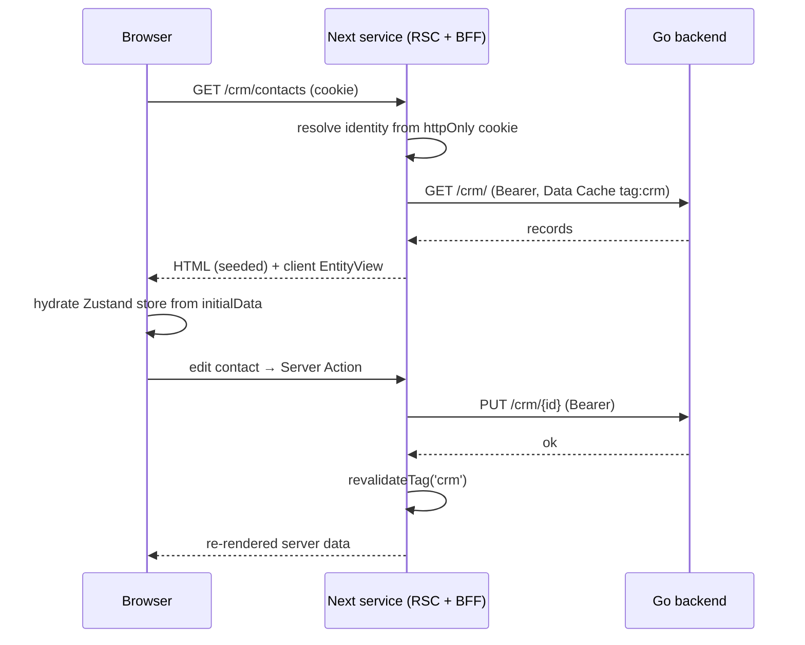
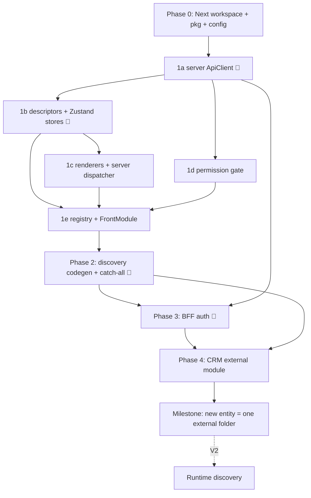

# EERP Frontend Roadmap — Claude Code Build Plan

> **Framework:** React 19 + **Next.js (App Router)** + TypeScript + MUI (MUI X for grid/tree). **Zustand** for client state + persistence. Chosen over Svelte/Vue on familiarity + ERP widget ecosystem; Next chosen so the server does the data work (SSR + caching) and the frontend ships as its own service.
> **Action item (not Claude Code):** revise **ADR-004** — "SvelteKit CSR" → "**React + Next.js App Router, server-rendered (RSC/SSR), running as a standalone service**". The frontend is no longer a CSR bundle stuck to the backend.

## Architecture model (read first)

The frontend is a **standalone Next.js service**. It runs as its own process (its own port / Dockerfile / lifecycle) and talks to the Go backend **only over HTTP** — never its filesystem or process. It may live in the same monorepo and even the same machine; "independent service" is a **runtime** property, not a repo or host one.

Three pillars:

1. **Server does the work (RSC + SSR + Data Cache).** Route data is fetched and rendered on the **server** (React Server Components), cached in Next's Data Cache, and shipped as HTML. The browser hydrates and ships less JS. One fetch is reused across reloads and users — same result, less power. The Next server is a **BFF**: the browser talks only to Next; Next holds the session and calls Go.
2. **Zustand owns client state + storage.** The server owns *data*, *caching*, *session*, and *authorization*. The client owns *interaction state* — per-view stores (records seeded from the server, selection, draft, dirty, expanded) plus cross-cutting UI (theme, sidebar, last route) and a **session mirror** for UI gating. Cross-cutting + session state persists via Zustand `persist` (localStorage). There is **no** `useSyncExternalStore` controller layer — Zustand is the state manager.
3. **Modules are self-contained folders that can live anywhere on disk** and own their frontend, declared in `module.json` → `static_files.views`. At **build time** the frontend reads the **shared `eerp-config.json` at the repo root** (the same file the Go backend uses), scans its `module_root` paths, and compiles each module's views into the Next app. "Module lives anywhere" is build-time wiring, not a runtime filesystem concern.

This mirrors the backend split, but the frontend is now its own deployable:

| Backend | Frontend equivalent | Loading |
|---|---|---|
| Go service (compiled into the monolith) | **v1: build-time aggregation** | build scans module roots, compiles views into the Next service |
| WASM module (Wasmtime, loaded at runtime) | **v2: runtime discovery** | the running service fetches module bundles from `GET /modules`, `import()`s them |

**We build v1 now.** Modules anywhere, self-describing, developed/tested standalone — without federation machinery. Cost: adding/updating a module needs a frontend rebuild + redeploy of the service (fine for an internal authenticated ERP). v2 is captured at the end; the `FrontModule` contract is identical in both, so nothing here is thrown away.

**Two deliberate departures from backend purity — flagged on purpose:**
1. **Modules import a shared package.** Backend forbids modules importing core (ABI boundary for the WASM sandbox + language-agnosticism). The frontend has neither — all TS, one React tree, no sandbox. So the contract is a shared typed package, **`@eerp/core-front`**, exporting descriptors, the Zustand store factories, renderers, server loaders, and `ApiClient`. That package *is* the frontend ABI.
2. **Frontend modules are trusted code, not sandboxed plugins.** A view rendering in your tree (server or client) has full reach. "Portable module" means *your own modules, relocatable and developed in isolation* — not untrusted third-party plugins.

## How to use this doc

Phases are **sequential**; tasks inside a phase are mostly parallel unless noted. Each task has a paste-ready Claude Code prompt and references the **Conventions** block (single source of truth — kept at `packages/core-front/CONVENTIONS.md`).

**Model routing:** lightweight model by default. Escalate (🔺) for: ApiClient auth/refresh, store factories, discovery codegen, the BFF auth layer — security + shared-infra surfaces.

**Test rule (non-negotiable):** every file ships with tests. Unit tests mock `ApiClient`/Server Actions (no network). Integration tests run against MSW or a live backend, are named `*.integration.test.ts`, and are skipped unless `TEST_API_BASE` is set.

---

## Conventions (contracts — source of truth)

| Concern | Contract |
| --- | --- |
| Backend base URL | `{API_BASE}/api/v{API_VERSION}` — **server-side env** (`API_BASE`, `API_VERSION`, default `1`). Never exposed to the browser; the browser calls Next, Next calls Go. |
| Module routes (Go) | `/{module}/` (list, create) + `/{module}/{id}` (get, update, delete). CRM contacts → `/crm/` + `/crm/{id}` |
| Core routes (Go) | `GET /health`, `GET /ready`, `GET /modules` |
| Auth (Go) | `POST /auth/login {email, password}`; `POST /auth/refresh` |
| Session transport | **BFF**: Next exchanges credentials with Go, stores the token in an **HttpOnly cookie on the Next domain**, and resolves identity **server-side** (`next/headers` `cookies()`). The token never reaches client JS. Client holds only a non-secret **session mirror** (identity + permissions) for UI gating. |
| Token TTLs | access **1h**, refresh **7d**, refresh **single-use** (rotation). Reusing a spent refresh = theft → Go kills session → Next clears the cookie → redirect to `/login`. |
| Session refresh | Two layers, because Next forbids writing cookies during a Server Component render (only a Route Handler/Server Action/`proxy.ts` can) and Go's refresh token is single-use — a refresh that can't persist its rotated cookie would silently spend the token and brick the next real refresh. **`apps/shell/proxy.ts`** (Next's "middleware" file convention, renamed in Next 16) runs ahead of every request and proactively rotates the session whenever the access cookie is absent — this is also what keeps a session alive for the refresh token's full 7-day lifetime instead of dropping to anonymous every 1h. **`ApiClient.ts`'s `fetchWithRefresh`** stays as the reactive fallback for Route Handlers/Server Actions (login/refresh/logout, mutations, the pictures BFF): on a 401 it refreshes once and retries once, same as before. If a 401 still reaches it from an RSC read (`canWriteCookies()`, probed via a throwaway `cookies().delete()` — Next exposes no public "can I write cookies here" check), it fails closed and surfaces the 401 instead of attempting a refresh it can't safely persist. |
| Error envelope (Go) | `{ "error": { "code": "UPPER_SNAKE", "message": "...", "request_id": "01J..." } }` |
| Status map | 400 validation · 401 unauthenticated · 403 forbidden · 404 not found · 409 conflict · 500 `INTERNAL_ERROR` |
| Permissions | DSL `module:resource:action` (`crm:contacts:` then `read` / `write` / `delete`). Wildcards `*:*:read`, `crm:*:read`. **Server** authorizes (RSC/route guard); **client** `<Can>` gates UI off the session mirror. |
| Delete | Soft-delete by default (ADR-003). `remove` archives; add `restore` when backend exposes it. |
| View types (v1) | `form`, `tree`, `dashboard`, `catalog`. New entity = a descriptor; new view type = one store factory + one renderer + one server loader path. **`catalog`** (`docs/roadmaps/app-store.md` Phase 2, `catalog-renderer.tsx`) is an icon/title/subtitle list over `createEntityStore` (reusing the plain list-fetch loader, no new server path) — `ViewDescriptor.catalog: { icon?, title, subtitle? }` names the fields a row's Avatar/title/subtitle read from (a bare 40px Avatar shows the icon field's string value, or the title's first letter uppercased if absent or the field is empty); `validateCatalogDescriptor()` (`registry.ts`'s `validateDescriptor()` calls it for every registration) requires `catalog.title` to be a real field on `viewType: 'catalog'` descriptors. A row navigates to `formPath` with `:id` replaced, exactly like a tree row. The engine also exports `useRecentlyChangedStore` (`recently-changed-store.ts`) — a session-only, non-persisted `Set<id>` any host action outside the generic form commit can mark via `markChanged(id)`; `CatalogRenderer` badges a row (`Chip`, label `t('Updated')`) when its id is in the set. The App Store's own catalog (below) is the first consumer of both, but neither is App-Store-specific. |
| Layout tree | `ViewDescriptor.layout?: LayoutNode[]` — a presentational tree over `fields` (`{ kind: 'group'\|'row'\|'section'\|'notebook'\|'page', id?, title?, columns?, children }` containers, `{ kind: 'field', name, variant? }` leaves), addressed by field name or an explicit `id` (the anchor a future view EXTENSION targets — `docs/roadmaps/view-customization.md`). Omitted ⇒ `normalizeLayout()` synthesizes a default — for `viewType: 'tree'\|'dashboard'` (any non-form view) that's the original one implicit, untitled group wrapping every field in declaration order, unchanged since the tree was introduced; for `viewType: 'form'` it's the richer default anatomy below (`docs/roadmaps/responsive-displays.md`, Phase 3–4/ADR-007). Either way it's full back-compat, zero renderer change for descriptors that predate the tree/this default. **Every renderer goes through `normalizeLayout()`** — `FormRenderer` (`layout-renderer.tsx`'s `LayoutForm`, also reused by the relation widgets' create-from-search wizard) and `TreeRenderer`'s DataGrid columns / hierarchy label field (via `layoutFieldOrder()`) — never `descriptor.fields` directly for display order/grouping. `normalizeLayout` validates every field-leaf exists in `fields`, no field appears twice, every `id` is unique, and (Phase 4) a `page` is a direct child of a `notebook` and nowhere else, every `page` declares a `title` (it doubles as its tab label), a `notebook`'s children are ALL `page`s, and at most one `notebook` exists per layout; violations are a registration-time error naming the field/id/kind, not a silently dropped node. |
| Default form anatomy | `viewType: 'form'` + no explicit `layout` ⇒ `normalizeLayout()` synthesizes (never writes back) `FORM_HEADER_ID` (`'__form_header'`, a `row`: the first `widget: 'picture'` boolean field, then the first plain — non-`long` — `text` field with `variant: 'title'` — omitted pieces just don't appear, and the row itself is skipped if BOTH are absent), `FORM_COLUMNS_ID` (`'__form_columns'`, a `group` with `columns: 2` holding every remaining non-`long` field, declaration order), and `FORM_NOTEBOOK_ID` (`'__form_notebook'`, a `notebook` whose first tab, `PAGE_SETTINGS_ID` — title `'Settings'` — holds every `widget: 'long'` field, declaration order; renders even with zero long fields, since it's also where a record's own runtime pages attach — see the Runtime notebook pages row below). `LayoutFieldNode.variant?: 'title'` renders a large, borderless-until-focus input (label as placeholder) via `layout-renderer.tsx`'s `TitleField` — a real text field underneath, so required/disabled/error affordances survive; a `long` field is never title candidate material (a multi-line note doesn't belong as the big heading). `LayoutContainerNode.columns?: number` renders as a CSS **container-query** grid (`container-type: inline-size` wrapper + `@container (min-width: layout.formTwoColumnMinWidth)`, never a viewport media query — the SAME `LayoutForm` renders both the full-width form page and the relation wizard's ~552px dialog, and only the dialog should ever collapse to one column). `kind: 'row'` stacks below `sm` on phone EXCEPT `__form_header` (stays side-by-side at every width — a picture beside a big title doesn't need to stack). A `notebook` renders as MUI `Tabs` (scrollable) over its `page` children, each page's `title` doubling as its tab label; the active tab is local, ephemeral state and every page's content stays MOUNTED at all times (CSS `hidden`, never a conditional unmount) — an inactive page's field mount effects (pictures, relation widgets) stay alive and a dirty draft on one page survives switching to another and back. `FormRenderer` renders at full width (`maxWidth: '100%'`) inside RootLayout's page inset — `layout.formMaxWidth` now only sizes the relation wizard's dialog. Because the synthesized nodes carry the same stable, well-known ids as any hand-authored node, a view EXTENSION (ADR-005) targets them exactly like it would a declared layout — `applyExtension` already normalizes the layout before applying ops, so a form-view `addField` with no target lands inside `__form_columns` (skipping past `__form_notebook`, which structurally can't hold a bare field — the last ELIGIBLE top-level container, not literally the last one), a target-less `widget: 'long'` `addField` lands on the Settings page instead when one exists, and `addNode`/`addField`/`move` already work against a page's own id — a module adds a whole new notebook tab with the SAME three ops any other layout restructuring uses, no new extension API (`crminheritdemo`'s extension-added `comment`, marked `widget: 'long'`, lands on the Settings page with zero extra wiring — proof, not just claim). See ADR-007 for the full rationale, including the deliberate three-way split (descriptor / `app_settings` / per-record service data) the Phase 5 runtime-pages service builds on. |
| Runtime notebook pages | A record's OWN pages (e.g. "Meeting notes" added to one crm row) are per-record service data, not descriptor structure and not `app_settings` (ADR-007's third category) — Go: `internal/notebook/`, table `notebook_page` (`tenant_id`/`table_name`/`record_id` anchor, `title`, `position`, `content`), routes `GET/POST /api/v1/notebook_pages` (query `table`+`record`) + `PUT/DELETE /api/v1/notebook_pages/:id`, permissions `notebook_pages:notebook_pages:*` derived from the route (underscored to match — the route itself is `/notebook_pages`, not a hyphenated spelling). Frontend: `NotebookOps` (`notebook-ops.tsx`) is `GraphOps`'s exact shape — `{ list, create, update, remove }`, a context/provider/hook, `useNotebookOps()` returning `null` with no provider mounted — bound Server Actions (`apps/shell/src/lib/notebook-actions.ts`) the root layout provides once via `NotebookOpsProvider`. `layout-renderer.tsx`'s `NotebookNode` appends one tab per stored page AFTER the declared ones in the SAME `Tabs` strip (keys namespaced `d:`/`s:` so a declared id can never collide with a stored row's UUID), each backed by its own `StoredPageEditor` — keep-mounted like declared pages, its own local title/content state so a dirty edit survives switching tabs, `NotebookOps.update`/`.remove` the only write path a save/delete ever takes (a page save can never dirty the record's form draft). A trailing `+ Add page` control (a plain `Button` beside `Tabs`, not a `Tab` itself — `Tabs` clones its immediate children, which a `Tooltip`-wrapped `Tab` would fight) is HIDDEN entirely without `notebook_pages:notebook_pages:write` (`CreateBar`'s posture) and DISABLED with the picture widgets' own "Available once the record has been saved." hint when the record has no id yet. No `NotebookOpsProvider` mounted ⇒ declared pages render alone, inert, the same posture `RelationOps`/`GraphOps` take. See `docs/roadmaps/responsive-displays.md` Phase 5. |
| Field states | `FieldDescriptor.states?: { visible?; readOnly?; required?: Condition }`, `Condition = { field, op: 'eq'\|'ne'\|'in'\|'set'\|'unset', value? } \| { all: Condition[] } \| { any: Condition[] }` — a declarative expression, never a function (RSC boundary), evaluated by `evaluateCondition()` against the CURRENT DRAFT on every render, so states react live to the user's own edits (e.g. a status field flipping a comment field visible) with no extra plumbing. `visible: false` unmounts the field in `LayoutForm` WITHOUT touching its draft value — toggling it back on shows whatever was last set. `readOnly: true` ORs into the widget's disabled state alongside the existing compute-disables rule AND the static `FieldDescriptor.readOnly?: boolean` (`docs/roadmaps/app-store.md` Phase 2 — `layout-renderer.tsx`'s disabled computation is `Boolean(field.compute) || field.readOnly === true || stateReadOnly`; static wins, nothing un-disables a field once ANY of the three says so). A static `readOnly: true` is how the App Store's own form makes every field display-only while still using the generic `LayoutForm`/commit machinery (Decision 3 in `docs/adr/ADR-008-module-lifecycle-via-api.md`) — since no field is ever writable, that form's Save/commit path simply never fires; a module wanting a genuine write affordance renders it as host chrome beside the view (the `ActivateButton`/`CreateBar` posture), not as a field. `required: true` (state-derived or the static flag) blocks `commit()` via `requiredMissing()`, surfaced through the form's existing `ApiError` slot (`code: 'VALIDATION_ERROR'`) — but ONLY among currently visible fields; a hidden field can never block commit. |
| View extensions | `FrontModule.extends?: ViewExtension[]`, `ViewExtension = { path, operations: Operation[] }` (`src/registry/extensions.ts`) — a module reshapes ANOTHER module's (or its own) already-registered route without touching its code: `addField`/`removeField`/`setField`/`move`/`addNode`/`setDescriptor`, applied by the pure `applyExtension()` and run once per module at `ModuleRegistry.register()` time — `ModuleRegistry` keeps a `resolvedRoutes` map (base descriptor, then each extension's merged result in turn) that `buildRegistry()`/`menu()`/`listViews()`/`formDescriptorFor()` simply read; extensions apply in registration order, after the base and after earlier modules' extensions. An extension targeting an unregistered path, an unknown field/target/id, a duplicate field name, or a malformed `move` (both or neither of `name`/`id`) throws, naming the module, path, and operation — registration-time, not render-time. `module.json` `depends` (threaded via `RegisterOptions.depends`, discovery-generated) drives BOTH the module registration order (`topoSortModules` in `module-discovery.mjs` — a real dependency-graph topological sort, name as tie-break, cycle ⇒ build error) and a `console.warn` when a module extends a path owned by a module absent from its own `depends` (a hygiene check, not a hard gate). See `docs/roadmaps/view-customization.md`. |
| Field widgets | `FieldDescriptor.widget` picks presentation per data type (`FIELD_WIDGETS` matrix, first entry = default): text `simple`/`long`/`phone`/**`table`** · number `float`/`int`/`percent`/`stars`/`phone` · boolean `switch`/`picture`/`signature` · selection `select` (only entry) · date/relation stock. `widgetOptions` tunes it (`{ max: 5 }`, `{ decimals: 0 }`, `{ base: 'percent' }`) — JSON only. Invalid pairs fail at `registry.register`, naming module/route/field. Numeric widgets format exclusively through `useNumberFormat()` (workspace separators — `app_settings` `format.number`, edited in Settings → Formats behind `settings:format:write`, mirrored client-side by `useFormatStore` and seeded by the preferences load). Boolean `picture`/`signature` are backed by the core picture service (field true ⇔ a picture exists on the `(entity, record, field)` anchor): the widgets talk to the `/api/pictures` BFF routes via `createPictureClient()` (stub with `PictureClientProvider` in tests), uploads land before the record PUT commits the flag, and a record with no id yet renders a hint instead of an upload surface. `type: 'selection'` requires a non-empty `selection: { options: string[] }` (registration error otherwise); no `default` declared ⇒ the FIRST option (a selection has no natural empty value — `fieldZeroDefault`'s type-specific rule). See `docs/roadmaps/field-widgets.md`. **`text/table`** (`TableWidget`, `widgets.tsx`, `docs/roadmaps/app-store.md` Phase 2) renders a plain, read-only MUI `Table` over an array-valued field — `widgetOptions.columns: { key, label }[]` names which properties of each row object become columns, in order; an empty array renders `t(widgetOptions.emptyLabel ?? 'Nothing here yet.')` instead (the custom label always passes through `t()`, never rendered raw, since it's developer-authored UI chrome). It's a generic list-of-objects primitive — the App Store's Views/Reports notebook pages (below) are its first use, not a special case baked into the widget. |
| Relation fields | `type: 'relation'` requires a `relation` block `{ entity, kind, labelField? ('name'), inverseField? (o2m), via? (m2m junction entity), viaFields? }`; the widget derives from the kind (`many2one`→search+wizard on the FK column, `one2many`→read-only embedded grid of `inverseField`-scoped records, `many2many`→tag chips over junction rows named `<own>_id`/`<related>_id` by default). o2m/m2m fields are **virtual** — auto-stripped from commit payloads; the tags widget writes junction rows at interaction time through the generic surface. Data path: **RelationOps** — entity-generic Server Actions (`src/lib/relation-actions.ts`) mounted once by the root layout's `RelationOpsProvider`; Go authorizes every query/link from the session (stub the provider in tests). Server-side refinement rides `EntityListOptions` (`filter[col]` exact / `search[col]` ILIKE / paging) on the generic list endpoint. Unlink affordance: hover the tag chip, cross on its right. **Create-from-search:** m2o/m2m dropdowns list up to 6 results plus a 7th "Create a new <entity>" line; the o2m grid gets the same line under it. Picking it opens a creation dialog rendering the target entity's own registered form descriptor (fallback: a one-field labelField form) over a real form store bound to `RelationOps.create` — defaults/behaviors/store:false apply as on the entity's own form; the typed search text seeds the labelField, o2m presets (and hides) the inverse FK, and the created record is linked exactly like a pick. |
| Field behaviors | `FieldDescriptor.compute` names a function registered via `registerFieldFunction({ entity, name, depends, handler })` in the module's views file (a NAME, never a function — descriptors cross the RSC boundary); `registerOnChange({ entity, name, onChange, handler })` patches the draft when listed fields change. The form store fires on_change then recomputes dependent computes in topological order; cycles/unknown names fail at `registry.register` / store creation. on_change fires only on genuine edits and — once, at seed — for a brand-new record with no id (its defaulted fields are treated as freshly "changed"): loading an existing record, or the post-commit reconcile with what Go just returned, runs a **compute-only** pass instead, so an on_change suggestion never overwrites a value the user already set or that was just saved. Computed fields render disabled. `store: false` = display-only: stripped from commit payloads, recomputed after reconcile. `FieldDescriptor.default` seeds fields the record lacks: a JSON literal or the NAME of a registered field function (called with the seed draft); omitted ⇒ the type's zero default (text `''`, number `0`, boolean `false`, date/relation `null`). Defaults apply before the seed compute pass, never overwrite present values (explicit `null` counts as present), never dirty the form. DB indexes stay a **Go model** concern: `db:"col,index=gin"` struct tags → `CREATE INDEX IF NOT EXISTS` at migration. |
| List display modes | `TreeRenderer` (any `viewType: 'tree'` view) renders a `List \| Kanban \| Calendar \| Graph` mode switcher (`ToggleButtonGroup`) above its content; the choice persists per entity in `useUiStore.viewMode`. Kanban/Calendar stay disabled (tooltip pointing at Settings → Views) until an admin configures, respectively, a Kanban status field or a Calendar date field for that entity — **runtime `app_settings` state (`views.<entity>.fields`, key `ViewFieldsKey(entity)`), never a `ViewDescriptor` field** (ADR-006 — this is the one deliberate exception to "per-field concerns live in the descriptor"). `GET/PUT /api/v1/settings/views/:entity/fields` (permissions `settings:views:read`/`settings:views:write`) is read once per tree-view load (`loadViewFields`, server-side, degrading to the unconfigured state on any read failure) and passed to `EntityView` as `viewFields`. Graph needs no configuration (always enabled). **Kanban** (`kanban-renderer.tsx`) and **Calendar** (`calendar-renderer.tsx`) are implemented, sharing their drag/PATCH/revert mechanics through one hook, `useOptimisticFieldMove` (`use-optimistic-field-move.ts`) — set a field, PATCH via the SAME `actions.update` Server Action `FormRenderer`'s Save calls, optimistic with revert-and-`ErrorAlert` on a rejected write — and their card-field selection through `orderedFields()` (`layout-fields.ts`, the normalized-layout-order heuristic). Kanban: columns from the status field's `selection.options` (declared order) + a trailing "No status" column. Calendar: a v1-minimal month grid (current month's own days only, no adjacent-month filler, no week/day view) positioning records by their date field, plus an "Unscheduled" panel (drop target too — clears the date field to `null`) for records with none; month navigation re-filters the same already-fetched records, never refetches. Both use plain HTML5 DnD (`draggable`) with no keyboard path yet (v1 gap, tracked in the roadmap's Pitfalls). **Graph** (`graph-renderer.tsx`) is a `react-grid-layout` (RGL v2) canvas of `Tile { id,x,y,w,h,type,title?,config,hidden? }` — persisted via `GraphOps`/`GraphOpsProvider` (`graph-ops.tsx`, a context mirroring `RelationOps`: bound Server Actions the host provides once at the root layout, fetched lazily on Graph mode mount, never through `EntityActions` — a tile move is workspace *settings* state (ADR-006), not an entity write). `GET/PUT /api/v1/settings/views/:entity/graph` (permissions `settings:views:read`/`write`) round-trips `{ tiles }`; Go validates each tile's shape (id, non-negative/non-zero geometry, closed `type` set, no duplicate ids) but never its opaque `config`, and round-trips `hidden` with no extra validation. Columns are derived from the canvas's own measured container width (RGL's `useContainerWidth()`, `cols = Math.round(containerWidth / GRID_UNIT)`) rather than the tiles' bounding box — the canvas can no longer be independently wider than the page (it already sits inside RootLayout's page inset below). `gridConfig.rowHeight = GRID_UNIT` (30px, exact); `compactor={verticalCompactor}` runs unconditionally, auto-stacking tiles with no gaps/overlaps. Below `layout.phoneMaxWidth` (600px, measured on the same container — never the viewport) the canvas mounts NO RGL at all: a read-only single-column **phone projection** renders the saved tiles ordered by `(y, x)`, full-width, `h × GRID_UNIT` tall (floored at `TILE_MIN_SIZE`), with the whole Edit toolbar hidden — it projects `saved`, never the draft, and has no code path that writes geometry, so a phone visit can never corrupt a desktop layout (docs/roadmaps/responsive-displays.md Phase 2). Move/resize is RGL's own engine (`dragConfig`/`resizeConfig`, both gated on `editing`), floored per-`type` at `TILE_MIN_SIZE[type]` (`graph-renderer.tsx`) rather than a uniform minimum — this reverses an earlier "hand-rolled, not a library" decision (docs/roadmaps/list-view-modes.md's Architecture Decision #7 and its Phase 4.6) once Graph needed real collision-aware auto-compaction. An "Edit" toggle (gated by `usePermission('settings:views:write')`, like `CreateBar`) switches between read-only tiles and a local draft with drag/resize/"+ Add widget", saved via **Save** or discarded via **Cancel**. A tile's × button is non-destructive: it sets `Tile.hidden = true` (excluded from RGL's layout and rendering) and the tile reappears as a restorable chip in a "Hidden widgets" row until clicked, which sets `hidden = false` at its last-known geometry. Each tile's `type` dispatches to a widget-registry component in `graph-widgets.tsx` (mirroring `FIELD_WIDGETS`'s type→component matrix): **xy** (a smoothed, axis-labeled line chart — Y gridlines via `graph-aggregate.ts`'s `niceTicks`, localized X bucket labels, day/week/month buckets, sum/avg/count — with an optional `seriesField` splitting it into one colored line + legend entry per distinct value via `xySeries`, a strict superset of the single-series `xyPoints`), **bar** (grouped or stacked bars over the SAME `xySeries` data as xy — `mode: 'grouped'\|'stacked'` is a pure layout choice with no effect on the underlying aggregation; grouped draws one bar per series side-by-side within each bucket, stacked draws one bar per bucket split into per-series segments; shares xy's axes/gridlines/legend/responsive-sizing chrome and the config dialog's X/Y/series/aggregate/bucket fields, adding only a "Bar mode" select), **pie** (donut + legend, `pieSlices`, ALWAYS sized by record count per group — a `valueField` only annotates the tooltip with its sum, never reweights slice size, a deliberate fix once a value-weighted pie surprised a reviewer with a 60/40 split for two equally-sized groups — an `OTHER_LABEL` fold past `MAX_PIE_SLICES` ranked by count, centered and sized to the tile rather than a fixed 84px), **stat** (one big, centered number, `statValue`, mean/median/sum/count — median SORTS for a real middle value, never approximated), and **list** (the one exception to client-side aggregation: reuses `RelationOps` for a real server-side `filter[col]=value` query, not the already-fetched page). xy/pie/stat aggregate CLIENT-SIDE over the same already-fetched `records` Kanban/Calendar render from (the roadmap's "Aggregation, v1" contract) and show a `PartialDataBadge` whenever the passed `recordTotal` exceeds the rendered count — an unknown total is treated as "possibly partial," never "complete." Chart colors come from `graph-widgets.tsx`'s own light/dark categorical palette (the repo has no chart-specific palette elsewhere yet — see the dataviz skill). The "+ Add widget" dialog (`graph-widget-config.tsx`'s `WidgetConfigDialog`, reused for re-configuring an existing tile via the tile header's ✎ button) builds each type's `Tile.config` from field pickers sourced from the entity's own descriptor (dates for xy's X, numbers for xy's Y, numbers gated behind mean/median/sum on stat) and validates live — Add/Save stays disabled with an inline reason (e.g. "Mean, median and sum need a number field") rather than failing at render time. All three modes, and all five widget types, are now real; the Phase 1 `DisplayModeComingSoon` placeholder no longer exists. |
| Data + mutations | **Reads** server-side via the server `ApiClient` (Next Data Cache, `tags:[entity]`). **Writes** via Server Actions that call Go then `revalidateTag(entity)` — no client→Go calls. |
| **Module FE contract** | `module.json.static_files.views` lists `.ts` files under the module's `views/`. Each file default-exports a **`FrontModule`** ( `{ name; routes:[{ path; descriptor: ViewDescriptor; permission? }]; extends?: ViewExtension[] }` ) registered with the engine. A module contributes **descriptors only** — the engine derives the server loader, the Zustand store, and the renderer; `ViewDescriptor` itself may carry a **layout tree** (`layout?: LayoutNode[]`, see Layout tree row) and per-field **declarative states** (`FieldDescriptor.states`, see Field states row), and a module with NO routes of its own — `routes: []` — may still contribute by **extending** another (or its own) already-registered route (see View extensions row); `core/modules/crminheritdemo/views/CrmInheritViews.ts` is the reference example, reshaping crm's own `/crm/:id` and `/crm/list` without crm's views file ever being touched. Modules import the engine from `@eerp/core-front`. `module.json.app_mode: true` additionally presents the module as an application (landing-menu tile); default = routes only, no tile — meaningless for a routes-less extension-only module, so `crminheritdemo` sets neither `app_mode` nor a menu entry. **`core/modules/appstore`** (`docs/roadmaps/app-store.md`, `docs/adr/ADR-008-module-lifecycle-via-api.md`, `docs/adr/ADR-009-live-module-lifecycle.md`) is the one module whose form route is a **hand-built page**, not the generic catch-all: `/appstore/:id` needs to merge server-only `moduleRegistry` data (which views a module created/edited — sourced from `buildRegistry()` + the registry's `extendedPaths()`, never from Go) into the record `EntityView` renders, which the catch-all's generic server-fetch has no way to do. Its `AppStoreViews.ts` still registers `/appstore` (the catalog, viewType `catalog`) through the normal catch-all — only the form route needed a bespoke `apps/shell/app/appstore/[id]/page.tsx`. That page also renders `ActivateButton`/`ReloadButton`/`LogsButton` (host chrome beside the read-only form, `Field widgets` row's static-`readOnly` example) — the App Store's write affordances, entirely outside the descriptor; all three act live (no restart/rebuild), and `ReloadButton` hides itself for `type: "go"` modules since their code can't be hot-swapped. |

## Module discovery (build-time, shared config)

At build time the frontend reads the **shared `eerp-config.json` at the repo root** (`EERP/` — the same file the Go backend uses) and walks each path in its `module_root` array for `module.json`, reads `static_files.views`, and resolves each to `<module_dir>/views/<file>`. Reusing the backend config keeps a single source of truth for module roots; the read is **build-time only**, so the running frontend service never touches the backend's config or filesystem at runtime (BFF boundary preserved). A module is authored once and consumed by both sides via its own `module.json`.

**Two generated manifests, one per bundle:** the codegen writes `generated-modules.ts` (imports each view's default export and registers it with the `moduleRegistry` from the **server** barrel — imported by the layout/catch-all Server Components) *and* `generated-modules.client.ts` (the same imports + registrations through the **client** barrel — imported by the `'use client'` `ModulesInit` in the root layout, the twin of `I18nInit`). The split exists because both registries live per-bundle: views files register **behaviors** (`registerFieldFunction`/`registerOnChange`) at import time — without the client twin the form store throws `compute function "…" is not registered` at hydration — and the relation widgets' create wizard resolves the target entity's form descriptor from the client `moduleRegistry`. During SSR both manifests evaluate against the same registry instance; `register()` is idempotent by module name, so that double evaluation is harmless. Pitfall: never import the server manifest from client code — it pulls the `server-only` barrel.

**Active flag:** discovery no longer filters on `module.json` `active` (`docs/adr/ADR-009-live-module-lifecycle.md`) — every discovered module's views and translations compile in regardless. Gating moved to request time instead: `apps/shell/src/lib/module-state.ts`'s `activeModuleNames()` reads the live, Go-sourced active state (the same one the backend's own `Registry.ActiveGateMiddleware` consults) and the landing menu (`app/page.tsx`) / catch-all route (`app/[...module]/page.tsx`) filter/block on it per request. This is what makes activate/deactivate live end-to-end with no rebuild, for any module already known to `module_root` at the last build — a module folder discovery has never seen still needs one rebuild to exist at all, compiling its (currently dead) views ahead of time is not the same as installing new code live.

**Application mode (`app_mode`):** a module that should appear as a full application — a tile on the landing menu — declares `app_mode: true` in its `module.json`. Without it the module's views are still compiled, registered, and navigable (deep links, `formPath` targets from other modules), it just gets no home-page tile. The flag is *registration metadata*, not part of the `FrontModule` the views file exports: discovery reads it from `module.json` and the generated manifest emits `moduleRegistry.register(mod, { appMode: true })`; `moduleRegistry.menu()` only lists app-mode modules. It lives in `module.json` (like `display_name`) because how a module presents in the shell is deployment metadata, kept next to the backend's module manifest rather than in code. Pitfall: a declared view file that doesn't exist on disk is silently skipped by discovery — check the `[generate-modules]` count when a module unexpectedly has no tile.

**Dependency order (`depends`):** discovery registers modules in `module.json` `depends` topological order (`topoSortModules`, name as tie-break; a cycle is a build error naming the chain) — same field name the Go loader reads, so one `module.json` declares the relationship for both sides. This is what makes view extensions safe: a module's `extends` always finds its target already registered, because discovery guarantees the base module registers first. `depends` also rides into the generated `moduleRegistry.register(mod, { depends: [...] })` call, so the registry can warn (not throw) when a module extends a path owned by a module it doesn't declare depending on — a hygiene check, not a correctness gate (registration order already makes the extension work regardless).

**Descriptor `entity` = the Go route prefix.** The engine derives everything else (loader, store, renderer, Server Actions) from the descriptor, so the one contract the module author must get right is `entity`: it maps 1:1 to the backend's generic CRUD prefix, which is the **snake_case struct name** the Go module registers (`orm.Register[Contact]` → `/api/v1/contact` → `entity: 'contact'`), not the module slug or the frontend route path. Field `name`s must likewise match the DB column names the handler returns (snake_case, e.g. `tenant_id`). A wrong entity surfaces at runtime as a `NOT_FOUND` alert on the view — the derived loader called a route Go never mounted.

## Translations (i18n — build-time discovery, server-owned language preference)

Gettext-based, **source string = msgid** (`useT()` / `t('Save')`; untranslated text renders verbatim). A module ships translations in an **`i18n/` folder** next to its `module.json`: `<name>.pot` declares its translatable source strings, each `<locale>.po` translates them (`fr.po` → locale `fr`); the shell's own chrome strings sit in `apps/shell/i18n/`. The discovery walk that finds views also finds these folders — **no module.json field, the folder is the contract** (mirrors `.wasm` auto-discovery). The codegen parses every catalog to JSON and writes `src/generated/generated-translations.ts`, which registers them with the engine's shared `translationRegistry`; same-locale catalogs merge across modules (last wins per msgid), and the browser never ships a gettext parser. Adding a language = drop a `.po` in a module's `i18n/` + rebuild.

**Which language renders is server state, resolved per user:** each user's `preferred_locale` lives on their user record (`PUT /api/v1/me/preferences`; `null` = inherit the workspace default, the reserved `"source"` = force the untranslated source language), and the **workspace default** lives in the tenant's `app_settings` (`PUT /api/v1/settings/i18n`, key `i18n.default_locale`, permission `settings:i18n:write`). Both calls go through Server Actions in `apps/shell/src/lib/preferences.ts` over the engine's generic `apiRequest` (BFF, never cached — per-user data must not enter the shared Data Cache). On load the root layout reads `GET /me/preferences` and `<LocaleSync>` applies the resolved locale (`resolveEffectiveLocale` in `src/lib/locale.ts`: preferred wins over default; a locale the build no longer ships falls back) to `useI18nStore` — the client mirror `useT` renders from, updated optimistically by the settings UIs and reconciled on the next load. The store's `enabledLocales` set stays client-owned curation: it decides which shipped translations the Account page offers.

**Settings → Translations** (workspace level) lists the discovered pool (coverage vs `.pot`, contributing modules), lets the user **add/remove** translations from the enabled set, and — for holders of `settings:i18n:write` — sets the **workspace default language**. **Settings → Account** (personal) is where each user picks their own **display language**: workspace default, source, or any enabled translation. The Translations page also **exports** translation files: pick a target language, and it downloads one `.po` per module containing every string that module declares translatable (its `.pot` keys + already-translated msgids), pre-filled with the target language's existing translations and blank where untranslated (`renderModulePo` in the engine) — save the file as `i18n/<locale>.po` in the module folder and rebuild; that is how a new language starts.

## Settings pages (the hub + engine reuse)

Settings live under `apps/shell/app/settings/*` and are listed in `SETTINGS_SECTIONS` (SettingsHub) — a new area is one entry + a page. Hand-built pages (Appearance, Formats, Translations, Account) own their UI; **Settings → Users** instead reuses the view engine outside the module catch-all: `app/settings/users/descriptors.ts` declares dashboard/tree/form descriptors over the `users` and `roles` entities, and the pages render `EntityViewServer` with the generic entity Server Actions — proof that "descriptors only" works for any authenticated route, not just module routes. Those entities resolve to Go's **dedicated admin endpoints** (the auth tables are off the generic CRUD surface; the handlers whitelist writable fields and pin the tenant), which mimic the generic list envelope so the engine's ApiClient needs no special case. A list descriptor's `formPath` (e.g. `/settings/users/accounts/:id`) makes rows navigate to the record's form.

**Settings → Views** (`app/settings/views/`) is a third shape: a hand-built page like Formats/Translations, but — unlike them — it must enumerate every registered module's tree-view descriptors to build its rows, so it carries the same generated-manifest side-effect import (`import '@/generated/generated-modules'`) the catch-all route and the landing menu use (`registry.ts`'s `treeViewEntities()` reads `moduleRegistry.buildRegistry()`). Each entity's row offers its `type: 'selection'` fields as Kanban status-field choices and `type: 'date'` fields as Calendar date-field choices — sourced from the descriptor, saved to `app_settings` (see the List display modes row above; ADR-006).

**Create affordance:** tree (list) views — and only they; dashboards and forms offer none — get a right-aligned **Create** button on the page title row when the descriptor declares both `formPath` and `createPermission` (e.g. `crm:contacts:write`) — default-closed, gated client-side against the session mirror's role-derived permissions (display only; Go re-authorizes the POST, deriving the `:write` permission from the route; the `permissions` JWT claim feeds the mirror). No renderer places the button: the HOST page renders the exported `CreateBar` inline on the title row (the catch-all does this for every module tree view — a module gets it from its descriptor alone). The button opens the same form empty (`formPath` with `:id` → `new`; the server loader seeds `"new"` with no record) and the form store POSTs on commit because the draft has no id. A user account created this way starts **locked** (no usable password) until a credential flow exists.

**Settings → Developer** (`app/settings/developer/`) is a fourth shape: a hand-built page like Formats, but its write isn't a dedicated backend endpoint — `src/lib/dev-seed.ts`'s `seedDemoData()` Server Action populates the workspace with fake `contact`/`crm`/`tag`/`crm_tag` records purely by looping `createServerApiClient().create(entity, body)` against the **generic entity API**, the same one any real write goes through, in dependency order (contacts and tags before the crm/crm_tag rows that reference their ids) and tolerating per-record failures (collected into a `{entity, created, failed, errors}[]` summary instead of aborting the batch). No new backend route exists or is needed — Go authorizes each `create()` from the caller's own session exactly like a real user's write. Gated on `process.env.NODE_ENV !== 'production'` (`packages/core-front/src/api/session-cookies.ts`'s `sessionCookieOptions()` established this as the one dev-detection idiom in the frontend) checked **twice**: the page passes `isDev` to disable the button client-side, and the Server Action re-checks it itself before writing anything — the button being hidden/disabled is UI-only defense, never the actual gate, since a bulk fake-data write must never be reachable against a real tenant by any path.

## State model (server vs client)

- **Server owns:** data fetching, the Next Data Cache, the session (httpOnly cookie → identity resolved server-side), and authorization.
- **Client (Zustand) owns:** per-view interaction stores seeded from server `initialData` (records, selected, draft, dirty, expanded); a `useSessionStore` (`persist`) mirroring identity/permissions for UI gating; a `useUiStore` (`persist`) for theme/sidebar/last-route.
- **Mutations:** Server Actions → Go → `revalidateTag` → server re-render. The client store updates optimistically, then reconciles with the revalidated server data.

## Testing

Every file ships with tests. Unit tests mock `ApiClient`/Server Actions (no network). Integration tests run against MSW or a live backend, are named `*.integration.test.ts`, and are skipped unless `TEST_API_BASE` is set.

---

## Repo layout

`core-front/` is the **frontend service** — a pnpm workspace holding the **engine package** + the **Next.js host app**. Business modules live **outside the frontend**, under the roots listed in the repo-root `eerp-config.json` (`module_root`) — anywhere on disk those paths point.

```
<repo>/eerp-config.json              # shared backend+frontend config: module_root (paths)
core-front/                          # frontend SERVICE (Next.js) — own process, own Dockerfile
├── package.json                     # pnpm workspace root
├── Dockerfile                       # builds + runs `next start` as a standalone service
├── packages/
│   └── core-front/                  # @eerp/core-front — the engine (publishable/linkable)
│       ├── src/
│       │   ├── api/                 # server ApiClient (BFF) + errors + server-action helpers
│       │   ├── views/               # descriptors, Zustand store factories, renderers, server loader/dispatcher
│       │   ├── auth/                # permission primitives (hasPermission, <Can>, usePermission) + session store
│       │   └── registry/            # FrontModule contract + ModuleRegistry (build-time)
│       ├── index.ts                 # public CLIENT barrel (the "ABI")
│       ├── server.ts                # public SERVER-ONLY barrel ('server-only'): ApiClient, loaders, guards
│       └── CONVENTIONS.md           # the Conventions block above
└── apps/shell/                      # the Next.js App Router service (host)
    ├── next.config.js               # discovery codegen + resolve/transpile external module dirs
    ├── app/
    │   ├── layout.tsx               # RootLayout: MUI AppRouterCacheProvider + ThemeProvider + providers
    │   ├── page.tsx + Menu.tsx      # landing menu: requireAuth (anon → /login), else installed apps + views (permission-filtered)
    │   ├── (auth)/login/page.tsx    # login page (BFF)
    │   ├── api/auth/                # BFF route handlers: login / logout / refresh (proxy to Go, set cookie)
    │   └── [...module]/page.tsx     # catch-all: matches registry → server-fetch → client renderer
    ├── src/
    │   ├── lib/                     # server session (cookies → identity), server ApiClient factory
    │   └── generated/               # generated-modules(.client).ts — GITIGNORED, regenerated at build
    └── ...

<repo>/core/modules/crm/             # a business module — discovered via module_root, relocatable
├── module.json                      # static_files.views: ["CrmViews.ts"]
├── module.go · internal/crm.go      # Go service
└── views/
    └── CrmViews.ts                  # default-exports a FrontModule (descriptors only)
```

`module_root` paths may point anywhere on disk, so a module folder is relocatable — `core/modules/crm` is just the current default. Each module is self-describing via `module.json`; `static_files.views` lists the `.ts` view files under its `views/`.

---

## Data flow



---

## Phase 0 — Workspace, package boundary, discovery config

**Goal:** a runnable empty Next service + empty engine package, wired to discover modules from the shared repo-root `eerp-config.json`. No business logic.

**Claude Code prompt:**
```
Create a pnpm workspace at core-front/ (frontend SERVICE; Next.js App Router; React 19; TS).
packages/core-front: a TS library "@eerp/core-front" with src/{api,views,auth,registry}, a CLIENT
barrel index.ts and a SERVER-ONLY barrel server.ts ('server-only'), both empty. Build with tsup; ship types.
apps/shell: a Next.js 16 App Router app (no /pages dir) depending on @eerp/core-front via the workspace.
Add MUI v6 + @mui/material-nextjs (App Router SSR emotion cache) + @mui/x-data-grid + @mui/x-tree-view,
and zustand. Workspace dev deps: vitest + @testing-library/react + msw, eslint + prettier.
Server env only (no client secrets): API_BASE + API_VERSION (default "1"); type them.
Module discovery reuses the existing repo-root eerp-config.json (its module_root array) — do NOT create a
separate frontend config. gitignore apps/shell/src/generated/.
Add a Dockerfile that builds the workspace and runs `next start` as a standalone service on its own port.
app/layout.tsx: AppRouterCacheProvider + ThemeProvider; a placeholder "/" page. One smoke test renders it.
Copy the Conventions block into packages/core-front/CONVENTIONS.md.
```
**DoD:** `pnpm dev` serves the Next app; `pnpm build` produces a standalone service (`next start` runs); `pnpm test` passes; the engine package builds and is importable from the app; lint clean.

---

## Phase 1 — Front-core engine (`@eerp/core-front`)

**Goal:** the reusable, metadata-driven, server-rendered view engine. Nothing module-specific. Everything lives in `packages/core-front` and is re-exported from `index.ts` (client) or `server.ts` (server-only).

### 1a 🔺 Server ApiClient + error model (BFF)
Build first — everything depends on it.
```
In @eerp/core-front, implement src/api/ApiClient.ts + errors.ts per CONVENTIONS.md. This client runs
SERVER-SIDE (RSC, route handlers, Server Actions); mark the module 'server-only' and export via server.ts.

errors.ts: class ApiError extends Error {code, message, requestId, status}. parseError(response) reads the
{error:{code,message,request_id}} envelope; if the body isn't that shape, synthesize code from status
(500 -> INTERNAL_ERROR).

ApiClient:
- createServerApiClient(): reads the session cookie (next/headers cookies()), builds `${API_BASE}/api/v${API_VERSION}`,
  attaches Authorization: Bearer to every Go call.
- reads integrate the Next Data Cache: GET uses fetch with { next: { tags:[entity] } }; mutations call
  revalidateTag(entity) after success.
- methods: list<T>(entity), get<T>(entity,id), create<T>(entity,body), update<T>(entity,id,body),
  remove(entity,id) (soft delete). entity maps straight to Go routes: list('crm') -> GET /crm/.
- 401-with-expired: refresh ONCE (POST /auth/refresh) then retry the original request ONCE. Serialize refreshes via a
  single shared in-flight promise (the refresh token is single-use — a double refresh trips theft detection). On
  refresh failure: clear the session cookie and signal session-expired (callers redirect to /login). Never loop.
- always surface requestId on errors.

Tests (mock fetch): success; 404 -> code from envelope; 500 -> INTERNAL_ERROR; 401 -> refresh+retry ok;
401 -> refresh fails -> cookie cleared + session-expired; CONCURRENT 401s -> exactly one refresh; mutation ->
revalidateTag called.
```
**DoD:** all ApiError paths covered; single-flight refresh proven under concurrency; cache tags asserted.

### 1b 🔺 Descriptors + Zustand store factories
The client state engine — Zustand stores seeded by server data (no client load-on-mount).
```
In @eerp/core-front, implement src/views/descriptor.ts + Zustand store factories.

descriptor.ts: type ViewType='form'|'tree'|'dashboard';
  FieldDescriptor {name; label; type:'text'|'number'|'date'|'relation'|'boolean'; required?};
  ViewDescriptor<T> {entity:string; viewType:ViewType; fields:FieldDescriptor[]; permissions?:string[]}.

stores (zustand): each store is SEEDED with server-fetched initialData; it does NOT fetch on mount.
- createEntityStore<T extends {id:string}>(descriptor, initialData): { records, selected, error, setSelected }.
- createFormStore: draft:Partial<T>, dirty, edit(record), setField(k,v), commit() -> invokes the entity's
  Server Action (create vs update by id), optimistic update, clears dirty; server revalidation supplies fresh data.
- createTreeStore<T extends {id;parent_id?}>: expanded:Set, roots, children(id), toggle(id).
- createDashboardStore: widgets[], refresh() -> Server Action.
- useSessionStore (zustand + persist): identity + effective permissions mirror for UI gating (server is source of truth).
- useUiStore (zustand + persist): theme, sidebar, lastRoute.
Provide typed selector hooks. NO useSyncExternalStore / controller classes — Zustand is the state manager.

Tests (mock Server Actions): store seeds from initialData; Form commit routes create vs update by id and clears
dirty; Tree roots/children/toggle; persist round-trips session/ui state.
```
**DoD:** stores seed from server data; create-vs-update proven; persisted stores round-trip.

### 1c Renderers + server dispatcher
```
In @eerp/core-front, implement src/views/ client renderers + a server loader/dispatcher (RSC + MUI).
Server: loadView(descriptor, serverApi) -> initialData (cached). EntityViewServer({descriptor}) is a Server
Component: fetches initialData, then renders the client <EntityView descriptor initialData/>.
Client ('use client') EntityView<T>: builds the Zustand store from descriptor + initialData; MUI Alert on error
(requestId in caption); else dispatch on viewType to Form|Tree|DashboardRenderer.
FormRenderer: fields -> MUI inputs bound to draft via setField; Save calls commit() (Server Action), disabled unless
dirty; map field.type to control (text/number/date/Switch/relation-as-Select stub).
TreeRenderer: MUI X RichTreeView from roots/children + expanded/toggle; plus a flat 'list' fallback in
@mui/x-data-grid (columns from fields).
DashboardRenderer: responsive MUI Grid of widget cards (stub widget contract).
Tests (RTL + seeded store): error alert; correct renderer by viewType; Save disabled until change.
```
**DoD:** all three view types render server-seeded from descriptor with zero entity-specific code.

### 1d Permission gate
```
In @eerp/core-front, src/auth/permissions.ts: hasPermission(effective:string[], required:string) with
segment-wise wildcard matching over module:resource:action (* matches any segment; 'crm:*:read' grants
'crm:contacts:read'; '*:*:read' grants any :read).
Server: requirePermission(required) for RSC/route handlers (redirect or 403 when missing).
Client: <Can permission> component + usePermission(required) hook reading the effective set from useSessionStore.
Tests: allow/deny matrix incl. wildcards; server guard denies without the permission.
```
**DoD:** wildcard matcher correct on a deny/allow matrix; server guard enforced.

### 1e Module registry + FrontModule contract
```
In @eerp/core-front, src/registry/: export FrontModule
{ name; routes:{ path; descriptor:ViewDescriptor; permission? }[] }.
ModuleRegistry with register(module) and buildRegistry() -> a path->routeConfig map the catch-all App Router page
consumes (descriptor + permission per path). A module contributes DESCRIPTORS ONLY — the engine derives the server
loader, the Zustand store, and the renderer. Re-export the public CLIENT API from index.ts and the SERVER-ONLY API
(ApiClient, loaders, guards) from server.ts.
Tests: registering a module yields guarded route configs in order; nothing reaches engine internals beyond the barrels.
```
**DoD:** a module registers and produces guarded route configs; access only via the public barrels.

**Phase 1 exit:** the engine renders any entity from a descriptor on the server, hydrates a Zustand store on the client, gates on permissions, talks to Go through one server client — but no module is wired and the engine doesn't yet know how to find external module folders.

---

## Phase 2 — Module discovery & build pipeline (host) 🔺

**Goal:** make external module folders (anywhere on disk) compile into the Next service, driven by the repo-root `eerp-config.json` (`module_root`) + `module.json.static_files.views`. This is the portability centerpiece.

### 2a Discovery codegen + catch-all route
```
In apps/shell, implement build-time module discovery (Next — no Vite plugin).

A generate script (run on prebuild AND on dev start; re-run when a module.json under the roots changes) reads
the repo-root eerp-config.json { module_root: string[] } (the SAME file the Go backend reads — shared, build-time only).
For each root: walk for module.json; read static_files.views (array); resolve each to <module_dir>/views/<file>.

The pipeline must:
1. Generate apps/shell/src/generated/generated-modules.ts: real STATIC imports of each resolved view file
   (via an "@module/<name>/..." alias) and a call registering each default export with a single ModuleRegistry
   instance. (Static imports so the bundler tree-shakes normally.)
2. In next.config.js: make external module dirs resolvable AND transpiled (Next's analog of Vite's server.fs.allow —
   add the dirs to the bundler's resolve roots + include them in the TS/SWC transform); alias "@module/<name>".
3. The catch-all app/[...module]/page.tsx (Server Component) looks the pathname up in buildRegistry(), runs the
   server permission guard, server-fetches via createServerApiClient() (cached), and renders the client EntityView
   seeded with initialData. Mutations go through the engine's Server Actions.
Extend tsconfig to include the module roots so types resolve across them.

Tests: a temp fixture root with a module.json + a views file exporting a trivial FrontModule -> the generator emits a
manifest that imports + registers it, and the catch-all resolves its route. Ship that fixture as the integration test
(proves the external-folder pipeline end-to-end, before auth or CRM).
```
**DoD:** a throwaway module folder *outside* the frontend, listed in the repo-root `eerp-config.json`'s `module_root`, renders its route **server-side** in the running service; editing its view rebuilds. The generated manifest is gitignored.

**Phase 2 exit:** "module anywhere on disk → compiled into the Next service via its own `module.json`" works. Real modules (CRM) now just need a folder + descriptor.

---

## Phase 3 — Auth frontend (BFF, host)

**Goal:** real login/session through the BFF — credentials exchanged server-side, token in an httpOnly cookie, identity resolved on the server. The smoke test for Phase 1.

### 3a 🔺 BFF auth + session lifecycle
```
In apps/shell, implement BFF auth. Identity = { userId; tenantId; roles:string[]; permissions:string[] }.
Route handlers under app/api/auth/:
- login (POST {email,password}): call Go POST /auth/login; on success set an httpOnly, Secure, SameSite session
  cookie on the Next domain; return the non-secret identity (for the client session mirror).
- logout: clear the cookie; best-effort Go logout.
- refresh: server-side, single-use rotation; reused/spent refresh -> clear cookie.
Server: src/lib/session.ts resolves identity from the cookie (next/headers) for RSC + guards.
Wire ApiClient.onSessionExpired -> clear cookie -> redirect /login (covers spent/rotated refresh = theft).
Hydrate useSessionStore (client) from the server-resolved identity on first render; feed permissions into <Can>.
Tests (mock Go via MSW): login sets cookie + returns identity; login 401 surfaces ApiError; expired refresh clears
cookie -> anon.
```
**DoD:** login/logout/refresh correct; token never in client JS; theft-path forces logout.

### 3b Login page + route guard
```
In apps/shell, implement RequireAuth as a SERVER check (RSC/middleware: redirect to /login when anon; the catch-all
already runs the permission guard). LoginPage (client, MUI email+password): POST app/api/auth/login, show the ApiError
message inline on failure, redirect to the intended route on success.
Tests (RTL + MSW): anon hitting a module route redirects to /login; LoginPage shows the server message on bad creds,
redirects on success.
```
**DoD:** unauthenticated users can't reach module routes (server-enforced); bad creds show the server message; good creds land in the app.

**Phase 3 exit:** log in against the live backend, session survives reload via the httpOnly cookie (resolved server-side), expired/stolen refresh cleanly logs out. Validates Phase 1's ApiClient + error model + permission plumbing.

---

## Phase 4 — CRM module (first external business module)

**Goal:** prove the metadata-driven, server-rendered design *and* the portable-folder pipeline: a real entity needs only an external folder + a descriptor.

### 4a The CRM module folder
```
Extend the EXISTING crm module at core/modules/crm (it already has module.json + module.go + internal/crm.go,
with static_files currently {}). Do NOT create a new folder. Add to it:
- set module.json static_files.views: ["CrmViews.ts"]
- package.json depending on @eerp/core-front (link it for dev)
- views/CrmViews.ts: a Contact type {id; tenant_id; name; email; phone?; status?; parent_id?} and a
  default-exported FrontModule "crm" with DESCRIPTORS ONLY:
    * '/crm/contacts/:id' -> ViewDescriptor over entity 'crm', viewType 'form', guard crm:contacts:read
      (write enables Save)
    * '/crm/contacts' -> ViewDescriptor over 'crm', viewType 'tree' (flat/DataGrid mode), guard crm:contacts:read;
      row actions edit (-> form) and archive (-> remove, needs crm:contacts:delete)
  No controllers, no renderers — only descriptors; the engine derives server loader + store + renderer.
Ensure core/modules/crm's root is in the repo-root eerp-config.json module_root (it already is). Rebuild — the discovery
codegen picks it up. If you need a custom CRM component, STOP — that's an engine gap; fix it in @eerp/core-front.
Unit tests (inside the module): the FrontModule wires the right descriptors/permissions per path.
```
**DoD:** CRM list + form work purely through the engine, server-rendered, from a folder *outside* the frontend service; the only CRM code is the descriptors.

### 4b End-to-end integration test
```
Add crm.integration.test.ts (skipped unless TEST_API_BASE set) that, against a running backend: logs in (BFF),
lists contacts, creates one, edits it, archives it (soft delete), asserting each step's API shape and that reads come
from the server (cache tag) and writes revalidate.
Add an MSW-mocked twin that runs in CI without a backend, replaying the same flow against handlers emitting the real
error/response envelopes.
```
**DoD:** full CRUD round-trip passes against MSW and (when available) a live backend.

**Phase 4 exit / milestone:** adding the next entity (e.g. an external inventory module) is one more folder + descriptor under a `module_root` path. If that's true, the engine is done and the architecture goal — metadata-driven, server-rendered, relocatable frontend modules in a standalone service — is met.

---

## Future — V2 runtime discovery (deferred; do not build now)

Removes the rebuild-to-add-a-module cost, mirroring WASM runtime loading and the V2.0.0 registry. Capture only; no prompts yet.

- Each module's frontend is **pre-built** into its own bundle that **externalizes** React/MUI/`@eerp/core-front` (shared singletons provided by the host).
- The running Next service fetches a manifest from the extended `GET /modules` (each module's frontend bundle URL + version) and `import()`s each, registering via the *same* `FrontModule` contract.
- Bundles served from the **same registry/bucket** as WASM binaries (V2.0.0 "Registry / versioned storage"), versioned per module.
- Migration is additive: the build-time path keeps working; runtime discovery is opt-in per deployment. v1 `FrontModule` definitions carry over unchanged.

---

## Deployment — the frontend as a standalone service

- Built and run independently: `pnpm build` then `next start` (or the Dockerfile) on its own port. Separately deployable from the Go backend even when they share the monorepo.
- Configured by **server env**: `API_BASE` (Go backend origin) + `API_VERSION`. The browser never sees these — it talks only to the Next service.
- The BFF boundary means the Go backend can sit on a private network; only the Next service needs to reach it.

---

## Build order at a glance



## Sequencing notes

- **1a blocks everything.** Build/test the server client before any UI.
- **1b before 1c.** 1d and 1e parallelize once 1a/1b land.
- **Phase 2 needs 1e** (it wires the registry to disk + the catch-all route). Its fixture proves the portable-folder pipeline *before* auth/CRM — keep that isolation.
- **Phase 3 needs 1a + 1d**, not the renderers.
- **Phase 4 is the real test of Phases 1+2.** Custom CRM component code = a Phase-1 engine bug, not a Phase-4 feature.
- Revisit the heavy-grid choice (MUI X DataGrid vs AG Grid vs TanStack Table) only when a real grid hits limits — not before.
- Pursue V2 runtime discovery only when "add a module without redeploying the service" becomes a real requirement.
