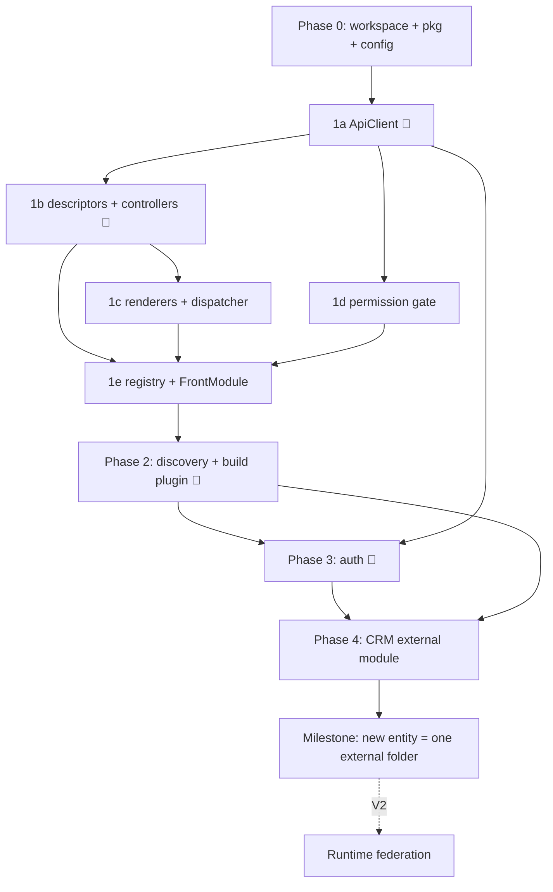

# EERP Frontend Roadmap — Claude Code Build Plan

> **Framework:** React 19 + TypeScript + Vite + MUI (MUI X for grid/tree). Chosen over Svelte/Vue on familiarity + ERP widget ecosystem. The controller layer is plain TS and portable, so this is reversible.
> **Action item (not Claude Code):** revise **ADR-004** — "SvelteKit CSR" → "React CSR SPA". Keep CSR-only; only the framework changes.

## Architecture model (read first)

Modules are **self-contained folders that can live anywhere on disk** and own their frontend, declared in `module.json` → `static_files.views`. A browser can't read a `.ts` off disk and run it, so on the frontend "module lives anywhere" is a **build-time wiring** concern, not a runtime filesystem-mapping one. The same `module.json` is honored — the _consumer_ of `static_files.views` is the frontend build, not a running server.

This mirrors a split you already have on the backend:

| Backend                                   | Frontend equivalent            | Loading                                                                         |
| ----------------------------------------- | ------------------------------ | ------------------------------------------------------------------------------- |
| Go service (compiled into the monolith)   | **v1: build-time aggregation** | build scans module roots, compiles views into one SPA bundle                    |
| WASM module (Wasmtime, loaded at runtime) | **v2: runtime federation**     | host fetches pre-built module bundles from the registry, `import()`s at runtime |

**We build v1 now.** It gives you everything asked for — modules anywhere, self-describing, developed/tested standalone — without federation machinery, and matches how Go services already work. Cost: adding/updating a module needs a frontend rebuild + redeploy (fine for an internal authenticated ERP). v2 is captured at the end, tied to the V2.0.0 WASM registry; the `FrontModule` contract is identical in both, so nothing here is thrown away.

**Two deliberate departures from backend purity — flagged on purpose:**

1. **Modules import a shared package.** Backend forbids modules importing core (ABI boundary, for the WASM sandbox + language-agnosticism). The frontend has neither — all TS, one React tree, no sandbox possible. So the contract is a shared typed package, **`@eerp/core-front`**, exporting controllers, descriptors, renderers, and `ApiClient`. That package _is_ the frontend ABI.
2. **Frontend modules are trusted code, not sandboxed plugins.** Build-time or runtime, a view rendering in your DOM has full reach. "Portable module" here means _your own modules, relocatable and developed in isolation_ — not untrusted third-party plugins.

## How to use this doc

Phases are **sequential**; tasks inside a phase are mostly parallel unless noted. Each task has a paste-ready Claude Code prompt and references the **Conventions** block (single source of truth — keep it in the repo at `packages/core-front/CONVENTIONS.md` and point Claude Code at it).

**Model routing:** lightweight model by default. Escalate (🔺) for: ApiClient auth/refresh, controller base, discovery plugin, the auth layer — security + shared-infra surfaces.

**Test rule (non-negotiable):** every file ships with tests. Unit tests mock `ApiClient` (no network). Integration tests run against MSW or a live backend and are named `*.integration.test.ts`, skipped unless `TEST_API_BASE` is set.

---

## Conventions (contracts — source of truth)

| Concern                | Contract                                                                                                                                                                                                                                                                                         |
| ---------------------- | ------------------------------------------------------------------------------------------------------------------------------------------------------------------------------------------------------------------------------------------------------------------------------------------------ | ----- | ------------------------------------------------------------------------------------------------------------- |
| Base URL               | `{API_BASE}/api/v{API_VERSION}` — from env (`VITE_API_BASE`, `VITE_API_VERSION`, default `1`)                                                                                                                                                                                                    |
| Module routes          | `/{module}/` (list, create) + `/{module}/{id}` (get, update, delete). CRM contacts → `/crm/` + `/crm/{id}`                                                                                                                                                                                       |
| Core routes            | `GET /health`, `GET /ready`, `GET /modules`                                                                                                                                                                                                                                                      |
| Auth                   | `POST /auth/login {email, password}`; `POST /auth/refresh`                                                                                                                                                                                                                                       |
| Session transport      | **HttpOnly cookies primary** (`fetch` `credentials:'include'`); **token-in-body fallback**. Support both.                                                                                                                                                                                        |
| Token TTLs             | access **1h**, refresh **7d**, refresh **single-use** (rotation). Reusing a spent refresh = theft → server kills session → frontend hard-logout.                                                                                                                                                 |
| Error envelope         | `{ "error": { "code": "UPPER_SNAKE", "message": "...", "request_id": "01J..." } }`                                                                                                                                                                                                               |
| Status map             | 400 validation · 401 unauthenticated · 403 forbidden · 404 not found · 409 conflict · 500 `INTERNAL_ERROR`                                                                                                                                                                                       |
| Permissions            | DSL `module:resource:action` (`crm:contacts:read                                                                                                                                                                                                                                                 | write | delete`). Wildcards `_:_:read`, `crm:\*:read`. UI gates on the identity's effective set w/ wildcard matching. |
| Delete                 | Soft-delete by default (ADR-003). `remove` archives; add `restore` when backend exposes it.                                                                                                                                                                                                      |
| View types (v1)        | `form`, `tree`, `dashboard`. New entity = a descriptor; new view type = one controller subclass + one renderer.                                                                                                                                                                                  |
| **Module FE contract** | `module.json.static_files.views` lists `.ts` files under the module's `views/`. Each file default-exports a **`FrontModule`** ( `{ name; routes:[{path; viewFactory:(api)=>BaseViewController; permission?}] }` ) registered with the engine. Modules import the engine from `@eerp/core-front`. |

---

## Repo layout

The frontend is an npm/pnpm workspace living at **`core-front/`** inside the EERP monorepo. It holds the **engine package** + the **host shell**. Business modules live **outside the frontend**, under the roots already declared in the shared backend config — anywhere on disk those paths point.

Discovery reuses the **same `eerp-config.json` the backend reads** (at the monorepo root, field `module_root` — an array of paths). A module is therefore declared **once** and picked up by both the backend (Go service / WASM) and the frontend (views). This file is **committed** (shared dev config), not a per-machine frontend file.

```
EERP/                                # monorepo root
├── eerp-config.json                 # shared backend+frontend config — "module_root": ["…"] (committed)
├── core/                            # Go backend (Wasmtime host, ORM, API)
│   └── modules/                     # default module_root entry — business modules live here
│       └── crm/                     # a business module — relocatable to any module_root path
│           ├── module.json          # static_files.views: ["CrmViews.ts","CrmWizard.ts"]
│           ├── module.go            # Go service
│           ├── internal/crm.go
│           └── views/               # frontend views (added in Phase 4)
│               ├── CrmViews.ts      # exports a FrontModule
│               └── CrmWizard.ts     # exports a wizard contribution
└── core-front/                      # frontend workspace (this package)
    ├── package.json                 # workspace root
    ├── packages/
    │   └── core-front/              # @eerp/core-front — the engine (publishable/linkable)
    │       ├── src/
    │       │   ├── api/             # ApiClient, errors
    │       │   ├── views/           # descriptors, controllers, renderers, dispatcher
    │       │   ├── auth/            # permission primitives (hasPermission, <Can>)
    │       │   └── registry/        # FrontModule contract + ModuleRegistry
    │       ├── index.ts             # public API barrel (the "ABI")
    │       └── CONVENTIONS.md       # the Conventions block above
    └── apps/
        └── shell/                   # host SPA (Vite)
            ├── vite.config.ts       # discovery plugin + aliases + fs.allow (from config)
            ├── src/
            │   ├── app/             # providers, router, layout shell
            │   ├── auth/            # AuthContext/Provider, LoginPage, RequireAuth
            │   └── generated/       # generated-modules.ts — GITIGNORED, regenerated
            └── ...
```

`module_root` is an array of paths and may point anywhere on disk, so a module folder is relocatable — `core/modules/crm` is just the current default. Each module is self-describing via `module.json`; its `static_files.views` lists the `.ts` view files under the module's `views/`. Current modules ship `static_files: {}` until frontend views are added.

---

## Phase 0 — Workspace, package boundary, discovery config

**Goal:** runnable empty shell + empty engine package + the discovery config. No business logic.

**Claude Code prompt:**

```
Create a pnpm workspace named eerp-front (CSR only, no SSR).
packages/core-front: a TS library package "@eerp/core-front" with src/{api,views,auth,registry}
and an index.ts barrel (empty for now). Build with tsup or vite lib mode; ship types.
apps/shell: a React 19 + Vite + TS app depending on @eerp/core-front via the workspace.
Add MUI v6 + @mui/x-data-grid + @mui/x-tree-view, react-router-dom v7, and to the workspace
dev deps: vitest + @testing-library/react + msw, eslint + prettier.
Add apps/shell env typing for VITE_API_BASE and VITE_API_VERSION (default "1").
Reuse the existing monorepo-root eerp-config.json (committed) and read its "module_root"
array for discovery — do NOT create a separate frontend config. Gitignore only
apps/shell/src/generated/.
App shell: ThemeProvider + a router with a placeholder "/" route. One smoke test renders it.
Copy the Conventions block into packages/core-front/CONVENTIONS.md.
```

**DoD:** `pnpm dev` serves a blank shell; `pnpm test` passes; the engine package builds and is importable from the shell; lint clean.

---

## Phase 1 — Front-core engine (`@eerp/core-front`)

**Goal:** the reusable, metadata-driven view engine. Nothing module-specific. Everything below lives in `packages/core-front` and is re-exported from `index.ts`.

### 1a 🔺 ApiClient + error model

Build first — everything depends on it.

```
In @eerp/core-front, implement src/api/ApiClient.ts + errors.ts per CONVENTIONS.md.

errors.ts: class ApiError extends Error {code, message, requestId, status}. parseError(response)
reads the {error:{code,message,request_id}} envelope; if the body isn't that shape, synthesize
code from status (500 -> INTERNAL_ERROR).

ApiClient:
- constructor(baseUrl, apiVersion, { onSessionExpired }) builds `${baseUrl}/api/v${apiVersion}`.
- every request: fetch with credentials:'include' (cookies primary). Optional in-memory bearer
  token (body-fallback) sent as Authorization: Bearer when present.
- methods: list<T>(entity), get<T>(entity,id), create<T>(entity,body), update<T>(entity,id,body),
  remove(entity,id)  // soft delete. entity maps straight to routes: list('crm') -> GET /crm/.
- 401-with-expired: refresh ONCE then retry the original request ONCE. Serialize refreshes via a
  single shared in-flight promise so a burst of concurrent 401s triggers exactly one POST
  /auth/refresh (the refresh token is single-use — a double refresh would trip theft detection and
  kill the session). If refresh fails, fire onSessionExpired and throw. Never loop.
- always surface requestId on errors.

Tests (mock fetch): success; 404 -> code from envelope; 500 -> INTERNAL_ERROR; 401 -> refresh+retry
ok; 401 -> refresh fails -> onSessionExpired + throw; CONCURRENT 401s -> exactly one refresh call.
```

**DoD:** all ApiError paths covered; single-flight refresh proven under concurrency.

### 1b 🔺 Descriptors + controller base + subclasses

The literal inheritance, in portable TS; React subscribes via `useSyncExternalStore`.

```
In @eerp/core-front, implement src/views/descriptor.ts + controllers.

descriptor.ts: type ViewType='form'|'tree'|'dashboard';
  FieldDescriptor {name; label; type:'text'|'number'|'date'|'relation'|'boolean'; required?};
  ViewDescriptor<T> {entity:string; viewType:ViewType; fields:FieldDescriptor[]; permissions?:string[]}.

base.ts: abstract BaseViewController<T extends {id:string}>
  - state {records:T[], loading, error:ApiError|null, selected:T|null}
  - subscribe(fn)/getSnapshot() for useSyncExternalStore; protected emit() clones state + notifies
    (immutable snapshot per change)
  - constructor(descriptor, api); async load(); save(input) (create vs update by id);
    remove(id) (soft delete then reload); getters entity/fields/viewType; abstract defaultLayout()
form.ts: FormViewController — draft:Partial<T>, dirty, edit(record), setField(k,v), async commit();
  defaultLayout -> fields.
tree.ts: TreeViewController<T extends {id;parent_id?}> — expanded:Set, roots getter, children(id),
  toggle(id); defaultLayout -> roots.
dashboard.ts: DashboardViewController — widgets[], async refresh(); defaultLayout -> widgets.
hooks: useController(controller) wraps useSyncExternalStore + triggers load() once on mount.

Tests (mock ApiClient): load populates/clears loading; error path; Form commit routes create vs
update by id and clears dirty; Tree roots/children/toggle.
```

**DoD:** inheritance chain works; `useController` re-renders on emit; create-vs-update proven.

### 1c Renderers + dispatcher

```
In @eerp/core-front, implement src/views/ renderers + EntityView dispatcher (React + MUI).
EntityView<T>({controller}): useController; MUI spinner while loading; MUI Alert on error (requestId
in caption); else dispatch on viewType to Form|Tree|DashboardRenderer.
FormRenderer: fields -> MUI inputs bound to draft via setField; Save calls commit(), disabled unless
dirty; map field.type to control (text/number/date/Switch/relation-as-Select stub).
TreeRenderer: MUI X RichTreeView from roots/children + expanded/toggle; plus a flat 'list' fallback
rendering records in @mui/x-data-grid (columns from fields).
DashboardRenderer: responsive MUI Grid of widget cards (stub widget contract).
Tests (RTL + mock controller): spinner/error/correct-renderer by viewType; Save disabled until change.
```

**DoD:** all three view types render from descriptor + controller with zero entity-specific code.

### 1d Permission gate

```
In @eerp/core-front, src/auth/permissions.ts: hasPermission(effective:string[], required:string)
with segment-wise wildcard matching over module:resource:action (* matches any segment; 'crm:*:read'
grants 'crm:contacts:read'; '*:*:read' grants any :read). <Can permission> component +
usePermission(required) hook reading the effective set from an AuthContext (default [] for now; the
shell provides the real one in Phase 3). Tests: allow/deny matrix incl. wildcards.
```

**DoD:** wildcard matcher correct on a deny/allow matrix.

### 1e Module registry + FrontModule contract

```
In @eerp/core-front, src/registry/: export the FrontModule type
{ name; routes:{ path; viewFactory:(api:ApiClient)=>BaseViewController<any>; permission? }[] }.
ModuleRegistry with register(module) and buildRoutes(api) that emits react-router route objects,
each wrapping <EntityView controller={factory(api)}> in <RequireAuth> (shell provides) + <Can
permission> guards. This mirrors module.json: a module contributes descriptors, nothing more.
Re-export the full public API from packages/core-front/index.ts.
Tests: registering a module yields guarded routes in order.
```

**DoD:** a module can register and produce guarded routes; nothing reaches into engine internals beyond the public barrel.

**Phase 1 exit:** the engine renders any entity from a descriptor, gates on permissions, talks to the backend through one client, and exposes a clean public API — but no module is wired and the engine doesn't yet know how to find external module folders.

---

## Phase 2 — Module discovery & build pipeline (host) 🔺

**Goal:** make external module folders (anywhere on disk) compile into the shell, driven by the monorepo-root `eerp-config.json` (`module_root`) + `module.json.static_files.views`. This is the portability centerpiece.

### 2a Discovery plugin + manifest generator

```
In apps/shell, implement a Vite plugin (vite-plugin-eerp-modules) + its config wiring.

Read the monorepo-root eerp-config.json { module_root: string[] } (the same file the backend
reads; paths may be outside the frontend workspace).
For each root: walk for module.json files; for each, read static_files.views (array); resolve every
entry to <module_dir>/views/<file>.

The plugin must:
1. Generate apps/shell/src/generated/generated-modules.ts: real STATIC imports of each resolved view
   file (via an "@module/<name>/..." alias) and a call registering each default export with a single
   ModuleRegistry instance. (Static imports so Rollup bundles + tree-shakes normally.)
2. Inject resolve.alias entries mapping "@module/<name>" to each module dir, AND add every module_root
   to server.fs.allow (Vite blocks imports outside project root by default — this is what lets
   external folders compile and HMR).
3. Re-run generation on dev start and when any module.json under the roots changes (watch the roots);
   trigger an HMR update.
Also extend tsconfig to include the module roots so types resolve across them.
The shell's router consumes ModuleRegistry.buildRoutes(api).

Tests: given a temp fixture root with a module.json + a views file exporting a trivial FrontModule,
the generator emits a manifest that imports + registers it, and buildRoutes yields its route.
Ship that fixture as the plugin's integration test (proves the external-folder pipeline end-to-end,
before auth or CRM).
```

**DoD:** a throwaway module folder _outside_ the frontend workspace, listed in `eerp-config.json`'s `module_root`, renders its route in the running shell; editing its view hot-reloads. The generated manifest is gitignored.

**Phase 2 exit:** "module anywhere on disk → compiled into the SPA via its own `module.json`" works. Real modules (CRM) now just need a folder + descriptor.

---

## Phase 3 — Auth frontend (host)

**Goal:** real login/session exercising ApiClient + error envelope + context plumbing. The smoke test for Phase 1.

### 3a 🔺 Auth context + session lifecycle

```
In apps/shell, implement src/auth/AuthContext.tsx per CONVENTIONS.md.
Identity = { userId; tenantId; roles:string[]; permissions:string[] }.
AuthProvider holds identity|null + status('loading'|'authed'|'anon').
- login(email,password): POST /auth/login; store identity (+effective permissions) from response/body
  fallback; cookies carry the token.
- logout(): clear identity (call logout endpoint if one exists).
- bootstrap on mount: a lightweight authed call (GET /modules) detects an existing cookie session.
- wire ApiClient.onSessionExpired -> hard logout (covers spent/rotated refresh = theft).
Expose useAuth(); feed permissions into @eerp/core-front's <Can>/usePermission AuthContext.
Tests (mock ApiClient): login success -> authed+permissions; login 401 surfaces ApiError message;
onSessionExpired -> anon.
```

**DoD:** login/logout/bootstrap correct; theft-path forces logout.

### 3b Login page + route guard

```
In apps/shell, implement src/auth/RequireAuth.tsx (redirect to /login when anon; spinner while
loading) and a LoginPage (MUI email+password, calls useAuth().login, shows ApiError message inline on
failure, redirects to intended route on success). Add /login; the engine's guarded routes already
wrap in <RequireAuth>.
Tests (RTL): RequireAuth redirects anon; LoginPage error on bad creds, redirect on success.
```

**DoD:** unauthenticated users can't reach module routes; bad creds show the server message; good creds land in the app.

**Phase 3 exit:** log in against the live backend, session survives reload via cookie, expired/stolen refresh cleanly logs out. Validates Phase 1's ApiClient + error model + permission plumbing.

---

## Phase 4 — CRM module (first external business module)

**Goal:** prove the metadata-driven design _and_ the portable-folder pipeline: a real entity needs only an external folder + a descriptor.

### 4a The CRM module folder

```
Extend the EXISTING crm module at core/modules/crm (it already has module.json + module.go +
internal/crm.go, with static_files currently {}). Do NOT create a new folder. Add to it:
- set module.json static_files.views: ["CrmViews.ts","CrmWizard.ts"]
- package.json depending on @eerp/core-front (link it for dev)
- views/CrmViews.ts: a Contact type {id; tenant_id; name; email; phone?; status?; parent_id?} and a
  default-exported FrontModule "crm" with:
    * '/crm/contacts/:id' -> FormViewController over entity 'crm', guard crm:contacts:read (write
      enables Save)
    * '/crm/contacts' -> TreeViewController in flat/DataGrid mode over 'crm', guard crm:contacts:read;
      row actions edit (-> form) and archive (-> remove, needs crm:contacts:delete)
  importing FormViewController/TreeViewController/types from @eerp/core-front.
- views/CrmWizard.ts: a minimal wizard contribution (stub) to exercise multi-file static_files.
Add this folder's path to the monorepo-root eerp-config.json module_root array. Rebuild — the
discovery plugin picks it up. NO CRM-specific rendering code: only the descriptor + engine controllers. If you need a custom CRM
component, STOP — that's an engine gap; fix it in @eerp/core-front instead.
Unit tests (inside the module): descriptor wires the right controllers/permissions.
```

**DoD:** CRM list + form work purely through the engine, from a folder _outside_ the frontend repo; the only CRM code is the descriptor + wizard stub.

### 4b End-to-end integration test

```
Add crm.integration.test.ts (skipped unless TEST_API_BASE set) that, against a running backend: logs
in, lists contacts, creates one, edits it, archives it (soft delete), asserting each step's API shape.
Add an MSW-mocked twin that runs in CI without a backend, replaying the same flow against handlers
emitting the real error/response envelopes.
```

**DoD:** full CRUD round-trip passes against MSW and (when available) a live backend.

**Phase 4 exit / milestone:** adding the next entity (e.g. an external inventory module) is one more folder + descriptor under a `module_root` path. If that's true, the engine is done and the architecture goal — metadata-driven, backend-mirroring, relocatable frontend modules — is met.

---

## Future — V2 runtime federation (deferred; do not build now)

Removes the rebuild-to-add-a-module cost, mirroring WASM runtime loading and the V2.0.0 registry. Capture only; no prompts yet.

- Each module's frontend is **pre-built** into its own ES bundle that **externalizes** React/MUI/`@eerp/core-front` (shared singletons provided by the host via import maps or Module Federation — e.g. `@originjs/vite-plugin-federation`).
- The host fetches a manifest at runtime and `import(moduleUrl)`s each, registering via the _same_ `FrontModule` contract. Extend the existing `GET /modules` to include each module's frontend bundle URL + version.
- Bundles served from the **same registry/bucket** as WASM binaries (V2.0.0 "Registry / versioned storage"), versioned per module.
- Migration is additive: the build-time path keeps working; federation is opt-in per deployment. v1 `FrontModule` definitions carry over unchanged.

---

## Build order at a glance



## Sequencing notes

- **1a blocks everything.** Build/test before any UI.
- **1b before 1c.** 1d and 1e parallelize once 1a/1b land.
- **Phase 2 needs 1e** (it wires the registry to disk). Its fixture proves the portable-folder pipeline _before_ auth/CRM — keep that isolation.
- **Phase 3 needs 1a + 1d**, not the renderers.
- **Phase 4 is the real test of Phases 1+2.** Custom CRM component code = a Phase-1 engine bug, not a Phase-4 feature.
- Revisit the heavy-grid choice (MUI X DataGrid vs AG Grid vs TanStack Table) only when a real grid hits limits — not before.
- Pursue V2 federation only when "add a module without redeploying the shell" becomes a real requirement.
