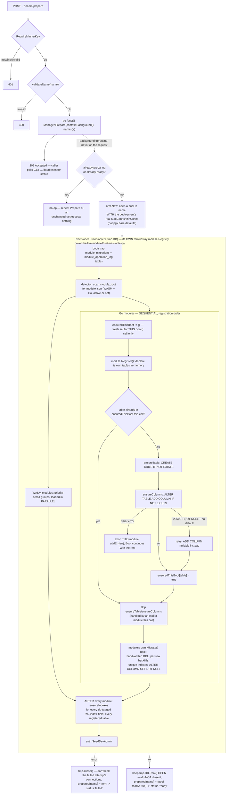
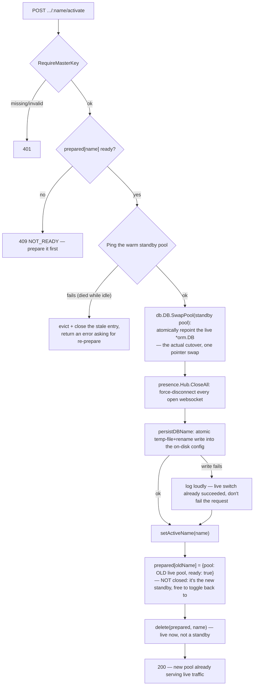

# ADR-021 — Unauthenticated database management (`/database/management`)

**Status:** accepted

## Problem
Operating this app needs an Odoo-style database manager: list/create/switch/delete the
Postgres databases behind a deployment, and extract/restore a database (SQL + optionally its
S3 content) as a portable archive — reachable even when nobody can log in yet (a fresh
deployment, a locked-out admin), so it cannot ride the normal JWT session model.

## Decision
- **Auth model:** every action on `/api/v1/database-management/*` (`core/internal/dbmanage`)
  is gated by comparing an `X-Master-Key` header against `Config.MasterPassword` — the SAME
  secret that signs every JWT (`internal/auth.TokenService`), not a separate one. One secret to
  provision/rotate, but this page is now an alternate full-compromise path if it leaks — accepted
  trade-off, not an oversight. No `jwtMw`/`permMw` on the route group; every handler calls
  `RequireMasterKey` itself, including plain listing (revealing live database names to an
  anonymous caller is real information). Rate-limited with the same `AuthRateLimiter` the
  `/api/v1/auth` group uses, as defense-in-depth against brute-forcing the key.
- **Switching is a true live hot-swap, not a restart.** `core-back` previously opened one
  `pgxpool.Pool` at boot and never again — every `Repository[T]`/handler/background ticker
  captured that same `*orm.DB` pointer, never a copy of the pool. `db.DB.SwapPool` (`core/orm/
  pool/db/db.go`) turned `pool` into an `atomic.Pointer[pgxpool.Pool]` so a switch repoints the
  SAME `*orm.DB` at a different database in place — every existing repo/handler picks up the new
  pool with nothing to rebuild.
- **Prepare/Activate split (blue/green toggling) supersedes the original one-call `SwitchTo`.**
  The original design did `SwapPool` (instant, live cutover) *then* `module.Registry.Boot` (schema
  provisioning) — meaning real traffic was already hitting the new database while it was still
  being provisioned, for as long as `Boot()` took (measured: up to ~2 minutes on production
  spinning disk — see the pitfall bullet below). `internal/dbmanage/prepare.go` decouples the two:
  - **`Prepare(ctx, name)`** provisions a database *without* touching the live pool at all —
    `Provisioner.Provision` (`provision.go`) builds its own throwaway `module.Registry` per call,
    completely independent of the process's one live registry singleton (safe because that
    registry's active/table-ownership bookkeeping is derived purely from `module_root`'s
    filesystem scan, never from which database happens to be live — it never needed recomputing on
    a switch to begin with). On success the resulting pool is kept **warm**, not closed, and
    recorded in `Manager.prepared[name]` as a ready standby. `Handler.Prepare`
    (`POST .../:name/prepare`) runs this in a background goroutine and returns `202` immediately;
    `Handler.List` surfaces `unprepared`/`preparing`/`ready`/`failed` per database so the UI can
    poll.
  - **`Activate(ctx, name)`** is the actual cutover — near-instant, since all it does is `Ping` the
    already-warm standby pool once (cheap insurance against a connection that died while idle;
    `SwapPool` itself does zero validation), `SwapPool` it in, force-disconnect every presence
    websocket, best-effort persist `db_name` (temp-file-then-rename, same pattern `module.json`'s
    own PUT uses — failure to persist logs loudly but doesn't fail the request, since the live
    switch already happened), and `setActiveName`. Crucially, **the just-deactivated pool becomes
    the new standby for its own name** instead of being closed — this is what makes toggling back
    to it later free (no re-provisioning, no new connections, just another `Ping` + `SwapPool`),
    directly answering "toggle between a first and a second database, don't re-deploy on every
    switch."
  - **`SwitchTo`** (`switch.go`) is now a thin backward-compatible wrapper — `Prepare` (blocking,
    if not already `ready`) then `Activate` — kept for scripts/callers that still want the old
    one-call blocking behavior; the UI itself moved to the two-step flow.
  - **`Discard(name)`** releases a prepared standby without activating it (closes its pool, drops
    the map entry) — both an explicit "never mind" UI action and something `Delete` now calls
    first, since Postgres refuses `DROP DATABASE` while a standby's connections are still open.
- **A real prerequisite bug this exposed:** `module.Registry.Boot`'s Go-module schema
  provisioning (`internal/module/go_module.go`'s `loadGoModule`) decided whether to run
  `ensureTable`/`ensureColumns` by diffing a **process-global, in-memory** table registry, not
  real database state — correct on a process's first boot, silently a no-op on any *later* Boot
  call in the same process (exactly what create/switch need). Fixed by running the already-fully-
  idempotent (`IF NOT EXISTS`) `ensureTable`/`ensureColumns` unconditionally every call, keeping
  the in-memory diff only for table-ownership bookkeeping. This is what makes "switch into an
  empty database" and "create + immediately provision a new one" both actually work.
- **That "unconditionally every call" fix was itself O(n²)** until a second pass: `loadGoModule`'s
  per-table loop walks the ENTIRE global table registry (every table any module has EVER
  registered, not just the current module's own), so module *k* of *n* redundantly re-issued
  `ensureTable`/`ensureColumns` for all *k-1* tables earlier modules in the SAME `Boot()` call had
  already handled — on an otherwise-empty target (this feature's whole point), that's pure
  redundant round trips, not a no-op skipped by `IF NOT EXISTS` (the statement still has to be
  sent and answered). Fixed by scoping a per-`Boot()`-call `ensuredThisBoot` set through every
  module's `loadGoModule` invocation: a table is ensured exactly once per `Boot()` call — still
  unconditional across *separate* `Boot()` calls (the actual invariant a switch depends on), just
  no longer redundant *within* one.
- **A NOT-NULL column with no natural default could wedge `Boot()` outright on a populated
  table.** `ensureColumns` derives `zeroSQLDefault` for backfilling a new required column
  (`''`/`false`/`0`/`'{}'::jsonb`) but has no sane default for `UUID` — `model.BaseModel`'s own
  `TenantID` is exactly this type. `ADD COLUMN ... NOT NULL` with no `DEFAULT` fails outright
  (Postgres 23502) the moment the table already has rows, which is precisely the case a switch
  into a real, pre-existing database hits. A module can hand-write the correct two-step fix in its
  own `Migrate()` hook (add nullable, backfill per-row, `ALTER COLUMN ... SET NOT NULL` —
  `auth.module.go`'s `user_roles.tenant_id` and `propertymanagement`'s own analogous case) but
  `Migrate()` runs *after* `ensureColumns` in the same module's load, so the column's OWN required
  nullable-first step never happened before that hand-written fix could even reach it — the
  generic pass errored out first and aborted the whole `Boot()` before `Migrate()` ran. Fixed by
  having `ensureColumns` retry a 23502 on a no-default NOT NULL column as a plain nullable
  `ADD COLUMN`, leaving the owning module's `Migrate()` to backfill and tighten it — exactly the
  gap `zeroSQLDefault`'s own doc comment already named ("would otherwise permanently wedge
  auto-migration") but that wasn't actually wired up until now.
- **Also surfaced: `auth.SeedDevAdmin` had a standing, silent bug** — it seeded a `Permissions`
  row under a hardcoded id AND unconditionally called `SeedDefaultRoles`, which seeded a
  *different* id for the same `code = "*:*:*"`, violating `idx_permissions_code` on every single
  boot (silently swallowed as non-fatal in `main.go`, so nobody noticed — the original admin/role
  pair seeded fine regardless, only the newer Admin/Viewer/Deny bundle silently failed). This
  package's `Provisioner` treats that error as fatal (a fresh database MUST be immediately
  loggable-into), which is what surfaced it. Fixed by reusing the SAME deterministic id
  (`seedUUID(DevTenantID, "permission:*:*:*")`) for both seed paths instead of two rows sharing a
  code.
- **S3 extraction is manifest-driven, not a bucket dump.** `BuildManifest` queries the database
  being extracted (not necessarily the active one) for every `picture`/`attachment` row's
  `object_key` — this is what scopes an extraction to exactly that database's own objects out of
  a bucket potentially shared by several EERP databases on the same instance. Generated report
  PDFs (`internal/reports`) are deliberately never included: that package persists no DB row for
  its own S3 key at all, and a report is always regeneratable on demand from the underlying
  invoice/quote/receipt data, which the SQL dump already carries.
- **Dump/restore shells out to `pg_dump`/`pg_restore`** (PGDG apt repo in `core/Dockerfile`'s
  runtime stage, pinned to the server's own Postgres 18 major version) rather than reimplementing
  the dump format. `extract.go` streams a zip directly into the HTTP response via `archive/zip`
  (no temp file, no full in-memory buffering); `restore.go` writes the upload to a temp dir,
  `pg_restore`s the dump, then re-uploads each manifest object to the *current* instance's bucket
  at the *same* key — no key rewriting, since keys are tenant/table/record/field-scoped, never
  environment-scoped.
- **Frontend:** `core-front/apps/shell/app/database/management/page.tsx` is a plain client
  component, deliberately outside `requireAuth()` and the descriptor-driven view engine — this
  route must render for a fully anonymous visitor. No BFF/Server Actions: the browser calls
  `/api/v1/database-management/*` directly with the typed master key as a header, the same
  "browser calls Go directly for a good reason" precedent Presence established (ADR-019), here
  because of large binary transfer with no session involved at all. Per row, the action shown
  follows `status`: `unprepared`/`failed` → **Prepare**, `preparing` → a disabled spinner chip,
  `ready` → **Activate** + **Discard**, `active` → none. A `useEffect` polls `GET .../databases`
  on a 3s interval (silently — no busy flag, so it never fights an in-flight foreground action)
  whenever any row is `preparing`, since `Prepare` runs off-request with no push/webhook path back
  to the browser.
- **Infra:** `infra/nginx/nginx.conf` gets its own `location /api/v1/database-management/` block
  (`client_max_body_size 2g`, `proxy_read_timeout 3600s`) — the default `/api/v1/` block's 50m/120s
  is far too small for a full dump+S3 bundle.

## Sequence: prepare (background) then activate (instant)

Two separate request paths now, deliberately never sharing a request: `Prepare` does every bit of
slow, DB-touching work off the live pool entirely; `Activate` does none of it.

Every `ALTER`/`CREATE` in `Prepare`'s Go-module loop and trailing index pass is its own DB round
trip, `Boot()`-unconditional by design (see the bullets above) — so on an otherwise-empty target
this cost is almost entirely **schema size × round-trip latency**, not row count, and it never
touches the request path at all now. A real production database being prepared for the first time
additionally pays for whatever a module's own `Migrate()` hook has to backfill (`UPDATE ... FROM
...` scans, index builds) — that part *does* scale with the target's existing row counts, unlike
the schema-provisioning loop above it, but it's still happening off to the side, not blocking live
traffic. `Activate` itself does none of this — it's bounded by one `Ping` round trip plus a handful
of fast, non-DDL bookkeeping steps, regardless of schema size or row count on either side.

## Consequences / pitfalls
- A switch invalidates every current session implicitly, not by design revocation — an old JWT's
  claims simply stop resolving against whatever database is now live. The existing
  401-then-redirect-to-`/login` handling (`ApiClient.ts`) covers this with no new frontend code;
  presence sockets are force-closed explicitly since nothing else would notice they're stale.
- **The old grace-period-then-`Close()` dance is gone, on purpose.** The original design always
  destroyed the outgoing pool (`defer time.AfterFunc(5*time.Second, oldPool.Close)`) because it had
  nowhere else to put it. Since `Activate` now repurposes the just-deactivated pool as the new
  standby for its own name instead, there's nothing to leak-guard against on the happy path — the
  pool that used to need a deferred `Close` now just keeps living in `Manager.prepared`. A pool
  only actually gets closed on an explicit `Discard`, a failed `Prepare` attempt (leaked otherwise),
  or a stale standby caught by `Activate`'s pre-swap `Ping`.
- **`Manager.prepared` is in-memory only, never persisted — deliberately.** A `core-back` restart
  wipes it; anything not currently active needs a fresh `Prepare` after one. This isn't a gap: a
  restart is also exactly when new module code/migrations could exist, so forcing re-preparation is
  correct, not just convenient — there's no staleness/fingerprinting problem to solve because
  nothing survives long enough to go stale across a code change.
- **`Prepare`'s pool now carries the deployment's real `MaxConns`/`MinConns`** (`cfg.MaxConns`/
  `cfg.MinConns`, threaded through `Manager`) — the original `CreateAndProvision` and `SwitchTo`
  both silently built their pool with `pgxpool.New`'s bare defaults instead, harmless when the pool
  was immediately closed again (`CreateAndProvision`) or short-lived, but a real gap once a pool
  built this way can end up serving all production traffic indefinitely via `Activate`'s `SwapPool`.
- `Manager.Delete` calls `Discard` before `DropDatabase` — a database sitting as a prepared-but-
  never-activated standby holds open idle connections, and Postgres refuses `DROP DATABASE` while
  any exist ("database is being accessed by other users"). Without this, deleting an abandoned
  prepare candidate would fail with that raw error instead of just working.
- `DROP DATABASE`/`CREATE DATABASE` identifiers can't be parameterized — safety is a strict
  `^[a-z][a-z0-9_]{0,62}$` allowlist (`dbmanage.validateName`) plus `pgx.Identifier{}.Sanitize()`,
  not string interpolation of arbitrary request input.
- The database LIST is filtered to "EERP-shaped" databases (`to_regclass('public.users')` and
  `('public.app_settings')` both non-null) — `postgres`/`template0`/`template1`/an unrelated
  database sharing the same Postgres server never appear, so there is no path to switching into
  or dropping something that isn't an EERP database via this UI.
- **`Prepare` time is dominated by fsync-per-statement, not row count** — this used to be *switch*
  time before the Prepare/Activate split, and the underlying cost hasn't changed, just where it
  lands. Every `ensureTable`/`ensureColumns`/`ensureIndexes` call outside an explicit transaction is
  Postgres's own autocommit — one WAL fsync per statement, not per `Boot()` call. On fast local
  storage (SSD/NVMe, sub-millisecond fsync) this is unnoticeable even for a few hundred statements;
  on spinning disk (a real fsync can cost 5-20ms+) the SAME schema-size-bound statement count that
  takes under a second in dev can stretch to a minute or more in production — the original "switch
  takes 2 minutes on a hard drive for a brand-new (empty) database" report, not data volume (an
  empty target has no row-scanning step at all). It no longer blocks live traffic — `Prepare` runs
  off the request path — but an operator waiting on the "preparing → ready" status still feels it.
  The lever this doesn't yet use: batching a `Boot()` call's DDL into one (or a few) transactions
  would collapse many fsyncs into one commit — not implemented, since it needs
  `Migrator.Migrate(ctx, db *orm.DB)`'s signature to accept `orm.Executor` instead (13 modules
  implement it today); add it if `Prepare` time on slow storage becomes a real operational problem.
