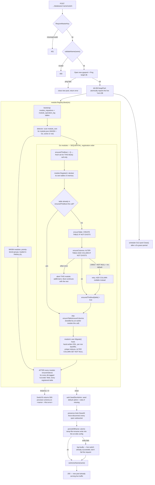

# ADR-021 — Unauthenticated database management (`/database/management`)

**Status:** accepted

## Problem
Operating this app needs an Odoo-style database manager: list/create/switch/delete the
Postgres databases behind a deployment, and extract/restore a database (SQL + optionally its
S3 content) as a portable archive — reachable even when nobody can log in yet (a fresh
deployment, a locked-out admin), so it cannot ride the normal JWT session model.

## Decision
- **Auth model:** every action on `/api/v1/database-management/*` (`core/internal/dbmanage`)
  is gated by comparing an `X-Master-Key` header against `Config.MasterPassword` — the SAME
  secret that signs every JWT (`internal/auth.TokenService`), not a separate one. One secret to
  provision/rotate, but this page is now an alternate full-compromise path if it leaks — accepted
  trade-off, not an oversight. No `jwtMw`/`permMw` on the route group; every handler calls
  `RequireMasterKey` itself, including plain listing (revealing live database names to an
  anonymous caller is real information). Rate-limited with the same `AuthRateLimiter` the
  `/api/v1/auth` group uses, as defense-in-depth against brute-forcing the key.
- **Switching is a true live hot-swap, not a restart.** `core-back` previously opened one
  `pgxpool.Pool` at boot and never again — every `Repository[T]`/handler/background ticker
  captured that same `*orm.DB` pointer, never a copy of the pool. `db.DB.SwapPool` (`core/orm/
  pool/db/db.go`) turned `pool` into an `atomic.Pointer[pgxpool.Pool]` so a switch repoints the
  SAME `*orm.DB` at a different database in place — every existing repo/handler picks up the new
  pool with nothing to rebuild. `SwitchTo` (`internal/dbmanage/switch.go`) then re-runs the live
  `module.Registry.Boot` (not a throwaway one — its in-memory active/table-ownership state must
  stay correct for `ActiveGateMiddleware`), reseeds the default admin, force-disconnects every
  presence websocket (`presence.Hub.CloseAll`, new), and best-effort persists `db_name` back into
  the on-disk config (temp-file-then-rename, same pattern `module.json`'s own PUT uses) so the
  switch survives a restart — failure to persist (e.g. a read-only-mounted config in Docker) logs
  loudly but does not fail the request, since the live switch already happened.
- **A real prerequisite bug this exposed:** `module.Registry.Boot`'s Go-module schema
  provisioning (`internal/module/go_module.go`'s `loadGoModule`) decided whether to run
  `ensureTable`/`ensureColumns` by diffing a **process-global, in-memory** table registry, not
  real database state — correct on a process's first boot, silently a no-op on any *later* Boot
  call in the same process (exactly what create/switch need). Fixed by running the already-fully-
  idempotent (`IF NOT EXISTS`) `ensureTable`/`ensureColumns` unconditionally every call, keeping
  the in-memory diff only for table-ownership bookkeeping. This is what makes "switch into an
  empty database" and "create + immediately provision a new one" both actually work.
- **That "unconditionally every call" fix was itself O(n²)** until a second pass: `loadGoModule`'s
  per-table loop walks the ENTIRE global table registry (every table any module has EVER
  registered, not just the current module's own), so module *k* of *n* redundantly re-issued
  `ensureTable`/`ensureColumns` for all *k-1* tables earlier modules in the SAME `Boot()` call had
  already handled — on an otherwise-empty target (this feature's whole point), that's pure
  redundant round trips, not a no-op skipped by `IF NOT EXISTS` (the statement still has to be
  sent and answered). Fixed by scoping a per-`Boot()`-call `ensuredThisBoot` set through every
  module's `loadGoModule` invocation: a table is ensured exactly once per `Boot()` call — still
  unconditional across *separate* `Boot()` calls (the actual invariant a switch depends on), just
  no longer redundant *within* one.
- **A NOT-NULL column with no natural default could wedge `Boot()` outright on a populated
  table.** `ensureColumns` derives `zeroSQLDefault` for backfilling a new required column
  (`''`/`false`/`0`/`'{}'::jsonb`) but has no sane default for `UUID` — `model.BaseModel`'s own
  `TenantID` is exactly this type. `ADD COLUMN ... NOT NULL` with no `DEFAULT` fails outright
  (Postgres 23502) the moment the table already has rows, which is precisely the case a switch
  into a real, pre-existing database hits. A module can hand-write the correct two-step fix in its
  own `Migrate()` hook (add nullable, backfill per-row, `ALTER COLUMN ... SET NOT NULL` —
  `auth.module.go`'s `user_roles.tenant_id` and `propertymanagement`'s own analogous case) but
  `Migrate()` runs *after* `ensureColumns` in the same module's load, so the column's OWN required
  nullable-first step never happened before that hand-written fix could even reach it — the
  generic pass errored out first and aborted the whole `Boot()` before `Migrate()` ran. Fixed by
  having `ensureColumns` retry a 23502 on a no-default NOT NULL column as a plain nullable
  `ADD COLUMN`, leaving the owning module's `Migrate()` to backfill and tighten it — exactly the
  gap `zeroSQLDefault`'s own doc comment already named ("would otherwise permanently wedge
  auto-migration") but that wasn't actually wired up until now.
- **Also surfaced: `auth.SeedDevAdmin` had a standing, silent bug** — it seeded a `Permissions`
  row under a hardcoded id AND unconditionally called `SeedDefaultRoles`, which seeded a
  *different* id for the same `code = "*:*:*"`, violating `idx_permissions_code` on every single
  boot (silently swallowed as non-fatal in `main.go`, so nobody noticed — the original admin/role
  pair seeded fine regardless, only the newer Admin/Viewer/Deny bundle silently failed). This
  package's `Provisioner` treats that error as fatal (a fresh database MUST be immediately
  loggable-into), which is what surfaced it. Fixed by reusing the SAME deterministic id
  (`seedUUID(DevTenantID, "permission:*:*:*")`) for both seed paths instead of two rows sharing a
  code.
- **S3 extraction is manifest-driven, not a bucket dump.** `BuildManifest` queries the database
  being extracted (not necessarily the active one) for every `picture`/`attachment` row's
  `object_key` — this is what scopes an extraction to exactly that database's own objects out of
  a bucket potentially shared by several EERP databases on the same instance. Generated report
  PDFs (`internal/reports`) are deliberately never included: that package persists no DB row for
  its own S3 key at all, and a report is always regeneratable on demand from the underlying
  invoice/quote/receipt data, which the SQL dump already carries.
- **Dump/restore shells out to `pg_dump`/`pg_restore`** (PGDG apt repo in `core/Dockerfile`'s
  runtime stage, pinned to the server's own Postgres 18 major version) rather than reimplementing
  the dump format. `extract.go` streams a zip directly into the HTTP response via `archive/zip`
  (no temp file, no full in-memory buffering); `restore.go` writes the upload to a temp dir,
  `pg_restore`s the dump, then re-uploads each manifest object to the *current* instance's bucket
  at the *same* key — no key rewriting, since keys are tenant/table/record/field-scoped, never
  environment-scoped.
- **Frontend:** `core-front/apps/shell/app/database/management/page.tsx` is a plain client
  component, deliberately outside `requireAuth()` and the descriptor-driven view engine — this
  route must render for a fully anonymous visitor. No BFF/Server Actions: the browser calls
  `/api/v1/database-management/*` directly with the typed master key as a header, the same
  "browser calls Go directly for a good reason" precedent Presence established (ADR-019), here
  because of large binary transfer with no session involved at all.
- **Infra:** `infra/nginx/nginx.conf` gets its own `location /api/v1/database-management/` block
  (`client_max_body_size 2g`, `proxy_read_timeout 3600s`) — the default `/api/v1/` block's 50m/120s
  is far too small for a full dump+S3 bundle.

## Sequence: hot database switch

Every operation `SwitchTo` (`internal/dbmanage/switch.go`) runs, end to end, for
`POST /api/v1/database-management/databases/:name/switch` — the schema-provisioning box is
`module.Registry.Boot`, unchanged in shape whether this is the process's first boot or its
Nth switch, per the bullets above.

Every `ALTER`/`CREATE` in the Go-module loop and the trailing index pass is its own DB round
trip, `Boot()`-unconditional by design (see the bullets above) — so on an otherwise-empty target
this diagram's cost is almost entirely **schema size × round-trip latency**, not row count. A
real production database being switched INTO for the first time additionally pays for whatever a
module's own `Migrate()` hook has to backfill (`UPDATE ... FROM ...` scans, index builds) — that
part *does* scale with the target's existing row counts, unlike the schema-provisioning loop above
it.

## Consequences / pitfalls
- A switch invalidates every current session implicitly, not by design revocation — an old JWT's
  claims simply stop resolving against whatever database is now live. The existing
  401-then-redirect-to-`/login` handling (`ApiClient.ts`) covers this with no new frontend code;
  presence sockets are force-closed explicitly since nothing else would notice they're stale.
- `SwapPool`'s old pool MUST be scheduled for cleanup via `defer` immediately after the swap, not
  at the bottom of the function — an early return from a later provisioning failure otherwise
  leaks the just-replaced pool's connections forever (caught live via `pg_stat_activity` during
  this feature's own end-to-end testing).
- `DROP DATABASE`/`CREATE DATABASE` identifiers can't be parameterized — safety is a strict
  `^[a-z][a-z0-9_]{0,62}$` allowlist (`dbmanage.validateName`) plus `pgx.Identifier{}.Sanitize()`,
  not string interpolation of arbitrary request input.
- The database LIST is filtered to "EERP-shaped" databases (`to_regclass('public.users')` and
  `('public.app_settings')` both non-null) — `postgres`/`template0`/`template1`/an unrelated
  database sharing the same Postgres server never appear, so there is no path to switching into
  or dropping something that isn't an EERP database via this UI.
- **Switch time is dominated by fsync-per-statement, not row count.** Every `ensureTable`/
  `ensureColumns`/`ensureIndexes` call outside an explicit transaction is Postgres's own
  autocommit — one WAL fsync per statement, not per `Boot()` call. On fast local storage
  (SSD/NVMe, sub-millisecond fsync) this is unnoticeable even for a few hundred statements; on
  spinning disk (a real fsync can cost 5-20ms+) the SAME schema-size-bound statement count that
  takes under a second in dev can stretch to a minute or more in production — this is what's
  actually behind "switch takes 2 minutes on a hard drive for a brand-new (empty) database," not
  data volume (the diagram above has no row-scanning step for an empty target). The lever this
  doesn't yet use: batching a `Boot()` call's DDL into one (or a few) transactions would collapse
  many fsyncs into one commit — not implemented, since it needs `Migrator.Migrate(ctx, db
  *orm.DB)`'s signature to accept `orm.Executor` instead (13 modules implement it today); add it
  if switch time on slow storage becomes a real operational problem rather than a one-time
  cold-provisioning cost.
