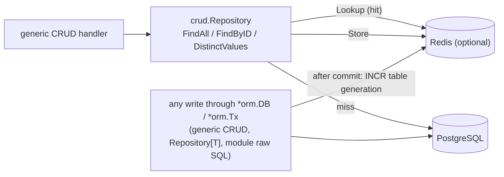

# ADR-022 — Optional Redis read cache between the generic CRUD API and Postgres

**Status:** accepted

## Problem
Every list view, search-bar group-by and form load goes through the generic CRUD read path
(`GET /api/v1/{table}`, `?distinct=`, `/:id`), and each of those is one or two Postgres round
trips (a list is a `COUNT(*)` plus the page). Most of these reads repeat unchanged data: the
same list re-fetched after navigation, the same form reopened. We want to absorb that repetition
without making a cache server **required** — a single-box deployment must keep working with
exactly the services it has today.

## Decision
An **optional** Redis-backed read cache (`core/orm/qcache`), enabled by one config key:

```json
"redis_url": "redis://redis:6379/0",
"redis_ttl_seconds": 60
```



- **What is cached:** only the three generic CRUD reads in `orm/internal/crud.Repository`, and
  only when its executor is the pool-level `*orm.DB` — never inside a transaction (a transaction
  must see its own writes). Typed `Repository[T]` reads and dedicated handlers stay uncached:
  they are write-adjacent business logic (totals, workflows) where a stale read costs more than a
  round trip saves.
- **Invalidation by generation counters, not key tracking.** A cache key embeds the current
  generation of its table *and* of the whole database:
  `eerp:<db>:q:<table>:<tableGen>:<dbGen>:<sha256(sql, args)>`. Writers never find or delete
  entries — they `INCR` a generation, which makes every older entry unreachable; the TTL then
  garbage-collects it. This keeps writes O(1) and makes the scheme safe across several
  `core-back` replicas sharing one Redis.
- **Invalidation lives in the executor**, the one choke point every write crosses:
  `db.DB.Exec`/`QueryRow`/`Query` and `tx.Tx` classify each statement with `qcache.WriteTarget`
  (`INSERT INTO t` / `UPDATE t` / `DELETE FROM t` → table `t`; DDL, `TRUNCATE`, writing CTEs and
  anything unrecognised → the whole database). So a module's raw SQL invalidates exactly like the
  generic CRUD does — nobody has to remember to call anything.
- **Bump after commit, read generations before querying.** A plain statement bumps once it
  returns; a `RETURNING` write once its rows are drained; a transaction records its tables and
  bumps only after `COMMIT`. `Lookup` reads the generations *before* the caller queries Postgres
  and hands back the key `Store` must use, so a write committing in between leaves the stored entry
  born unreachable rather than stale.
- **Boot and database switches invalidate everything** for the database concerned
  (`DB.SetQueryCache`, `DB.SwapPool`): entries cached by an earlier process may predate this
  boot's migrations, and a database restored under a reused name must not inherit its
  predecessor's entries. The database name is part of every key, so several EERP databases can
  share one Redis.
- **Optional at every level.** `redis_url` empty → `nil` cache, every method a no-op. Set but
  unreachable at boot → logged, app runs uncached. Unreachable at runtime → every call fails open
  to Postgres (300 ms dial / 200 ms I/O timeouts, no retries), errors logged at most once a
  minute. In compose, `core-back` waits on `redis` with `required: false`: delete the service and
  the stack still starts.
- **Redis is configured as a pure cache** (`compose.yml`): no persistence, 256 MB, `allkeys-lru`.
  Losing it loses nothing.

## Consequences
- Repeated list/form reads skip Postgres entirely; writes cost one pipelined `INCR`.
- Output is byte-identical to the uncached path: entries are JSON decoded with `UseNumber`, and
  cached rows only ever feed the JSON response (`crud.BuildResponse`), where `uuid`/`time`/numeric
  values encode the same either way. Field-level gating (ADR-013) still applies per caller:
  rows are cached *before* gating, and gated filter columns are rejected before any SQL (hence
  before any cache key) is built.

## Pitfalls
- **Writes that bypass `*orm.DB` are invisible until TTL**: `psql`, another tool, `pg_restore`
  into a live database, or code calling `DB.Pool()` directly. Keep app writes on the executor;
  lower `redis_ttl_seconds` if external writers are routine.
- **A `SELECT` calling a writing function** (`SELECT my_fn()`) is classified as a read. The ORM
  never issues one; a module that does should also `Exec` a no-op write on the affected table or
  rely on TTL.
- **Don't cache inside a transaction** — the `cachingDB` interface check in `crud.Repository`
  already guarantees it (`*tx.Tx` doesn't implement it); keep it that way.

## Related
- [ADR-013 — field-level group gating](ADR-013-field-level-group-gating.md)
- [ADR-021 — database management](ADR-021-database-management.md) (switches → `SwapPool` invalidation)
