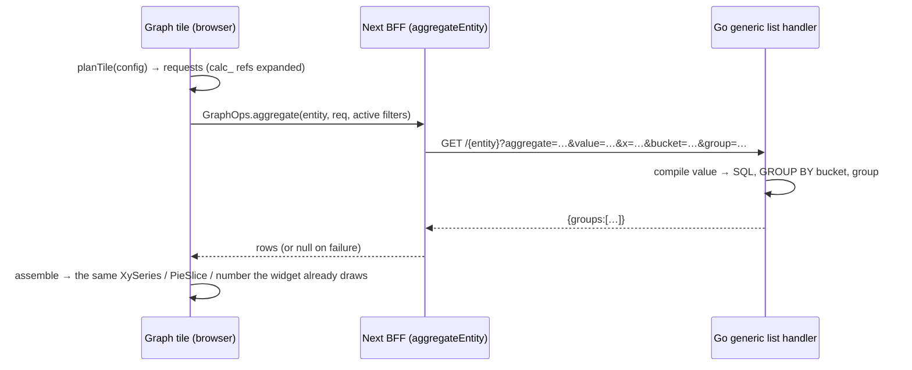

# ADR-023 — Server-side aggregation for Graph tiles

**Status:** accepted — supersedes the "Aggregation, v1" (client-side only) contract of
[list-view modes](../roadmaps/list-view-modes.md) for xy/bar/pie/stat tiles.

## Problem
Graph tiles aggregated **client-side over the records the list view had already fetched** — one
page, 20 rows by default. On a 100 000-row table every chart, stat and calculated field
summarized 20 rows under a "Partial data" badge: technically honest, practically useless. The
data volume the Developer "full" seed produces (and any real workspace reaches) needs the
aggregation to run where the rows are.

## Decision
The generic list endpoint gains an aggregate mode, the same way `?distinct=` was added
(ADR-014) — a query param on the existing route, so it keeps the `table:table:read` permission
and every filter/tenant/soft-delete/group-gating guard of the list:

```
GET /api/v1/{table}?aggregate=<sum|avg|mean|median|count>
                   &value=<column or formula>          (omit for a row count)
                   [&x=<date column>&bucket=<day|week|month>]
                   [&group=<column>]
                   [&filter[...]=…&search[...]=…&in[...]=…&gt[...]=…]
→ {"groups":[{"x":"2026-03","group":"paid","value":1234.5,"count":42}]}
```



- **Semantics match the client exactly**, so a tile shows the same numbers either way:
  buckets are `to_char(date_trunc(bucket, x AT TIME ZONE 'UTC'))` (`YYYY-MM`, `YYYY-MM-DD`,
  Postgres weeks start Monday like `bucketKey`); `median` is `percentile_cont(0.5)` (the true
  middle, not an approximation); rows with an empty group are skipped; `count` in a cell is its
  row count (a pie slice's size, a stat's "how many records").
- **Formulas compile to SQL, never interpolate text.** `value` is tokenized like the client's
  `evalFormula` (numbers, identifiers, `+ - * / ( )`) and rebuilt: identifiers become
  `COALESCE(col::float8, 0)` only if they are numeric columns the caller may read
  (`checkColumn`, so ADR-013 gating applies); unknown/gated/non-numeric identifiers read `0`,
  `x / 0` reads `0` (`NULLIF`), numbers are re-formatted from a parsed float. A single bare
  column compiles to `col::float8`, so NULLs drop out like the client's "skip non-numeric".
- **Calculated fields stay a client concept.** Go knows columns only; the client inlines
  `calc_` references (`expandCalcFormula`, parenthesized, recursively) with the same "a later
  or missing field reads 0" rule `withCalculatedFields` uses — which also rules out cycles.
- **Opt-in and fail-open on the frontend.** `GraphOps.aggregate` is optional; `planTile`
  returns `null` for list tiles, incomplete configs and tiles using a *dated* calculated field
  (computed per child row — not expressible as one table's aggregate); a failed call returns
  `null`. All three keep the old client-side path, badge included.
- **Filters follow the view.** The search bar reports its structured filters
  (`onFiltersChange`), merged with the route's `listFilter`, so a chart always describes the
  rows the list shows. Free-text live search (autocomplete) is not a row filter and isn't sent.
- Results ride the optional Redis read cache (ADR-022) like any generic read.

## Consequences
- Charts over 100k rows answer in ~100 ms (one grouped scan) and show no partial badge.
- A tile may issue several requests (one per `yFields` entry); each is small.
- Cells are capped at 2 000 per request (a chart past that is unreadable anyway).

## Pitfalls
- `x` must be a date/time column and `bucket` is required with it — anything else is a 400,
  and the tile silently falls back to the client path. Check the network tab when a tile
  unexpectedly shows "Partial data".
- A `count` over a **non-numeric** field counts rows (Go only aggregates numeric expressions);
  over a numeric field it counts non-null values, like the client.

## Related
- [ADR-014 — search/filter bar](ADR-014-search-filter-bar.md) (`?distinct=`, the pattern reused)
- [ADR-020 — graph calculated fields](ADR-020-graph-calculated-fields.md)
- [ADR-022 — optional Redis read cache](ADR-022-optional-redis-query-cache.md)
