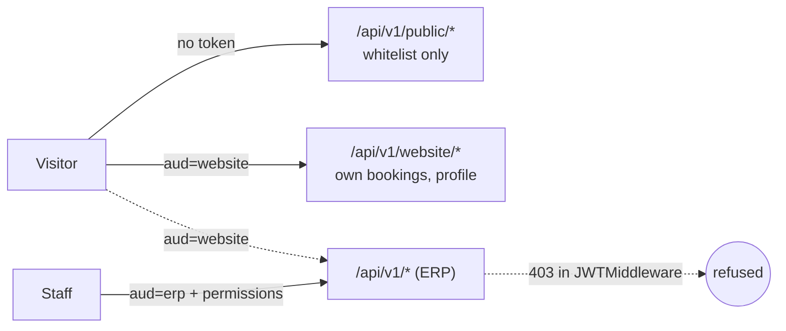

# ADR-024 — Public data access and website identities

**Status:** accepted — see the [public-access spec](../superpowers/specs/2026-09-29-website-1-public-access-design.md).

## Problem
Every EERP route assumes an authenticated ERP user: a JWT, a tenant, and a
`module:resource:action` permission derived from the route. A public website needs anonymous
reads of a small slice of data and self-registered visitor accounts — neither fits that model,
and bolting "anonymous" onto the permission system would put the whole ERP one mis-granted role
away from the internet.

## Decision
1. **Two-level whitelist for public data.** A module declares the ceiling in code
   (`orm.WithPublicFields`); an admin publishes a subset per table (`website.public.<table>`,
   optionally with a forced row filter). Only the intersection is readable anonymously.
2. **A separate route group, not a permission.** `/api/v1/public/*` is mounted without the JWT
   or permission middleware. Its only gate is the whitelist, enforced by the same
   `checkColumn` / `BuildResponse` code as ADR-013/014 field gating — one security boundary,
   fed by a different column set.
3. **JWT audience.** Tokens carry `aud` (`erp` default, `website`). `JWTMiddleware` refuses
   `aud=website` everywhere except `/public/*` and `/website/*`. Website accounts are
   `users.kind = 'website'` rows that can never log in to the ERP.

## Consequences
- Publishing data is a deliberate two-party act (developer + admin); neither alone can expose a
  column.
- Unpublished tables answer 404 on the public group, so its surface cannot be enumerated.
- The public group needs a fixed tenant (`website_tenant_id`, or the single tenant) — one site
  per database until multi-site is designed.
- Website and ERP sessions are independent cookies; one email cannot be both kinds of user (v1).

## Pitfalls
- Never add `/public` routes behind `permMw` "for safety": derived permissions would be required
  that anonymous callers can never hold, and the route silently breaks.
- A relation field exposes its target's label only if the target table is itself published.

## Implementation notes
Where the build differs from the first draft:
- Selections live at `company_id = uuid.Nil` (settings are company-keyed; Nil is the site-wide slot); filter values are strings (text comparison). `WithPublicFields` does not validate names (picture anchors aren't columns).
- The resolver is wrapped by `website.ActiveOnly(IsTableActive, …)`: a deactivated module's tables read as unpublished (404). `ActiveGateMiddleware` can't do this — it keys on the first path segment.
- Admin website-user API is `/api/v1/website_admin/users` (list + partial PUT, no GET `:id`), underscored so the derived permission matches. PUT order is enable → profile → disable; "lock" = soft delete + refresh-token revocation; an issued access token stays valid until its short TTL expires (`/website/me` already 404s).
- Session = two cookies `eerp_site_access`/`eerp_site_refresh`, BFF routes `/api/site-auth/*`.
- Rate limits: `/api/v1/public` and `/api/v1/website` use `public_rate_limit_per_minute` (default 300); signup/login the auth limit. `/website/me` sits behind `WebsiteJWTMiddleware`; `/website/auth/*` has no JWT. The limiter keys on `RealIP`, which Echo takes from `X-Forwarded-For` trusting only loopback/link-local/private hops (nginx sets it; the Next BFF forwards the browser's `x-forwarded-for`/`x-real-ip` on its site-auth calls). The site refresh route clears the visitor's cookies only on a 401 from Go — a 429/5xx keeps the session.
- Public lists refuse `page_size > 100` (400). A forced filter naming a column the table lacks (bad admin config) is a generic, server-logged 500 — its name never reaches the anonymous caller. A selection of only non-column anchor fields (e.g. just `picture`) is refused (400) and resolves as unpublished: it would publish bare ids.
- Website roles are seeded at boot in the site tenant; a seeding failure (e.g. a live role already holding `website_user` under another id) is logged, not fatal — only `/website/auth/signup` is left unmounted.
- Email uniqueness is enforced by `idx_users_email_live` (`lower(email)` where not deleted, global), created last and non-fatally by the auth migration: existing live case-duplicates only log a warning (find them with `SELECT lower(email), count(*) FROM users WHERE deleted_at IS NULL GROUP BY 1 HAVING count(*) > 1`). Website signup also pre-checks in its transaction, so it refuses duplicates even without the index. Admin create/update and signup return 409.
- The site tenant is resolved at boot (a dbmanage hot-swap keeps the old one until restart). Publish settings are written under the admin's tenant, the public site reads the site tenant — in a multi-tenant DB publish from the site tenant.
- Not in this plan: the public picture route (moves to spec 2, first consumer) and sorting (the generic list has no sort param). A many2one is returned as its raw id only if its column is published; labels are the consumer's job.
- Email verification (spec 4): signup enqueues a verification email (token stored hashed, 48 h). `POST /api/v1/website/me/verify {token}` accepts it only from the account's own session, then attaches confirmed anonymous bookings made with that address (`user_id IS NULL`) — an account never sees someone else's history by signing up with their email. `POST /website/me/verify/resend` re-issues the link.
