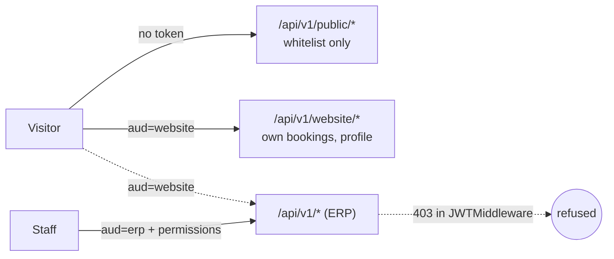

# ADR-024 — Public data access and website identities

**Status:** proposed — see the [public-access spec](../superpowers/specs/2026-09-29-website-1-public-access-design.md).

## Problem
Every EERP route assumes an authenticated ERP user: a JWT, a tenant, and a
`module:resource:action` permission derived from the route. A public website needs anonymous
reads of a small slice of data and self-registered visitor accounts — neither fits that model,
and bolting "anonymous" onto the permission system would put the whole ERP one mis-granted role
away from the internet.

## Decision
1. **Two-level whitelist for public data.** A module declares the ceiling in code
   (`orm.WithPublicFields`); an admin publishes a subset per table (`website.public.<table>`,
   optionally with a forced row filter). Only the intersection is readable anonymously.
2. **A separate route group, not a permission.** `/api/v1/public/*` is mounted without the JWT
   or permission middleware. Its only gate is the whitelist, enforced by the same
   `checkColumn` / `BuildResponse` code as ADR-013/014 field gating — one security boundary,
   fed by a different column set.
3. **JWT audience.** Tokens carry `aud` (`erp` default, `website`). `JWTMiddleware` refuses
   `aud=website` everywhere except `/public/*` and `/website/*`. Website accounts are
   `users.kind = 'website'` rows that can never log in to the ERP.

## Consequences
- Publishing data is a deliberate two-party act (developer + admin); neither alone can expose a
  column.
- Unpublished tables answer 404 on the public group, so its surface cannot be enumerated.
- The public group needs a fixed tenant (`website_tenant_id`, or the single tenant) — one site
  per database until multi-site is designed.
- Website and ERP sessions are independent cookies; one email cannot be both kinds of user (v1).

## Pitfalls
- Never add `/public` routes behind `permMw` "for safety": derived permissions would be required
  that anonymous callers can never hold, and the route silently breaks.
- A relation field exposes its target's label only if the target table is itself published.
