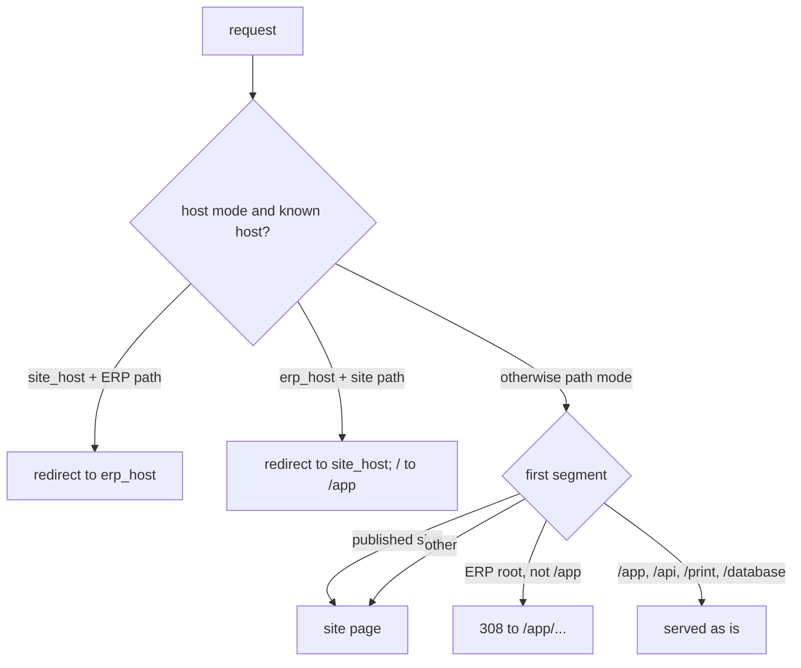

# ADR-025 — Website routing and the ERP `/app` base path

**Status:** accepted — see the [website core spec](../superpowers/specs/2026-09-29-website-2-core-design.md). Builds on [ADR-024](ADR-024-public-access-and-website-identities.md).

## Problem
The public website needs `/` (and `/<slug>`), but the ERP already owns `/`, `/crm`, `/settings`…
The two must coexist on one Next app and one gateway, optionally on two hostnames
(`www.example.com` for the site, `erp.example.com` for staff) — without an admin being able to
lock themselves out of the ERP by saving a wrong setting.

## Decision
1. **Site at `/`, ERP under `/app`.** The ERP route tree moved to `apps/shell/app/app/`.
   `/api`, `/print` (pdf-service renders `frontend_base_url` + `/print/...`) and `/database`
   stay at the root: they are machine or pre-login endpoints, not ERP pages.
2. **The base is added at link time, by `erpPath()`.** Module routes, descriptors, `formPath`s
   and settings sections stay **module-relative** (`/crm/:id`); every emitted link, push and
   redirect goes through one idempotent helper. Alternative rejected: rewriting registry and
   descriptor paths to include `/app` — it touches every module and extension, and a missed
   prefix would silently break a descriptor instead of costing one redirect.
3. **Legacy bare ERP paths 308 to `/app/...`** (old bookmarks, hard-coded links) — unless a
   **published** site page owns that first segment. The proxy fetches the published slugs
   (≤ 100 pages) plus the routing setting, caches both 60 s in-process (2 s timeout, one
   in-flight fetch shared by concurrent requests; failure → path mode, no slugs), so a slug
   such as `contacts` can win over the ERP root of the same name. Go additionally refuses
   reserved slugs and registered module names as a first line.
4. **Host mode is redirects, not rewrites.** `website.routing` = `{mode, site_host, erp_host}`.
   On `site_host` an ERP path redirects to `erp_host`; on `erp_host` a site path redirects to
   `site_host`, `/` goes to `/app`, and the ERP **keeps** its `/app` prefix. Redirects keep one
   canonical URL per page and let the same `erpPath` links work in both modes. Unknown hosts
   (IP, `localhost`) behave like path mode.
5. **Lockout guard.** `PUT` with `mode: "host"` is refused unless the request itself arrived
   through `erp_host`. Recovery override: `EERP_SITE_ROUTING=path` on `core-front`.
6. **The edge owns forwarding headers.** nginx sets `X-Forwarded-For $remote_addr` (never
   appends a client-supplied chain) and `X-Forwarded-Host`; the proxy still reads `Host`, which
   nginx passes through, never the client-controllable `X-Forwarded-Host`.

## Consequences and pitfalls
- A navigation site that forgets `erpPath` still works (through the 308) but costs a round trip.
- Old ERP `/login` bookmarks now 404: the ERP login is `/app/login`; visitor pages are
  `/login`, `/signup`, `/account` (separate website session).
- A published site page shadows an old ERP bookmark of the same first segment — the site owner's choice.
- Both sessions (ERP and site) are cleared only on a Go 401, never on 429/5xx.
- Cookies stay host-only: each hostname keeps its own sessions.
- Certificates: see [infra/nginx/README.md](../../infra/nginx/README.md).
