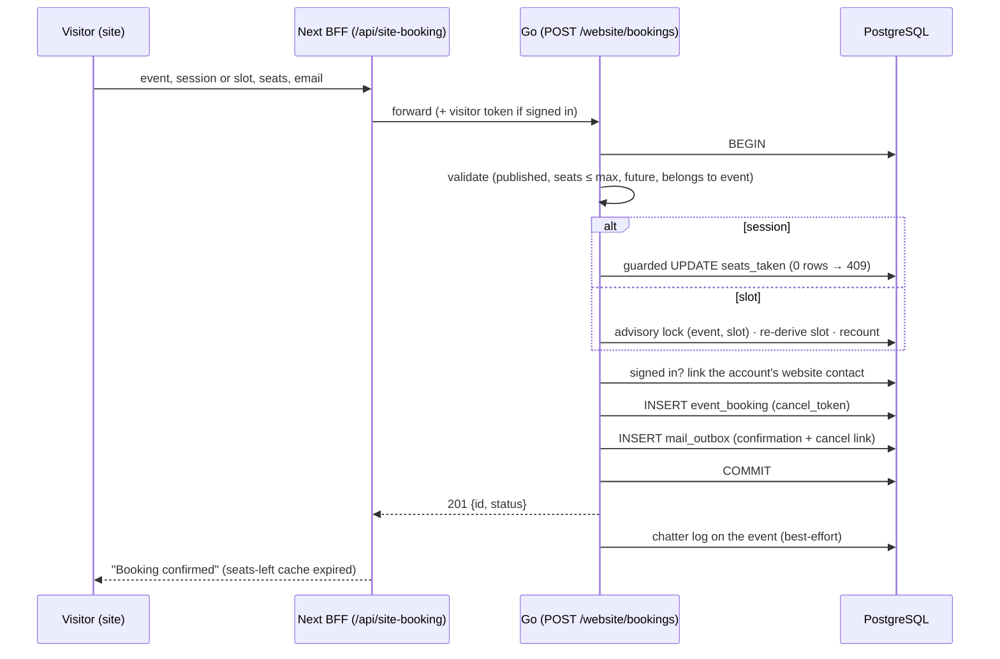
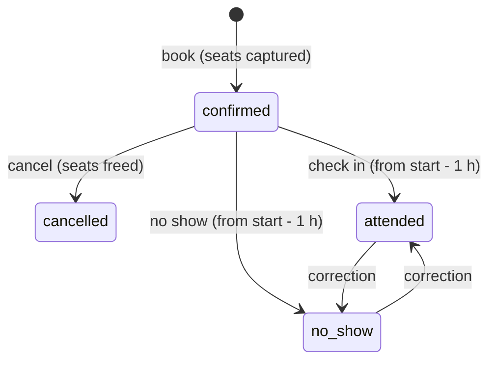

# ADR-026 — Booking capacity: no overbooking without a lock table

**Status:** accepted — see the [events & booking spec](../superpowers/specs/2026-09-29-website-4-events-booking-design.md).
Builds on [ADR-024](ADR-024-public-access-and-website-identities.md) (public access, website identities).

## Problem
Website visitors book seats on **event sessions** (fixed dates, a capacity) and on **appointment
slots** (derived from a weekly availability). Many visitors can race for the last seat, staff
book and cancel from the ERP at the same time, and each confirmed booking must produce exactly
one confirmation email. None of this may overbook, and a seat count must never drift from the
bookings that hold it.

## Decision
1. **Sessions: one guarded `UPDATE`.** The seat is captured by
   `UPDATE event_session SET seats_taken = seats_taken + n WHERE id = … AND seats_taken + n <= capacity AND starts_at > now()`.
   Postgres row locking serializes concurrent updates on the row; zero rows affected means full
   (409). No lock table, no `SELECT … FOR UPDATE` round trip. A `CHECK (seats_taken <= capacity)`
   also stops staff from shrinking a session below its booked seats.
2. **Appointment slots are computed, never stored.** `ExpandSlots` turns weekly availability
   (local wall-clock hours in the event's **own time zone**, DST-safe) into slots, dropping those
   inside the minimum notice, past the horizon, or already full. With no row to lock, a booking
   takes `pg_advisory_xact_lock(hashtextextended(event_id || slot_start))`, re-derives the slot
   from the availability (a forged or stale `slot_start` is a 400), recounts confirmed seats, and
   inserts — all in one transaction. Consequence: editing availability takes effect immediately,
   with no regeneration job and no orphaned slot rows.
3. **One transaction per booking, email through the outbox.** Capture, contact link, booking
   insert and `mail.Enqueue` commit together; a rollback leaves no seat, no booking and no email.
   Delivery is at-least-once (the outbox's contract). The chatter log on the event is posted after
   commit, best-effort.
4. **Bookings are cancelled, never deleted.** ERP-side: `POST /event_booking` books through the
   same service (staff may book unpublished events), `PUT` changes only name/phone or sets
   `status: "cancelled"` (which frees the seats), `DELETE` is a 409 "cancel instead". Changing
   seats or target is cancel-and-rebook. Cancel is idempotent (cancel twice → 200, seats freed
   once).
5. **Only accounts are contacts.** A website signup creates a `contact` with `website = true` in
   the signup transaction (auth's `OnWebsiteSignup` hook, wired in `internal/app`; `contact`
   stays out of `auth`). A booking made while signed in links to that contact; an anonymous or
   staff booking is just its name, email and phone on the booking row — no contact is created,
   so one-off visitors never flood the contact list. Verifying an email attaches earlier
   anonymous bookings to the account and to its contact.

## Addendum (Event v2): check-in holds seats
Staff record attendance from 1 h before the start: `confirmed` → `attended` | `no_show`
(correctable into each other), through `Service.SetAttendance` behind the same
`PUT /api/v1/event_booking/:id` override. A checked-in booking **keeps its seats** — the event
happened — so every capacity count now means "all bookings but cancelled ones" (slot recount,
`/slots`, the partial index `idx_event_booking_slot_held`), and a checked-in booking can no
longer be cancelled (409), which would otherwise free seats of a past session.

`event_booking.starts_at` copies the session start (or `slot_start`) so the bookings calendar
has one date column. The booking service writes it; moving a session re-syncs its bookings right
after the generic update commits (`GuardSessionUpdate` → `SyncSessionStart`, a separate
statement since the generic update owns its transaction), and every boot's `Migrate` heals any
drift a crash in between would leave. A DB trigger was rejected: its write would bypass the
Redis read cache's invalidation (ADR-022).

## Consequences
- Concurrency tests prove it: 20 visitors racing for 5 session seats end with exactly 5
  bookings and `seats_taken = 5`; 6 racing for a slot with `slot_capacity` 2 end with 2.
- Seats-left figures the site shows are hints (cached up to a minute, expired on every
  booking/cancel through the site); the 409 is the truth, and the form answers "just taken".
- A session's copy made with "Repeat weekly" keeps its UTC time, so a copy crossing a DST change
  is one hour off in local time until staff adjust it.

## Pitfalls
- Count held seats with `status <> 'cancelled'`, never `status = 'confirmed'`: attended,
  no-show and pending-payment bookings still occupy their seats. Waitlisted (and expired)
  bookings never hold seats; they exist on sessions only, whose count is `seats_taken`.
- Never write `event_booking` or `seats_taken` with a raw insert/update elsewhere: go through the
  booking service, or seat counts drift.
- Slot times are validated against the availability at booking time — a slot a visitor saw may
  legitimately be refused a minute later (availability edited, notice window passed).
- Emails link to `site_url` (config). Unset, links are relative and useless in a mail client
  (Go logs a warning at boot).
