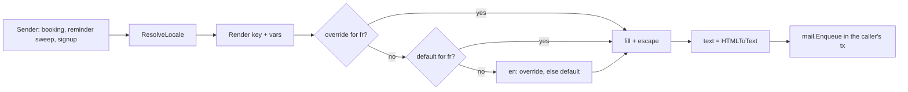

# ADR-027 — Email templates: registered in code, overridden per workspace

**Status:** accepted — see the [Event v2 overview § SP4](../superpowers/specs/2026-10-06-event-v2-overview.md#sp4-email-templates-languages-reminders).
Builds on the [mail outbox](../superpowers/specs/2026-09-29-website-3-mail-outbox-design.md) and
[ADR-026](ADR-026-booking-capacity.md) (booking emails).

## Problem
Transactional emails (booking confirmation, reminder, cancellation, website email verification)
were English strings in Go. A workspace needs them in its visitors' languages and in its own
words, without a deploy — and an admin-authored body must never become a way to break rendering,
leak data or inject markup into mail clients.

## Decision
1. **A module registers each email in code.** `mail.RegisterTemplate(TemplateDef{Key, Label,
   Vars, Defaults})` at `init()`: a stable key (`event.booking_confirmed`), the variables the
   sender fills, and default texts per language (English required — the last fallback). The code
   owns *which* emails exist and *what data* they may show.
2. **A workspace overrides (key, language).** Table `mail_template` (`tenant_id`, `key`,
   `locale`, `subject`, `body_html`; unique on the first three among live rows), off the generic
   CRUD surface: `GET /api/v1/settings/mail_templates` (catalog: definitions + this tenant's
   overrides) and `PUT|DELETE /api/v1/settings/mail_templates/:key/:locale` (DELETE = back to
   the default), permissions `settings:mail_templates:*` derived from the route.
3. **Substitution, not a template language.** `{{var}}` placeholders only, from the key's
   declared list; an unknown variable is refused on save (400). No conditionals or loops, so a
   saved template can't fail at send time, and an admin can't reach data the sender didn't hand
   over. Values are HTML-escaped in the HTML part and used as-is (one line) in the subject.
4. **HTML is sanitized on save; text is derived.** The body is edited in a WYSIWYG (`text/html`
   field widget, Tiptap) and reduced server-side to an allowlist (paragraphs, emphasis, lists,
   headings, links to http(s)/mailto/`{{placeholder}}`; scripts dropped with their content,
   every other attribute dropped). The plain-text part is generated from the HTML at send time,
   so the two can't drift.
5. **Language = the recipient's.** `ResolveLocale`: the account's `preferred_locale`, else the
   workspace default (`i18n.default_locale`), else English. Rendering walks
   locale → base language → English, and at each step a workspace override wins over the code
   default.

## Consequences
- Adding an email = one `RegisterTemplate` call; it appears in Settings → Email templates with
  its variables as insertable chips.
- Renaming or removing a variable in code silently empties it in existing overrides (they still
  render; the placeholder becomes ""). Treat a key's variables as a contract: add new ones, don't
  rename.
- `internal/mail` can't import `internal/settings` (settings → auth → mail would cycle), so it
  reads the workspace language key as a literal. The default language is stored per company; an
  email isn't sent as a company, so the first company's setting stands for the workspace.
- Dates are formatted by `mail.FormatDateTime` with built-in day/month names (en, fr): Go has
  no locale-aware formatting. Another language falls back to English names until added there.

## Pitfalls
- Never build an email body by string concatenation any more: register a template so admins can
  reword and translate it.
- A link must be written as a placeholder (`href="{{cancel_url}}"`): any other non-http(s)
  scheme is stripped on save.
