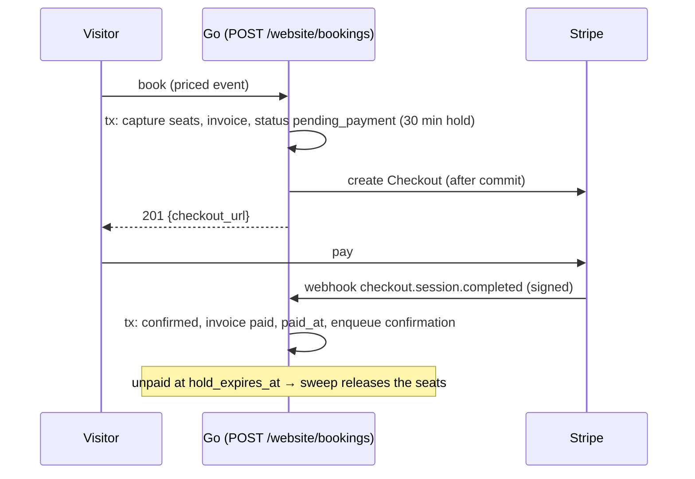

# ADR-028 — Online payment: a provider registry, Stripe as a module

**Status:** accepted — see the [Event v2 overview § SP5](../superpowers/specs/2026-10-06-event-v2-overview.md#sp5-waiting-list-ical-invoicing-payment).
Builds on [ADR-026](ADR-026-booking-capacity.md) (seat capture) and
[ADR-009](ADR-009-live-module-lifecycle.md) (live module activation).

## Problem
Paid event bookings must be payable online, but a workspace may not want (or be allowed) to use
a given payment service, and must keep working when none is connected: the booking is then
confirmed at once and paid at the event. Payment must never overbook, never keep seats forever
for someone who walked away, and never confirm a booking on an unverified notification.

## Decision
1. **A core registry, providers as modules.** `internal/payment` defines `Provider`
   (`Configured`, `CreateCheckout`, `ParseWebhook`) and a registry; a provider module registers
   itself at `init()` under its module name. `payment.Available(ctx, tenant)` returns a provider
   only when its module is **active** (live App Store state, `module.Registry.IsActive`, wired
   at boot) **and** configured for the tenant. Callers never import a provider: Stripe today,
   another later, without touching the event module.
2. **Stripe = `core/modules/payment_stripe`.** Stripe Checkout over Stripe's REST API (no SDK).
   Keys live in `app_settings` (`integrations.stripe`, tenant-wide slot), edited at
   `GET|PUT /api/v1/settings/integrations/stripe` (`settings:integrations:*`) and never sent
   back — the GET only says whether each is set. Webhooks are verified with the endpoint's
   signing secret (HMAC-SHA256 of `<t>.<body>`, at most 5 minutes old).
3. **Hold, then pay, then confirm.** A visitor's booking of a priced event, with a provider
   available, is captured exactly like any booking (same guarded `UPDATE` / slot lock) but saved
   as `pending_payment` with `hold_expires_at` = now + 30 min, its invoice `sent`, and no email.
   After the transaction commits — never a network call while the seat row is locked — the
   handler opens the checkout and returns its URL; if that fails the hold is released at once
   (502). The signed webhook (`POST /api/v1/public/payments/:provider/webhook`, site tenant)
   confirms the booking, marks the invoice paid, stamps `paid_at` and sends the confirmation; an
   expired checkout, or the 5-minute sweep past `hold_expires_at`, releases the seats silently
   (and offers them to the waiting list).
4. **Not connected = pay later.** The booking is confirmed immediately; the confirmation uses the
   `event.booking_confirmed_pay_later` template with the amount due; staff mark it paid from the
   booking ("Mark paid" → `paid_at`).

## Consequences
- The hold is 30 minutes, not 15: Stripe refuses a Checkout expiry under 30 minutes, and the
  hold must outlive the payment page.
- A payment arriving after its hold was released (a webhook delayed past expiry) is logged and
  must be refunded by hand; refunds are manual in v1 (Stripe dashboard).
- Staff bookings are never sent to online payment.
- Amounts go to the provider in minor units of the workspace currency (first company's);
  zero-decimal currencies (JPY…) are handled by `payment.MinorUnits`.

## Pitfalls
- Stripe's keys are stored in `app_settings` as plain text, like every other setting: protect
  database access and backups accordingly.
- Register the webhook endpoint on the **public site origin** for the `checkout.session.completed`
  and `checkout.session.expired` events; the public group is rate-limited per client IP.
- `pending_payment` holds seats: count it wherever held seats are counted (it is, since every
  count is "not cancelled").
