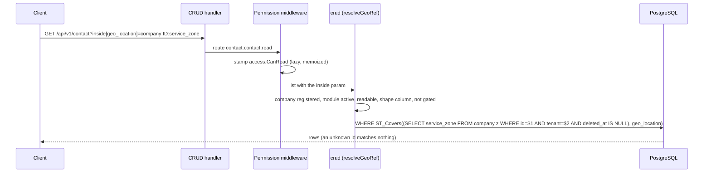

# ADR-029 — Geographic fields: PostGIS, GeoJSON on the wire

**Status:** accepted — design in [the geo fields spec](../superpowers/specs/2026-10-09-geo-fields-design.md).
Builds on [ADR-013](ADR-013-field-level-group-gating.md) (group gating),
[ADR-024](ADR-024-public-access-and-website-identities.md) (public scope) and
[ADR-014](ADR-014-search-filter-bar.md) (search filters).

## Context
Records need places, and the database should answer the geographic questions:
1. sort / filter a list by distance ("contacts within 10 km, nearest first");
2. the distance between two records (attendee to event);
3. the website's "events nearest to me";
4. zones: "contacts inside our service zone", "which companies serve this point".

Zones rule out plain lat/lon columns or `earthdistance`; a framework feature must also stay
declarative (a struct tag), tenant-safe and usable by any module.

## Decision
1. **PostGIS, `geography(…, 4326)`.** Distances are in meters on the globe with no projection
   choice for callers. The DB image is `postgis/postgis:18-3.6` (dev, prod, CI); boot runs
   `CREATE EXTENSION IF NOT EXISTS postgis` under the schema advisory lock, before any table DDL
   (boot, `EnsureSchema`, `MigrateModules`, and so dbmanage create/switch).
2. **Two ORM types**, `orm.GeoPoint` (`geography(Point,4326)`) and `orm.GeoShape`
   (`geography(Geometry,4326)`: Polygon, MultiPolygon, LineString). Declared as nullable pointers:
   `` Location *orm.GeoPoint `db:"geo_location,index=gist"` ``.
3. **Text I/O, not a pgx codec.** Values are read as EWKB hex and written as EWKT
   (`SRID=4326;POINT(lon lat)`) through `Scanner`/`Valuer`. A codec would have to be registered
   on the pool's type map, which needs the extension to exist *before* the pool connects and
   re-registration after a dbmanage hot-swap. Text needs neither and no SQL rewriting.
4. **GeoJSON geometry on the wire** (what Leaflet and Nominatim speak). Generic CRUD recognises a
   geo column by its Go type, converts on read, validates and converts on write. Invalid input
   is a **422 `VALIDATION_ERROR`** with the field in `fields`.
5. **List params** on `GET /api/v1/{table}`: `near[col]=lon,lat` (nearest first, rows carry a
   read-only `_distance_m`), `within[col]=lon,lat,meters` (radius), `covers[col]=lon,lat` (zones
   containing a point), `inside[col]=<table>:<id>:<shape col>` (points inside another record's
   zone). Malformed values are **400**; an unusable reference is **404**.
6. **References are authorized in the ORM.** `inside` and the distance endpoint resolve
   `table:id:col` only if the table is registered and not `Excluded`, its module is **active**
   (`orm.SetTableActiveCheck`), the caller can read it (`access.CanRead`, stamped by the
   permission middleware as `<table>:<table>:read`; `core/orm` never imports `auth`), the column
   has the right geo kind and is not group-gated for the caller. Tenant and soft-delete scoping
   sit *inside* the subquery, so a missing or foreign record matches nothing and leaks nothing.
   References are refused (400) on public routes; `near`/`within`/`covers` work there on
   published columns.
7. **`GET /api/v1/geo/distance?from=&to=`** (`internal/geo`, permission `geo:distance:read`)
   returns `{"meters": n|null}` for point/zone pairs, via the same reference resolution.
8. **Frontend:** Leaflet with OSM tiles and a minimal own polygon editor (no API key);
   `geo` field type (`point`, `shape` widgets), computed `distance` widget, search-bar
   Near / Inside / Covers filters. The user's unit system (`units.system`, in
   `/me/preferences` as `unit_system`) picks km or miles.

## Consequences
- **Image switch:** the only deployment step; the data directory format is unchanged. On managed
  Postgres, `CREATE EXTENSION` needs a privileged role (or the extension pre-created).
- **OSM tile policy:** the default tile server is for light use; a heavy deployment must point
  at its own tile provider.
- Group gating, the public scope, tenant pinning and the Redis read cache apply to geo columns
  and params unchanged (cache keys include the SQL and args).
- Not in v1: routing/travel time, drawing lines (stored and shown only), marker clustering,
  reverse geocoding.

## Pitfalls
- GeoJSON and EWKT coordinates are `[lon, lat]`, the reverse of the habitual "lat, lon".
- A point exactly on a zone's boundary is covered (`ST_Covers`, not `ST_Contains`).
- `_distance_m` is computed: never writable, absent without `near`; at most one `near` per request;
  `?distinct=` and `?aggregate=` ignore it.
- A point column without `index=gist` makes `near`/`within` scan the table.
- `inside` is refused on `/api/v1/public`, as it would reference arbitrary records.
- A shape with fewer than 3 vertices in the editor means "no zone" (`null`).
- Tree grids never render geo columns; keep geo fields in list descriptors for the search bar.
- Production: the extension is created at boot, but a role without the right cannot do it.
