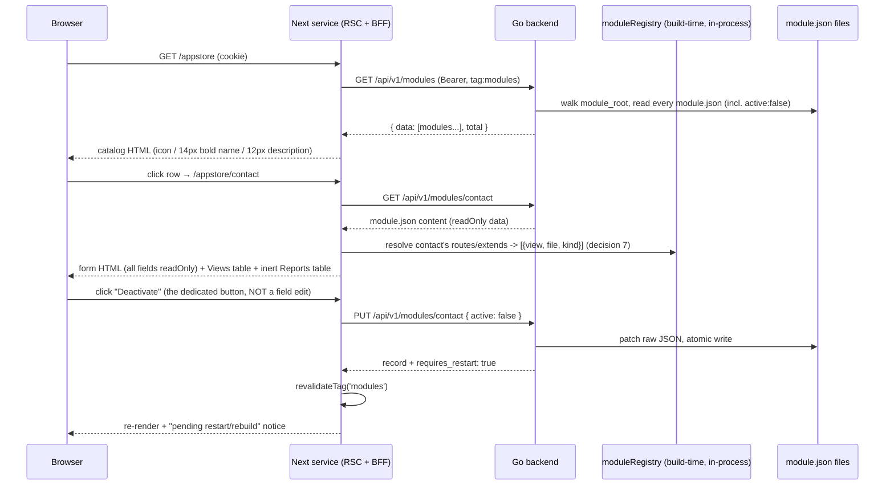
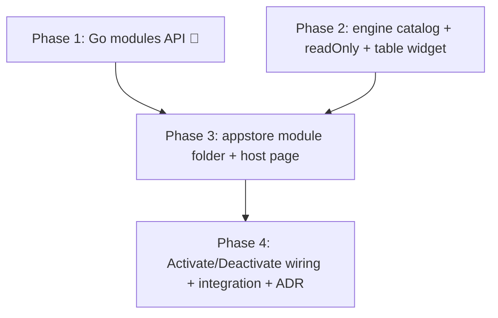

# App Store module — build roadmap

> **Goal:** a module (`appstore`) that acts as the application store of the ERP: it lists every
> detected module as a catalog (icon + name + description), opens a form on the `module.json`
> content, and lets an authorized user activate/deactivate it. The form is **read-only for data**
> — every `module.json` field, `app_mode` included, renders for inspection only. The **one**
> write affordance is a dedicated **Activate / Deactivate button**, not a field edit, and it
> **writes the change back to the module's `module.json` file** so both the backend loader and
> the frontend discovery pick it up on the next restart/rebuild. The form's notebook (docs/
> roadmaps/responsive-displays.md) carries two documentation pages: **Views** — every view path
> the module creates or edits, with the source file behind each — and **Reports**, a placeholder
> for a later, separate development.

## Why it exists / what problem it solves

Today `active` and `app_mode` are flipped by hand-editing `module.json` files on disk. That is
invisible to non-developers, error-prone (the `contact` NOT_FOUND incident came from a manual
edit), and unauditable. The store makes module lifecycle a first-class, permissioned UI concern
— while deliberately **not** promising hot reload: v1 writes config; activation still happens at
the next backend restart + frontend rebuild, exactly like an edit on disk would.

It is also the proof-case for three engine gaps worth closing generically: a **catalog** view type
(icon/title/subtitle list — any future "directory of things" reuses it), **read-only form
fields** (forms over data the user may only inspect), and a **read-only table widget** (any future
field whose value is naturally a list of records — not just this module's Views/Reports pages).

Read-only-by-default is also a legibility choice: `app_mode`, `depends`, `priority` etc. are
build-time facts a module author set in `module.json` — editing them from the running UI would
silently diverge the file from what actually shipped. `active` is the one exception because IT IS
exactly the lifecycle switch this store exists to make safe and auditable; everything else is
"look, don't touch."

## Architecture decisions (read first)

1. **The management API is core infrastructure, not module code.** Go modules today only
   register ORM models (`module.RegisterGoModule` → `Register() error`); they cannot mount HTTP
   routes, and the thing being managed (the module set) is a core concern anyway. The API lives
   in `core/internal/module/` and is mounted in `main.go` behind `jwtMw + permMw`, exactly like
   `internal/auth` and `internal/settings`. The **frontend** of the store, however, IS a regular
   module folder with descriptors only — proving the module pipeline on a non-DB entity.
2. **List from the backend scan, never from the frontend registry.** The store must show
   deactivated modules (that is the point of a store) — but frontend discovery drops
   `active: false` modules by design. So the catalog data comes from Go's detector walk of
   `module_root`, which sees every `module.json` regardless of `active`.
3. **The writer patches raw JSON, never marshals `types.Module`.** `module.json` carries fields
   the Go struct does not know (`app_mode` is frontend-only; future fields will follow).
   Round-tripping through the struct would silently drop them. The writer reads the file into
   `map[string]any`, patches only the whitelisted keys, and writes atomically (temp file +
   rename). Key order/indentation normalization is accepted and documented.
4. **`modules` is a virtual entity that mimics the generic envelope.** The auth admin endpoints
   set the precedent: dedicated, tenant-agnostic handlers that return the generic list envelope
   (`{ data, total, ... }`) so the engine's `ApiClient` needs no special case. `id` = module
   `name` (the detector already resolves names uniquely across roots).
5. **Restart semantics are explicit, not hidden.** Every successful `PUT` response carries
   `requires_restart: true` and the UI surfaces a "pending restart/rebuild" notice. No hot
   reload in v1 (that is the V2.0.0 registry's job).
6. **The ONLY writable field is `active`, and it is not even a form field — it is a button.**
   Every other `module.json` key, `app_mode` included, renders `readOnly: true` for display.
   `active`'s CURRENT value also renders read-only alongside the rest (so the form always shows
   ground truth); a separate **Activate**/**Deactivate** button — host-rendered next to the form,
   the same "chrome the generic renderer doesn't own" posture `CreateBar` already takes for tree
   views — fires its own Server Action straight to `PUT /api/v1/modules/:id { active: !current }`,
   bypassing the generic `FormRenderer`'s dirty-tracked Save entirely. With every field read-only
   the generic Save button can never become enabled anyway; giving activation its own control
   is honest about that, not a workaround for it.
7. **The Views/Reports notebook pages are sourced from the FRONTEND's own build-time module
   registry, not from Go.** "Which paths does this module create or edit, and from which file"
   is exactly what `moduleRegistry` already resolves for the top nav (`moduleNav()`) and Settings
   → Views (`treeViewEntities()`) — a `FrontModule`'s `routes` (created) and `extends` (edited),
   cross-referenced with `module.json`'s `static_files.views` (the file each default-exports
   from). Go's `/api/v1/modules` knows NONE of this — it only ever reads `module.json`. This
   makes the appstore form page a **hand-built page reusing the generic engine**, the same third
   shape `core-front/CLAUDE.md` already documents for Settings → Views/Users: a Next.js page that
   fetches the Go record AND reads the compiled `moduleRegistry` server-side, merges the two into
   one seed, and renders it through the ordinary `LayoutForm`/`EntityView` machinery — not the
   generic catch-all route, because the catch-all only ever fetches from Go.
8. **A new read-only `widget: 'table'` closes the third engine gap.** A `type: 'text'`,
   `store: false` field whose runtime VALUE is an array of plain objects, rendered as a compact
   MUI `Table`; `widgetOptions.columns: { key: string; label: string }[]` declares the columns
   (declared, not inferred, so column order and labels are a descriptor concern like everywhere
   else). Deliberately generic — not "the appstore Views widget" — because the SAME shape (a
   list of records too small to need pagination, shown inside a form) will recur; giving it a
   name and a home in the engine now is cheaper than a bespoke component per future use. Because
   the value is seeded server-side (decision 7), NOT derived via `compute`, this field carries no
   `compute` name at all — it is a plain `store: false` field the seed simply arrives with a
   value for, same as any server-computed display field.
9. **The Reports page ships INERT in this roadmap.** Its table renders with its columns declared
   and zero rows, plus a one-line "Reports are not available yet" caption — reserving the tab's
   place in the notebook and its shape in the descriptor without building the reporting feature
   itself, which is explicitly a **separate, later development** (its own future roadmap, not a
   phase here). Do not wire a real data source for it in this roadmap's phases.

## Contracts

| Concern | Contract |
| --- | --- |
| Backend routes | `GET /api/v1/modules` (list, generic envelope) · `GET /api/v1/modules/:id` · `PUT /api/v1/modules/:id` — `:id` = module `name`. Mounted with `jwtMw + permMw`. |
| Permissions | Derived from the route (flat case): `modules:modules:read` / `modules:modules:write`. |
| Record shape | `{ id, name, display_name, description, version, author, type, icon, active, app_mode, depends, priority, is_service }` — read straight from each `module.json` (raw map), `id` mirrors `name`. Every field renders read-only in the form (decision 6); `active`'s value is included for display like the rest. |
| Writable field | **`active` only** (boolean). The PUT body accepts exactly `{ "active": bool }`; any other key is rejected with `VALIDATION_ERROR` — whitelist, fail closed. `app_mode` is no longer writable through this API at all (decision 6) — changing it stays a manual `module.json` edit, same as every other non-lifecycle key. |
| Activate/Deactivate control | A `Button` rendered by the HOST page beside the form (never inside `LayoutForm`), labeled "Activate" when `active` is currently false, "Deactivate" when true; gated on `modules:modules:write` (hidden without it, `CreateBar`'s posture); disabled mid-flight; on the appstore module's OWN record, `active` is currently `true` and this button is disabled with a hint (mirrors the backend's self-protection). Its own Server Action calls `PUT /api/v1/modules/:id { active: !current }` directly — it does not go through the record's form store/commit at all. |
| Write behavior | Raw-JSON patch of the module's `module.json`, atomic write (`.tmp` + `rename`), serialized by a mutex. Response: updated record + `requires_restart: true`. |
| Self-protection | `PUT` refuses `active: false` for the `appstore` module itself (`VALIDATION_ERROR`) — the store must not brick its own UI. |
| Icon | New **optional** `module.json` field `icon` (short string — emoji in v1, e.g. `"🧩"`). Missing icon → the catalog renders a letter Avatar from `display_name`. The Go decoder is lenient, so the field is backward-compatible everywhere. |
| Catalog item | Left: 40px icon/Avatar. Right of it: `display_name` at **14px bold** (`fontSize: 14, fontWeight: 700`); beneath it `description` at **12px regular**, `text.secondary`, single line ellipsized. Whole row clickable → `formPath`. |
| Frontend entity | `entity: 'modules'` (maps 1:1 to the Go route prefix, per the descriptor-entity rule in `core-front/CLAUDE.md`). |
| Table widget | `widget: 'table'` on a `type: 'text'`, `store: false` field; `widgetOptions.columns: { key, label }[]`; the field's VALUE (seeded, never computed — decision 8) is `Record<string, JsonValue>[]`. Renders a borderless MUI `Table`, one row per array entry, an empty-state caption (`widgetOptions.emptyLabel`, default "Nothing here yet.") when the array is empty. Read-only by construction — there is no write path for a table field, ever. |
| Views notebook page | First page in the form's notebook (`addNode`, `position: 'first'` on `FORM_NOTEBOOK_ID` — decision 7). One row per path the viewed module's `FrontModule` **creates** (`routes`) or **edits** (`extends`), columns `View` (the path, e.g. `/crm/:id`), `File` (the `static_files.views` entry the route's/extension's default export came from, e.g. `CrmViews.ts`), `Kind` (`Created` or `Edited`). Sourced from `moduleRegistry`, server-side, per decision 7 — never a client `compute`. |
| Reports notebook page | Second page, same table shape (`Report`, `File` columns) — ships with zero rows and the "Reports are not available yet." caption in THIS roadmap (decision 9); a later, separate development wires real data. |
| Effect of a change | On disk immediately; live after backend restart + frontend rebuild. The UI must say so. |

## Data flow



---

## Phase 1 🔺 — Backend module management API (`core/internal/module/`)

Security + file-writing surface — build and test first; everything else consumes it.

**Claude Code prompt:**
```
In core/internal/module/, add a module management HTTP surface (echo), mounted in
cmd/app/main.go under /api/v1/modules with jwtMw + permMw (permission middleware already
derives modules:modules:read|write from the route).

manager.go (repository): walks the config's module_root dirs for module.json files
(reuse/extract the detector's walk, but stateless — no snapshot caching) and exposes:
- List(ctx) ([]map[string]any, error): one record per module.json, raw-decoded, with
  id mirroring name; includes active:false modules.
- Get(ctx, name) (map[string]any, error)
- Patch(ctx, name, changes map[string]any) (map[string]any, error): whitelist ONLY
  {"active"} (boolean — reject anything else, including app_mode, with VALIDATION_ERROR;
  fail closed). Read the raw JSON map, apply, write atomically (same-dir .tmp +
  os.Rename), serialize writes with a mutex. NEVER round-trip through types.Module:
  unknown keys (app_mode, icon, future fields) must survive untouched. Refuse
  active:false when name == "appstore".

handler.go: GET "" (list, generic envelope {data,total}), GET /:id, PUT /:id. Error
envelope + status map per the project convention (404 unknown module, 400 validation).
Every successful PUT response includes requires_restart: true.

Table-driven tests (t.Run) against a temp module_root fixture: list includes inactive
modules; get by name; patch flips active and PRESERVES every unknown json key
(app_mode included); patch attempting app_mode -> 400 VALIDATION_ERROR, file untouched;
unknown module -> 404; appstore self-deactivation -> 400; concurrent patches don't
corrupt the file. golangci-lint clean (zap via common.Logger).
```
**DoD:** envelope matches the generic list shape; a patched `module.json` diff shows only the
`active` key changing (plus formatting normalization); every other key, `app_mode` included,
survives byte-for-byte; an `app_mode` patch attempt is rejected and changes nothing; the
permission middleware denies without `modules:modules:*`; tests green via
`make run-back-tests BACKTESTPATH=./internal/module/...`.

## Phase 2 — Engine: `catalog` view type, read-only fields, table widget (`@eerp/core-front`) ✅ (implemented)

> Implementation notes: landed as designed, with the export barrel note resolved by NOT
> needing one — `catalog-renderer.tsx`, like `kanban-renderer.tsx`/`graph-renderer.tsx`
> before it, stays OUT of `views/index.ts`'s public barrel entirely: it's an
> `EntityView`-internal implementation detail a module author never imports directly,
> only reaches through `viewType: 'catalog'`. `CatalogDescriptor`, the `readOnly` field,
> and `validateCatalogDescriptor` DO need exporting, and already were — they live in
> `descriptor.ts`, which the barrel already re-exports wholesale.
>
> `validateCatalogDescriptor` (new, alongside `validateDescriptorWidgets`) turned out to be
> the one real addition beyond the prompt's letter: `catalog.title`/`icon`/`subtitle` are
> field NAMES, so a typo should fail the build the same way a dangling layout leaf does —
> wired into `registry.ts`'s `validateDescriptor()` right next to the widget check. Every
> other viewType is a no-op pass-through.
>
> `FieldDescriptor.readOnly` composes into `layout-renderer.tsx`'s existing `disabled`
> computation as a third OR term (`Boolean(field.compute) || field.readOnly === true ||
> stateReadOnly`) — no new branch, since "static wins" was already true by construction
> once it's part of an OR. The form store's `commit()` needed NO change at all: it already
> sends the whole draft regardless of which fields are editable, so a readOnly field's
> untouched value just round-trips unchanged — "readOnly never blocks commit" was true for
> free, not something to implement.
>
> `TableWidget` needed one addition the prompt didn't call out: a visible caption
> (`fieldLabel`, same as `NumberStarsWidget`'s pattern) above the table, for consistency
> with every other widget always identifying itself — the App Store's own Views/Reports
> pages don't strictly need it (their notebook PAGE title already says "Views"/"Reports"),
> but a generic engine primitive used from an unknown future context shouldn't assume its
> caller always supplies that context. Column LABELS go through `t()` (developer-declared
> msgids, like a field label); row VALUES never do (record data, same "declared vs data"
> split notebook pages/stored-page titles already established).
>
> `CatalogRenderer`'s row title/subtitle values are likewise never translated — they're a
> record's own data (a module's `display_name`/`description`), not developer-authored UI
> chrome. Added one thing beyond the letter: an explicit "No entries." empty state (there
> is no DataGrid-style built-in fallback for a plain `List`), and its own
> `CatalogRendererProps<T>` interface rather than importing `EntityViewProps` from
> `renderers.tsx` — importing across that direction is exactly what Kanban/Calendar/Graph
> renderers already avoid, to keep `renderers.tsx` the only file depending on the others,
> never the reverse.
>
> No real-browser verification this phase — there is still no real consumer (`appstore`'s
> own descriptors are Phase 3), so a live check has nothing genuine to click through yet;
> the RTL suite (23 new tests: 8 `validateCatalogDescriptor`, 5 `TableWidget`, 6
> `CatalogRenderer`, 3 `readOnly` disabling, 1 `readOnly`-never-blocks-commit) covers this
> phase's own DoD directly. Full engine + downstream (`crm`/`contact`/`crminheritdemo`/
> `apps/shell`) test suites stay green — 511 + 195 = 706 tests total.

Three generic gaps; no store-specific code in the engine.

**Claude Code prompt:**
```
In @eerp/core-front:

1. descriptor.ts: add ViewType 'catalog' and an optional descriptor block
   catalog?: { icon?: string; title: string; subtitle?: string }   // field NAMES
   Reuse formPath for row navigation. Add FieldDescriptor.readOnly?: boolean.

2. CatalogRenderer (client): MUI List of clickable rows — 40px Avatar on the left
   (record[catalog.icon] rendered as text/emoji; fallback: first letter of the title
   value), then a column: title at fontSize 14 / fontWeight 700, subtitle at fontSize 12
   regular, color text.secondary, one line with ellipsis. Row click routes to formPath
   with :id replaced (same mechanism as tree rows). Wire 'catalog' into the EntityView
   dispatcher; it reuses createEntityStore + the existing server loader path untouched
   (list fetch — no new loader).

3. FormRenderer: a field with readOnly: true renders disabled (never blocks commit);
   boolean fields keep the existing Switch control, just disabled.

4. TableWidget (new): widget: 'table' on a type: 'text' field. widgetOptions:
   { columns: { key: string; label: string }[]; emptyLabel?: string }. value is
   Record<string, JsonValue>[] (loosely typed on purpose — it never round-trips through
   validation the way an editable field would). Renders an MUI Table: header row from
   widgetOptions.columns[].label, one body row per array entry reading columns[].key off
   each record (missing key -> empty cell, never throws), OR the emptyLabel caption
   (default "Nothing here yet.") when the array is empty. Always effectively read-only —
   register it with no onChange wiring at all, not just a disabled one.

Tests (RTL + seeded store, no network): catalog renders icon/title/subtitle with the
specified typography and falls back to a letter avatar; row click navigates; readOnly
fields are disabled while editable ones commit; TableWidget renders declared columns,
renders rows in array order, and shows the empty-state caption for []. Export new types
from the barrels.
```
**DoD:** all existing renderer tests still pass; a catalog descriptor renders from seeded data
with zero entity-specific code; `readOnly` proven in a form commit test; `TableWidget` renders
an arbitrary array-of-records value against declared columns, including the empty state.

## Phase 3 — The `appstore` module folder (descriptors + one hand-built form page) ✅ (implemented)

> Implementation notes: landed as designed, plus two real bugs found and fixed along the
> way, and one pre-existing inconsistency found and deliberately NOT fixed.
>
> **`ModuleRegistry` needed one new accessor.** `buildRegistry()` alone answers "created"
> (a `RouteConfig.module` stays the ORIGINAL registrant through every extension merge —
> confirmed by reading `registry.ts`, not assumed), but nothing exposed "which paths does
> module X's OWN `extends` target" for the "edited" half. Added `extendedPaths(moduleName):
> string[]` — a focused, generic accessor (any future "what does module X touch" question
> reuses it), not an appstore-specific one.
>
> **Bug 1 — a virtual entity's non-UUID id broke Phase 5's runtime notebook pages.** The
> App Store's `modules` entity keys records by NAME ("crm", "contact"), not a UUID.
> `LayoutForm`'s notebook always tries to list STORED (Phase 5) pages for the current
> `(entity, recordId)` anchor whenever a `NotebookOpsProvider` is mounted (it is, globally)
> — Go's `notebook_pages` API validates `record` as a UUID and correctly 400s "crm", which
> surfaced as a full-width `INTERNAL_ERROR` banner on an otherwise perfectly working,
> entirely-read-only form. Root-caused by rebuilding the Docker images and driving the app
> for real, not by reasoning about it — the browser is what caught this. Fixed generically
> in `layout-renderer.tsx`, not with an appstore special case: a REJECTED background LIST
> now degrades silently to "no stored pages" (the exact posture "no `NotebookOpsProvider`
> mounted" already has), while Add/Save/Delete — real user-initiated actions — still
> surface their own failures. A malformed anchor, a missing permission, or any other list
> failure now degrades the same way for every form, not just this one; pinned with a new
> layout-renderer test.
>
> **Bug 2 — the read-only Active/App mode toggles went stale after their own button.**
> `createFormStore` seeds once (a lazy `useState` initializer) and never re-reads
> `initialData` on a later prop change — correct for the generic catch-all, where every
> write goes THROUGH that same store's `commit()`, which reconciles itself. The
> Activate/Deactivate button deliberately mutates OUTSIDE the form store (decision #6),
> then calls `router.refresh()` — a fresh server fetch, but the SAME `EntityView` instance
> unless something forces React to remount it. Caught by actually clicking the button in a
> real browser and watching the "Active" switch NOT flip, even though the button's own
> label updated correctly (it reads a fresh server prop directly). Fixed with
> `key={JSON.stringify(record)}` on the `EntityView` in the host page — cheap and always
> correct here specifically because every field is readOnly (there is no local edit state
> a remount could lose).
>
> **Discovered, deliberately not fixed: `core/modules/contact`'s two names don't match.**
> `module.json` declares `"name": "contact"` (singular — the Go entity/table name, the
> identifier `moduleViewRows` keys its lookup on); `ContactsViews.ts`'s `FrontModule.name`
> is `'contacts'` (plural) — every OTHER module here (`crm`, `crminheritdemo`, `appstore`
> itself) keeps the two identical, which is what makes `moduleViewRows`'s module-name
> lookup work at all. The mismatch means `/appstore/contact`'s Views tab shows "Nothing
> here yet." instead of `contact`'s real three routes — a pre-existing, unrelated
> inconsistency this phase's own verification happened to expose, not a bug in the Views
> feature (crm/crminheritdemo/appstore all show correct rows). Renaming `contacts.name` to
> `'contact'` would fix it, but `Menu.tsx` derives the LANDING TILE'S LABEL directly from
> `module.name` (`t(titleize(module.name))`) — that rename would visibly change the
> Contact module's tile text ("Contacts" → "Contact"), a real UI change to an unrelated,
> already-shipped module, and out of scope for this phase. Flagged here for whoever next
> touches `core/modules/contact`, the same "flag it, don't silently patch unrelated code"
> posture `docs/roadmaps/responsive-displays.md` already took for crminheritdemo's header
> crowding.
>
> Verified against the real stack (rebuilt both Docker images, logged in as the dev
> admin): the App Store tile appears on the landing menu; `/appstore` lists all four
> modules (itself included) with correct icon-or-letter-avatar/title/subtitle; clicking a
> row opens `/appstore/<name>` with EVERY field disabled (verified query-role, not just
> visually) and the Views tab showing accurate Created/Edited rows (CRM's own
> self-extension for its Signature page — docs/roadmaps/app-store.md's earlier sample —
> correctly shows up as an "Edited" row on ITS OWN "Created" routes, proving a module can
> be both); Reports shows the "not available yet" caption; Deactivate on `contact` flips
> its button label, its read-only Active switch, AND its catalog visibility (still listed
> — inactive modules stay visible, the whole point of the store) — then reactivated back
> to its original state; `/appstore/appstore` renders its OWN Deactivate button disabled
> with the self-protection hint tooltip.

**Claude Code prompt:**
```
Create core/modules/appstore/:
- module.json: { active: true, type: "go", name: "appstore", display_name: "App Store",
  icon: "🧩", app_mode: true, version: "0.0.1", description: "Install and manage the
  workspace's applications", static_files: { views: ["AppStoreViews.ts"] }, is_service: false }
- module.go: a no-op RegisterGoModule (Register() returns nil) so the backend loader is
  satisfied — the module ships no models; verify LoadModules accepts it (if a views-only
  module needs loader support, fix that in internal/module, don't fake a model).
- package.json + tsconfig.json mirroring core/modules/contact (workspace-linked engine).
- views/AppStoreViews.ts — DESCRIPTORS ONLY over entity 'modules' (the Go route prefix):
    '/appstore'      catalog view; catalog: { icon: 'icon', title: 'display_name',
                     subtitle: 'description' }; formPath '/appstore/:id';
                     permissions ['modules:modules:read']
    '/appstore/:id'  form view: EVERY field (name/display_name/version/author/type/
                     description/active/app_mode) declared readOnly: true — there is no
                     editable field on this form at all (decision 6). `views` and
                     `reports` are two additional store: false, type: 'text',
                     widget: 'table' fields (widgetOptions.columns per the Views/Reports
                     notebook page row in the Contracts table) — declared here with NO
                     compute (their values are seeded server-side, see the host page
                     below), just like display_name/description read straight from the
                     seed. Self-extend '/appstore/:id' (this module targeting its OWN
                     route, the same pattern core/modules/crm/views/CrmViews.ts uses for
                     its Signature page) with addNode ops: a page {title:'Views',
                     children:[{kind:'field',name:'views'}]} at target
                     FORM_NOTEBOOK_ID/position:'first', then a page {title:'Reports',
                     children:[{kind:'field',name:'reports'}]} targeting the Views page's
                     own id / position:'after' — final notebook order is
                     Views, Reports, (Settings, empty — no widget:'long' field here,
                     which is fine per Phase 4 of responsive-displays.md).
  Field names are the raw module.json keys (snake_case rule) plus the two virtual table
  fields above. No custom widget code here — TableWidget/readOnly are engine gaps closed
  in Phase 2.
- views/AppStoreViews.test.ts: route/descriptor wiring, catalog mapping, every field
  readOnly: true (assert NONE is false/undefined), the notebook's page order and each
  page's single field.

apps/shell/app/appstore/[id]/page.tsx — the ONE hand-built page this roadmap needs
(mirrors Settings → Views' "hand-built host page reusing the generic engine" shape,
core-front/CLAUDE.md): fetches the module record from Go (createServerApiClient or the
generic loader) AND reads the compiled moduleRegistry server-side to build the Views
rows for THIS module name — walk buildRegistry() entries whose OWNING module (the
`module` field ModuleRegistry.register() records per resolved route) is this one, each
a 'Created' row; separately, if THIS module itself declares its own `extends`, each of
those target paths is an 'Edited' row. Map every row to its static_files.views file name
(a views file exports exactly one FrontModule, so file attribution is 1:1 with the
module). Merge { ...record, views: [...], reports: [] } as the seed passed into the
ordinary EntityView/LayoutForm — no bespoke rendering, just a bespoke SEED. Render the
Activate/Deactivate button here too (host chrome, per decision 6), bound to its own
Server Action.
Rebuild: discovery registers appstore (app_mode tile "App Store" on the landing menu).
```
**DoD:** the App Store tile appears; `/appstore` lists every module **including deactivated
ones** (backend data, not the registry); clicking a row opens a form filled with that module's
`module.json` content, EVERY field disabled/readOnly, no field ever becomes dirty; the notebook
shows Views (real rows: this module's own created/edited paths + files) then Reports (empty,
"not available yet"); the Activate/Deactivate button is the only thing on the page that can
mutate anything.

## Phase 4 — Activate/Deactivate wiring, integration proof, docs

**Claude Code prompt:**
```
1. Wire the Activate/Deactivate button end-to-end: its OWN Server Action PUTs
   { active: !current } to /api/v1/modules/:id — NOT the generic form commit path, which
   this form never uses (every field is readOnly). revalidateTag('modules'), optimistic
   button-state update (flip the label immediately, revert on a rejected write, same
   revert-and-ErrorAlert posture Kanban/Calendar/notebook pages already use). Surface the
   response's requires_restart as an MUI Alert: "Saved to module.json — takes effect
   after backend restart + frontend rebuild"; also badge any catalog row toggled this
   session (client-only, cleared on reload).
2. appstore.integration.test.ts (skipped unless TEST_API_BASE): login, list modules,
   deactivate contact via the button's endpoint (PUT {active:false}), assert the
   file-backed record changed and app_mode is untouched, reactivate it. MSW twin
   replaying the same flow with the real envelopes for CI.
3. Docs (same task, per the documentation rules): core-front/CLAUDE.md — catalog view
   type, readOnly fields, and TableWidget in the engine sections; App Store under the
   module examples, noting it is the one module with a hand-built form host page; root
   CLAUDE.md — the /api/v1/modules surface under internal/module/; NEW ADR: "Module
   lifecycle managed via API" (why file-write + restart, why raw-JSON patching, why
   activation is a button and not a field, why app_mode stopped being writable, why the
   Views/Reports data comes from the frontend registry and not Go; hot reload and real
   Reports both deferred — the former to the V2 registry, the latter to its own future
   roadmap).
```
**DoD:** clicking Activate/Deactivate results in a changed `module.json` on disk (`active` only)
and a visible pending notice; after `make rebuild-and-run` the change is live (deactivated
module gone from menu / `app_mode` tile appears); integration + MSW tests green; docs and ADR
merged with the code.

> **✅ (implemented)** — `ActivateButton.tsx` now holds local optimistic `active` state (flips
> the label the instant you click, before the write resolves) and reverts it — plus renders
> `ErrorAlert` (newly exported from the engine's client barrel, previously internal-only) — on
> a rejected write, the exact same revert-and-`ErrorAlert` posture `use-optimistic-field-move.ts`
> established for Kanban/Calendar. A successful write additionally shows a persistent `Alert`
> ("Saved to module.json — takes effect after backend restart + frontend rebuild") and calls the
> new `useRecentlyChangedStore.markChanged(name)` (`recently-changed-store.ts`, a plain
> non-persisted Zustand `Set<id>`, also newly exported) so `CatalogRenderer` can badge the row
> with a small `Chip` labeled `t('Updated')`. `module-actions.ts`'s `setModuleActive` now returns
> `{ active, requiresRestart }` instead of a bare boolean so the button has something to key the
> notice off of. `appstore.integration.test.ts` (skipped unless `TEST_API_BASE`) and its MSW twin
> `appstore.msw.test.ts` live in `apps/shell/src/`, mirroring `crm.integration.test.ts`/
> `crm.msw.test.ts`'s existing convention exactly (this repo's integration tests live beside the
> host app, not inside the module folder) — both deactivate/reactivate `contact` through the
> button's own endpoint (`PUT /api/v1/modules/:id`) and assert `app_mode` survives untouched; the
> MSW twin adds a second case replaying the appstore-self-deactivation 400. `ADR-008` and both
> `CLAUDE.md`s were written alongside the code, per the documentation rules.
>
> Verified live (rebuilt `core-front` from source, backend untouched since this phase touched no
> Go code): the button's label flips optimistically before the network settles, the
> requires_restart `Alert` renders on success, and the appstore-self-deactivate button stays
> **disabled** (not just rejected) exactly as Phase 3 built it. The catalog badge needed real
> care to verify correctly: a Zustand store is a plain in-memory JS singleton, so it only survives
> a **client-side** Next.js navigation (clicking a row, the browser back button within the same
> session) — a `page.goto()`/hard reload in Playwright reinitializes the whole JS bundle and
> wipes it immediately, which is indistinguishable from "the badge doesn't work" if your test
> script hard-navigates by mistake. Once verified with a real click-through (catalog → row →
> Deactivate → browser back), the badge shows correctly and clears on an actual full reload, as
> designed. No product bug here — the confusion was entirely in getting the Playwright script's
> navigation to match a real user's, plus test runs that left `contact` deactivated mid-way
> (a crashed script skipping its own cleanup step) and made a *later* run's assertions look like
> failures when they were actually testing a pre-deactivated starting state. Restored via a
> direct `PUT /api/v1/modules/contact {active:true}` afterwards — the container's writable layer
> holds this test-run state, never the host's `module.json` (unchanged throughout, per the
> COPY-based-Dockerfile isolation noted in Phase 1).
>
> One more thing double-checked, not fixed: loading `/appstore/contact` still logs a server-side
> `record must be a UUID` `ApiError` (Bug 1 from Phase 3 — the runtime notebook-pages list fetch
> rejects the App Store's name-shaped ids) on every load, and the underlying Server Action POST
> does return an HTTP 500 at the network layer. This is expected, not a regression: Next.js has no
> way to signal a thrown Server Action error except as a 500, and the existing Phase 3 fix
> (`layout-renderer.tsx`'s `.catch()` silently setting `storedPages([])`) still fully suppresses
> it from the UI — confirmed no visible error, no console-surfaced alert, notebook just renders
> with the declared Views/Reports tabs and nothing else. Flagged again here so a future reader
> checking server logs doesn't mistake this known, already-handled log line for a new bug.

---

## Build order



Phases 1 and 2 are independent — parallelize. Phase 3 is the one phase with real host-page code
(the hand-built `/appstore/[id]` page) rather than pure descriptors — that is an intentional,
documented exception (decision 7), not scope creep; if MORE than the seed-merging and the
Activate button end up bespoke, an engine gap leaked out of Phase 2.

## Pitfalls (learned the hard way, encode them)

- **`entity` = Go route prefix** (`'modules'`), field names = raw JSON keys. A mismatch
  surfaces as `NOT_FOUND` on the view (see the descriptor-entity rule in `core-front/CLAUDE.md`).
- **Never serialize `types.Module` back to disk** — it drops `app_mode`, `icon`, and any future
  frontend-only key. Raw map patch only.
- **The catalog must not read the frontend registry** — the registry no longer contains
  `active: false` modules, which are exactly the ones a store exists to re-activate.
- **The Views/Reports table values must NEVER be a `compute`.** `moduleRegistry`'s data lives
  behind the `server-only` barrel (`@eerp/core-front/server`); a views file's `compute` handler
  runs in the BROWSER too (the form store recomputes on every render) — importing the server
  barrel there pulls it into the client bundle, the exact "never import the server manifest from
  client code" pitfall `core-front/CLAUDE.md` already names for `generated-modules.ts`. Seed the
  `views`/`reports` field values server-side, once, in the hand-built host page — never register
  a client compute for them.
- **Don't let the Activate/Deactivate button flow through the generic form store.** Every field
  is `readOnly`, so the form is never dirty and Save can never fire — that is correct, not a bug
  to route around by secretly making `active` editable again. The button's Server Action is
  independent of `createFormStore`/`commit()` entirely.
- Deactivating a module whose views are currently open produces dead routes **only after the
  next rebuild** — until then nothing changes. That asymmetry is the `requires_restart` notice's
  whole job; do not fake liveness.
- JSON rewrite normalizes formatting; keep `module.json` files free of hand-formatting you care
  about (they already are).
- **The Reports page is a placeholder, not a stub to "finish while you're in there."** Wiring a
  real data source for it is explicitly out of scope for this roadmap (decision 9) — leave it
  empty with its caption; a future, separate roadmap owns the actual reporting feature.
