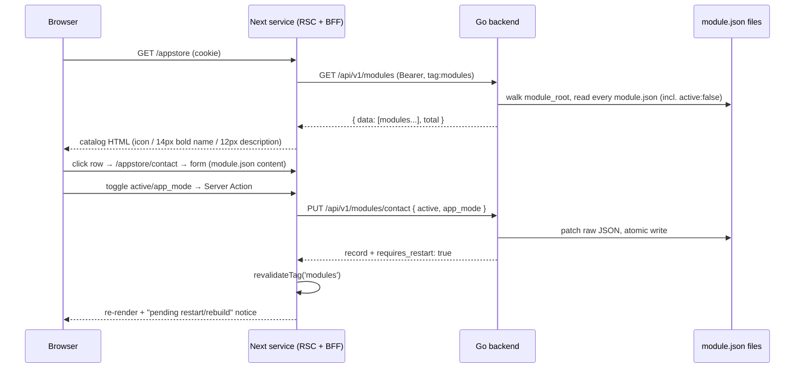
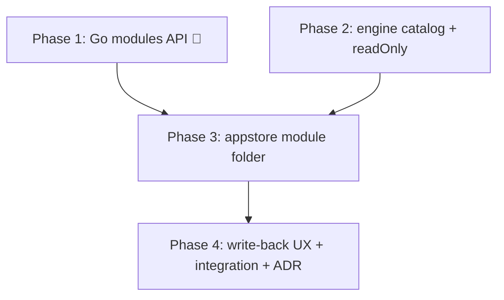

# App Store module — build roadmap

> **Goal:** a module (`appstore`) that acts as the application store of the ERP: it lists every
> detected module as a catalog (icon + name + description), opens a form on the `module.json`
> content, lets an authorized user toggle `active` and `app_mode`, and **writes the change back
> to the module's `module.json` file** so both the backend loader and the frontend discovery
> pick it up on the next restart/rebuild.

## Why it exists / what problem it solves

Today `active` and `app_mode` are flipped by hand-editing `module.json` files on disk. That is
invisible to non-developers, error-prone (the `contact` NOT_FOUND incident came from a manual
edit), and unauditable. The store makes module lifecycle a first-class, permissioned UI concern
— while deliberately **not** promising hot reload: v1 writes config; activation still happens at
the next backend restart + frontend rebuild, exactly like an edit on disk would.

It is also the proof-case for two engine gaps worth closing generically: a **catalog** view type
(icon/title/subtitle list — any future "directory of things" reuses it) and **read-only form
fields** (forms over data the user may inspect but only partially edit).

## Architecture decisions (read first)

1. **The management API is core infrastructure, not module code.** Go modules today only
   register ORM models (`module.RegisterGoModule` → `Register() error`); they cannot mount HTTP
   routes, and the thing being managed (the module set) is a core concern anyway. The API lives
   in `core/internal/module/` and is mounted in `main.go` behind `jwtMw + permMw`, exactly like
   `internal/auth` and `internal/settings`. The **frontend** of the store, however, IS a regular
   module folder with descriptors only — proving the module pipeline on a non-DB entity.
2. **List from the backend scan, never from the frontend registry.** The store must show
   deactivated modules (that is the point of a store) — but frontend discovery drops
   `active: false` modules by design. So the catalog data comes from Go's detector walk of
   `module_root`, which sees every `module.json` regardless of `active`.
3. **The writer patches raw JSON, never marshals `types.Module`.** `module.json` carries fields
   the Go struct does not know (`app_mode` is frontend-only; future fields will follow).
   Round-tripping through the struct would silently drop them. The writer reads the file into
   `map[string]any`, patches only the whitelisted keys, and writes atomically (temp file +
   rename). Key order/indentation normalization is accepted and documented.
4. **`modules` is a virtual entity that mimics the generic envelope.** The auth admin endpoints
   set the precedent: dedicated, tenant-agnostic handlers that return the generic list envelope
   (`{ data, total, ... }`) so the engine's `ApiClient` needs no special case. `id` = module
   `name` (the detector already resolves names uniquely across roots).
5. **Restart semantics are explicit, not hidden.** Every successful `PUT` response carries
   `requires_restart: true` and the UI surfaces a "pending restart/rebuild" notice. No hot
   reload in v1 (that is the V2.0.0 registry's job).

## Contracts

| Concern | Contract |
| --- | --- |
| Backend routes | `GET /api/v1/modules` (list, generic envelope) · `GET /api/v1/modules/:id` · `PUT /api/v1/modules/:id` — `:id` = module `name`. Mounted with `jwtMw + permMw`. |
| Permissions | Derived from the route (flat case): `modules:modules:read` / `modules:modules:write`. |
| Record shape | `{ id, name, display_name, description, version, author, type, icon, active, app_mode, depends, priority, is_service }` — read straight from each `module.json` (raw map), `id` mirrors `name`. |
| Writable fields | **`active` and `app_mode` only** (booleans). Everything else in the PUT body is rejected with `VALIDATION_ERROR` — whitelist, fail closed. |
| Write behavior | Raw-JSON patch of the module's `module.json`, atomic write (`.tmp` + `rename`), serialized by a mutex. Response: updated record + `requires_restart: true`. |
| Self-protection | `PUT` refuses `active: false` for the `appstore` module itself (`VALIDATION_ERROR`) — the store must not brick its own UI. |
| Icon | New **optional** `module.json` field `icon` (short string — emoji in v1, e.g. `"🧩"`). Missing icon → the catalog renders a letter Avatar from `display_name`. The Go decoder is lenient, so the field is backward-compatible everywhere. |
| Catalog item | Left: 40px icon/Avatar. Right of it: `display_name` at **14px bold** (`fontSize: 14, fontWeight: 700`); beneath it `description` at **12px regular**, `text.secondary`, single line ellipsized. Whole row clickable → `formPath`. |
| Frontend entity | `entity: 'modules'` (maps 1:1 to the Go route prefix, per the descriptor-entity rule in `core-front/CLAUDE.md`). |
| Effect of a change | On disk immediately; live after backend restart + frontend rebuild. The UI must say so. |

## Data flow



---

## Phase 1 🔺 — Backend module management API (`core/internal/module/`)

Security + file-writing surface — build and test first; everything else consumes it.

**Claude Code prompt:**
```
In core/internal/module/, add a module management HTTP surface (echo), mounted in
cmd/app/main.go under /api/v1/modules with jwtMw + permMw (permission middleware already
derives modules:modules:read|write from the route).

manager.go (repository): walks the config's module_root dirs for module.json files
(reuse/extract the detector's walk, but stateless — no snapshot caching) and exposes:
- List(ctx) ([]map[string]any, error): one record per module.json, raw-decoded, with
  id mirroring name; includes active:false modules.
- Get(ctx, name) (map[string]any, error)
- Patch(ctx, name, changes map[string]any) (map[string]any, error): whitelist
  {"active","app_mode"} (booleans only — reject anything else, fail closed), read the
  raw JSON map, apply, write atomically (same-dir .tmp + os.Rename), serialize writes
  with a mutex. NEVER round-trip through types.Module: unknown keys (app_mode, future
  fields) must survive. Refuse active:false when name == "appstore".

handler.go: GET "" (list, generic envelope {data,total}), GET /:id, PUT /:id. Error
envelope + status map per the project convention (404 unknown module, 400 validation).
Every successful PUT response includes requires_restart: true.

Table-driven tests (t.Run) against a temp module_root fixture: list includes inactive
modules; get by name; patch flips active/app_mode and PRESERVES unknown json keys;
non-whitelisted field -> 400; unknown module -> 404; appstore self-deactivation -> 400;
concurrent patches don't corrupt the file. golangci-lint clean (zap via common.Logger).
```
**DoD:** envelope matches the generic list shape; a patched `module.json` diff shows only the
flipped keys (plus formatting normalization); unknown keys survive; the permission middleware
denies without `modules:modules:*`; tests green via `make run-back-tests BACKTESTPATH=./internal/module/...`.

## Phase 2 — Engine: `catalog` view type + read-only form fields (`@eerp/core-front`)

Two generic gaps; no store-specific code in the engine.

**Claude Code prompt:**
```
In @eerp/core-front:

1. descriptor.ts: add ViewType 'catalog' and an optional descriptor block
   catalog?: { icon?: string; title: string; subtitle?: string }   // field NAMES
   Reuse formPath for row navigation. Add FieldDescriptor.readOnly?: boolean.

2. CatalogRenderer (client): MUI List of clickable rows — 40px Avatar on the left
   (record[catalog.icon] rendered as text/emoji; fallback: first letter of the title
   value), then a column: title at fontSize 14 / fontWeight 700, subtitle at fontSize 12
   regular, color text.secondary, one line with ellipsis. Row click routes to formPath
   with :id replaced (same mechanism as tree rows). Wire 'catalog' into the EntityView
   dispatcher; it reuses createEntityStore + the existing server loader path untouched
   (list fetch — no new loader).

3. FormRenderer: a field with readOnly: true renders disabled (never blocks commit);
   boolean fields keep the existing Switch control.

Tests (RTL + seeded store, no network): catalog renders icon/title/subtitle with the
specified typography and falls back to a letter avatar; row click navigates; readOnly
fields are disabled while editable ones commit. Export new types from the barrels.
```
**DoD:** all existing renderer tests still pass; a catalog descriptor renders from seeded data
with zero entity-specific code; `readOnly` proven in a form commit test.

## Phase 3 — The `appstore` module folder (descriptors only)

**Claude Code prompt:**
```
Create core/modules/appstore/:
- module.json: { active: true, type: "go", name: "appstore", display_name: "App Store",
  icon: "🧩", app_mode: true, version: "0.0.1", description: "Install and manage the
  workspace's applications", static_files: { views: ["AppStoreViews.ts"] }, is_service: false }
- module.go: a no-op RegisterGoModule (Register() returns nil) so the backend loader is
  satisfied — the module ships no models; verify LoadModules accepts it (if a views-only
  module needs loader support, fix that in internal/module, don't fake a model).
- package.json + tsconfig.json mirroring core/modules/contact (workspace-linked engine).
- views/AppStoreViews.ts — DESCRIPTORS ONLY over entity 'modules' (the Go route prefix):
    '/appstore'      catalog view; catalog: { icon: 'icon', title: 'display_name',
                     subtitle: 'description' }; formPath '/appstore/:id';
                     permissions ['modules:modules:read']
    '/appstore/:id'  form view: name/display_name/version/author/type/description as
                     readOnly text fields; active and app_mode as boolean fields
  Field names are the raw module.json keys (snake_case rule). No custom components — a
  needed component is an engine gap (Phase 2), stop and fix it there.
- views/AppStoreViews.test.ts: route/descriptor wiring, catalog mapping, the two and
  only two editable fields.
Rebuild: discovery registers it (app_mode tile "App Store" on the landing menu).
```
**DoD:** the App Store tile appears; `/appstore` lists every module **including deactivated
ones** (backend data, not the registry); clicking a row opens the form filled with that
module's `module.json` content; the only enabled inputs are `active` and `app_mode`.

## Phase 4 — Write-back UX, integration proof, docs

**Claude Code prompt:**
```
1. Wire the form commit end-to-end: Server Action PUTs {active, app_mode} to
   /api/v1/modules/:id, revalidateTag('modules'), optimistic store update. Surface the
   response's requires_restart in the form AND as a badge on catalog rows whose file
   state was changed this session: MUI Alert "Saved to module.json — takes effect after
   backend restart + frontend rebuild".
2. appstore.integration.test.ts (skipped unless TEST_API_BASE): login, list modules,
   flip contact's app_mode off, assert the file-backed record changed, flip it back.
   MSW twin replaying the same flow with the real envelopes for CI.
3. Docs (same task, per the documentation rules): core-front/CLAUDE.md — catalog view
   type + readOnly fields in the engine sections, App Store under the module examples;
   root CLAUDE.md — the /api/v1/modules surface under internal/module/; NEW
   ADR: "Module lifecycle managed via API" (why file-write + restart, why raw-JSON
   patching, why the appstore self-protection; hot reload deferred to the V2 registry).
```
**DoD:** a toggle in the UI results in a changed `module.json` on disk and a visible pending
notice; after `make rebuild-and-run` the change is live (deactivated module gone from menu /
`app_mode` tile appears); integration + MSW tests green; docs and ADR merged with the code.

---

## Build order



Phases 1 and 2 are independent — parallelize. Phase 3 is deliberately tiny (one folder, one
descriptors file); if it isn't, an engine gap leaked out of Phase 2.

## Pitfalls (learned the hard way, encode them)

- **`entity` = Go route prefix** (`'modules'`), field names = raw JSON keys. A mismatch
  surfaces as `NOT_FOUND` on the view (see the descriptor-entity rule in `core-front/CLAUDE.md`).
- **Never serialize `types.Module` back to disk** — it drops `app_mode`, `icon`, and any future
  frontend-only key. Raw map patch only.
- **The catalog must not read the frontend registry** — the registry no longer contains
  `active: false` modules, which are exactly the ones a store exists to re-activate.
- Deactivating a module whose views are currently open produces dead routes **only after the
  next rebuild** — until then nothing changes. That asymmetry is the `requires_restart` notice's
  whole job; do not fake liveness.
- JSON rewrite normalizes formatting; keep `module.json` files free of hand-formatting you care
  about (they already are).
