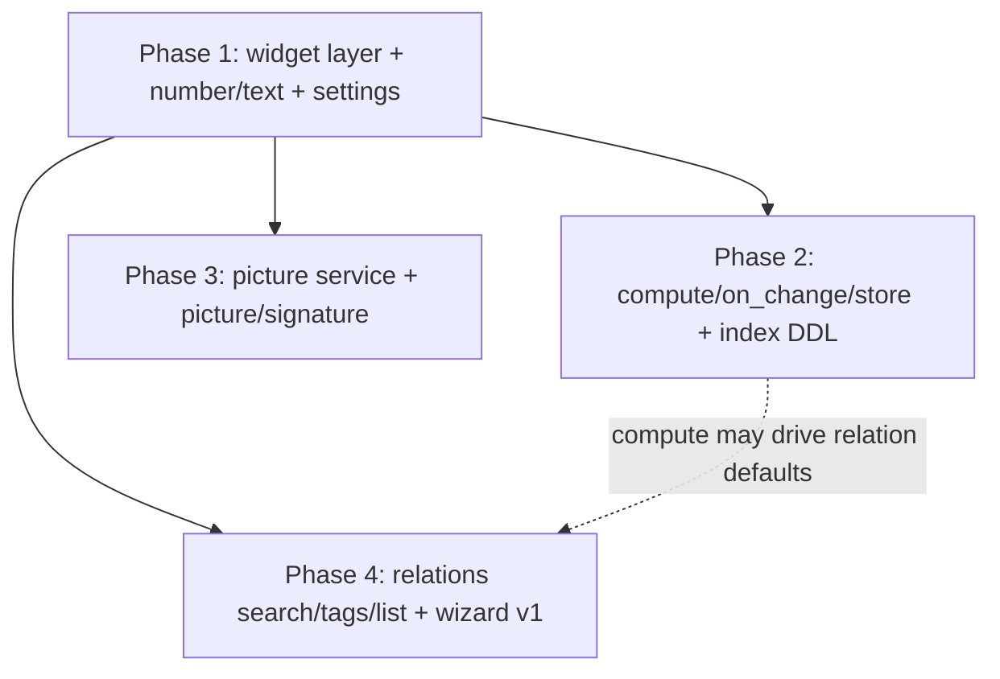

# Field widgets & behaviors — build roadmap

> **Goal:** split *what a field is* (its data type) from *how it displays and behaves*. Every
> field gains a **widget** decorator (boolean → switch/picture/signature; text → simple/long;
> number → int/float/percent/stars/phone; relation → search/tags/list), plus behavior
> metadata: `compute` (with `depends`/`on_change` triggers), `store`, and DB `index`. The
> model is Odoo's field/widget split (`<field widget="signature"/>`, `@api.depends`),
> transposed to the descriptor system — cited only as examples.

## Why it exists / what problem it solves

Today `FieldDescriptor.type` conflates data type and presentation: `'text'` is always one
input box, `'number'` a bare input, `'boolean'` a switch, `'relation'` a stub. Real ERP forms
need signatures, star ratings, phone prefixes, and record pickers — and without a widget
layer every one of those becomes a custom component in a module, which the architecture
forbids (descriptors only). The widget layer keeps the promise: modules *describe*, the
engine renders. The behavior layer (`compute`/`on_change`) does the same for form logic that
today has nowhere to live.

## Architecture decisions (read first)

1. **`type` stays the data type; `widget` is presentation.** `widget` is optional with a
   per-type default (boolean→`switch`, text→`simple`, number→`float`, relation→`search`), so
   every existing descriptor keeps rendering unchanged. A widget/type compatibility matrix is
   validated at registration — wrong pairs fail the build, like broken view-extension anchors.
2. **Functions are registered by name; descriptors carry strings.** Descriptors cross the RSC
   boundary, so `compute`/`on_change` handlers cannot live in them (the standing rule from the
   view-customization roadmap). Module views files call `registerFieldFunction` /
   `registerOnChange` (engine exports, client-safe — views files already bundle into the
   client via the generated manifest) and descriptors reference `compute: 'crm.margin'`.
3. **Compute runs at draft time in v1.** `depends` lists the fields whose edits trigger
   recompute; the result lands in the draft. `store: true` (default) persists it on commit as
   a normal column; `store: false` makes it display-only — never sent to Go, no DB column
   needed. Server-side recompute of stored fields on non-form writes is explicitly out of
   scope for v1 (documented limitation).
4. **`index` belongs to the Go model, not the view.** View descriptors never create DB
   objects. The ORM **already parses** `db:"col,index"` / `db:"col,index=<method>"` with the
   exact method set (btree, hash, gist, spgist, gin, brin) into `FieldMeta.Index/IndexType` —
   only the DDL emission is missing. The roadmap finishes that: migration emits
   `CREATE INDEX IF NOT EXISTS ... USING <method>`.
5. **Pictures are a core service, not a widget hack.** Core registers a `picture` table
   (metadata) and stores binaries in S3-compatible object storage (Garage in dev compose — see infra/garage/).
   A picture-backed boolean field is `true` ⇔ a picture row exists for
   `(table, record_id, field)`; the column stores the flag, the service owns the bytes.
   Uploads follow the BFF rule: browser → Next → Go → S3, never browser → Go.
6. **Number formatting is workspace state.** Thousands/decimal separators live in
   `app_settings` (the `i18n.default_locale` precedent), editable from Settings, applied by
   one shared formatting hook — widgets never hardcode separators.

## Contracts

| Concern | Contract |
| --- | --- |
| FieldDescriptor v2 | `{ name, label, type, widget?, widgetOptions?, required?, readOnly?, states?, compute?, store?, relation? }` — all JSON-serializable. `store?: boolean` default `true`; `compute?: string` (registered function name). |
| Widget matrix | boolean: `switch` (default) · `picture` · `signature` — text: `simple` (default) · `long` (multiline) — number: `float` (default) · `int` · `percent` · `stars` · `phone` — relation: `search` (default, many2one) · `tags` (many2many) · `list` (one2many) — date: unchanged. Anything else ⇒ registration error. |
| number/float | Default widget; formatted `%.2f` (`widgetOptions.decimals` overrides), separators from settings. |
| number/int | Integer input/display, thousands separator from settings. |
| number/percent | Value stored as ratio 0..1 by default (`widgetOptions.base: 'ratio'\|'percent'`), displayed `× 100` with `%`. |
| number/stars | `widgetOptions.max` (default **3**), half-star granularity (0.5 steps), click/keyboard to set. |
| phone | Country indicator (flag + dial prefix) leading the input; value normalized E.164. Allowed on `text` (recommended — leading `+`/zeros don't survive numeric columns) and on `number` with that caveat documented. |
| Format settings | `app_settings` key `format.number` = `{ decimal_separator, thousands_separator }`; `PUT /api/v1/settings/format` (permission `settings:format:write`); read with the preferences load; `useNumberFormat()` engine hook is the only consumer path. |
| boolean/picture | Field value = "image exists". Upload/replace/delete through the picture service; widget shows thumbnail or upload affordance. |
| boolean/signature | Drawable canvas; non-empty drawing ⇒ field `true`; on "done" the canvas exports PNG → picture service; a **reset button** deletes the picture and sets `false`. |
| Picture service | Core `picture` table: `id, tenant_id, table_name, record_id, field, object_key, mime, size, created_at…` (off the generic CRUD surface). Routes: `POST /api/v1/pictures` (multipart) · `GET /api/v1/pictures/:id` (stream) · `GET /api/v1/pictures?table&record&field` · `DELETE /api/v1/pictures/:id`; permissions `pictures:pictures:read\|write` from the route; respects the existing body-size limit. Storage is **already provisioned**: the `s3_*` fields sit in `eerp-config.json` (host endpoint `:3910`) and `eerp-config.docker.json` (`http://garage:3900`), backed by the compose `garage` service — bootstrap with `make garage-init`, details in `infra/garage/README.md`. |
| relation metadata | `relation: { entity, kind: 'many2one'\|'one2many'\|'many2many', labelField? ('name'), inverseField? (o2m), via? (m2m junction entity), viaFields? ({own, related} junction columns, default `<own>_id`/`<related>_id`) }`. `entity` = Go route prefix, as everywhere. The widget derives from the kind; o2m needs `inverseField`, m2m needs `via` — enforced at registration. |
| relation/search (m2o) | An autocomplete search bar querying the related entity's list (Go authorizes — the user only ever sees records they may read). A **link icon at the right** of the field opens a **wizard dialog** (search + grid, select to set) — v1 basic, improved in a later iteration. Selected record renders as a tag. |
| relation tags (m2o/m2m) | Tag shows the related record's `labelField`; **on hover a cross appears on the tag's right side**; clicking it unlinks (m2o → null, m2m → junction row removed). |
| relation/list (o2m) | The inverse side: records of another table whose `inverseField` column holds this record's id. v1 renders a read-only embedded grid (list filtered by the inverse FK); inline create/edit deferred. |
| compute | `registerFieldFunction({ entity, name, depends: string[], handler(draft) => value })`. Recomputed when any `depends` field changes in the draft; result written to the field. Dependency cycles ⇒ registration error. |
| on_change | `registerOnChange({ entity, name, onChange: string[], handler(draft) => Partial<draft> })`. Fired when a listed field changes; the returned patch merges into the draft (may cascade compute, cycle-guarded). |
| index | Go struct tag `db:"col,index"` (btree default) or `db:"col,index=gin"` etc. — metadata already parsed; migration emits `CREATE INDEX IF NOT EXISTS idx_<table>_<col> ON <table> USING <method> (<col>)`. |

**Example — one field, everything on (the Odoo analogy):**

```ts
// Odoo: rating = fields.Float(compute="_compute_rating", store=True)
//        + <field name="rating" widget="priority"/> + @api.depends("deals")
{ name: 'rating', label: 'Rating', type: 'number', widget: 'stars',
  widgetOptions: { max: 5 }, compute: 'crm.rating', store: true }
// in the same views file:
registerFieldFunction({ entity: 'crm', name: 'crm.rating',
  depends: ['deals_won', 'deals_lost'], handler: (d) => score(d) })
```

---

## Phase 1 — Widget architecture + text/number widgets + format settings ✅ (implemented)

**Claude Code prompt:**
```
In @eerp/core-front, introduce the widget layer:
1. descriptor.ts: widget?: string, widgetOptions?: Record<string, JsonValue>, per-type
   defaults, and the widget/type compatibility matrix validated in normalize/registration
   (error names field, type, widget). All serializable.
2. FormRenderer dispatches per (type, widget) via an internal widget registry (engine-
   internal — modules still contribute descriptors only). Implement: text/simple,
   text/long (multiline), number/float (decimals option, default 2), number/int,
   number/percent (ratio<->% display), number/stars (max option default 3, half-star
   steps, accessible), phone (country indicator + dial prefix leading the input, E.164
   normalization; allowed on text and number). boolean/switch = existing control moved
   into the registry.
3. Number formatting: useNumberFormat() reading a client settings mirror seeded like the
   locale is; backend: settings key format.number + PUT /api/v1/settings/format behind
   settings:format:write (mirror the i18n settings handler); a "Formats" block on the
   Settings page. Widgets format through the hook exclusively.
Tests: matrix allow/deny; each widget renders + round-trips its value through the store;
percent and separator formatting against both separator configs; stars half-steps.
```
**DoD:** existing views render unchanged (defaults); each widget proven by a store round-trip
test; separators flip app-wide from Settings with no widget code change.

## Phase 2 — Behavior layer: compute / depends / on_change / store, index DDL ✅ (implemented)

> Implementation note: the index DDL turned out to already exist end to end
> (`internal/module/migration.go` `ensureIndexes`/`createIndex`, wired into the Go-module
> load path) — Phase 2 refactored the DDL helpers onto the call-site `orm.Executor`
> interface and added the missing per-method + idempotency tests.

**Claude Code prompt:**
```
1. In @eerp/core-front: client registries registerFieldFunction({entity,name,depends,
   handler}) and registerOnChange({entity,name,onChange,handler}) (exported from the
   CLIENT barrel; modules call them from their views files). Form store: after
   setField(k,v), fire matching on_change handlers (merge returned patch), then
   recompute every field whose compute's depends include the changed keys —
   topologically, cycle detection at registration. compute fields render readOnly.
   store:false fields are stripped from the commit payload (and tolerated as absent in
   server data). Descriptors stay data: compute is a NAME.
2. In core/orm: FieldMeta.Index/IndexType are already parsed (db:"col,index=gin") —
   emit the DDL: during table registration/migration, CREATE INDEX IF NOT EXISTS
   idx_<table>_<col> ON <table> USING <method> (<col>). Table-driven tests per method;
   idempotent on rerun.
Tests (front, mock Server Actions): depends chain recomputes in order; on_change patch
cascades a compute; cycle -> registration error; store:false never in the PUT body.
```
**DoD:** a computed field updates live as its dependencies are edited and persists (or not)
per `store`; a tagged Go column materializes a real index of the right method in Postgres
(verified via `make run-back-tests`).

## Phase 3 — Core picture service + picture/signature widgets ✅ (implemented)

> Implementation notes: the service invariant is ONE picture per (tenant, table,
> record, field) anchor — POST replaces in place (unique index `uq_picture_anchor`
> enforces it), so the picture-backed boolean always has exactly one object to
> point at. Widgets reconcile the draft flag against the service on load (the
> service is authoritative, per the pitfall below) and upload at interaction
> time, which realizes the "upload first, then the record PUT" commit order.
> On a record that has never been saved (no id → no anchor) both widgets render
> a hint instead of an upload surface.

**Claude Code prompt:**
```
1. Backend (core/internal/pictures/, mounted like settings/auth): the picture table
   (registered off the generic surface) and an S3 client reading the EXISTING s3_*
   fields of eerp-config.json — the dev Garage node, its bucket, and the imported dev
   key are already provisioned (compose `garage` service + `make garage-init`; see
   infra/garage/README.md; in-network endpoint http://garage:3900 per
   eerp-config.docker.json). Add the s3_* fields to types.Config. Routes per the
   contracts table; tenant-pinned; multipart within the existing body limit; DELETE
   removes object + row. Table-driven tests against the dev Garage node (skipped when
   it is unreachable — same stance as TEST_API_BASE).
2. BFF: a Next route handler proxies multipart upload to Go with the Bearer (browser
   never talks to Go); engine ApiClient gains uploadPicture/deletePicture helpers.
3. Widgets: boolean/picture (thumbnail via GET stream, upload/replace/delete; field
   true ⇔ picture exists) and boolean/signature (canvas; any stroke -> field true;
   "done" exports PNG -> upload; RESET button deletes + false). Commit order: upload
   first, then the record PUT with the boolean flag.
Tests: widget state machine (empty -> drawn -> saved -> reset) with mocked helpers;
backend upload/list/delete round-trip incl. tenant isolation.
```
**DoD:** a signature drawn on a form lands in Garage with a `picture` row, the boolean commits
`true`, reset clears all three; picture fields survive reload (thumbnail from the service).

## Phase 4 — Relation widgets: search, wizard, tags, o2m/m2m ✅ (implemented)

> Implementation notes: the backend ListFilter existed but carried only
> pagination — Phase 4 added the filter surface: `?filter[col]=v` (exact,
> compared as text) and `?search[col]=v` (ILIKE containment), columns
> whitelisted against the table meta in the handler (400) AND the repository
> (the security boundary — column names become SQL identifiers). Relation
> widgets reach other entities through **RelationOps** — entity-generic Server
> Actions the shell mounts once via `RelationOpsProvider` in the root layout —
> so every query re-enters Go's permission gate. The relation widget derives
> from the kind (`many2one`→search, `one2many`→list, `many2many`→tags); o2m/m2m
> fields are **virtual** (`isVirtualRelation`) and auto-stripped from commit
> payloads. m2m junction columns default to `<own>_id`/`<related>_id`
> (`viaFields` overrides). The DoD demo: `crm.contact_id` m2o + `tag`/`crm_tag`
> m2m on the CRM form, and the inverse o2m embedded on the contact form —
> verified end-to-end against the live backend.

**Claude Code prompt:**
```
1. descriptor.ts: the relation metadata block (entity, kind, labelField, inverseField,
   via). ApiClient list() gains server-side filter params (backend ListFilter already
   exists) for autocomplete queries and o2m scoping.
2. relation/search (many2one): MUI Autocomplete querying the related entity's list
   (debounced, permission-enforced by Go); link icon at the field's right opens the
   wizard MUI Dialog (search + DataGrid, row select sets the value) — keep it minimal,
   it is iteration 1 of the wizard. Selected value renders as a tag (labelField), hover
   reveals the right-side cross -> unlink (null).
3. relation/tags (many2many): multiple tags + the same search input; add links, cross
   unlinks. Backend groundwork: junction support — the module declares the junction
   entity (via), the widget reads/writes junction rows through the generic surface.
4. relation/list (one2many): read-only embedded DataGrid of the inverse records
   (list filtered by inverseField = record id). Inline edit deferred.
Tests: search set/unset; tags add/remove against junction fixtures; o2m renders scoped
rows; wizard select round-trip. MSW handlers emit the real envelopes.
```
**DoD:** CRM can point a contact at a company (search + wizard), tag records across a junction
table, and embed the inverse list — descriptors only, no module component; unlink works from
the tag cross exactly as specced (hover, right side).

---

## Build order



Phase 1 is the foundation; 2, 3, 4 parallelize after it (3 and 4 have independent backend
tracks). The wizard dialog's second iteration (richer filtering, create-from-wizard) is
deliberately **not** in this roadmap.

## Coordination

- **view-customization roadmap:** `states` (visible/readOnly/required conditions) compose with
  widgets — a widget renders the control, states decide if/how it's enabled. Extensions'
  `setField` patch can change `widget`, `widgetOptions`, `compute` — that is how an extending
  module upgrades a base field's display. Same `descriptor.ts` file: land in either order,
  rebase the other.
- **app-store roadmap:** static `readOnly` merges into the same FieldDescriptor; the catalog
  view's icon rendering may later reuse the picture service (module icons as pictures) — not
  a v1 dependency.

## Pitfalls (encode them)

- **No functions in descriptors** — compute/on_change are registered names; the registries are
  the only home for code (the standing RSC rule).
- **Phone in a numeric column loses `+` and leading zeros** — the widget allows it per spec,
  but the module author guidance is a text column with E.164 normalization.
- **Picture-backed booleans have two sources of truth** (column flag vs picture row): the
  widget must treat the service as authoritative and reconcile the flag on commit, or a failed
  upload leaves a `true` with no image.
- **`store: false` fields must be tolerated as absent in server payloads** — they never come
  back from Go; seeding must not mark the form dirty for them.
- **Index DDL must be idempotent** (`IF NOT EXISTS`) — module reloads re-run registration.
- **Autocomplete must lean on Go for authorization** — "tables accessible to the logged-in
  user" is enforced by the backend permission middleware, never by filtering client-side.
