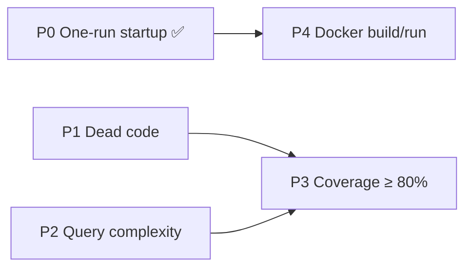

# Global improvements — dead code, complexity, coverage, Docker startup

Baseline measured 2026-09-28 on `dev` (`4cea66a`). P0 (one-run startup) ships with this
page; P1–P4 are the plan, each an independent PR, ordered by payoff per line changed.

| Metric | Today (`dev`) | Target |
| --- | --- | --- |
| Go coverage, as CI measures it (`-coverpkg=./...`) | **35.2 %** (3 089 / 8 766) | ≥ 80 %, gated in CI |
| Shell (`apps/shell`) coverage, lines | **66.1 %** (908 / 1 374) | ≥ 80 % (+192 lines) |
| Engine (`packages/core-front`) coverage | 90.0 % stmts, 79.9 % branches | keep ≥ 80 %, gated |
| Unreachable Go functions (`deadcode`) | 35 | only deliberate public API |
| Backend image | 1.39 GB | ~250 MB |

## P0 — One-run startup (done)

**Root causes on `dev`:**
- `db`'s healthcheck (`pg_isready -U postgres`) used the unix socket, which answers during
  initdb's *temporary* server — `core-back` raced the real server and failed its first ping
  (`restart: always` now retries it, but only after a crash).
- A missing `eerp-config.docker.json` makes Docker create a **directory** at the bind-mount
  source, and the backend can never start until someone notices.
- Garage stayed unprovisioned until `make garage-init`, and `init.sh` imported a hardcoded key
  no config template uses, so S3 never worked out of the box. `garage.toml` still committed an
  `rpc_secret` — the same class of leak `docs/security/pentest-2026-09-24.md` scrubbed elsewhere.

**Fix:** `make bootstrap` (`infra/bootstrap.sh`) — generates any missing secret into the
gitignored `.env` (`POSTGRES_PASSWORD`, `EERP_MASTER_KEY`, the S3 pair, `GARAGE_RPC_SECRET`),
creates `eerp-config.json` / `eerp-config.docker.json` from their templates and fills
`master_key` / `db_password` / `s3_*`, starts infra with `--wait`, re-applies the DB password
over the local socket (rotation keeps data), provisions Garage, then starts the app with
`--wait`. `db` is checked over TCP, `core-back` gets a healthcheck (bash `/dev/tcp` — the image
has no curl) and `core-front` waits for it. `eerp-config.prod.json` is never touched.

Pitfalls: `docker compose up --wait` fails when a one-shot container (`gateway-certs`) exits,
so the script waits on named long-running services; and compose does **not** recreate a
container when only a bind-mounted file's *content* changes (e.g. `nginx.conf` after a branch
switch) — restart it (`docker compose restart api-gateway`).

## P1 — Dead code

`go run golang.org/x/tools/cmd/deadcode ./...` (35 hits) and `knip` (frontend):

| Bucket | Symbols | Action |
| --- | --- | --- |
| Test seams in production files | `newHandlerWith` ×10 (attachments, auth ×2, chatter, cron, module, notebook, pictures, savedfilter, settings), `cron.clearForTest` | Fold into `NewHandler` taking the interfaces (the concrete repos satisfy them); move `clearForTest` to a `_test.go` |
| Truly dead | `orm.AutoScan` (documented no-op), `cache.ReflectTypeOf`, `scan.Row`, `server.NewEcho`/`MountHandler` (tests can use `server.New(...).RegisterRoutes`), `dbmanage.Provisioner.Provision` (check first — new in `dev`) | Delete |
| Public ORM API (framework surface) | `orm.Repo`, `Select`, `In`, `NewNoopLogger`, `ExposedTableNames`, `ExtendSchema`, `WithReadOnlyFields`, `WithFieldGroups`, builders' `Returning`/`OnConflict*`/`Exec`/`All` | **Keep**; cover with tests |
| Frontend | unused `react-resizable` engine dependency; needless exports `decodeAccessClaims`, `FORCE_PASSWORD_CHANGE_PATH`, 5 graph widget bodies, `PHONE_COUNTRIES`; 7 identical copies of `errorResponse` across `app/api/**/route.ts` | Drop / unexport; one shared `src/lib/route-errors.ts` |

Gate: a CI step diffing `deadcode` output against a committed allowlist of the public API, so
the list only shrinks.

## P2 — Time complexity (DB round trips)

| Hot path | Today | Target |
| --- | --- | --- |
| `cron.SweepHistory` — runs **every minute** | loads every cron and every `cron_history` row into memory to find the few expired ones | evaluate the cutoff in SQL (`created_at <= $now - make_interval(years => …)`); read only expired rows |
| `sale.linkedTaxes`, `propertymanagement.linkedBillingLineTaxes` | 1 query + one `FindByID` per linked tax, on every line write | one `id = ANY($1)` query (shared helper), keeping link order/duplicates |
| `sale.ExpireOverdueQuotes` — hourly | loads every quote of every tenant, updates overdue ones one by one | one `UPDATE … WHERE status IN (…) AND due_date < now()` |
| `company.BackfillCompanyID` — boot | 2 statements per tenant | 2 statements total (`INSERT … SELECT DISTINCT`, `UPDATE … FROM`) |

Replace each pure-function unit test (`quoteOverdue`, `historyExpired`) with a DB test of the
same cases. Review rule — candidates:
`rg -U 'for .*range.*\{\n(.*\n){0,6}.*\.(FindByID|Find|Query|Exec|Update)\(ctx'`.

## P3 — Test coverage ≥ 80 %

**Why CI measures 35 %:** DB tests never run there. They are split between `CONFIG` and
`TEST_DSN` (+ an `integration` build tag), CI sets neither, and `db` isn't even published to
the runner (`expose` only). Several tagged tests have rotted (`registry.Reset` no longer
exists; hand-written schemas lag the real ones).

1. **One DB-test path:** `core/internal/testdb` — `Open(t)` from `TEST_DSN`, else `CONFIG`, else
   skip; `MigrateModules(t, app, "auth", …)` building a module's *real* schema on a fresh DB.
   Drop the build tag. In CI, publish `db` on the runner (a CI-only compose override or a
   `services: postgres` block) and set `TEST_DSN`.
2. **Tests share the dev DB — make them safe first.** `internal/auth/integration_test.go`
   cleans up with `DELETE FROM users` / `roles` / `permissions` — run against a dev DB it wipes
   every account. Seed under a fresh `uuid.New()` tenant and delete only those rows.
3. **`main.go` → `internal/app`** — the wiring is `cmd/app`'s 2 034 statements at 0 %, the
   single biggest lever. `app.Build(ctx, cfg)` returning errors instead of `Fatal`, `Run(ctx)`
   for jobs + server; one test boots it against the test DB and drives every route group plus
   create/update/delete flows through each module override as the seeded dev admin.
4. Then the remaining gaps: `internal/module` (471 uncovered), `internal/dbmanage` (452),
   `internal/auth` (394), `modules/sale` (311), `modules/propertymanagement` (286),
   `modules/auth` (252), `internal/presence` (173), `internal/cron` (120).
5. **Frontend shell (+192 lines):** `app/database/management/page.tsx` (67), the BFF routes
   (`api/attachments`, `api/auth/refresh`, `api/cron-history`) and server actions
   (`saved-filter-actions`, `chatter-visibility`, `graph-actions`, …) and
   `PasswordChangeForm`. Pitfall: `beforeEach(() => mock.mockReset())` *returns* the mock,
   which vitest then runs as a teardown — use a block body.
6. **Gates:** `.github/.testcoverage.yml` `threshold.total: 80`; vitest `coverage.thresholds`.

**Flaky test to fix on the way:** `internal/reports/nats_renderer_test.go` subscribes (l.38)
then requests (l.58) without `Flush()` on the subscriber's connection — under parallel test
binaries the request can beat the subscription ("no responders available").

**Known bugs these tests will surface** (all confirmed present on `dev`, all found by the same
tests on a `main`-based run):

| Bug | Impact |
| --- | --- |
| `cron.Cron` has no JSON tags | `POST/PUT /api/v1/cron` silently drops `action_id`, `execution_date`, `run_as_user_id`, `history_retention_years` — a cron created from the form never gets its action |
| `crm.CRM.Contacts` has no JSON tag | `POST /api/v1/crm` drops `contact_id` |
| `orm.WithTableName` doesn't set `StructMeta.Table` | generic CRUD on an overridden name queries the derived table |
| `orm.New(cfg, nil)` | nil logger panics on the first logged query error |
| Concurrent `CREATE TABLE IF NOT EXISTS` | two processes migrating one DB (replicas, parallel tests) collide on `pg_type` — serialize schema DDL with a Postgres advisory lock |

## P4 — Docker build and run

| Item | Why |
| --- | --- |
| BuildKit cache mounts (Go module + build cache, pnpm store, `.next/cache`) — none today | Incremental rebuilds in seconds instead of recompiling everything |
| Backend runtime on `debian:trixie-slim` + `ca-certificates` + PGDG `postgresql-client-18` instead of the full `golang` image | 1.39 GB → ~250 MB; same Debian release as the builder (cgo/glibc) |
| `GET /health` on `core/orm/server` (DB ping) | nginx already proxies `/health` to a route Go doesn't have; the compose healthcheck could then check readiness, not just a listening port |
| Named `pgdata` volume for `db` | the image's anonymous volume is orphaned by every `docker compose down` + `up` |
| Host-native `make run-back-tests` / `go run` can't reach `db` or `garage` (ports are `expose`-only since the hardening) | publish them on `127.0.0.1` only in a dev override, or run the tests in a container on the compose network |
| `deploy.yml` needs `GARAGE_RPC_SECRET` in the server's `.env` from P0 on | one line next to `POSTGRES_PASSWORD` |

## Related

- [ADR-008 module lifecycle via API](../adr/ADR-008-module-lifecycle-via-api.md)
- `docs/security/pentest-2026-09-24.md` — why configs and secrets are gitignored
- `infra/garage/README.md` — S3 bootstrap and reset
