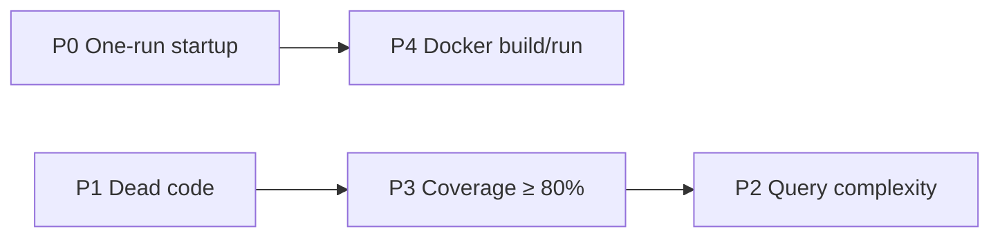

# Global improvements — dead code, complexity, coverage, Docker startup

Baseline measured 2026-09-28 on `dev` (`4cea66a`); all phases landed the same day. This
page records what changed, why, and the gates that keep it from regressing.

P2 landed after P3: its DB tests use P3's `core/internal/testdb`.

| | Before (`dev`) | After | Gate |
| --- | --- | --- | --- |
| Go coverage, as CI measures it (`-coverpkg=./...`, fresh DB) | 35.2 % | **81.3 %** | `.github/.testcoverage.yml` `total: 80` |
| Shell (`apps/shell`) coverage, lines | 66.1 % | **85.0 %** | vitest thresholds 80 (branches 70) |
| Engine (`packages/core-front`) coverage, lines | 92.3 % | 92.3 % | vitest thresholds 80 (branches 75 — baseline 79.9) |
| Unreachable Go functions (`deadcode`) | 35 | public ORM API + test support only | CI diff vs `.github/deadcode-allowlist.txt` |
| Backend image | 1.39 GB | **289 MB** | — |
| Incremental backend image rebuild | full recompile | **~7 s** | — |
| Fresh `docker compose up` | several runs + manual Garage init | **`make bootstrap`, one run** | real healthchecks |

## P0 — One-run startup

Root causes: `db`'s socket `pg_isready` passed during initdb's temporary server; a missing
`eerp-config.docker.json` made Docker create a **directory** at the bind-mount source; Garage
stayed unprovisioned and `init.sh` imported a hardcoded key no template uses; `garage.toml`
committed an `rpc_secret`. `make bootstrap` (`infra/bootstrap.sh`) generates missing secrets
into `.env`, creates and fills the gitignored configs from their templates, re-applies the DB
password, provisions Garage and starts everything with `--wait`. `eerp-config.prod.json` is
never touched.

Pitfalls: `--wait` fails when a one-shot container (`gateway-certs`) exits, so the script waits
on named long-running services; compose never recreates a container when a bind-mounted file's
*content* changes, and on Docker Desktop the old container even keeps the file it was created
with ("no such file" after a branch switch) — the script recreates the stateless gateway.

## P1 — Dead code

- Each package's test-only `newHandlerWith` folded into `NewHandler`, which takes interfaces.
- Deleted `orm.AutoScan` (no-op), `cache.ReflectTypeOf`, `scan.Row`, `server.NewEcho`/
  `MountHandler`; `dbmanage.Provisioner` has one `Provision(ctx, db, onProgress)`.
- Frontend: 7 identical BFF `errorResponse` copies → `src/lib/route-errors.ts`; unused
  `react-resizable` dependency and needless exports removed.
- Kept on purpose (allowlisted): the public ORM API modules build on, and test support.

## P2 — Time complexity

| Hot path | Before | After |
| --- | --- | --- |
| `cron.SweepHistory` (every minute) | loaded every cron and every history row | cutoff evaluated in SQL; only expired rows read |
| `sale.linkedTaxes`, `propertymanagement.linkedBillingLineTaxes` | one `FindByID` per linked tax | `sale.ResolveTaxes`: one `id = ANY($1)` query |
| `sale.ExpireOverdueQuotes` (hourly) | loaded every quote of every tenant | one `UPDATE` |
| `company.BackfillCompanyID` (boot) | 2 statements per tenant | 2 statements total |

Review rule — candidates: `rg -U 'for .*range.*\{\n(.*\n){0,6}.*\.(FindByID|Find|Query|Exec|Update)\(ctx'`.

## P3 — Test coverage

- **`main.go` → `internal/app`**: `Build` returns errors instead of `Fatal` (keeping `dev`'s
  leaked-literal, key-length and `environment` rules), `Run` starts the jobs. The app tests
  boot it against the test DB and drive every route group, each module override, the database
  manager (a real scratch database created and deleted), graph fields, role rights and the
  live presence WebSocket.
- **DB tests actually run**: `core/internal/testdb` is the one path (`TEST_DSN`, else
  `CONFIG`, else skip) with `MigrateModules` for a module's real schema. CI uses a
  `services: postgres` container (compose's `db` isn't reachable from the runner); dev
  publishes `db`/`garage` on `127.0.0.1` only for host-native tests.
- **Pitfall — tests may share the dev DB**: seed under a fresh `uuid.New()` tenant and delete
  only those rows (the auth suite used to `DELETE FROM users`). `dev`'s generic CRUD refuses
  requests without a tenant in context — tests must set one (`access.WithTenant`).
- **Pitfall — vitest**: `beforeEach(() => mock.mockReset())` *returns* the mock, which vitest
  runs as a teardown; heavy MUI renders need a longer `testTimeout` under coverage.

### Bugs and flakes fixed on the way

| Issue | Impact |
| --- | --- |
| `cron.Cron`, `crm.CRM.Contacts` lacked JSON tags | cron create/update dropped `action_id`, `execution_date`, `run_as_user_id`, `history_retention_years`; crm create dropped `contact_id` — `internal/app/bind_test.go` guards it |
| `orm.WithTableName` didn't set `StructMeta.Table` | generic CRUD on an overridden name queried the derived table |
| `orm.New(cfg, nil)` | nil logger panicked on the first logged query error |
| Concurrent `CREATE TABLE IF NOT EXISTS` | parallel boots could fail; schema DDL now under a Postgres advisory lock |
| NATS renderer test | raced its own subscription — now flushes it |
| ORM pool tests | used `TEMP` tables across pooled connections |
| propertymanagement view tests | asserted a layout `dev` had deliberately changed (`generated_at`, equal floor/UOM columns) |

## P4 — Docker build and run

- BuildKit cache mounts: Go modules + build cache (backend, pdf-service), pnpm store, `.next/cache`.
- Backend runtime on `debian:trixie-slim` + PGDG `postgresql-client-18` (dbmanage) + `curl`.
- `GET /health` on `core/orm/server` (DB ping) — compose healthcheck and the gateway use it.
- Named `pgdata` volume in dev. **Production keeps the anonymous volume** until migrated once
  by hand (`compose.prod.yml`'s `db` comment): switching the mount in place would boot on an
  empty database.

## Related

- [ADR-008 module lifecycle via API](../adr/ADR-008-module-lifecycle-via-api.md)
- `docs/security/pentest-2026-09-24.md` — why configs and secrets are gitignored
- `infra/garage/README.md` — S3 bootstrap and reset
