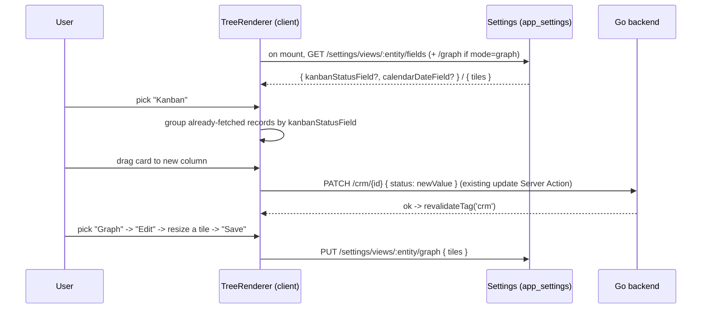
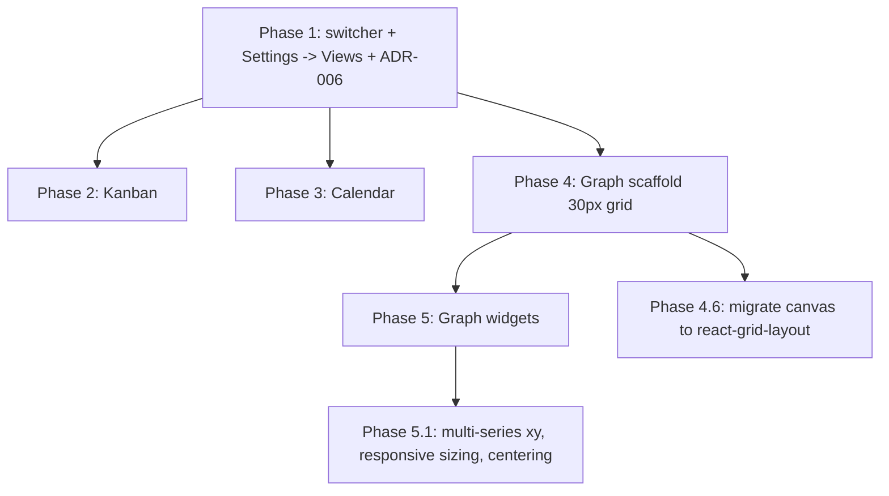

# List view display modes — Kanban, Calendar, Graph board — build roadmap

> **Goal:** give any `tree` (list) view a **display-mode switcher**, top-right of the page —
> `List | Kanban | Calendar | Graph` — that re-renders the SAME fetched records through a
> different lens, no new route, no descriptor change. Kanban groups by a status field, Calendar
> positions by a date field, both picked per-entity by an admin from a new Settings page. Graph
> is a 30px-grid canvas of resizable/movable widget tiles (XY plot, pie, mean/median stat,
> filtered list) editable from an "Edit" toggle. The reference model is Odoo's `<kanban>`/
> `<calendar date_start="...">` view types plus its Spreadsheet dashboard tiles — cited only as
> examples, not copied wholesale.

## Why it exists / what problem it solves

Today a `tree` descriptor renders exactly one way: `TreeRenderer`'s DataGrid or, for parented
data, a `RichTreeView` (`core-front/packages/core-front/src/views/renderers.tsx`). That is the
only lens on any entity's list — there is no kanban, no calendar, no chart. `viewType:
'dashboard'` already exists, but it means something else entirely: a landing-page roll-up of
KPI count tiles across a module's own list views (`DashboardRenderer`), not a per-entity
analytics canvas. Nothing in this roadmap touches that.

The three requested modes share a shape: they are **presentations**, not new data. A kanban
column is just the list grouped by one field; a calendar cell is the list positioned by one
date field; a graph tile is an aggregate over the list. None of it needs a new backend route
beyond what field-widgets already shipped (`filter[col]`/`search[col]` on the generic list
endpoint) — except knowing *which field* is the status/date field per entity, which is genuinely
new: nothing today lets an admin say "on `crm`, `status` is the kanban field." That is this
roadmap's one real gap to close, plus the graph canvas itself (entirely new: no kanban,
calendar, chart, or drag-resize-grid code exists anywhere in the repo today).

## Architecture decisions (read first)

1. **Modes are a client-side switch inside `TreeRenderer`, not a new `ViewType`.** `list` stays
   the default and is pixel-equivalent to today. Kanban/Calendar/Graph render the identical
   `initialData` the tree already fetched — no new server loader, no new route. This keeps the
   "one server fetch, several client lenses" story cheap and reversible: deleting the switcher
   leaves the current behavior completely intact.
2. **Field selection is admin-configured runtime state, not developer-declared descriptor
   data — a deliberate departure, and it needs an ADR.** Every other per-field concern in this
   codebase (`widget`, `states`, `compute`) is something the *module author* commits in a
   `FrontModule`. Kanban's status field and Calendar's date field are different in kind: they're
   a workspace admin's choice, made after the module ships, changeable without a rebuild — the
   same posture as `i18n.default_locale` or `format.number` in `app_settings`, not a
   `ViewDescriptor` property. Phase 1 documents why in a new ADR (see Phase 1's DoD).
3. **Graph tile layout is likewise workspace-owned data, stored the same way.** A tile array is
   just another `app_settings` JSON blob (`views.<entity>.graph`), not a new dedicated table —
   consistent with the existing `format.number` precedent and cheap to add: no migration, no new
   repository, just another settings key + handler pair.
4. **Kanban/Calendar mutate through the SAME write path a form uses.** Dragging a card to a new
   column is `PATCH { [statusField]: newValue }` via the entity's existing update Server Action
   — Go re-authorizes with the entity's own `<entity>:write` permission, same as any edit. There
   is no bespoke "kanban write" endpoint.
5. **Tiles stay pure JSON — no functions, ever.** Same RSC-boundary rule that has held since
   `compute`/`on_change`/`states`: a tile's `config` is a closed set of field names + enum
   strings (`aggregate: 'mean'|'median'|...`), never a callback. A client-side widget registry
   (mirroring the `FIELD_WIDGETS` matrix) maps `tile.type` → rendering component; modules never
   register their own tile types in v1.
6. **The grid unit is one named constant, everywhere.** `GRID_UNIT = 30` (px) is imported by the
   drag/resize math, the CSS, and nowhere else hardcodes `30` — see Pitfalls.
7. **Move/resize math is hand-rolled, not a grid-dashboard library — a reversal of this
   decision's original draft, made once Phase 2/3 proved why.** Kanban and Calendar deliberately
   chose plain HTML5 DnD over any drag library specifically because it's testable in jsdom
   (`clientX`/`clientY` deltas on synthetic events, no real layout measurement needed) with zero
   new dependencies. The Graph canvas applies the same lesson one level further: `mousedown` on a
   tile header/resize handle, `mousemove`/`mouseup` on `window`, converting **pixel deltas**
   (never `getBoundingClientRect`) to grid-unit deltas via `Math.round(delta / GRID_UNIT)`. A
   library like `react-grid-layout` would add real value later (collision avoidance, smoother
   drag visuals) but was reevaluated against: React 19 peer-dependency risk, CSS it requires
   importing, and — the deciding factor — that its drag interactions are notoriously hard to
   drive reliably from jsdom-based tests, the opposite of every other list-view-modes decision
   made so far. Revisit if/when Graph needs collision-aware auto-layout a coordinate-only model
   can't express.

   **Reversed again (Phase 4.6): Graph now needs exactly that** — collision-aware
   auto-compaction plus a non-destructive hide/restore flow, which the hand-rolled
   coordinate model genuinely can't express without reimplementing a bin-packer. `react-grid-layout`
   v2.2.3 resolves both originally-cited blockers: React 19 is a satisfied peer
   (`>=16.3.0`), and the jsdom-testability problem is solved not by avoiding the
   library but by testing at the component boundary — mocking `react-grid-layout`'s
   default export and `useContainerWidth` in `graph-renderer.test.tsx`, asserting the
   props handed to it (`layout`, `gridConfig`, `dragConfig`, `resizeConfig`) and driving
   `onLayoutChange` directly instead of simulating a real mouse drag through the
   library's `react-draggable`/`getBoundingClientRect` internals, which jsdom cannot
   compute. See Phase 4.6 below.

## Contracts

| Concern | Contract |
| --- | --- |
| Display-mode switcher | `TreeRenderer` renders a segmented control (`ToggleButtonGroup`) top-right of its own content area, above the DataGrid/tree — a self-contained addition (see Phase 1's implementation notes for why it isn't lifted to the host `page.tsx` title row the way `CreateBar` is). Modes: `list` (default, unchanged DataGrid/RichTreeView) · `kanban` · `calendar` · `graph`. Selection is client-only state, persisted per entity in `useUiStore` (`viewMode.<entity>`). No route change, no descriptor change. |
| Mode availability | `list` and `graph` are always enabled (graph needs no field configured — an empty canvas is valid). `kanban`/`calendar` are disabled with a tooltip ("Configure in Settings → Views") until an admin sets the relevant field. |
| View field config | New `app_settings` key `views.<entity>.fields` = `{ kanbanStatusField?: string; calendarDateField?: string }`. `GET/PUT /api/v1/settings/views/:entity/fields`, permission `settings:views:write` (same DSL area as `settings:i18n:write`/`settings:format:write`). |
| Settings → Views page | New hand-built page (`apps/shell/app/settings/views/`), added to `SETTINGS_SECTIONS`: one row per entity that has a registered tree view, two selects — status field (filtered to the entity's `type: 'selection'` fields) and date field (filtered to `type: 'date'`) — sourced from the already-registered `ViewDescriptor.fields` in the module registry. No new backend introspection route needed. |
| Kanban render | Columns = the status field's `selection.options`, in declared order, plus a trailing "No status" column for null/unset. Card body: the entity's relation `labelField` if declared, else its first `text` field, plus up to 3 more fields read off the descriptor's normalized layout (fixed v1 heuristic — see Pitfalls). |
| Kanban drag | Dropping a card on another column issues `PATCH { [kanbanStatusField]: newValue }` through the entity's existing update Server Action (the same one `FormRenderer`'s Save calls) — full permission/validation re-check by Go, no bypass. |
| Calendar render | Month grid (v1 scope; week/day views are a later increment). Each record renders on the day read from `calendarDateField`. Records with no value in that field list in an "Unscheduled" side panel — never silently dropped. |
| Calendar drag | Dropping a record on another day issues `PATCH { [calendarDateField]: newDate }`, same mutation path as Kanban. |
| Graph layout | `app_settings` key `views.<entity>.graph` = `{ tiles: Tile[] }`. `GET/PUT /api/v1/settings/views/:entity/graph`, permissions `settings:views:read`/`settings:views:write` (same read/write split as the fields endpoint, both derived automatically from the route). `Tile = { id, x, y, w, h, type: 'xy'\|'pie'\|'stat'\|'list', title?, config: JsonValue, hidden?: boolean }` — `x/y/w/h` are integer grid units; `GRID_UNIT = 30` (px), the one place that number is a literal (now `gridConfig.rowHeight`, exact; column WIDTH is only approximately `GRID_UNIT`, derived from the measured container). Pure data, no functions; the Go handler validates every tile's shape (id, non-negative/non-zero geometry, closed type set, no duplicate ids) but never its opaque `config`, and round-trips `hidden` with no validation beyond its bool type (Phase 4.6). |
| Graph canvas (Phase 4.6) | `react-grid-layout` (RGL) v2 drives the canvas: `gridConfig.cols = Math.max(4, Math.round(containerWidth / GRID_UNIT))`, measured via RGL's own `useContainerWidth()` — the canvas is now a **responsive column grid sized to its container** (which is itself already bounded by RootLayout's page inset — see `core-front/CLAUDE.md`), not a free-form surface sized to the tiles' bounding box. `compactor={verticalCompactor}` runs unconditionally (view and edit mode alike): tiles auto-stack with no gaps/overlaps, resolving on every render, not just after a drag. |
| Graph edit mode | An "Edit" toggle top-right of the graph toolbar (one level below the mode switcher), visible only to a session holding `settings:views:write` (client-side display gating, like `CreateBar` — Go re-authorizes the PUT regardless). View mode: tiles render read-only via RGL with `dragConfig.enabled`/`resizeConfig.enabled` both `false`. Edit mode: every tile is draggable (`dragConfig.handle`, a header) and resizable (`resizeConfig.handles: ['se']`, RGL's own bottom-right handle), floored per-`type` at `TILE_MIN_SIZE[type]` (not a uniform floor), plus a "Hide" (×) button and a "+ Add widget" button below the canvas that opens a type + title dialog. Hiding a tile is **non-destructive**: it sets `Tile.hidden = true` (excluded from the rendered/RGL-managed grid and from collision/compaction) and appears as a restorable chip in a "Hidden widgets" row below the canvas — clicking a chip sets `hidden = false`, restoring the tile at its last-known geometry. Changes stay in a local draft (mirrors the form store's `dirty`/`commit` shape) until **Save** (`PUT .../graph`, reverting to view mode on success, keeping the draft and surfacing the error on rejection) or **Cancel** (discards the draft, reverts to the last saved layout, including any hide/restore/move/resize made since). |
| Widget: xy | `config: { xField, yField, seriesField?, aggregate?: 'sum'\|'avg'\|'count', bucket?: 'day'\|'week'\|'month' }`. A smoothed line of `yField`, bucketed by `xField` (a date field), with Y-axis gridlines/numeric ticks and localized X-axis bucket labels. `seriesField` (optional, a selection/text/boolean field) splits the chart into one colored line per distinct value (e.g. a status column) instead of a single implicit series — a legend renders only when there's more than one series. The chart is sized 1:1 to its OWN measured tile pixels (`useElementSize`/`ResizeObserver`), never a fixed literal, so resizing a tile visibly resizes its chart. |
| Widget: pie | `config: { groupByField, valueField?, aggregate?: 'sum'\|'count' }` (default `count`). One slice per distinct value of `groupByField`. |
| Widget: stat | `config: { field, aggregate: 'mean'\|'median'\|'sum'\|'count' }` — a single big-number tile. Mean and median are the SAME widget type with a different `aggregate`, not two widget kinds (mirrors the widget/type split in `docs/roadmaps/field-widgets.md`). |
| Widget: list | `config: { filterField, filterValue, displayFields: string[] }`. Reuses the existing `filter[col]=value` list-endpoint contract (field-widgets Phase 4) — no new backend surface. |
| Aggregation, v1 | Computed **client-side** over the entity's already-fetched page (capped `page_size`, same records the list/kanban/calendar modes use). Documented v1 limitation, same posture as field-widgets' "server-side recompute out of scope for v1": a future `GET /api/v1/{entity}/aggregate` endpoint is the v2 fix for large tables — flagged in the UI (a "partial data" badge), not silently wrong. |
| Chart styling | Widget rendering follows the repo's `dataviz` design conventions (categorical/sequential palette, accessible contrast, consistent light/dark) — no ad hoc per-tile colors. |

**Example — a graph layout after an admin adds two tiles (the shape persisted at `views.crm.graph`):**

```json
{
  "tiles": [
    { "id": "t1", "x": 0, "y": 0, "w": 8, "h": 6, "type": "xy",
      "title": "Deals closed over time",
      "config": { "xField": "closed_at", "yField": "amount", "aggregate": "sum", "bucket": "month" } },
    { "id": "t2", "x": 8, "y": 0, "w": 4, "h": 6, "type": "stat",
      "title": "Median deal size",
      "config": { "field": "amount", "aggregate": "median" } }
  ]
}
```

## Data flow



---

## Phase 1 — Display-mode switcher + Settings → Views (field config) + ADR ✅ (implemented)

The prerequisite: nothing renders as Kanban/Calendar until an entity's fields are configurable
and readable.

> Implementation notes: the switcher renders **inside `TreeRenderer`'s own
> content area** (a `DisplayModeSwitcher` above the DataGrid/tree, from
> `renderers.tsx`), not lifted into the host `page.tsx`'s title row the way
> `CreateBar` is. `CreateBar` needs the host to place it because only the host
> knows `formPath`/`createPermission` gating; the mode switcher needs nothing
> page-specific (just the descriptor + the fetched field config already
> passed to `TreeRenderer`), and lifting it would have meant fetching
> `views.<entity>.fields` twice (once for the title row, once inside
> `EntityViewServer`) or reworking `EntityViewServer`'s prop contract for no
> real benefit. Net effect is the same ask — a switcher at the top of the
> list, right-aligned — one contained code path instead of two. `loadView`'s
> corresponding docstring/contract in `core-front/CLAUDE.md` reflects this.
>
> `GET /settings/views/:entity/fields` derives `settings:views:read` and `PUT`
> derives `settings:views:write` automatically from `derivePermissionFromRoute`
> (`core/internal/middleware/permission.go`) — unlike `i18n`/`format`, which are
> PUT-only, this endpoint needed a GET too (the switcher and Settings → Views
> both read it), so both actions exist from day one, not just the write side
> the contracts table's precedents used.
>
> Kanban/Calendar/Graph render a shared `DisplayModeComingSoon` placeholder for
> now — real content lands in Phases 2–4. This keeps the switcher fully
> functional and tested (mode persists per entity via `useUiStore.viewMode`,
> Kanban/Calendar correctly enable once configured) without a mode ever
> rendering broken or blank.
>
> `entity`/field-name path and body values are validated server-side against a
> shared `^[a-z][a-z0-9_]*$` pattern (`entitySlugPattern`/`fieldNamePattern` in
> `core/internal/settings/handler.go`) — the backend doesn't know an entity's
> real field names (that check happens client-side, Settings → Views only ever
> offers real `type: 'selection'`/`type: 'date'` fields sourced from the
> registered descriptor), so this is a junk floor, not semantic validation.

**Claude Code prompt:**
```
In @eerp/core-front and apps/shell:
1. core/internal/settings/: add GET/PUT /api/v1/settings/views/:entity/fields, key
   views.<entity>.fields = { kanbanStatusField?: string; calendarDateField?: string },
   permission settings:views:write (mirror the existing i18n/format settings handlers exactly —
   same tenant-scoped app_settings repository, same error/permission shape).
2. In @eerp/core-front, TreeRenderer: add a ToggleButtonGroup ('list'|'kanban'|'calendar'|
   'graph') on the title row next to CreateBar. Selection persists per entity in useUiStore
   (viewMode.<entity>). 'list' renders exactly what TreeRenderer renders today (no regression).
   'kanban'/'calendar' render disabled with a tooltip until views.<entity>.fields has the
   relevant field set; 'graph' is always enabled. Fetch views.<entity>.fields once per entity
   view (server-side, alongside the existing list fetch) and pass it down.
3. apps/shell/app/settings/views/: a new page listing every entity with a registered tree view
   (read off the module registry), two selects per row (status: entity's selection-typed
   fields; date: entity's date-typed fields) wired to the new settings routes. Add to
   SETTINGS_SECTIONS.
4. docs/adr/ADR-006-runtime-configurable-view-fields.md: why kanban/calendar field choice is
   admin-configured app_settings state, not FrontModule descriptor data (contrast with
   ADR-005's registration-time descriptor resolution) — same rigor and section shape as
   ADR-005. Update core-front/CLAUDE.md's Conventions table with the new switcher/settings rows.
Tests: settings routes round-trip + permission-gated; switcher disables/enables per fetched
config; Settings → Views page writes and the switcher reflects it without a rebuild.
```
**DoD:** every existing tree view still renders pixel-equivalent in `list` mode by default; an
admin can set a status/date field per entity from Settings → Views with no code change; the
switcher enables/disables live off that config; ADR-006 merged.

## Phase 2 — Kanban renderer + drag-to-update ✅ (implemented)

> Implementation notes: `KanbanRenderer` lives in its own file
> (`src/views/kanban-renderer.tsx`), imported by `TreeRenderer` — not inlined
> in `renderers.tsx` — following the same "helper renderer file, not in the
> public barrel" precedent `layout-renderer.tsx` already set. `ErrorAlert` had
> to move out of `renderers.tsx` into a new `error-alert.tsx` first, so
> `kanban-renderer.tsx` could reuse it without a circular import back into
> `renderers.tsx`; `FormRenderer`'s error surface is unchanged, just
> re-imported.
>
> The card's "label field" heuristic is simpler than the contracts table's
> literal wording ("the entity's relation `labelField` if declared, else its
> first text field"): a relation's `labelField` is declared on *other*
> entities' descriptors that point AT this one, not on this entity's own
> descriptor, so reading it from inside `KanbanRenderer` would need a new
> cross-descriptor lookup with no existing precedent or use elsewhere. Instead
> the card reuses the SAME heuristic `HierarchyTree` already uses for a tree
> node's own label — first field in `layoutFieldOrder(normalizeLayout(...))`
> — which in practice is normally the same "name-like" field a relation would
> have pointed `labelField` at anyway. `kanbanCardFields()` filters the status
> field itself out (redundant with the column) and keeps up to 4 fields total
> (the label + up to 3 more), per the contract.
>
> Drag-and-drop uses the plain HTML5 DnD API (`draggable`, `onDragStart`/
> `onDragOver`/`onDrop`) — no new dependency for Kanban. The dragged record's
> id lives in local component state (`draggingId`), never read off
> `event.dataTransfer` — simpler, and testable in jsdom, which doesn't fully
> implement `DataTransfer`. This is a real gap, not a stylistic choice: native
> HTML5 DnD has no keyboard path, so a keyboard-only user cannot move a card
> between columns in v1 — flagged in Pitfalls below, the same "v1, improved
> later" posture the relation wizard's search dialog already documented.
>
> A move rejected by Go (permission, a `states.required` block, ...) reverts
> the optimistic column change and surfaces the error through the SAME
> `ErrorAlert` component `FormRenderer`'s Save failure uses — one error
> surface, not two.

**Claude Code prompt:**
```
In @eerp/core-front, add KanbanRenderer<T> (src/views/kanban-renderer.tsx), used by TreeRenderer
when viewMode === 'kanban':
- Columns from the configured kanbanStatusField's selection.options (declared order) + a
  trailing "No status" column for null/unset values, computed over the ALREADY-FETCHED records
  (no new fetch).
- Card body: relation labelField if the entity declares one (used as a relation target
  elsewhere), else the first 'text' field; plus up to 3 more fields off the normalized layout.
- Drag a card to another column: PATCH { [kanbanStatusField]: newValue } via the SAME update
  Server Action FormRenderer's Save uses. Optimistic move, reconciled on revalidate; a rejected
  write (permission/validation) snaps the card back with the ApiError surfaced inline.
Tests: column grouping incl. the null column; card field heuristic; drag issues the right PATCH;
a 403/422 response reverts the optimistic move.
```
**DoD:** an entity with a configured status field renders as draggable kanban columns; a drag
persists through the real update path and reverts cleanly on a rejected write.

## Phase 3 — Calendar renderer + drag-to-update ✅ (implemented)

> Implementation notes: the drag/PATCH/revert mechanics were extracted out of
> `KanbanRenderer` into a shared hook, `useOptimisticFieldMove` (`src/views/
> use-optimistic-field-move.ts`), rather than Calendar re-implementing the
> same optimistic-move-then-revert logic — the literal reading of "same
> mutation path and optimistic/revert behavior as Kanban's drag — reuse that
> logic, don't duplicate." `KanbanRenderer` was refactored onto the same hook
> in the same change (behavior-preserving — its existing Phase 2 tests passed
> unchanged). The card-field heuristic was similarly factored out into
> `orderedFields()` (`src/views/layout-fields.ts`), shared by both renderers
> (Kanban: label + up to 3 more; Calendar: label only, since day cells are
> compact).
>
> Calendar month-grid math is deliberately **v1-minimal**: a 7-column CSS grid
> showing only the current month's own days (1..N, with leading blank cells
> for weekday alignment) — no adjacent-month "ghost days" filling out a full
> 6-row rectangle the way most calendar UIs do. A record dated outside the
> visible month simply doesn't render anywhere until you navigate to its
> month; it is never in the Unscheduled panel (that panel is strictly for
> records with NO date value) and never silently dropped from the underlying
> record set — only from the current grid's visible cells. All grid math
> (`daysInMonth`/`firstWeekday`/`isoDate`) uses the numeric `Date(year, month,
> day)` constructor, never `new Date('YYYY-MM-DD')` — the latter parses as UTC
> midnight and can land on the wrong local calendar day, a classic date-math
> bug this roadmap deliberately avoids by construction, not by testing around
> it.
>
> Dropping a record into the **Unscheduled** panel PATCHes its date field to
> `null` (the same "clear the value" semantics Kanban's "No status" column
> already established) — Unscheduled is a real drop target, not just a
> passive list.

**Claude Code prompt:**
```
In @eerp/core-front, add CalendarRenderer<T> (src/views/calendar-renderer.tsx), used by
TreeRenderer when viewMode === 'calendar':
- Month grid (v1 scope only — no week/day view). Records position on the day read from the
  configured calendarDateField, over the already-fetched records.
- Records with no value in that field render in an "Unscheduled" side panel (visible, not
  dropped).
- Drag a record onto another day: PATCH { [calendarDateField]: newDate }, same mutation path
  and optimistic/revert behavior as Kanban's drag (Phase 2) — reuse that logic, don't duplicate.
Tests: month grid positioning incl. unscheduled records; drag issues the right PATCH; month
navigation (prev/next) doesn't refetch (still the same page's records).
```
**DoD:** an entity with a configured date field renders a month calendar; dragging a record to a
new day persists through the real update path.

## Phase 4 — Graph mode scaffold: 30px grid canvas + tile CRUD + edit mode ✅ (implemented)

The heaviest phase: an entirely new subsystem, no widget content types yet.

> Implementation notes:
>
> - **No `react-grid-layout` (or any drag library) — see Architecture decision 7's rewrite.**
>   Move/resize is `mousedown` on a tile header/resize handle → `mousemove`/`mouseup` on `window`
>   → `Math.round((clientX - startX) / GRID_UNIT)` grid-unit deltas. This is the exact reasoning
>   Kanban/Calendar already established (native HTML5 DnD over a library, for jsdom
>   testability) applied one level further, now to continuous drag/resize instead of discrete
>   drop targets. Tests fire `mouseDown`/`mouseMove`/`mouseUp` with explicit `clientX`/`clientY`
>   and assert the resulting `style.left/top/width/height` directly — no layout mocking needed.
> - **Layout persistence goes through a NEW context, `GraphOps`/`GraphOpsProvider`
>   (`graph-ops.tsx`), not through `EntityActions` or the tree-view server loader.** A tile move
>   is workspace SETTINGS state (ADR-006), not an entity record write — mixing it into
>   `EntityActions<T>` (the entity's own CRUD) would conflate two different kinds of mutation.
>   `GraphOps` is a straight structural copy of the existing `RelationOps` pattern: bound Server
>   Action references the host provides once via a root-layout Provider, fetched lazily by
>   `GraphRenderer` itself (a `useEffect` on mount) rather than eagerly by the tree view's server
>   loader — unlike `viewFields` (Phase 1), which gates the switcher's enabled/disabled state on
>   EVERY tree-view page load, nothing needs the Graph layout before the user actually switches
>   to Graph mode, so eagerly fetching it for every entity would be pure waste.
> - **The canvas has no "responsive column count."** That requirement, as originally drafted,
>   assumed `react-grid-layout`'s reflowing-column model; a hand-rolled, absolutely-positioned
>   canvas has no natural "column count" to be responsive about — each tile's `x`/`y` are fixed
>   grid coordinates regardless of viewport width. The canvas is instead sized to the tiles'
>   bounding box (min 12×8 units) and scrolls if content overflows. Simpler, and arguably a
>   closer read of "x/y/w/h are integer grid units" than a column-reflow model would have been.
> - **`DisplayModeComingSoon` (Phase 1's placeholder) is deleted, not left dormant** — with
>   Kanban, Calendar, and now Graph all real, no mode ever reaches it; keeping unreachable code
>   around "for later" is exactly the kind of drift `golangci-lint`/`eslint`'s unused-code checks
>   exist to catch on the Go side, so the same discipline applies here.
> - **Edit gating is a NEW `usePermission('settings:views:write')` check** — the Edit button
>   itself is display-gated the same way `CreateBar` gates Create, but this is the first display
>   gate in `list-view-modes.md`: Kanban/Calendar's drags have no client-side permission check at
>   all, relying entirely on Go rejecting an unauthorized `PATCH`. Graph's Edit button is
>   worth the extra gate because entering edit mode is itself a meaningful state change (draft
>   tracking, an Add-widget affordance) a read-only viewer has no reason to see, not just a
>   single mutation attempt.
> - **A visible 30px grid background** (a CSS `repeating` linear-gradient at `GRID_UNIT`
>   intervals) was added beyond the literal contract — it's what makes "this display should be a
>   grid of 30px squares" (the original request) actually *look* like one, not just behave like
>   one internally.
> - **Tile removal (a "×" button in edit mode) was added beyond Phase 4's literal DoD tests**,
>   which only named add/move/resize/Save/Cancel — but a tile CRUD with no way to undo an
>   accidental add would be a genuinely broken v1, not a deferred nicety, so it shipped now
>   rather than waiting for a Phase 4.5.

**Claude Code prompt:**
```
In @eerp/core-front, add GraphRenderer<T> (src/views/graph-renderer.tsx), used when
viewMode === 'graph':
1. core/internal/settings/: GET/PUT /api/v1/settings/views/:entity/graph, key
   views.<entity>.graph = { tiles: Tile[] } (Tile per the contracts table), permission
   settings:views:write.
2. GRID_UNIT = 30 (px) as one exported constant, imported everywhere grid math or CSS needs it
   — never a bare 30 elsewhere.
3. Pick and wire a grid-dashboard library (react-grid-layout or equivalent) for drag-to-move +
   corner/edge resize, snapped to GRID_UNIT, responsive column count from container width, fixed
   30px row height.
4. "Edit" toggle top-right of the graph toolbar. View mode: tiles read-only, no handles. Edit
   mode: drag/resize enabled, a "+ Add widget" tile opens a placeholder config dialog (type
   picker only — widget bodies land in Phase 5) and appends a tile. Local draft state (mirrors
   form store dirty/commit); Save PUTs the tile array, Cancel discards.
Tests: add/move/resize a tile persists the right { x, y, w, h }; view mode has zero drag/resize
affordance; Cancel discards an in-progress edit; Save persists and a reload restores the layout.
```
**DoD:** a user with `settings:views:write` can add placeholder tiles to a blank 30px canvas,
drag and resize them, save, and reload to see the same layout; a read-only user sees the saved
tiles with no edit affordance.

## Phase 4.6 — Graph canvas: migrate to `react-grid-layout` ✅ (implemented)

Architecture Decision #7 named its own exit condition — "revisit if/when Graph needs
collision-aware auto-layout a coordinate-only model can't express." This phase is that
revisit: the hand-rolled `mousedown`/`mousemove`/`mouseup` engine from Phase 4 is replaced
by `react-grid-layout` (RGL) v2.2.3, while the tile-creation flow (`WidgetConfigDialog`,
`GraphWidgetBody`, `graph-aggregate.ts`, Phase 5) is completely untouched.

> Implementation notes:
>
> - **RGL's v2 config-object API is a close match for what this canvas already needed.**
>   `gridConfig` (`cols`, `rowHeight`, `margin`, `containerPadding`), `dragConfig`
>   (`enabled`, `handle`, `cancel`), `resizeConfig` (`enabled`, `handles`), and a
>   `compactor` prop (`verticalCompactor`) replace the entire hand-rolled `DragState`/
>   `beginDrag`/`window`-listener machinery in one pass. `Tile.x/y/w/h` were already
>   integer grid-unit counts (not pixels) — directly compatible with RGL's `LayoutItem`
>   shape, so the wire format barely changed (one new optional field, `hidden` — see
>   below).
> - **Canvas sizing inverts from tiles-bounding-box to container-width-derived.**
>   `useContainerWidth({ measureBeforeMount: true })` (an RGL export, not a bespoke hook)
>   measures the canvas's own wrapping `Box`, which already sits inside RootLayout's
>   page inset (`core-front/CLAUDE.md`'s `pageInsetX`/`pageInsetY`) — `cols =
>   Math.max(4, Math.round(containerWidth / GRID_UNIT))`. This is a genuine improvement,
>   not just a refactor: Graph's canvas can no longer be independently wider than the
>   page the way the old bounding-box-derived width could, closing the one overflow
>   vector this session's page-inset work didn't already cover.
> - **Per-type minimum sizes replace the old uniform `MIN_TILE_UNITS = 2` floor.**
>   `TILE_MIN_SIZE: Record<TileType, {minW, minH}>` in `graph-renderer.tsx`, reverse
>   engineered from each widget's actual rendered pixel dimensions in `graph-widgets.tsx`
>   (`XyChart`'s fixed 96px-tall svg, `PieChart`'s 84px donut + legend column, a compact
>   `DataGrid` needing a header + a row or two) — passed as `minW`/`minH` on each RGL
>   `LayoutItem`, enforced by the library during resize rather than by our own clamping.
> - **Hide/restore replaces destructive remove.** `Tile.hidden?: boolean` (frontend
>   `api/graph.ts`; backend `graphTile.Hidden bool` `json:"hidden,omitempty"` in
>   `core/internal/settings/handler.go`) — deliberately named `hidden`, not `visible`:
>   Go's zero-value for a missing bool is `false`, so naming it `visible` would have
>   silently hidden every tile stored before this field existed. Hidden tiles are
>   filtered out of both RGL's `layout` array and its rendered children (never part of
>   collision/compaction), and listed as chips in a "Hidden widgets" row below the
>   canvas, editing-only; clicking a chip restores the tile at its last-known geometry.
>   `applyRGLLayout()` (exported from `graph-renderer.tsx` for direct unit testing)
>   merges RGL's reported positions back onto the full tile array by id — a tile absent
>   from that report (because it's hidden and wasn't rendered) keeps its geometry
>   untouched, never reset or dropped.
> - **`compactor={verticalCompactor}` runs unconditionally**, in both view and edit
>   mode — any layout saved before this migration with intentional gaps compacts
>   upward the first time it renders post-migration. Deterministic and one-time in
>   practice (a subsequent Save re-persists the compacted geometry); this is the entire
>   point of the migration, not a bug.
> - **Testing strategy shift, the accepted cost of this migration.** RGL's actual drag/
>   resize (`react-draggable`/`react-resizable`) measure real DOM geometry
>   (`getBoundingClientRect`), which jsdom always reports as a zero rect — the old
>   pixel-delta `fireEvent.mouseDown/mouseMove/mouseUp` simulation has nothing left to
>   drive. `graph-renderer.test.tsx` now mocks `react-grid-layout` at the component
>   boundary (its default export and `useContainerWidth`), asserting the props handed to
>   it (`gridConfig`, `dragConfig`, `resizeConfig`, per-tile `minW`/`minH`) and calling
>   the captured `onLayoutChange` directly to simulate "a drag/resize just finished" —
>   wrapped in React's `act()` since it's a direct function call, not a `fireEvent`.
>   Real compaction/collision behavior is not unit-tested (the mock's `verticalCompactor`
>   is an identity no-op); it's covered by manual real-browser verification instead.
>   `applyRGLLayout` is also unit-tested standalone against hand-built fixtures — the
>   cleanest way to pin "hidden tiles keep their geometry untouched" without going
>   through the mocked component at all.
> - **`ResizeObserver` has no jsdom implementation.** Neither `packages/core-front/src/
>   test/setup.ts` nor `apps/shell/src/test/setup.ts` polyfilled it before this phase (RGL
>   uses it internally, via `useContainerWidth`); both now install a minimal stub
>   (`observe`/`unobserve`/`disconnect` no-ops) so any test that mounts something
>   RGL-adjacent doesn't crash with "ResizeObserver is not defined" — `graph-renderer.
>   test.tsx` itself doesn't rely on it (it mocks the whole module), but nothing else in
>   the test suite should have to know that.

**Claude Code prompt:**
```
In @eerp/core-front, migrate GraphRenderer's drag/resize engine to react-grid-layout v2:
1. Add react-grid-layout@^2.2.3 + react-resizable@^3.1.3 (the version RGL itself depends
   on) to packages/core-front's peerDependencies + devDependencies, and apps/shell's
   dependencies — same convention as @mui/material. Import
   'react-grid-layout/css/styles.css' + 'react-resizable/css/styles.css' in
   apps/shell/app/layout.tsx (the first raw CSS imports in this codebase).
2. api/graph.ts: add `hidden?: boolean` to Tile. core/internal/settings/handler.go: add
   `Hidden bool` `json:"hidden,omitempty"` to graphTile, no new validation (opaque,
   round-trips like Config).
3. graph-renderer.tsx: replace the hand-rolled DragState/mousemove engine with
   <ReactGridLayout> — gridConfig.cols from useContainerWidth(), gridConfig.rowHeight =
   GRID_UNIT, dragConfig/resizeConfig.enabled = editing, compactor = verticalCompactor,
   per-type TILE_MIN_SIZE as each LayoutItem's minW/minH. Replace the destructive remove
   (×) button with hideTile/restoreTile (Tile.hidden), a "Hidden widgets" chip row in
   edit mode. Keep WidgetConfigDialog/GraphWidgetBody/graph-aggregate.ts untouched.
4. Add a ResizeObserver stub to both packages' vitest setup.ts.
Tests: mock react-grid-layout's default export + useContainerWidth in
graph-renderer.test.tsx; assert gridConfig/dragConfig/resizeConfig/minW/minH per tile
type; drive onLayoutChange directly (wrapped in act()) instead of simulating mouse
events; unit-test applyRGLLayout standalone (hidden tiles keep geometry untouched); test
hide/restore chip flow end to end.
```
**DoD:** dragging/resizing a tile in a real browser snaps to the grid and persists;
resizing the window changes the column count without overlaps (`verticalCompactor`
resolves any gaps); hiding a tile removes it from the canvas and lists it as a
restorable chip; restoring brings it back at its prior geometry; Save/Cancel/permission
gating behave exactly as Phase 4; the full test suite (mocked-RGL-boundary strategy)
and a real-browser verification pass both go green.

## Phase 5 — Graph widgets: XY plot, pie, mean/median stat, filtered list ✅ (implemented)

> Implementation notes: the aggregate/bucket math lives in its own
> dependency-free module, `graph-aggregate.ts` (`aggregate()`, `bucketKey()`,
> `xyPoints()`, `pieSlices()`, `statValue()`) — no React, so the numbers are
> unit-tested directly rather than through a mounted component. `median`
> sorts the full value list for a real middle value (average of the two
> middles on an even count), per the DoD's explicit "not an approximation."
> `bucketKey()` follows Phase 3's date-math discipline: it parses the stored
> `'YYYY-MM-DD'` string by hand and never round-trips through `new
> Date('YYYY-MM-DD')`, which parses as UTC and can land on the wrong local
> day (see Pitfalls). `pieSlices()` folds anything past `MAX_PIE_SLICES` (8,
> matching the categorical palette's hue count) into one ranked-smallest
> `OTHER_LABEL` slice rather than reusing a hue.
>
> `graph-widgets.tsx` is the widget registry the contract calls for — a
> `GraphWidgetBody` dispatcher switching on `tile.type`, mirroring
> `FIELD_WIDGETS`'s type→component matrix. xy/pie/stat render hand-rolled
> inline SVG (no charting library pulled in for four widget shapes) using a
> light/dark categorical palette lifted from the dataviz skill's validated
> reference instance — the repo had no chart-specific palette yet, only a
> 5-slot UI brand one. `list` is the one widget that does NOT aggregate the
> already-fetched page: it reuses `RelationOps` (the same entity-generic
> Server Action relation widgets already call) for a real server-side
> `filter[col]=value` query, per the contracts table — the other three read
> `records`/`recordTotal` props straight off `GraphRenderer`.
>
> **Partial-data badge is a real prop, not a guess.** `GraphRenderer` passes
> `recordTotal` down (defaulting to `initialData.length` when the host
> doesn't have Go's real row count), and `PartialDataBadge` renders whenever
> `total > shown` — `total == null` counts as "possibly partial," never as
> "complete," so an unknown total never suppresses the badge.
>
> `graph-widget-config.tsx`'s `WidgetConfigDialog` replaces Phase 4's
> type-picker-only placeholder with a real per-type config form, and is
> reused for BOTH adding a tile and re-configuring an existing one (a new ✎
> button on the tile header in edit mode, next to the existing × remove) via
> an `initial` prop. Field pickers are sourced from the entity's own
> `descriptor.fields` — a `Tile.config` can only ever name a field that
> genuinely exists, the same "descriptor is the source of truth" discipline
> every other widget contract in this codebase follows. Validity is computed
> live on every keystroke/selection (`build()`), so an invalid combination
> (e.g. a text field on a `mean` stat) disables Add/Save with an inline
> reason instead of failing at submit or render time — the DoD's literal
> ask. Pie's aggregate is derived, not user-picked: no value field ⇒
> `{ aggregate: 'count' }`, a value field ⇒ `{ aggregate: 'sum' }`, matching
> the contracts table's "`valueField?`, aggregate sum or count (default
> count)" shape with one fewer control to get wrong.
>
> Tests split the same way the code does: `graph-aggregate.test.ts` covers
> the pure math (including median's even/odd split and the pie fold),
> `graph-widgets.test.tsx` covers each widget body's rendering and the
> partial-data badge's on/off/unknown-total cases, and
> `graph-widget-config.test.tsx` covers the dialog's live validation and the
> exact `Tile.config` shape each type submits — the dedicated test the DoD
> calls for, kept separate from `graph-renderer.test.tsx`'s existing
> end-to-end "open dialog, pick pie, add tile" case so the validation matrix
> doesn't have to ride through the full canvas/drag machinery.

**Claude Code prompt:**
```
In @eerp/core-front, implement the four tile types dispatched by tile.type (a widget registry,
mirroring the FIELD_WIDGETS matrix pattern):
- xy: line/scatter of yField over xField-bucketed groups (day/week/month), aggregate
  sum/avg/count. Follow the dataviz skill's palette/accessibility conventions.
- pie: one slice per distinct groupByField value, valueField aggregate sum or count (default
  count). Same palette conventions.
- stat: one big number, aggregate mean/median/sum/count over field. Median needs a real
  selection/sort, not an approximation.
- list: embedded read-only rows matching filterField == filterValue (reuses the existing
  filter[col] list contract), showing displayFields as columns.
All four aggregate CLIENT-SIDE over the entity's already-fetched page (capped page_size) — when
the total record count exceeds that page, render a "partial data" badge on the tile rather than
silently aggregating a subset unlabeled.
Each type's "+ Add widget" dialog (Phase 4's placeholder) gets a real config form: field pickers
sourced from the entity's descriptor (numbers/dates only where the aggregate requires it),
aggregate select, filter value input for 'list'.
Tests: each widget's aggregate math against a fixture record set; the partial-data badge appears
past page_size; each config dialog produces a valid Tile.config; invalid config (e.g. a
non-numeric field on a mean stat) is rejected in the dialog, not at render time.
```
**DoD:** all four widget kinds render correctly against fixture data and the config dialogs let a
user build them without editing code; the partial-data limitation is visible, not silent.

## Phase 5.1 — Widget polish: multi-series xy, responsive sizing, centering ✅ (implemented)

> Implementation notes:
>
> - **The xy widget gained axes, gridlines, a legend, and multi-series support**, matching a
>   reference chart style provided during review. `xySeries()` (`graph-aggregate.ts`) generalizes
>   `xyPoints()`: an optional `seriesField` (a selection/text/boolean field, e.g. a status column)
>   splits records into one independently-bucketed series per distinct value; omitted, it's a
>   single implicit series identical to calling `xyPoints` directly — a strict superset, no
>   behavior change for existing tiles. `niceTicks()` picks round (1/2/5 × 10ⁿ) Y-axis values the
>   same way any off-the-shelf chart axis does. X-axis bucket keys ('YYYY-MM[-DD]') render as
>   short localized labels via `Intl.DateTimeFormat` (never `new Date('YYYY-MM-DD')` — the
>   UTC-midnight parsing bug Calendar's own grid math already avoids; built from the numeric
>   `Date(y, m-1, d)` constructor throughout, same discipline). Lines are smoothed via a simple
>   per-segment cubic Bézier (horizontally-offset control points) — a deliberately small,
>   dependency-free technique, not a full spline library. A legend renders only when there's more
>   than one series (a single line needs no legend, per the original Phase 5 design).
> - **Every widget is now sized to its OWN measured tile pixels, not a fixed literal** — the fix
>   for "resize a tile and the chart inside stays the same size." `useElementSize()` (a small
>   local `ResizeObserver` hook in `graph-widgets.tsx`) replaces `XyChart`/`PieChart`'s hardcoded
>   `width`/`height`; the SVG's `viewBox` matches the container's real pixel size 1:1 (no
>   `preserveAspectRatio` distortion to reason about). It starts at a sane, non-zero fallback size
>   and stays there until the first real measurement arrives — jsdom's `ResizeObserver` stub
>   (added this same effort for `react-grid-layout`'s `useContainerWidth`) never actually fires,
>   so component tests render at the fallback forever, same accepted tradeoff as the RGL
>   migration's testing strategy. The ref'd element renders UNCONDITIONALLY from the first render
>   in both hooks, never behind an early return — `graph-renderer.tsx`'s own container hit exactly
>   this bug earlier in the effort, so it's now a documented rule, not a one-off fix.
> - **Stat and pie stopped being stuck to the top-left corner.** `StatWidgetBody`'s number now
>   centers (both axes) in whatever space the tile gives it, at a larger variant (`h3`, up from
>   `h5`) since resized tiles are often much bigger than the widget's old fixed footprint.
>   `PieChart`'s donut+legend group centers too, and the donut's diameter and stroke width now
>   scale with the tighter of the container's width/height (never a fixed 84px) — a bigger tile
>   gets a visibly bigger donut, not a small one adrift in empty space.
> - `NoData` (the shared "nothing to show" placeholder every widget falls back to) centers in its
>   container the same way, so an unconfigured/empty tile of any size reads consistently.

**DoD:** resizing a tile in edit mode visibly resizes the chart/number/donut inside it, not just
the empty space around a fixed-size element; an xy tile configured with a series field renders
one colored line + legend entry per distinct value; stat and pie content is centered, never
pinned to one corner, at any tile size.

---

## Build order



Phases 2 and 3 parallelize once Phase 1 lands and share the drag-to-PATCH logic (write it once,
Phase 3 reuses it). Phase 5 cannot start before Phase 4's canvas/persistence exists. Phase 4.6
parallelizes with (or follows) Phase 5 — it replaces the canvas's drag/resize engine, not the
widget bodies Phase 5 shipped, which it leaves untouched. Phase 5.1 is a widget-body-only
refinement of Phase 5 (config stays backward compatible) and is independent of Phase 4.6.

## Coordination

- Does **not** touch `ViewType` (`'form' | 'tree' | 'dashboard'` stays as-is) — the existing
  `dashboard` viewType (KPI count tiles, `DashboardRenderer`) is unrelated and unmodified; the
  app-store roadmap's `catalog` viewType work can land before or after this one without conflict.
- **field-widgets roadmap:** Kanban requires `type: 'selection'` fields to exist (Phase 1 of that
  roadmap) and the `filter[col]` list contract (its Phase 4) — both already shipped, this
  roadmap only consumes them.
- **view-customization / ADR-005:** this roadmap's Phase 1 deliberately departs from that ADR's
  "descriptors are developer-committed" posture for exactly two fields (kanban status, calendar
  date) — ADR-006 exists specifically to make that departure explicit and bounded, not a
  precedent for moving other descriptor concerns into `app_settings`.

## Pitfalls (encode them)

- **Client-side aggregation is capped at `page_size`.** A stat/pie tile on a table larger than
  one page is silently wrong unless the "partial data" badge (Phase 5) actually fires — verify
  it fires, don't just implement the aggregate math.
- **A kanban/calendar drag is a real write, not a display trick.** It goes through the entity's
  normal permission and `states`/`required` validation — a card that can't legally move (e.g. a
  `required` field left empty) must reject and revert, never silently succeed client-side.
- **`GRID_UNIT` must be one constant.** A hardcoded `30` in CSS, drag math, and persistence
  independently is how a future resize (e.g. to 40px) becomes a multi-file bug hunt instead of a
  one-line change.
- **Tiles are workspace-shared, not per-user.** One `views.<entity>.graph` layout is visible to
  everyone who can view that entity's list; only `settings:views:write` holders can edit it. Two
  editors saving concurrently is last-write-wins (same posture as `PUT /settings/i18n` today) —
  documented, not solved, in v1.
- **No functions in `Tile.config`, ever** — same RSC-boundary rule as every other descriptor-
  shaped thing in this codebase. `aggregate`/`bucket` are closed enum strings, never a custom
  expression or callback.
- **Kanban's card-field heuristic has no per-entity override in v1** — an entity whose "obvious"
  title field isn't `labelField` or its first text field will render an awkward card; that's a
  documented v1 gap, not a bug to chase.
- **Kanban's and Calendar's drag-and-drop have no keyboard path in v1** — plain HTML5 DnD
  (`draggable`) has no built-in keyboard equivalent, so a keyboard-only user cannot move a card
  between columns or a record between days yet. Same posture as the relation wizard's "v1 basic,
  improved in a later iteration" — a real gap to close (e.g. a "Move to…" menu as a
  keyboard-accessible fallback, usable by both renderers since they share `useOptimisticFieldMove`),
  not silently acceptable long-term.
- **Calendar's month grid only shows the current month's own days** — a record dated in another
  month is invisible until you navigate there; it never lands in Unscheduled (that panel is
  strictly for records with no date at all) and is never dropped from the underlying record set,
  only from the visible grid. Don't "fix" this by silently pulling adjacent-month records into
  Unscheduled — that would make Unscheduled lie about what it means.
- **Never parse a stored date value with `new Date('YYYY-MM-DD')`** — it parses as UTC midnight
  and can render on the wrong LOCAL day near a timezone boundary. Calendar's grid math uses the
  numeric `Date(year, month, day)` constructor throughout; keep doing that for any future
  date-field code (Graph's time-bucketed XY widget, Phase 5, will need the same discipline).
- **Graph's move/resize drag also has no keyboard path in v1** — same gap as Kanban/Calendar.
  Post-Phase-4.6 the reason is `react-grid-layout`'s own default behavior (its drag/resize is
  mouse/touch-only out of the box), not a jsdom-testability tradeoff anymore — RGL does support
  wiring a keyboard fallback (e.g. `isDraggable`/`isResizable` per item plus custom keydown
  handling), just not by default. A future fix should still give all three renderers ONE
  accessible fallback mechanism, not three bespoke ones.
- **A tile's `config` is written as `{}` by the backend whenever the request omits it** — never
  `null`, never absent. Phase 5's per-type config editors can rely on `config` always being a
  present JSON object to spread/patch into, not something that needs a null-check first.
- **(Superseded by Phase 4.6) The Graph canvas now DOES measure real layout, on purpose.**
  Earlier phases avoided `getBoundingClientRect` specifically to keep drag/resize testable with
  synthetic `clientX`/`clientY` events in jsdom. `react-grid-layout` measures real DOM geometry
  internally (`react-draggable`, `useContainerWidth`'s `ResizeObserver`) — jsdom cannot compute
  that, so `graph-renderer.test.tsx` no longer simulates mouse events at all; it mocks RGL's
  default export and `useContainerWidth` at the component boundary instead (see Phase 4.6). Any
  future Graph code should assume real layout measurement is already happening inside RGL, not
  avoid triggering it — the old advice to "stay coordinate-only" no longer applies here.
- **A `ResizeObserver`/`useContainerWidth`-style ref MUST mount unconditionally, from the first
  render — never behind an early `if (...) return null`.** Hit twice now: once in
  `graph-renderer.tsx` (Phase 4.6, the canvas container) and again in `graph-widgets.tsx` (Phase
  5.1, `useElementSize`'s chart/donut container). The observer attaches once, on mount, to
  whatever `ref.current` is at that exact moment; if the ref-bearing element only enters the tree
  on a LATER render (because an earlier one returned `null`/a placeholder instead), the observer
  attaches to nothing and never retries — `mounted`/the measured size silently stays stuck at its
  initial value forever, with no error to point at the cause. Both fixes were the same shape:
  render the ref'd element on every branch, and put the "nothing to show yet" content INSIDE or
  ALONGSIDE it, never in its place. Neither jsdom's `ResizeObserver` stub nor the unit tests catch
  this — only a real browser does (see both phases' "known trade-off" notes).
