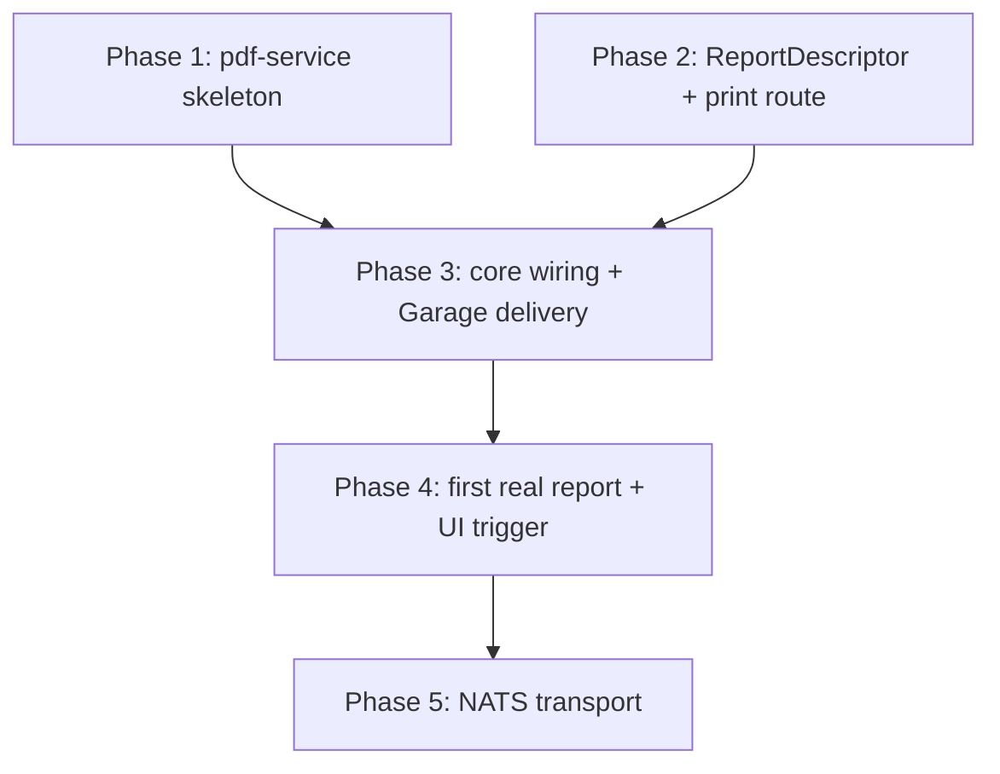

# PDF report generation — build roadmap

> **Goal:** generate PDF reports (statements, invoices, list exports) authored the same way
> developers already author on-screen views — a declarative `ReportDescriptor`, not a bespoke
> templating language — with real Tailwind/MUI CSS and the same entity field data forms use,
> rendered by an external, independently-scalable `pdf-service` so the cost of that fidelity
> never lands on the core API. See `docs/adr/ADR-010-pdf-report-generation.md` for the
> benchmark data and reasoning behind every choice below.

## Why it exists / what problem it solves

The ERP has no report/document-export path today. Ad hoc per-feature PDF code would either
reinvent layout in Go (no CSS, a permanently-owned custom engine) or embed a browser inside
the API server (steals its CPU budget, shares its fault domain, bloats its image). Neither
lets a developer build a report the way they already build a view.

## Architecture decisions (read first)

1. **Render engine is headless Chromium (`chromedp`)**, chosen over a native Go/Rust renderer
   specifically for CSS/Tailwind/MUI fidelity and component/data reuse — ADR-010's benchmark
   shows native Go winning throughput by ~17x/vCPU, but throughput was never the bottleneck;
   flexibility was the requirement.
2. **`pdf-service` is a standalone Go microservice**, never embedded in `core` — isolates
   Chromium's resource and fault domain. One pooled browser per replica, a new tab per report,
   never a new browser per report (that's the difference between ~490ms cold and ~170ms warm).
3. **Transport v1 is synchronous HTTP** (`POST /render`) behind a `Renderer` interface. NATS
   (Phase 5) is a deferred, pre-wired extension — not built until multiple workers are needed.
4. **Reports are `ReportDescriptor`s**, mirroring `ViewDescriptor`/`FrontModule`'s
   "descriptors only" contract — a layout tree of typed nodes, each with an optional
   `className`, bound to entity field data. One generic print route interprets any descriptor,
   the same way `FormRenderer` already interprets `ViewDescriptor`. TS/JSON only, no XML.
5. **Delivery goes through Garage** (S3-compatible), mirroring `internal/pictures`' anchor +
   object-storage split, not raw bytes stored in Postgres.
6. **Pagination uses DevTools `printToPDF` header/footer templates** (page numbers, static
   title/date) — CSS `running()` is unsupported by Chromium and out of scope, not a bug.

## Contracts

**`ReportDescriptor`** (`@eerp/core-front`, alongside `ViewDescriptor`):
```ts
interface ReportDescriptor {
  name: string                // e.g. 'crm.statement' — also the print route's :name param
  entity: string               // primary data source, same entity names views already use
  layout: ReportNode[]
  permissions: string[]        // same permission-string convention as ViewDescriptor
}

type ReportNode =
  | { kind: 'section'; className?: string; children: ReportNode[] }
  | { kind: 'field'; name: string; className?: string; format?: string }
  | { kind: 'table'; source: string; columns: { name: string; label: string }[]; className?: string }
  | { kind: 'pageBreak' }
```

**`pdf-service` HTTP contract:**
```
POST /render
{ "url": "http://core-front:3000/print/report/crm.statement/<record-id>?token=<internal>",
  "wait_for": "[data-report-ready]" }
→ 200, Content-Type: application/pdf, body = PDF bytes
```

## Phase 1 — `pdf-service` skeleton: pooled Chromium renderer + HTTP handler ✅ (implemented)

> Implementation notes: lives at `tools/pdf-service` (own `go.mod`, sibling to
> `tools/eerp-init-module`). `renderer.NewChromeRenderer` passes `chromedp.NoSandbox` —
> required for Chromium to launch at all inside a container, which has no setuid sandbox
> helper available; without it the browser fails to start. The runtime image is
> `debian:bookworm-slim` + `chromium` (not `golang:1.26` like `core/Dockerfile`, which has no
> browser) — verified end to end with a real `docker build` + `docker compose --profile pdf
> up`, hitting `/healthz` and `/render` against the running container. `compose.yml`'s
> `pdf-service` entry is gated behind `profiles: ["pdf"]` exactly as planned, confirmed absent
> from `docker compose config --services` without the flag.

**Claude Code prompt:**
```
Create tools/pdf-service (own go.mod, sibling to tools/eerp-init-module — not part of
core's module) implementing the Renderer interface prototyped in ADR-010:
1. renderer/renderer.go: ChromeRenderer backed by chromedp — launch Chromium ONCE at
   startup (chromedp.NewExecAllocator + chromedp.Run to force early start), Render(ctx,
   RenderRequest{URL, WaitFor, Timeout}) opens a NEW TAB per call (never a new browser),
   optionally chromedp.WaitVisible(WaitFor) before printing, then
   page.PrintToPDF().WithPrintBackground(true).WithDisplayHeaderFooter(true) with
   header/footer templates for page numbers. Per-call context.WithTimeout (default 20s).
2. main.go: POST /render HTTP handler (decode {url, wait_for} -> Renderer.Render -> stream
   PDF bytes back, Content-Type: application/pdf); GET /healthz once Chrome has
   successfully started. CHROME_PATH env var, default /usr/bin/google-chrome (or
   /usr/bin/chromium in the container image).
3. Dockerfile: a Chromium/Debian-slim base image + this Go binary; compose.yml: new
   pdf-service entry, healthcheck hitting /healthz, not started by `make run` by default
   until Phase 3 wires a caller (avoid an idle heavy container in every dev's `make run`).
Tests: Render() against a local HTML fixture file — assert non-empty PDF magic bytes
(%PDF-), assert page count via a lightweight PDF page-count check, assert it errors on an
unreachable URL and on WaitFor timeout. HTTP handler test via httptest hitting /render
with the same fixture.
```
**Tests:** `Render()` unit tests against a fixture HTML file (valid PDF output, correct page
count, error paths); `httptest`-based handler test.
**DoD:** `go run ./tools/pdf-service` serves `/render` and returns a real PDF for a local
fixture URL; `docker compose up pdf-service` passes its healthcheck.

## Phase 2 — `ReportDescriptor` + print-route interpreter (core-front) ✅ (implemented)

> Implementation notes: `ReportDescriptor`/`ReportNode`/`validateReportDescriptor` live in
> `packages/core-front/src/views/report-descriptor.ts` (sibling to `descriptor.ts`, not
> merged into it); `ReportRenderer` in `report-renderer.tsx` is deliberately NOT `'use
> client'` and uses no hooks — a report is a read-only server snapshot, not a draft/dirty
> client surface like `FormRenderer`. `ModuleRegistry` gained `FrontModule.reports?`, a
> `resolvedReports` map, and `buildReportRegistry()` — reports resolve by NAME
> (`ReportDescriptor.name`), not by path, since a report has no on-screen route of its own.
>
> Two things the research going in got wrong or underestimated, worth flagging: (1) there is
> **no existing date formatter anywhere in the engine** to reuse (`DateWidget` only strips an
> RFC3339 suffix for an `<input type="date">`) and **no server-side relation-label
> resolution path** either (relations resolve client-side, lazily, via autocomplete) — both
> aspirational in the original roadmap text. `ReportRenderer` ships its own minimal
> `formatFieldValue` (number via the existing pure `formatNumber`; date/datetime via
> `Date.prototype.toLocale*`, `ponytail:`-flagged as runtime-default-locale-only, no i18n
> wiring — add `resolveEffectiveLocale()` if a report ever needs translated dates) and
> `ReportTableNode.source` reads an already-embedded array field on the record rather than
> resolving a relation itself, which is enough for the fixture-driven tests and is the
> correctly-scoped v1 per the contract (`table.source` "a field name holding an array" —
> resolving cross-entity relations into that array, if ever needed, is additive later work,
> not a Phase 2 gap). (2) **there is only one root layout** (`app/layout.tsx`) and Next.js
> nests every route under it — a print route rendering through it would carry the full
> `AppTopBar`/nav chrome into the printed PDF. Rather than restructuring the whole `app/`
> tree into route groups with parallel root layouts (a large, risky diff touching every
> existing page), `AppTopBar` and the page-inset padding `Box` in `layout.tsx` got
> `'@media print': { display: 'none' }` / `{ p: 0 }` sx overrides — `Page.printToPDF` always
> applies print-media CSS, so the chrome renders in the DOM (harmless) but never in the PDF.
> Confirmed in the emitted HTML (`@media print` present) and, further down, in an actual
> printed PDF containing only the report content.
>
> **A real gap surfaced, explicitly Phase 3's to close, not Phase 2's:** the print route
> reuses `createServerApiClient()` exactly as designed, which reads the session from a
> cookie — but ADR-010 says pdf-service's request carries no browser session at all. Right
> now, a cookie-less request to the print route fails its `client.get()` with Go's 401,
> which the route's `catch` treats the same as "record not found" → clean `notFound()` (404,
> not a hang or a 500) — verified directly with a real cookie-less `curl`. Phase 3's "mints
> the internal print URL... short-lived signed token" is exactly the missing piece that lets
> that call succeed; until then, the print route only actually works when handed a valid
> session, which is what every verification below used.
>
> **Verified end to end against the real stack**, not just unit tests: logged into the
> running dev stack as the seeded `admin@eerp.local`, created a real `contact` row via the
> generic CRUD API, temporarily registered a throwaway report on the `contact` module,
> confirmed `/print/report/contact.smoketest/<id>` returns 200 with `data-report-ready`
> present and the real field values rendered, confirmed an unknown report name, an unknown
> record id, AND a cookie-less request all 404 cleanly, then drove an actual headless Chrome
> instance (cookie injected via `network.SetCookie`, mirroring how `pdf-service` would if
> Phase 3 handed it one) against the live route and extracted the resulting PDF's text —
> `Acme Corp` / `acme@example.test` / `Acme`, nothing from the app chrome. The throwaway
> report was reverted afterward; shipping a real one is Phase 4's job.

**Claude Code prompt:**
```
In @eerp/core-front:
1. descriptor.ts (or a new report-descriptor.ts alongside it): add ReportDescriptor and
   ReportNode per the Contracts section above. Validate on registration (unknown 'source'
   on a table node, missing 'name' on a field node -> registration error, same style as
   the widget/type compatibility matrix in field-widgets.md).
2. A new ReportRenderer component that walks a ReportDescriptor's layout tree into DOM,
   reusing FormRenderer's field-value formatting where it already exists (dates, numbers,
   relations) rather than reimplementing it. className passes straight through to the
   rendered element for Tailwind/MUI styling.
3. A generic print route apps/shell/app/print/report/[name]/[id]/page.tsx: server
   component, resolves the ReportDescriptor by name (module registry, same discovery
   ViewDescriptor already uses), fetches the entity record server-side, renders
   ReportRenderer, and sets a `data-report-ready` attribute on the root element once
   render is complete (chromedp waits on this selector — see Phase 1's WaitFor).
Tests (vitest): ReportRenderer renders each ReportNode kind correctly (section/field/
table/pageBreak) against fixture descriptors + data; registration rejects a table node
with an unknown source field and a field node with a missing name; the print route sets
data-report-ready only after data has resolved (no flash of an incomplete document).
```
**Tests:** `ReportRenderer` fixture-driven render tests per node kind; descriptor
registration validation tests; print-route readiness-marker test.
**DoD:** navigating to `/print/report/<name>/<id>` in a browser renders a real, styled
document from a `ReportDescriptor` and real entity data, with `data-report-ready` present
only once complete.

## Phase 3 — Core wiring: mint print URL, call `pdf-service`, deliver via Garage ✅ (implemented)

> Implementation notes: lives in `core/internal/reports` (`renderer.go`'s `PDFRenderer` +
> `httpPDFRenderer` calling `pdf-service`'s `/render`; `handler.go`'s `GeneratePDF`/
> `DownloadPDF`). Config gained `pdf_service_url` and `frontend_base_url` (the latter is new
> territory — Go previously had zero reason to know the frontend's address, since every
> other data flow is frontend-to-backend; both eerp-config.json and eerp-config.docker.json
> got dev-appropriate values).
>
> **The roadmap prompt's "derive report:<name>:read from the route, same convention as
> every other dedicated handler" turned out not to hold.** `PermissionMiddleware`'s
> `derivePermissionFromRoute` only ever sees the compiled Echo route pattern
> (`/api/v1/reports/:name/:id/pdf`), never `:name`'s runtime value — since `:name` sits
> immediately after the route's first static segment, mechanical derivation would yield the
> coarse `reports:reports:write`, not a report-specific permission. `GeneratePDF` mounts
> behind `jwtMw` alone and checks `report:<name>:read` manually via
> `PermissionRepository.Has`, against the actual requested name. `DownloadPDF` (a flat route,
> `GET /api/v1/reports/pdf`) has no such problem and uses `permMw` normally, deriving
> `reports:pdf:read`; tenant isolation on top of that is a key-prefix check
> (`reports/<tenant>/...`), the same posture `internal/pictures`' `Get` takes toward its own
> anchor's original write permission (never re-checked on download either).
>
> **Delivery has no presigned-URL or DB-row precedent to copy** — `internal/pictures`
> streams bytes through Go with no URL scheme at all. Went stateless: no new metadata table
> (nothing here needs pictures' `field true ⇔ row exists` invariant), a deterministic S3 key
> (`reports/<tenant>/<name>/<id>/<unix-ts>.pdf`, reusing `pictures.ObjectStore`/`S3Configured`/
> `NewS3Store` directly rather than duplicating an S3 client), and `download_url` is a
> same-origin Go path (`/api/v1/reports/pdf?key=...`) that `DownloadPDF` streams — never a
> presigned Garage URL, which would require Garage to be independently reachable by the
> end user's browser, a production requirement this avoids entirely.
>
> **Closed the real gap Phase 2 flagged**, rather than deferring it further: `TokenService`
> gained `IssueAccessWithTTL` (the existing `IssueAccess` now just calls it with the
> configured session TTL — a pure refactor, covered by the existing 52 auth tests, all still
> green) so `GeneratePDF` can mint a 60-second, report-scoped token — re-deriving permissions
> fresh via `ForRoles` rather than copying the caller's own claim — and embed it in the print
> URL's `?token=`. `createServerApiClient()` (`packages/core-front/src/api/ApiClient.ts`)
> gained an optional `tokenOverride` param threaded through every method, bypassing the
> cookie read entirely and failing closed (no refresh attempt — there's no refresh token
> behind a scoped print token) on a 401; the print route now reads `searchParams.token` and
> passes it through instead of relying on a cookie that was never going to exist for a
> cookie-less `pdf-service` request.
>
> **Verified against the real stack, all three services on the host** (Go backend, the
> already-built `pdf-service`, and the Next dev server, wired together via the
> `pdf_service_url`/`frontend_base_url` config added above) — not mocks: logged in as the
> seeded admin, created a real `contact`, temporarily registered the same throwaway
> `contact.smoketest` report Phase 2 used, and drove the actual
> `POST /api/v1/reports/contact.smoketest/<id>/pdf` → 201 with a real `download_url` →
> `GET` that URL → a real PDF whose extracted text is `Globex Corp` / `globex@example.test` /
> `Globex` plus a real `Page 1/1` footer. Also verified for real: a missing key 404s, an
> unknown report name 502s (RENDER_FAILED — the print route's own `notFound()` starves
> pdf-service's `WaitVisible` until its timeout, a slow-but-correct failure, not a crash),
> and a request with no `Authorization` header 401s before ever reaching the handler. The
> throwaway report was reverted afterward, same as Phase 2 — a real one is still Phase 4's.

**Claude Code prompt:**
```
In core/internal (new package, e.g. internal/reports):
1. POST /api/v1/reports/:name/:id/pdf — permission-checked (derive report:<name>:read from
   the route, same convention as every other dedicated handler), tenant-scoped. Builds the
   internal print URL (http://core-front:3000/print/report/:name/:id, short-lived signed
   token or the internal-trusted-network path per ADR-010 decision, no user-facing auth on
   the print route itself), calls pdf-service's POST /render, uploads the returned bytes to
   Garage using the SAME s3 client internal/pictures already constructs (new bucket key
   convention: reports/<tenant>/<name>/<id>/<timestamp>.pdf), returns {download_url}.
2. Config: PDF_SERVICE_URL in eerp-config.json (mirrors the existing s3_* fields' pattern),
   mounted only when set (like pictures' s3_* gating) so pdf-service stays optional for
   deployments that don't need reports yet.
Tests: handler test with a fake pdf-service (httptest server returning canned PDF bytes)
and a fake/local Garage bucket — permission denial for a caller without report:<name>:read,
tenant isolation (can't request another tenant's record), Garage upload happy path returns
a working download_url, pdf-service error surfaces as a clean 502 not a panic.
```
**Tests:** handler tests against a faked `pdf-service` + local Garage — permission
enforcement, tenant isolation, upload happy/error path.
**DoD:** `POST /api/v1/reports/crm.statement/<id>/pdf` returns a working download URL for a
real record, backed by a real `pdf-service` call and a real Garage upload.

## Phase 4 — First real report + UI trigger ✅ (implemented)

> Implementation notes: `crm.statement` lives in `core/modules/crm/views/CrmViews.ts`
> (`FrontModule.reports`) — header/company/status, contact details, and satisfaction/
> deals/score sections, a `pageBreak`, then notes. No `table` node: Go's `GET /crm/:id`
> carries no embedded array-valued field (relations resolve client-side only, Phase 2's own
> finding) — a real relation table is future work once a report actually needs one.
>
> **Neither Tailwind nor MUI turned out to be installed in this frontend** — the "className
> for Tailwind/MUI styling" plan from ADR-010 had nothing to attach to. `ReportRenderer`
> deliberately renders plain DOM (no MUI components, no client hooks), so the fix was a
> small plain-CSS file (`apps/shell/app/print/report/report.css`, `eerp-report-`-prefixed
> classes to stay collision-free) imported from the root layout — Next's App Router only
> allows global CSS imports there, per the existing react-grid-layout precedent in the same
> file. Real styling, not a framework, proportional to one report.
>
> **The UI trigger needed a second BFF proxy layer, not just a button** — the browser can
> never call Go directly (session lives in an httpOnly cookie Go can't read, and Go requires
> a Bearer header regardless of network trust). Added `generateReportPDF`/`streamReportPDF`
> to `ApiClient.ts` (same session-cookie path as the existing picture functions — NOT the
> print route's separate `tokenOverride` path) and two Route Handlers,
> `POST /api/reports/:name/:id` and `GET /api/reports/pdf`, mirroring `internal/pictures`'
> own `/api/pictures` BFF shape exactly. The POST handler translates Go's own
> `download_url` (a `/api/v1/...` path requiring a Bearer header) into this BFF's own proxy
> path — the browser is never handed something it can't actually reach.
> `ModuleRegistry.reportForEntity(entity)` (mirroring `formDescriptorFor`) lets the generic
> catch-all decide whether to render `ReportExportButton` next to a form's title, exactly
> where `CreateBar` sits for tree views — shown only for a real saved record (not the empty
> `new` draft) with a matching registered report.
>
> **Verified twice against the live stack**, not just the roadmap's asked-for automated
> test: (1) the new `TestGeneratePDF_EndToEnd` (`core/internal/reports/e2e_test.go`,
> `//go:build integration`, gated on `TEST_API_BASE` — mirroring core-front's own
> integration-test convention rather than inventing a new one) actually run against all
> three live services — real login, a uniquely-named real `crm` record, real generation,
> real download, and `github.com/ledongthuc/pdf` (new dependency — no existing Go PDF
> text-extraction in this repo) confirming exactly 2 pages and the record's own name plus
> its status in the extracted text; (2) separately, the actual browser-facing BFF path —
> Next's own session cookie, `POST /api/reports/crm.statement/:id`, the translated
> `download_url`, `GET` it — produced a real 2-page PDF with the record's real name/company/
> status/email, proving `ReportExportButton`'s exact code path, not just the Go handler.

**Claude Code prompt:**
```
Ship one real ReportDescriptor end to end (e.g. crm.statement, mirroring the existing crm
module the way crminheritdemo mirrors it) and an "Export to PDF" action on its form/list
view (frontend button -> POST /api/v1/reports/crm.statement/:id/pdf -> open download_url).
Tests: an end-to-end test (real descriptor, real record, real pdf-service, real Garage in
the test environment) asserting the resulting PDF has the expected page count and contains
expected field values (text-extraction check, not just non-empty bytes).
```
**Tests:** end-to-end generation test with content assertions (page count, key field values
present in extracted text), not just "a PDF came back."
**DoD:** a user can click "Export to PDF" on a real record and download a correct, styled
PDF of it.

## Phase 5 — NATS transport for multi-worker scaling ✅ (implemented)

> Implementation notes: built ahead of an actually-observed bottleneck, at explicit request
> — the "deferred until needed" framing below is the ORIGINAL v1 reasoning (ADR-010
> decision 3), kept as-written since it's still the right default advice for a fresh
> deployment; NATS is opt-in (`nats_url` unset by default in both `eerp-config.json` and
> `eerp-config.docker.json` — the HTTP path from Phases 1-4 is untouched and stays the
> default).
>
> `PDFRenderer` (`core/internal/reports/renderer.go`) is unchanged — `natsPDFRenderer`
> (`nats_renderer.go`) satisfies the exact same interface as `httpPDFRenderer`, so
> `GeneratePDF`/`DownloadPDF` needed literally zero changes; `main.go` picks NATS over HTTP
> only when `nats_url` is set (NATS wins if both are). `tools/pdf-service`'s NATS worker
> (`natsworker.go`) subscribes to `reports.render` in queue group `pdf-workers`, calling the
> SAME `renderer.Renderer.Render` the HTTP handler calls — genuinely one render pipeline,
> two front doors, coexisting (both start unconditionally; `NATS_URL` unset just skips the
> subscribe). Success replies with raw PDF bytes; failure replies with an `X-Render-Error`
> header rather than a JSON body, so the caller never has to sniff whether a reply "looks
> like" a PDF.
>
> **The roadmap's original sketch (worker uploads to Garage directly, "whichever worker
> completes it") was reconsidered during implementation** in favor of keeping Core as the
> ONLY thing that ever talks to Garage, on both the upload and download side — the simpler,
> more consistent design, and the one that actually delivers "zero core-side code change
> beyond the transport swap" literally, not approximately. That does mean pdf-service has no
> S3 credentials of its own and NATS reply payloads carry full PDF bytes rather than just an
> object key — comfortably inside NATS's 1MB default `max_payload` for every report size
> measured so far (10-60KB); nats-server only accepts `max_payload` from a config file, not
> a CLI flag, so raising it later means mounting one into the `nats` compose service, not
> just editing a command line.
>
> **"Redelivery," precisely:** core NATS (no JetStream) is at-most-once, not
> at-least-once — a worker crash mid-render just times out the caller's `RequestWithContext`
> (502, same as any other render failure), it doesn't replay the job server-side. What Phase
> 5 actually delivers, and what the tests below prove, is that a crashed replica doesn't take
> the QUEUE down — the survivor(s) keep serving every subsequent request, which is the
> throughput-scaling promise Phase 5 exists for. Genuine persistent redelivery would mean
> adopting JetStream, deliberately out of scope here as a second layer of complexity with no
> demonstrated need yet.
>
> **Tests, real not mocked:** `tools/pdf-service/natsworker_test.go` and
> `core/internal/reports/nats_renderer_test.go` both spin up a REAL, in-process NATS server
> per test (`github.com/nats-io/nats-server/v2/test`, the same package the nats.go project's
> own tests use — no Docker needed for CI) — `TestNATSWorker_QueueGroupLoadBalances` proves
> 20 requests across 2 workers split with zero duplication and zero drops;
> `TestNATSWorker_SurvivesAWorkerCrash` proves the survivor keeps answering after the other
> is killed mid-stream. **Then verified again against real infra**, twice: (1) two real
> `pdf-service` `go run` replicas + a real `nats-server` process + the real backend + real
> Chrome — generated a report, killed one replica, generated again, got a correct 2-page PDF
> from the survivor; (2) the actual persistent `docker compose` stack, rebuilt with all of
> Phases 1-5's code (`docker compose build core-back core-front pdf-service`,
> `--profile pdf up -d --scale pdf-service=2 nats pdf-service`, `up -d --no-deps core-back
> core-front` to redeploy — never `down`) and exercised through the real `api-gateway` —
> login, create a `crm` record, generate `crm.statement`, download, correct content. `nats`
> + 2 `pdf-service` replicas are left running in the stack afterward as a live demonstration.

**Claude Code prompt:**
```
Only once a single pdf-service replica's throughput (~3.2 reports/s/vCPU, see ADR-010) is
an actual observed bottleneck: add a NATS QueueSubscribe front door in tools/pdf-service
calling the SAME Renderer.Render used by the HTTP handler (both can coexist). Core's
internal/reports switches (or adds an alternate path) to publish a job and await a reply
(NATS request-reply) or poll a status keyed by a job id, uploading to Garage from whichever
worker completes it. compose.yml gains a nats entry; pdf-service is then replicated (N
containers, same NATS queue group = competing consumers, zero code change per replica).
Tests: two worker replicas subscribed to the same queue group — assert jobs are
load-balanced across both, not duplicated; a worker crash mid-job doesn't lose the job
(redelivery) but doesn't double-charge Garage storage either (idempotent upload key).
```
**Tests:** multi-replica competing-consumer test; crash/redelivery idempotency test.
**DoD:** running N `pdf-service` replicas behind NATS linearly increases sustained
throughput with no core-side code change beyond the transport swap.

## Build order



Phases 1 and 2 are independent (Go backend vs. frontend) and parallelize; Phase 3 needs both
done. Phase 5 was originally scoped as YAGNI — build it only once throughput is an observed
bottleneck (ADR-010 decision 3) — and was then built ahead of that signal, at explicit
request; the opt-in design (`nats_url` unset by default) keeps that original reasoning intact
for anyone who doesn't need it yet.

## Coordination

- **field-widgets roadmap:** `ReportRenderer` should reuse the same field-value formatting
  (`useNumberFormat`, date formatting) `FormRenderer`'s widgets already use, rather than
  duplicating it — a report showing a number should format it identically to the form it came
  from.
- **`internal/pictures`:** Phase 3's Garage upload is the second consumer of that S3 client
  after pictures — if a shared helper doesn't already exist, factor one out rather than
  duplicating client construction.
- **app-store / module system:** `ReportDescriptor`s are discovered the same way
  `ViewDescriptor`s are (module registry, build-time compilation) — no new discovery
  mechanism needed.

## Pitfalls (encode them)

- **A fresh browser per report instead of a pooled one** — this is the single biggest
  performance mistake possible here (~490ms cold vs ~170ms warm per ADR-010's numbers).
  `ChromeRenderer` must be constructed once at service startup and reused for the process's
  life; only tabs are per-request.
- **Printing before the page is actually ready** — React SSR + data fetching is async; a
  chromedp `WaitVisible` without the print route setting `data-report-ready` itself produces
  a PDF of a loading state. The readiness marker is the print route's responsibility, not the
  renderer's guess.
- **Chromium `running()` CSS will silently not work** — don't design a report layout that
  depends on dynamic per-page running headers; static header/footer templates (page number,
  fixed title) are the supported mechanism.
- **Optimal concurrency is ~2× the replica's vCPU count**, not "as high as possible" — past
  that, per-report latency degrades with no further throughput gain (measured directly: 4
  vCPU plateaus at 8 concurrent tabs, ~12.9 reports/s either way). Capacity planning scales
  replica count, not per-instance concurrency.
- **The print route must never be reachable without going through the core-signed URL** —
  per ADR-010's internal-trusted-network decision, it carries no independent auth; treat it
  as an internal-network-only route, not one exposed alongside the rest of core-front's public
  surface.
- **Garage upload keys must be deterministic/idempotent** (`reports/<tenant>/<name>/<id>/...`)
  so a retried render (Phase 5 redelivery, or a simple client retry in v1) doesn't leak
  orphaned objects.
