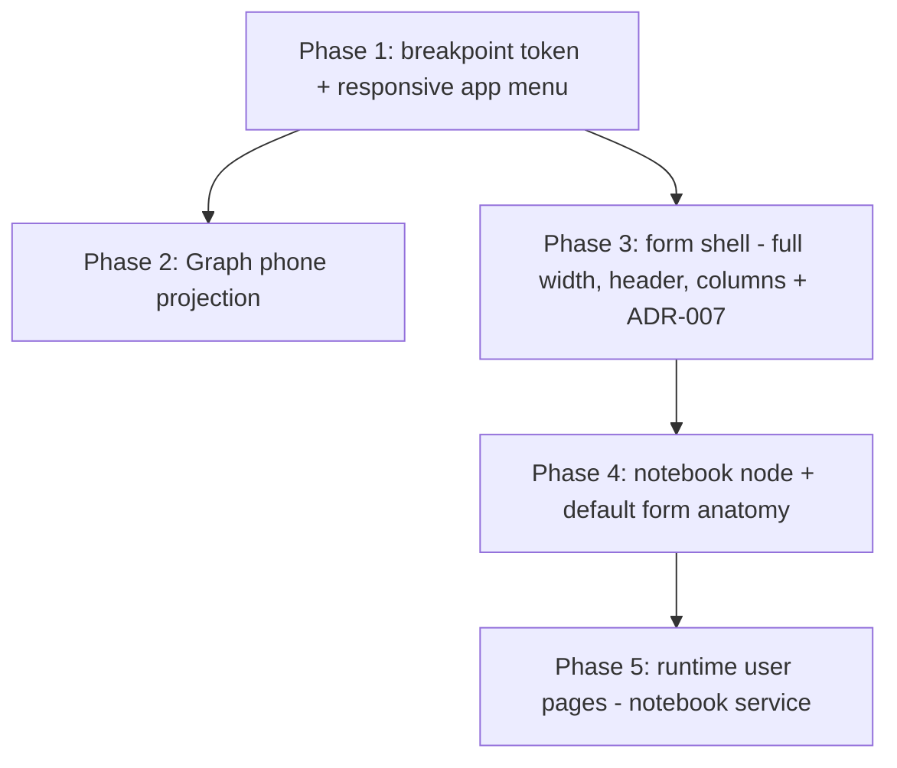

# Responsive displays & the form notebook — build roadmap

> **Goal:** make every display surface genuinely usable on a phone, and reshape the record
> form into a full-width, two-column layout with an Odoo-style **notebook** (tabbed pages)
> as the *default* rendering of any form. Concretely: the application landing menu collapses
> to compact 50px tiles, two per row, on phone screens; Graph mode stacks its tiles one per
> row instead of a grid; and the form gains a header (picture left, big title right), two
> field columns that collapse to one when narrow, and a notebook whose first page —
> **Settings**, holding the entity's long-text `comment`-style fields — ships by default,
> with more pages addable both by module developers (as easily as any view) and by end users
> at runtime, without ever leaving the record.

Related: [view-customization.md](view-customization.md) (the layout tree and view
extensions this roadmap builds on), [list-view-modes.md](list-view-modes.md) (Graph mode),
[field-widgets.md](field-widgets.md) (the picture/long widgets the new form chrome
promotes), [ADR-005](../adr/ADR-005-frontend-view-inheritance.md),
[ADR-006](../adr/ADR-006-runtime-configurable-view-fields.md).

## Why it exists / what problem it solves

Every display today is desktop-first, with exactly one hardcoded shape:

- **The application menu** (`apps/shell/app/Menu.tsx`) renders fixed `100×100` tiles in a
  flex row with a literal `70px` gap, spanning `66.6667vw` on desktop. On a phone the tiles
  keep their desktop size and wrap arbitrarily; nothing adapts. (The tile list also carries
  a real React key bug — `key` sits on the inner `SquareTile`, not the mapped wrapper `div`
  — visible as a console warning on every load.)
- **Graph mode** (`graph-renderer.tsx`) derives its column count from the measured container
  width (`cols = round(containerWidth / GRID_UNIT)`), so on a 360px phone a saved desktop
  layout renders as a squeezed ~12-column grid of unreadably narrow tiles — technically
  responsive, practically useless.
- **The form** (`FormRenderer` in `renderers.tsx`) is a single centered column capped at
  `layout.formMaxWidth` (560px). On a wide screen most of the viewport is empty; on a long
  entity (crm's form renders 13+ fields) the user scrolls a narrow tube. There is no concept
  of a header, of columns, or of tabbed pages — the layout tree
  ([view-customization.md](view-customization.md) Phase 1) has `group`/`row`/`section`
  container kinds, and `row` is a non-wrapping flex row that overflows on phones.

The form ask is the biggest piece: an Odoo-style default form anatomy — picture top-left,
big title beside it, two columns of fields, a notebook of pages underneath — that every
entity gets **without declaring anything**, while staying fully compatible with the existing
layout tree, view extensions, field states, and behaviors. "Notebook pages must be as easy
to create and edit as the current views" pins the developer contract: a page is a layout
node in a descriptor, addable by a view extension, never a bespoke registration API.

## Architecture decisions (read first)

1. **Responsiveness is CSS-first; JavaScript branches only where the render tree itself
   must differ.** Anything expressible as `sx` breakpoint values or a CSS grid stays CSS
   (SSR-safe, no hydration flash) — the menu tiles, the form columns, `row` stacking. Graph
   is the one place the *component tree* changes shape on phone (grid engine vs. plain
   stack), and it branches on its **own measured container width** (the `useContainerWidth`
   measurement it already takes for RGL), never on `window` — consistent with how the canvas
   already sizes itself, and immune to the "renderer inside a narrow dialog" problem.
2. **"Phone" means the container/viewport is narrower than 600px** — MUI's `sm` breakpoint,
   the boundary the codebase already uses (`Menu.tsx`'s `{ xs, md }` values). No custom
   breakpoint system; a `phoneMaxWidth = 600` layout token names the number once for the
   JS-side branches (Graph) so it can't drift from the CSS side.
3. **The form's two columns are container-driven, not viewport-driven.** The same
   `LayoutForm` renders inside the full-width form page *and* inside the relation widgets'
   narrow create-from-search dialog. A viewport media query would render two crushed columns
   inside that dialog; a CSS **container query** on the form's own width (two columns from
   `2 × formMaxWidth`-ish up, one below) collapses correctly in both places for free. Fields
   flow row-major into the grid — declaration order alternates left/right, which is exactly
   the "each field stacked in left or right column" ask. If container queries prove awkward
   to style through MUI, the fallback is the `useElementSize` measurement pattern
   `graph-widgets.tsx` already established — but try CSS first.
4. **The default form anatomy is synthesized, never stored.** `normalizeLayout` already
   synthesizes an implicit group for descriptors without an explicit `layout`; this roadmap
   upgrades that synthesis **for `viewType: 'form'` only** to: header row (picture widget
   field + title field) → two-column group → notebook (Settings page holding the long-text
   fields). `descriptor.layout` stays `undefined` — nothing is written back, no migration,
   and a module that declares an explicit `layout` keeps exactly what it declared (it opted
   out of the default by definition). Tree/kanban/calendar/dashboard views keep today's flat
   implicit group — their field order (`layoutFieldOrder`) must not change. This decision
   gets an ADR (ADR-007, Phase 3's DoD): it changes the default rendering of every form in
   every deployment.
5. **The notebook is a layout-tree citizen: two new node kinds, `notebook` and `page`.**
   A `page` is a titled container legal only directly inside a `notebook`; a `notebook`'s
   children are only `page`s (registration errors otherwise, same posture as every other
   layout validation). Because pages are ordinary nodes with ordinary `id`s, the existing
   extension operations already cover the developer story: `addNode` targeting the
   notebook's id adds a page, `addField` targeting a page id (or a field inside a page)
   drops a field onto it, `move` relocates fields between pages — **no new extension op**,
   and "as easy to create and edit as the current views" is literally true because it *is*
   the current views mechanism. The synthesized default nodes carry stable well-known ids
   (`__form_header`, `__form_columns`, `__form_notebook`, `__page_settings`) so extensions
   can target the default anatomy too.
6. **Switching notebook pages is client-only state and panels stay mounted.** Tabs switch
   with `display`-toggling (`keepMounted`), never unmount — the draft lives in the form
   store either way, but keeping panels mounted means field states/computes/pictures on an
   inactive page keep behaving and switching can never lose in-progress widget state. No
   route change, no store change: "switch between pages without quitting the object" is a
   `useState<number>` in the notebook node's renderer.
7. **Runtime user-created pages are per-record DATA, not settings and not descriptor
   state — a third category, and the pictures service is the precedent.** A user adding a
   "Meeting notes" page to *one crm record* is neither workspace configuration
   (`app_settings`, ADR-006's territory) nor developer-declared structure (ADR-005's). It is
   record-anchored content, exactly like a picture: a small dedicated backend service
   (`internal/notebook/`), a `notebook_page` table anchored on `(tenant, table, record)`,
   tenant-pinned dedicated routes off the generic CRUD surface, permissions derived from the
   route. Declared (descriptor) pages and stored (user) pages render in one tab strip —
   declared pages hold fields, user pages hold a title + one long-text body — and only user
   pages are creatable/renamable/deletable at runtime.
8. **The phone projection of Graph never writes.** Below the phone width the canvas renders
   a read-only single-column stack of the same tiles ordered by `(y, x)`; the Edit toggle
   hides. Stored geometry is never remapped to the narrow shape — rotating the phone or
   returning to desktop shows the saved layout untouched. (Native HTML5 drag doesn't fire on
   touch anyway; a touch-editable canvas is explicitly out of scope — see Pitfalls.)

## Contracts

| Concern | Contract |
| --- | --- |
| Breakpoint | Phone = narrower than **600px** (MUI `sm`). CSS-first via `sx` breakpoint values / CSS grid / container queries; JS branching only in Graph, off its own measured container width. New layout token `layout.phoneMaxWidth = 600` names the number once. |
| Application menu | ≥`sm`: today's 100×100 tiles, wrapping centered rows (unchanged look). `<sm`: tiles shrink to **50×50**, laid out **two per row** in a centered CSS grid, label rendered *below* each tile (the in-tile caption hides — it can't fit 50px), tap target stays ≥44px. Fix the `key`-on-wrong-element bug and the duplicated label (caption inside the tile *and* a `<p>` below it) in the same pass. |
| Graph phone projection | Container `< phoneMaxWidth` ⇒ tiles render as a plain vertical stack, one per row, full container width, height `h × GRID_UNIT` (floored at the tile type's `TILE_MIN_SIZE.minH`), ordered by `(y, x)`. Hidden tiles stay hidden. Edit toggle hidden; RGL not mounted at all in this branch. Stored geometry is **never mutated** by the projection. Widgets keep their `useElementSize` responsiveness — they just get a narrow, full-width box. |
| Form width | `viewType: 'form'` uses the **full width** inside RootLayout's page inset (`maxWidth: '100%'`); the 560px `formMaxWidth` cap is removed from `FormRenderer`. The token survives for the relation create-wizard dialog and as the column-width floor. |
| Form header | Synthesized `row` (id `__form_header`): the descriptor's first `widget: 'picture'` boolean field on the left (rendered at avatar scale), then the **title field** — the first `text` field per the existing `orderedFields` label heuristic — rendered big (h3-scale input, label as placeholder) filling the rest of the row. New JSON-only rendering hint `LayoutFieldNode.variant?: 'title'` drives the big style; explicit layouts may use it too. Header stays side-by-side even on phone. |
| Form columns | Synthesized `group` (id `__form_columns`) with new hint `LayoutContainerNode.columns?: number` — rendered as a CSS grid, **max 2 columns**, collapsing to 1 below the container-query threshold (the create wizard therefore always gets 1). Fields flow row-major (declaration order alternates left → right). All non-header, non-notebook fields land here. |
| Layout `row` on phone | `kind: 'row'` stacks vertically below `sm` (flex-wrap) — applies to explicit layouts too (e.g. crminheritdemo's), which is the intended "fully responsive" behavior, not a regression. |
| Notebook node | `{ kind: 'notebook', id?, children: Page[] }`, `{ kind: 'page', id?, title, children: LayoutNode[] }`. Validation at `normalizeLayout`/registration: `notebook` contains only `page`s, `page` appears only in a `notebook`, one `notebook` per form (v1). Rendered as MUI `Tabs` (scrollable when overflowing) + keep-mounted panels; active tab is client state. Pages/fields inside participate in states/behaviors/`hidden` exactly like any other node. |
| Default form anatomy | `viewType: 'form'` + no explicit `layout` ⇒ `normalizeLayout` synthesizes: `__form_header` → `__form_columns` → `__form_notebook` containing `__page_settings` (title `'Settings'`) holding every long-text field (`widget: 'long'`) in declaration order — for crm that is `notes` plus the crminheritdemo-extended `comment`. No long-text field ⇒ the Settings page still renders (it is also the home of runtime user pages' tab strip). Explicit layouts are untouched. Extension application against a form descriptor materializes this synthesized tree first, so ops can target the well-known ids; a form-view `addField` with no target defaults into `__form_columns` (not top-level). |
| Runtime notebook pages | Go: `internal/notebook/`, table `notebook_page` `(id, tenant_id, table_name, record_id, title, position, content, timestamps)`, one row per user page. Routes `GET/POST /api/v1/notebook_pages` (query `table`+`record`) and `PUT/DELETE /api/v1/notebook_pages/:id`, tenant-pinned, off the generic CRUD surface, permissions `notebook_pages:notebook_pages:*` derived from the route — the route is underscored (not hyphenated) precisely so the existing, unmodified permission-derivation mechanism produces this permission verbatim. Frontend: user pages render after declared pages in the same tab strip; a trailing `+ Add page` control (a plain `Button` beside `Tabs`, not a `Tab` — `Tabs` clones its immediate children, which fights a `Tooltip`-wrapped `Tab`; HIDDEN entirely without the write permission, `CreateBar`'s posture; DISABLED with a hint until the record has an id — the picture widgets' exact posture) creates one; user pages have an editable title and one long-text body saved through `NotebookOps`, never through the record's draft/commit. Declared pages are not deletable at runtime. |
| i18n | Every new string (`'Settings'`, `'New page'`, hints…) goes through `t()` with `fr.po` entries in the same phase — including the synthesized page title, which is a msgid like any layout `title`. |

**Example — what crm's form renders with no layout declared by anyone (after Phase 4):**

```text
┌──────────────────────────────────────────────────────────────┐
│ [picture]   Acme's project                        (title, h3) │
├──────────────────────────────┬───────────────────────────────┤
│ Email                        │ Company                       │
│ Status                       │ Score                         │
│ Signed                       │ Phone                         │
│ Satisfaction                 │ Deals                         │
│ Display name                 │ Contact                       │
│ Tags                         │ Date (from crminheritdemo)    │
├──────────────────────────────┴───────────────────────────────┤
│ [ Settings ] [ Meeting notes ] [ + ]                          │
│  Notes    (long)                                              │
│  Comment  (long, from crminheritdemo)                         │
└──────────────────────────────────────────────────────────────┘
```

("Meeting notes" is a runtime user page from Phase 5; on a phone the two columns
collapse to one and the header stays side-by-side.)

## Build order



Phases 2 and 3 parallelize once Phase 1 lands the breakpoint convention. Phase 4 needs
Phase 3's synthesized-layout plumbing; Phase 5 needs Phase 4's notebook renderer. Phases
1–2 are pure presentation (no backend); Phase 5 is the only one that touches Go.

## Phase 1 — Breakpoint convention + responsive application menu ✅ (implemented)

The foundation everyone else cites, plus the smallest visible win. Adds
`layout.phoneMaxWidth = 600` to `tokens.ts`, rebuilds `Menu.tsx`'s tile board as a
responsive grid, and takes a one-pass audit that no display surface produces horizontal
page scroll at 360px (the mode switcher, settings pages, and login are expected to already
pass thanks to RootLayout's page inset — verify, don't assume).

> Implementation notes: the tile board is one `Box` whose `sx` flips wholesale at `sm` —
> CSS grid (`repeat(2, auto)`, centered, `gap: 3`) below, the original flex-wrap row
> (70px gap, `66.6667vw` centered) above — no JS media query anywhere, per Architecture
> decision 1. Tile size is a responsive constant (`TILE_SIZE = { xs: 50, sm: 100 }`).
>
> One addition beyond the contract's letter: hiding the in-tile caption at phone size
> would leave icon-less module tiles as blank 50px squares (module tiles have no icon —
> only the built-in Settings tile does), so the compact tile shows an `aria-hidden`
> **monogram** (the label's first letter) instead. The label placement rule is: in-tile
> caption from `sm` up, below-tile label under it — both exist in the DOM, CSS shows
> exactly one per size. That also resolves the pre-existing duplicate label (the old
> always-rendered `<p>` under every tile) and the React key warning (the `key` sat on the
> inner `SquareTile` instead of the mapped wrapper).
>
> jsdom can't evaluate media queries, so `Menu.test.tsx` asserts structure (stable keys
> via a console-error spy, one below-label per tile, monogram presence, link hrefs) and
> the breakpoint *rendering* is verified by the real-browser audit: at 360×640, login /
> landing menu / crm list (all four switcher modes visible) / settings all report
> `scrollWidth === clientWidth === 360`; the phone tile's visible box is 48px (50 minus
> the Card's 1px borders — still above the 44px touch floor) and back to ~100px at 1280.

**Claude Code prompt:**
```
In @eerp/core-front and apps/shell:
1. tokens.ts: add layout.phoneMaxWidth = 600 (px) with a docstring pinning it to MUI's sm
   breakpoint — the ONE named number for phone-width JS branches; CSS keeps using sx
   breakpoint values.
2. apps/shell/app/Menu.tsx: rework the tile board — ≥sm keeps today's look (100×100 tiles,
   centered wrapping rows); <sm renders a centered two-column CSS grid of 50×50 tiles,
   in-tile caption hidden, label below each tile. Fix the React key placement (key belongs
   on the mapped wrapper div) and drop the duplicated label (caption inside the tile AND a
   <p> under it — keep exactly one, the below-tile label, at both sizes... at desktop the
   in-tile caption may stay if the below-label is removed instead; pick one, not both).
   Keep tap targets ≥44px.
3. Audit at 360×640 (real browser, headless chrome): landing menu, a list view (all four
   modes' switcher row), a settings page, login — no horizontal page scroll anywhere.
Tests: Menu renders one label per tile with stable keys; grid/tile classes flip at the
breakpoint (assert sx output or snapshot at both sizes); i18n untouched.
```
**DoD:** on a 360px viewport the landing menu shows compact 50px tiles two per row with
readable labels; desktop is pixel-equivalent to today (minus the duplicate label); no
horizontal scroll on any audited page; the key warning is gone from the console.

## Phase 2 — Graph mode: phone projection (one tile per row) ✅ (implemented)

> Implementation notes: landed as designed, with one structural addition — the tile
> chrome (inset Card, floating title, editing-only ✎/× buttons, widget body) was
> extracted into a shared `GraphTileCard` component so the projection and the RGL grid
> render the SAME chrome instead of a copy; the projection's wrapper Box simply provides
> what RGL's grid cell provides on desktop (a positioned box with an explicit height).
> The projection renders from `saved`, never the draft: a mid-edit window shrink hides
> the whole toolbar and parks the untouched draft until the canvas is wide again — no
> code path in the phone branch can write geometry. Tests drive the branch by making the
> mocked `useContainerWidth` width mutable (`vi.hoisted` state): below `phoneMaxWidth`
> assert no RGL, `(y, x)` tile order, `h × GRID_UNIT` heights, no Edit even with the
> write permission; then flip the width back and assert the RGL path returns. Verified
> in a real browser at 360×740: five tiles stacked full-width (stat/xy/bar/pie/list all
> rendering their live widgets), no Edit, `scrollWidth = 360`; widening the window
> restores the grid and the Edit toggle. One transient worth knowing: the very first
> frame after switching to Graph can briefly render the desktop branch until the
> container measurement lands — cosmetic only, the projection settles within a beat and
> nothing writes during it.

> Design notes: the branch lives in `GraphRenderer`, which already measures its container
> for RGL (`useContainerWidth`). `containerWidth < layout.phoneMaxWidth` ⇒ render the
> projection instead of mounting `ReactGridLayout` at all: visible tiles sorted by `(y, x)`,
> each in the existing tile chrome (inset Card, floating title) at full container width and
> `h × GRID_UNIT` height. The Edit toggle hides in this branch — native HTML5 drag doesn't
> fire on touch, so an "editable" phone canvas would be a lie; widgets stay live and
> responsive via their existing `useElementSize` sizing. The stored layout is never
> remapped: this is a projection, not a migration (Architecture decision 8).

**Claude Code prompt:**
```
In @eerp/core-front graph-renderer.tsx:
1. When the measured container width < layout.phoneMaxWidth, skip ReactGridLayout and
   render visible tiles as a vertical Stack ordered by (y, x): full width, height
   h × GRID_UNIT (floor: TILE_MIN_SIZE[type].minH × GRID_UNIT), same Card chrome +
   GraphWidgetBody, hidden tiles excluded. Hide the Edit toggle in this branch; saved
   geometry must never be written from it.
2. Keep the desktop path byte-identical. The RGL mock in graph-renderer.test.tsx keeps
   working — add tests that mock useContainerWidth to a narrow width and assert: no RGL
   mounted, tiles in (y,x) order, no Edit button, and that resizing back to wide restores
   the RGL path.
3. Update docs/roadmaps/list-view-modes.md (Graph contract rows + a pointer here) and
   core-front/CLAUDE.md's Graph sentence with the phone projection.
Verify in a real browser at 360px: tiles stack one per row, readable; rotate back to wide
and the saved grid renders unchanged.
```
**DoD:** a phone-width Graph shows every visible tile stacked one per row, read-only, with
live widgets; the desktop canvas and the saved layout are unchanged; tests cover both
branches.

## Phase 3 — Form shell: full width, header, two columns (+ ADR-007) ✅ (implemented)

> Implementation notes: landed as designed. `descriptor.ts` exports `FORM_HEADER_ID`/
> `FORM_COLUMNS_ID` as real constants (not string literals duplicated at each call
> site) — `normalizeLayout` uses them to build the synthesized tree, `layout-renderer.tsx`
> uses `FORM_HEADER_ID` to except the header row from phone-stacking, and
> `crminheritdemo`'s test suite imports `FORM_HEADER_ID` to pin where its `move email
> before name` op now lands (see below). The container-query grid needed two nested
> `Box`es (`containerType: 'inline-size'` on an outer wrapper, `@container (min-width:
> …)` on the inner grid) since a container query can't target the element that
> establishes it — this makes the whole thing self-contained wherever `LayoutForm`
> renders, with zero cooperation needed from `FormRenderer` or the relation wizard.
> `TitleField` is a thin wrapper around a `variant="standard"` `TextField` (placeholder
> instead of a floating label, `sx` targeting `.MuiInputBase-input` for the h3 scale) —
> deliberately not a new widget dispatch, so required/disabled/error still work exactly
> as they do on every other field.
>
> One real consequence, expected and pinned rather than avoided:
> `crminheritdemo`'s pre-existing `move email before name` op (written before this
> anatomy existed) now inserts `email` as a sibling INSIDE `__form_header`, next to the
> title, instead of into the flat body it used to join — because `'name'` (the anchor
> it targets) is now the title field living there. The relative-order guarantee the
> extension actually cares about (`email` before `name`) still holds; a new test in
> `CrmInheritViews.test.ts` pins exactly where that now happens, and ADR-007 documents
> it as an intended consequence of changing the default anatomy, not a regression.
> Existing test suites across `descriptor.test.ts`, `layout-renderer.test.tsx`,
> `renderers.test.tsx`, and `extensions.test.ts` needed their `viewType: 'form'`
> fixtures (that were only ever exercising the GENERIC flat-fallback behavior, written
> before form views were special) switched to `viewType: 'tree'` — the fixtures were
> testing the shared mechanism, not form-specific behavior, so this is a fixture
> correction, not a coverage loss; a new dedicated describe block in each file covers
> the actual form-anatomy synthesis. No new translatable strings were introduced
> (`TitleField`'s placeholder reuses each field's existing label), so no `fr.po` change
> was needed this phase.
>
> Verified in a real browser: crm's form (a picture field + `name` as title + a dozen
> other fields) renders full-width with the picture and big title side by side, the
> remaining fields in two alternating columns, collapsing to one column at phone width
> while the header stays side-by-side; directly measuring the columns group's
> `gridTemplateColumns` confirmed `571px 571px` (2 columns) at a 1400px viewport and a
> single `368px` track at 500px, driven purely by the container query — no viewport
> media query involved, so the relation wizard's ~552–600px dialog (measured: exactly
> 600px, a `Dialog maxWidth="sm"` Paper) reliably collapses too.
>
> One live observation worth recording, not a bug: crm's header row ends up with
> THREE items, not two — `crminheritdemo`'s `move email before name` (decision 2's
> pinned consequence) puts `email` in `__form_header` alongside the picture and the
> title. At phone width three side-by-side non-stacking items is genuinely crowded
> (the title visibly truncates) — an accepted consequence of that specific extension
> predating this anatomy, not a defect in the header/title-variant mechanism itself; a
> header with just its intended two items (picture + title) doesn't have this problem.
> Not fixed here — flagged for whoever next touches `crminheritdemo`'s ops, since the
> real fix is retargeting that `move`, not the anatomy. (Resolved in Phase 4: the op
> now targets this module's OWN `date` field instead of `name`, so the header goes
> back to its intended two items — see Phase 4's notes below.)

> Design notes: three moves in one phase because they only make sense together —
> (a) `FormRenderer` drops the 560px cap (`maxWidth: '100%'` inside the page inset);
> (b) the layout tree gains the two JSON-only rendering hints
> (`LayoutContainerNode.columns?: number`, `LayoutFieldNode.variant?: 'title'`) and
> `layout-renderer.tsx` learns to render them (columns ⇒ container-query CSS grid capped at
> 2, collapsing to 1 when the form box is narrow — which makes the create wizard correct
> automatically; title ⇒ h3-scale input, label as placeholder); (c) `row` becomes
> phone-safe (stacks below sm). The **synthesis** of header+columns for un-layouted forms
> also lands here (notebook comes in Phase 4): `normalizeLayout` branches on
> `viewType === 'form' && !layout` and emits `__form_header` + `__form_columns` from the
> existing heuristics (first picture-widget field, first text field per `orderedFields`).
> Tree/kanban/calendar synthesis is untouched — `layoutFieldOrder` for a TREE view must
> return exactly today's order (pin with a test).
>
> Extension application (`applyExtension`) already materializes the implicit group before
> applying ops; for form views it now materializes the richer default, and a form-view
> `addField` with no explicit target defaults into `__form_columns`. crminheritdemo's
> existing ops (anchored on `status`/`name`/`email` field anchors) keep working unchanged —
> pin that with a registration test.
>
> This phase writes **ADR-007 — Default form anatomy: synthesized header/columns/notebook**
> covering decisions 4–6 (the notebook part points at Phase 4 as "accepted, lands next").

**Claude Code prompt:**
```
In @eerp/core-front:
1. descriptor.ts: add LayoutContainerNode.columns?: number and LayoutFieldNode.variant?:
   'title' (JSON-only hints, documented). normalizeLayout: for viewType 'form' with no
   explicit layout, synthesize [__form_header row (picture-widget field + title-variant
   first text field), __form_columns group (columns: 2, all remaining fields in declaration
   order)] — all other viewTypes keep the flat implicit group (pin layoutFieldOrder
   equality for tree views in a test).
2. layout-renderer.tsx: render columns as a container-query CSS grid (max 2, min column
   width ~formMaxWidth/2, 1 column when the form container is narrow — the create wizard
   dialog must come out single-column); render variant 'title' as a large borderless-until-
   focus input (typeScale.h3), label as placeholder; make kind 'row' wrap/stack below sm.
3. renderers.tsx FormRenderer: maxWidth '100%' for form views; keep the Card + footer bar.
4. registry/extensions.ts: materialize the form-view default tree before applying ops;
   no-target addField on a form view appends into __form_columns. crminheritdemo still
   registers and renders correctly (test).
5. docs/adr/ADR-007-default-form-anatomy.md (decisions 4–6 of
   docs/roadmaps/responsive-displays.md), + core-front/CLAUDE.md rows for the new hints and
   default anatomy. fr.po for any new strings.
Tests: synthesized anatomy for an un-layouted form (header ids, columns membership, title
variant); explicit layouts untouched; wizard renders one column; row stacks at xs.
Verify in a real browser: crm form fills the width, picture+big title header, two columns
alternating fields, collapsing at phone width.
```
**DoD:** every un-layouted form renders header + two responsive columns full-width; the
create wizard stays single-column; explicit layouts and every non-form view render exactly
as before; ADR-007 merged.

## Phase 4 — Notebook node + default Settings page ✅ (implemented)

> Implementation notes: landed as designed, plus one real bug found and fixed along the
> way. `notebook`/`page` reuse the existing `LayoutContainerNode` shape (no new
> interfaces) with `normalizeLayout`'s `visit()` tracking `parentKind` and a
> `notebookCount` closure variable to enforce: a `page` is a direct child of a
> `notebook` (never top-level, never nested in a group/row/section), every `page`
> declares a `title` (it doubles as its tab label), a `notebook`'s children are ALL
> `page`s, and at most one `notebook` per layout. `layoutFieldOrder` needed zero
> changes — its generic `else walk(node.children)` branch already descends into any
> container kind, notebooks and pages included.
>
> **The bug:** Phase 3's "a target-less `addField` lands in `__form_columns`" worked
> because `__form_columns` was the LAST top-level node at the time. Appending
> `__form_notebook` after it broke that — `insertAt`'s target-less path blindly grabbed
> the literal last node, tried to insert a bare field into the notebook, and hit the
> "notebook children must be pages" validation error. Fixed by having `insertAt` scan
> backward (or forward, for `'first'`) past any `notebook` node to find the nearest
> node that can actually take a field child — a structural rule about the `notebook`
> KIND, not form-specific knowledge leaking into the generic extension engine. Caught
> by the existing Phase 3 registration test failing immediately, plus three more in
> `registry.test.ts` exercising the same target-less path against fixture form
> descriptors.
>
> **The "zero extra wiring" claim, made real:** a target-less `widget: 'long'`
> `addField` needed its OWN small rule in `applyExtension` (not `insertAt` — this one
> IS about `long`, a real semantic default) to default onto the Settings page
> (`hasNodeId(layout, PAGE_SETTINGS_ID)` before falling back to ordinary target-less
> behavior) instead of `__form_columns`. `crminheritdemo`'s `comment` field gained
> `widget: 'long'` and now lands on the Settings page (alongside crm's own `notes`) with
> no target/position change to its `addField` op at all — pinned by a new test in
> `CrmInheritViews.test.ts`. A title-field refinement fell out of the same work: the
> title-candidate search now excludes `widget: 'long'` fields (a multi-line note is
> never good header material), tested with a field ordered first.
>
> **Phase 3's flagged header crowding, actually fixed here:** `crminheritdemo`'s `move`
> op is retargeted — `{ name: 'email', target: 'date', position: 'after' }` instead of
> `{ target: 'name', position: 'before' }`. `'date'` (this same module's OWN
> `addField`, right above) lives in `__form_columns`, so `email` now joins it there
> instead of crowding into `__form_header` alongside the picture and title. The header
> goes back to its intended two items; `email` keeps a stable, meaningful position
> (immediately after the `date` field this module also added) instead of an arbitrary
> one. `CrmInheritViews.test.ts` drops its old "email co-located with the header"
> assertions for the actual new shape (header is exactly `['picture', 'name']`;
> `__form_columns` has `email` immediately after `date`) — the module's real lesson
> for extension authors: an anchor field can move out from under you as the default
> anatomy evolves (Phase 3 moved `name` into the header), so anchor a `move` on
> something under YOUR OWN control when the target's future home isn't guaranteed.
>
> `NotebookNode` (`layout-renderer.tsx`) renders MUI `Tabs` (scrollable) + one `Box`
> per page with the native `hidden` attribute toggling visibility — deliberately never
> a conditional `{active === i && …}` unmount, so pictures/relation widgets on an
> inactive page keep their mount effects alive and a dirty draft on one page survives
> switching to another and back (tested directly: edit page one, switch to page two,
> edit it, switch back — both edits present). `hidden` doesn't stop
> `getByLabelText`/`getByPlaceholderText` from finding elements in jsdom (unlike
> `getByRole`, which excludes inert content by default) — worth knowing before reaching
> for a different test strategy.
>
> One workflow reminder that cost real debugging time: a downstream workspace package
> (`crminheritdemo`, `crm`, `contact`) importing `@eerp/core-front` resolves the BUILT
> `dist/`, not the engine's live source — a `pnpm build` in `packages/core-front` is
> required before `crminheritdemo`'s own test suite reflects a `descriptor.ts` change,
> exactly the same rule already pinned for the dev server in `list-view-modes.md`, now
> reconfirmed for module-package test suites too.
>
> Verified in a real browser (rebuilt `core-back`/`core-front` Docker images off the
> current source, logged in as the dev admin): crm's form renders the full anatomy —
> picture + big title header, two alternating columns, then a single **Settings** tab
> holding `Notes`. `Comment` (crminheritdemo's extension-added, `widget: 'long'`) is
> correctly ABSENT until `status` is changed away from `incoming` — its own `states.visible`
> rule, not a synthesis bug — and appears in the same Settings panel, alongside Notes, the
> moment `status` flips to `running`, with no separate tab (a page holds fields; it doesn't
> partition by field, so an extension-added long field just joins whichever page it lands
> on). At 360×740 the header stays side-by-side, the two columns collapse to one, the tab
> strip renders full-width, a draft typed into `Notes` survives the resize (same store, only
> CSS changed), and `scrollWidth === clientWidth === 360` — no horizontal scroll.
> Tab-switching-preserves-an-inactive-page's-draft itself (needs a second page, which no
> registered module declares yet — that's Phase 5's runtime pages) is exercised by
> `layout-renderer.test.tsx`'s direct two-page test instead, per the note above.

> Design notes: adds the `notebook`/`page` node kinds, their validation, the tabbed
> renderer (keep-mounted panels, scrollable tabs), and extends Phase 3's form synthesis
> with `__form_notebook` / `__page_settings` holding the long-text (`widget: 'long'`)
> fields — crm's `notes`, and crminheritdemo's `comment` once that extension marks it
> `widget: 'long'` (do it in this phase: it is exactly the "string long" comment field the
> ask names, and it proves an *extension-added* field lands on the default Settings page
> with zero extra wiring). Pages are addressable layout nodes, so `addNode`/`addField`/
> `move` against a page id already work — add one registration test proving a module can
> `addNode` a new page onto `__form_notebook` and `addField` into it, which is the entire
> "developers create pages as easily as views" story.

**Claude Code prompt:**
```
In @eerp/core-front:
1. descriptor.ts: add node kinds 'notebook' and 'page' (page: title + children; notebook:
   children are pages only, pages legal only inside a notebook, at most one notebook per
   layout — validation errors name the node). layoutFieldOrder walks into pages.
2. layout-renderer.tsx: render notebook as MUI Tabs (variant scrollable) + keep-mounted
   panels; active tab is local state; fields inside pages behave exactly like anywhere else
   (states, hidden, behaviors).
3. normalizeLayout (form synthesis): append __form_notebook with __page_settings (title
   'Settings') containing every widget:'long' field in declaration order; those fields
   leave __form_columns. Notebook renders even when the page has no long field.
4. core/modules/crminheritdemo: set comment's widget to 'long' in the addField op — it must
   land on the default Settings page.
5. Extension test: a module addNode-ing { kind:'page', title:'Quality', children:[...] }
   onto __form_notebook and addField-ing into it registers and renders as a second tab.
6. Docs: this roadmap's phase check-off, core-front/CLAUDE.md (layout-tree row + Module FE
   contract row), fr.po ('Settings' + new strings).
Tests: validation rules; tab switching preserves a dirty draft on the inactive page;
synthesized Settings page membership; the extension-added page.
Verify in a real browser: crm form shows the notebook with Settings (Notes + Comment),
switching tabs keeps unsaved edits, phone width renders tabs full-width single column.
```
**DoD:** every un-layouted form ships a notebook whose Settings page holds its long-text
fields; a module adds a page with plain `extends` operations; switching pages never loses
draft state; crm shows Notes + Comment under Settings with no crm code change.

## Phase 5 — Runtime user pages: the notebook service ✅ (implemented)

> Implementation notes: landed as designed, with one deliberate departure from the
> contract's literal route spelling — `/api/v1/notebook_pages` (underscore), not
> `/api/v1/notebook-pages` (hyphen). `derivePermissionFromRoute` (the middleware every
> other dedicated service — pictures, users, roles, settings — already relies on) names
> the resource from the route's static segments verbatim; a hyphenated route would derive
> `notebook-pages:notebook-pages:*`, not the `notebook_pages:notebook_pages:*` this
> phase's own contract row names, and every other multi-word resource in this codebase
> (`crm_tag`, `app_settings`) is already underscored, never hyphenated. Underscore wins:
> it's what makes the existing, unmodified permission-derivation mechanism produce the
> permission the contract actually specifies, with zero special-casing.
>
> `internal/notebook/` mirrors `internal/pictures/` almost exactly (`Repository` tenant-
> pins every query; `Handler` whitelists table/title/content as the only writable
> surface) minus the object-storage leg and the one-per-anchor invariant — MULTIPLE
> pages share an anchor, so `ListByAnchor` returns all of them (sorted by `Position` in
> Go, not SQL — a handful of rows per record makes an `ORDER BY` not worth a query-builder
> dependency the rest of the repo doesn't use for this simple a case) and `Create` assigns
> `Position` as the anchor's current page count, so pages always append in creation
> order. `NotebookPage` DOES carry `model.BaseModel`'s soft-delete column — the opposite
> choice from `Picture`, and for the opposite reason: nothing here enforces a
> one-per-anchor uniqueness a tombstone could violate, so a soft-deleted page is
> harmless, unlike a soft-deleted picture. `core/modules/notebook/` registers the table
> `WithExcluded()` (schema migrates, generic CRUD never sees it) and adds the one index
> auto-migration can't derive: a plain (non-unique) `(tenant_id, table_name, record_id)`
> index for the anchor lookup. Cross-tenant denial is proven the same way
> `admin_handler_test.go` already proves it for users/roles — a foreign-tenant row
> behaves exactly like a missing one (the repository's tenant-pinned `FindInTenant`
> returns `orm.ErrNotFound`), so the handler's 404 path IS the cross-tenant test; no
> separate live-DB integration suite was needed for that guarantee. 21 new Go tests.
>
> `NotebookOps` (`notebook-ops.tsx`) is graph-ops.tsx's structure verbatim — a context,
> a provider, a hook returning `null` with no provider mounted. The notebook renderer
> (`layout-renderer.tsx`'s `NotebookNode`) fetches stored pages via `ops.list(entity,
> recordId)` in a `useEffect` keyed on `[ops, entity, recordId]`, skipping the call
> entirely when `recordId` is `null` (a brand-new record can't have pages yet). Declared
> pages (from the layout tree) and stored pages (from the service) render in the SAME
> `Tabs` strip, keys namespaced `d:`/`s:` per this roadmap's own Pitfall so a declared id
> can never collide with a stored row's UUID. Each stored page gets its own
> `StoredPageEditor` — mirroring the declared pages' keep-mounted posture (every stored
> page stays rendered, `hidden` toggling which one shows) via ITS OWN local
> title/content `useState`, which is how a dirty edit on one page survives switching to
> another and back without touching the record's form draft at all: `NotebookOps` is the
> only write path a page ever takes, so saving one is structurally incapable of dirtying
> the form (pinned by a test asserting `onFieldChange` is never called across an edit +
> save cycle). Save/delete are optimistic with revert-and-`ErrorAlert` on rejection — the
> exact pattern `use-optimistic-field-move.ts` established for Kanban/Calendar.
>
> The trailing add control renders as a plain `Button` next to (not inside) the `Tabs`,
> not a literal MUI `Tab` — `Tabs` clones its immediate children to inject selection
> props, and a `Tooltip`-wrapped `Tab` (needed for the disabled-with-hint state) would
> receive those props on the wrong element. It is HIDDEN entirely without
> `notebook_pages:notebook_pages:write` (`CreateBar`'s posture: no permission, no
> affordance at all) and, when the permission IS granted, DISABLED with the exact
> `Tooltip`-wrapped-`span` + "Available once the record has been saved." hint the
> picture widgets already use for the same "no id yet" state — reusing that literal
> string rather than inventing a near-duplicate. 8 new frontend tests (declared-only
> with no provider; stored tabs list with untranslated titles; hidden without
> permission; disabled-with-hint without an id; create-and-switch-to-it; save-never-
> dirties-the-form; revert-on-failed-save; delete-falls-back-to-Settings).
>
> Verified against the real stack (rebuilt `core-back`/`core-front` Docker images,
> logged in as the dev admin, and hit the routes directly with `curl` too, not just
> through the browser): created a page on crm's "Acme's project" record via `+ Add
> page`, renamed it "Meeting notes", wrote content, saved (the notebook page's OWN Save
> disabled itself once clean; the record form's separate Save/Reset footer stayed
> untouched — confirming the no-dirty guarantee end to end, not just in the unit test);
> reloaded the page and the tab, title, and content all survived; opened a SECOND crm
> record ("Michel") and it showed only its own `Settings` tab — no cross-record leakage.
> On a brand-new (`/crm/new`, no id yet) record the `+ Add page` control renders
> disabled with the hint tooltip on hover, exactly as designed. `curl`-level checks
> against `/api/v1/notebook_pages` directly confirmed create/update/list/delete and that
> a second record's anchor query returns an empty list, independent of the UI.

> Design notes: the pictures service is the template, deliberately —
> `internal/notebook/` mirrors `internal/pictures/` (tenant-pinned dedicated routes off the
> generic CRUD surface, permissions derived from the route, one anchor per row) minus the
> S3 leg: page content is text, it lives in the table. Frontend mirrors the RelationOps/
> GraphOps pattern: a `NotebookOps` context the shell's root layout provides once (bound
> Server Actions or BFF fetches — follow GraphOps, they are settings-shaped reads/writes
> per record), and the notebook renderer appends stored pages + the “+” tab when ops are
> present — absent ops (a host that never wired it), the declared pages render alone,
> inert-not-crashing, the same posture RelationOps/GraphOps established. Page writes go
> through the service directly and never dirty the record form.

**Claude Code prompt:**
```
Backend (core/):
1. internal/notebook/: notebook_page model (BaseModel + tenant_id, table_name, record_id,
   title ≤200, position int, content text) with its migration; handlers GET|POST
   /api/v1/notebook-pages (query table+record, tenant-pinned, list ordered by position,
   POST validates table/record shape + title) and PUT|DELETE /api/v1/notebook-pages/:id
   (tenant-checked). Permissions notebook_pages:notebook_pages:* derive from the route.
   Table-driven tests incl. cross-tenant denial.
Frontend (@eerp/core-front + apps/shell):
2. NotebookOps context (list/create/update/remove) mirroring GraphOps; shell provides it
   from the root layout via Server Actions hitting the new routes.
3. Notebook renderer: after declared pages, one tab per stored page (editable title, one
   long-text body, save + delete through NotebookOps, optimistic with revert-and-
   ErrorAlert — reuse the established pattern); trailing "+" tab gated on the write
   permission and disabled with a hint until the record has an id (picture-widget
   posture). No NotebookOps provider ⇒ declared pages only.
4. Docs: this roadmap, core/CLAUDE.md (new internal/ package row), core-front/CLAUDE.md,
   fr.po.
Tests: Go handler table tests; renderer with/without ops; create-on-new-record disabled;
page save never dirties the form store.
Verify in a real browser: create a page on a crm record, retitle it, write content, reload
— it persists; a second record shows its own pages only.
```
**DoD:** a user on a saved record adds, renames, fills, and deletes their own notebook
pages without leaving the form; pages are tenant- and record-scoped server-side; declared
pages remain developer-owned; a deployment that never mounts the service loses nothing
else.

## Coordination

- **[view-customization.md](view-customization.md) / ADR-005:** the notebook extends the
  layout tree with two node kinds and two rendering hints — the extension *mechanism*
  (operations, registration-time resolution) is untouched, which is the point: pages are
  reachable by the ops that already exist. The synthesized-default materialization in
  `applyExtension` is the one behavioral change there (form views only — Phase 3 pins the
  rest).
- **[list-view-modes.md](list-view-modes.md):** Phase 2 adds the Graph phone projection;
  that roadmap's contract rows get a pointer here rather than a duplicate description.
- **[field-widgets.md](field-widgets.md):** the header promotes the picture widget, the
  notebook promotes `widget: 'long'`; neither widget changes contract.
- **ADR-006 boundary:** runtime user pages are deliberately NOT `app_settings` — they are
  per-record data (decision 7). ADR-007 must state this contrast explicitly so the
  three-way split (descriptor / workspace settings / record data) stays legible.
- **app-store roadmap:** untouched; a future `catalog` viewType would simply keep the flat
  implicit-group synthesis like every non-form viewType.

## Pitfalls (encode them)

- **Never let the phone projection write Graph geometry.** The moment the narrow branch
  feeds anything into `onLayoutChange`/save, rotating a phone silently destroys a desktop
  layout. The projection must not mount RGL at all.
- **Form synthesis must stay `viewType === 'form'`-scoped.** `layoutFieldOrder` over the
  normalized layout drives tree column order and kanban/calendar card fields; changing the
  implicit synthesis for those views reorders every list in production. Pin tree-view order
  equality in a test *before* touching `normalizeLayout`.
- **Viewport media queries are the wrong tool for the form columns** — the create wizard
  renders the same `LayoutForm` inside a ~444px dialog on a 1920px screen. Container
  queries (or measured container width) only.
- **Keep notebook panels mounted.** Unmounting inactive tabs re-runs field mount effects
  (pictures re-fetch, relation widgets re-query) and loses in-widget transient state;
  `display: none` panels cost nothing at this scale. But remember the repo's own
  ResizeObserver rule (list-view-modes Pitfalls): anything measuring itself inside a hidden
  panel reads 0×0 until revealed — widgets must tolerate that (the `useElementSize`
  fallback pattern already does).
- **The title-variant field is still a real field** — required/states/computes apply; the
  big style must not eat the error/required affordances (asterisk, invalid state).
- **HTML5 DnD does not fire on touch devices.** Phone Graph is read-only by design;
  Kanban/Calendar drag on touch is a pre-existing gap (documented in list-view-modes
  Pitfalls) that this roadmap does not attempt — do not advertise phone drag anywhere.
- **50px tiles flirt with the 44–48px minimum touch target** — keep the whole tile (not
  just the icon) tappable and don't shrink below 50.
- **`position` on `notebook_page` ships in v1 storage but not v1 UI** (pages append in
  creation order) — the column exists so reorder never needs a migration, the same
  future-proofing posture `Tile.hidden` took.
- **Two sources of notebook tabs (declared + stored) must not collide on React keys or
  ids** — namespace stored-page tab keys by row id, never by index or title.
