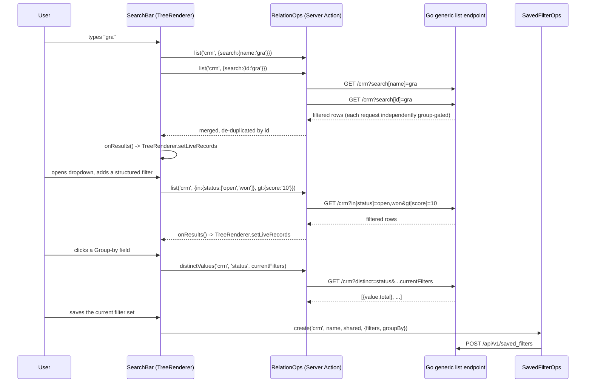
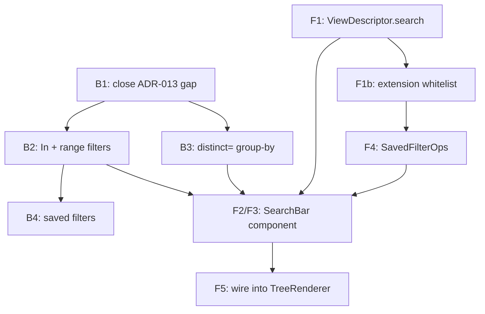

# Built-in search/filter bar — build roadmap

**Status:** ✅ Implemented (all phases below). See `docs/adr/ADR-014-search-filter-bar.md` for
the full architecture rationale — this doc is the phase-by-phase build record and the
contracts a future change to this feature should keep intact.

## Why it exists / what problem it solves

List views had no search or filtering affordance beyond one-off, per-widget autocomplete
(relation fields only). Users could not narrow a list by an arbitrary form field, group
records by a field's real distinct values, or save a filter combination for reuse. This adds
all three as **built-in chrome every list view gets automatically** — same "no opt-in"
posture as `CreateBar` and the List/Kanban/Calendar/Graph mode switcher — filtering entirely
server-side through the ORM, respecting the existing field-level group gating
(`docs/adr/ADR-013-field-level-group-gating.md`), and closing a gap that ADR named and
deliberately deferred (filter/search columns weren't group-aware).

## Architecture decisions (read first)

See ADR-014 for the full rationale behind each. Summary:

1. `Repository.checkColumn` group-gates every filter/search/in/range/distinct column — the
   ADR-013 follow-up, and the prerequisite every later decision below builds on safely.
2. Structured filters extend `ListFilter` with five more parallel maps (`In`, `GT`, `GTE`,
   `LT`, `LTE`) — not a generic operator DSL. A "between" is a `GTE` row + an `LTE` row.
3. Group-by rides the existing list endpoint via `?distinct=<column>` — not a new route,
   because a new route's literal path segment would derive its own auto-permission
   (`table:distinct:read`) no existing role has.
4. Saved filters are a dedicated Go package (`internal/savedfilter`), mirroring
   `internal/notebook` — "private OR shared" is an OR the generic repository's AND-only
   `.Where()` chain can't express, and rename/delete need an owner check.
5. Per-module customization is `ViewDescriptor.search` (plain data) + a `setDescriptor`
   whitelist widening for inheritance — not a new named-registry or extension op kind.
6. `SearchBar` mounts inside `TreeRenderer` (renderer-owned, always rendered), driving the
   SAME `liveRecords` state Kanban/Calendar already share. Live-typing reuses
   `RelationOps.list()` with up to 3 sequential debounced single-column searches — zero new
   backend surface for that leg.

## Contracts

- **`ListFilter`** (`core/orm/internal/crud/service.go`): `Page`, `PageSize`, `Equals`,
  `Matches`, `In map[string][]string`, `GT`/`GTE`/`LT`/`LTE map[string]string`. Every column
  key across every field goes through `Repository.checkColumn` before touching SQL.
- **Query string** (`GenericHandler.listFilter`): `filter[col]=`, `search[col]=`,
  `in[col]=v1,v2`, `gt[col]=`/`gte[col]=`/`lt[col]=`/`lte[col]=`, `?distinct=col` (mutually
  exclusive with pagination — returns `{"values":[{"value","total"}]}` instead of the
  paginated envelope).
- **`EntityListOptions`** (`packages/core-front/src/api/list-options.ts`): the frontend twin,
  1:1 with the query string above. `ApiClient.ts`'s `listQuery`/`distinctQuery` build it.
- **`ViewDescriptor.search?: SearchDescriptor`** (`descriptor.ts`): `liveFields?:
  {field,priority}[]`, `filterableFields?: string[]`, `groupableFields?: string[]` — every
  name validated against `fields` at registration (`validateSearchDescriptor`). Omitted ⇒
  engine defaults (a field named `"name"` then `"id"` then other text/relation fields for
  live search; every field for filterable; every selection/relation/boolean field for
  groupable) — all still per-caller group-gated via `isFieldVisible`.
- **`FilterCondition`** (`descriptor.ts`): `{field, op: FilterOperator, value?, values?}`,
  `FilterOperator = 'eq'|'contains'|'in'|'gt'|'gte'|'lt'|'lte'`. The shape a saved filter's
  `config.filters` and the dropdown's in-progress filter set both use.
- **`SavedFilterOps`** (`saved-filter-ops.tsx`): `{list, create, update, remove}`, mirroring
  `NotebookOps` exactly. `SavedFilterRecord = {id, entity, name, shared, mine, config:
  {filters, groupBy?}}`. `mine` is server-computed (`UserID === caller`), read-only from the
  frontend's perspective — the owner check is enforced independently server-side regardless.
- **`RelationOps.distinctValues?`** (`relation-ops.tsx`): optional, fail-open method the
  group-by section calls lazily (only when a group-by field is actually clicked, never on
  menu open or component mount).

## Data flow

## Phase B1 — Close the ADR-013 filter/search group-gating gap ✅ (implemented)

`TableMeta.FieldByColumn`, `Repository.checkColumn`, wired into `filterConditions` (now
`ctx`-aware). Table-driven tests: gated column + no/wrong group → `ErrUnknownColumn`; matching
group → filter applies; ungated column → zero behavior change (proves the no-op guarantee for
every pre-existing table). **DoD:** existing filter/search tests pass unmodified; new
group-gating tests pass; full `core/orm` suite green.

## Phase B2 — `In` and range filters ✅ (implemented)

`ListFilter.In`/`GT`/`GTE`/`LT`/`LTE`, `filterConditions`'s `= ANY($1)` and type-aware-cast
branches (`rangeCast`), `listFilter`'s `in[]`/`gt[]`/`gte[]`/`lt[]`/`lte[]` parsing. **DoD:**
correct SQL per operator/cast; combines with `filter[]`/`search[]` on one request (AND);
unknown/gated column → 400 for every new operator too.

## Phase B3 — Group-by via `distinct=<col>` ✅ (implemented)

`Service.DistinctValues`/`Repository.DistinctValues` (`GROUP BY` + `COUNT(*)`, reusing
`SelectBuilder.GroupBy`/`Columns`, previously unit-tested but unwired from the CRUD surface),
`scanDistinct`, the handler's `distinct=` branch (skips pagination, returns the values
envelope). **DoD:** counts correct; respects active filters; `distinctCap` (500) + ordering;
gated/unknown column → 400 (proving group-by inherits B1's gating for free).

## Phase B4 — Saved filters (`internal/savedfilter`) ✅ (implemented)

Model/repository (`ListVisible`'s OR query via `orm.Cond`)/handler, `core/modules/savedfilter`
(registration + the two-partial-index `Migrate()`), `core/modules/all` + `main.go` wiring.
**DoD:** private filter invisible to another user; shared filter visible tenant-wide;
owner-only update/delete (403 for non-owner, including on a shared row); duplicate name within
a scope → 409; migration DDL smoke-tested against a real Postgres (both indexes enforce their
respective scope, independently).

## Phase F1/F1b — `ViewDescriptor.search` + inheritance ✅ (implemented)

`SearchDescriptor`/`FilterCondition`/`FilterOperator`/`SearchFieldConfig` types,
`validateSearchDescriptor` wired into `registry.ts`'s `validateDescriptor`, `SetDescriptorOp`
whitelist widened by one key. **DoD:** registration-time error naming the field on a dangling
reference; a `setDescriptor` extension op overrides a base route's `search` block whole.

## Phase F2/F3 — `SearchBar` component ✅ (implemented)

`search-bar.tsx`: the live-search leg (sequential debounced `RelationOps.list()` calls, merged
+ de-duped by id), the Filters/Group-by/Saved-filters dropdown (a `Menu` styled on
`FormActionsMenu`'s template). `EntityListOptions` extended (`in`/`gt`/`gte`/`lt`/`lte`),
`RelationOps.distinctValues?` (optional, fail-open) + its Server Action. **DoD:** dropdown
sections render; a gated field never appears as a filter/group-by option; group-by fetches
lazily (only on field click, never on mount/menu-open); typed query clears back to the
fallback records when emptied.

## Phase F4 — `SavedFilterOps` context ✅ (implemented)

`saved-filter-ops.tsx` (mirrors `NotebookOps`'s `{list,create,update,remove}` shape exactly),
`saved-filter-actions.ts` Server Actions, `SavedFilterOpsProvider` mounted at the root layout
alongside `RelationOpsProvider`/`GraphOpsProvider`/`NotebookOpsProvider`. **DoD:** null/inert
with no provider mounted (same posture every other ops context takes); saved filters fetched
when the dropdown opens, not on `SearchBar` mount.

## Phase F5 — Wire into `TreeRenderer` ✅ (implemented)

`<SearchBar>` renders in `TreeRenderer`'s own `Box`, in the same slot as the display-mode
switcher, `onResults` wired straight into the existing `setLiveRecords`. **DoD:** no new
renderer-level state-sync code needed (Kanban/Calendar/Graph already read `liveRecords`); full
`core-front` + `apps/shell` suites green with the bar present in every existing tree-view test.

## Build order

## Pitfalls (encode them)

- **A new `/distinct` route is a permission footgun, not just a style choice.**
  `derivePermissionFromRoute` collects static path segments up to the first `:param` — a real
  new route derives its OWN auto-permission, which no existing role would have. Always extend
  the existing list route via a query param for anything that should share `table:table:read`.
- **`orm.Cond`'s placeholders always start at `$1` per condition**, not at the condition's
  final position in the combined WHERE — `Condition.rebase` shifts them based on the
  cumulative offset of everything appended before it. Writing `$2`/`$3` directly only "works"
  by coincidence (matches the final offset for a specific condition count/order) and breaks
  the moment another condition is added earlier in the chain.
- **Range filters need a type-aware SQL cast.** `Equals`/`Matches`' uniform `::text` cast is
  correct for equality/containment but silently wrong for `>`/`<` on numbers ("9" > "10" as
  text) and non-ISO dates — always route range comparisons through `rangeCast`.
- **Two independent uniqueness scopes need two partial indexes, not one compound index with a
  sentinel value.** A `coalesce(user_id, '00000000-...')`-style single index works but
  introduces a magic UUID with no other meaning in the schema; two indexes, each guarded by
  its own `WHERE shared = …`, document their scope directly.
- **The live-typed query and the structured filter dropdown are independent v1 paths** — they
  don't compose into one request. Don't assume "type then also add a filter" ANDs them
  together; whichever the user touched last is what's showing.
