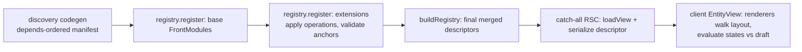
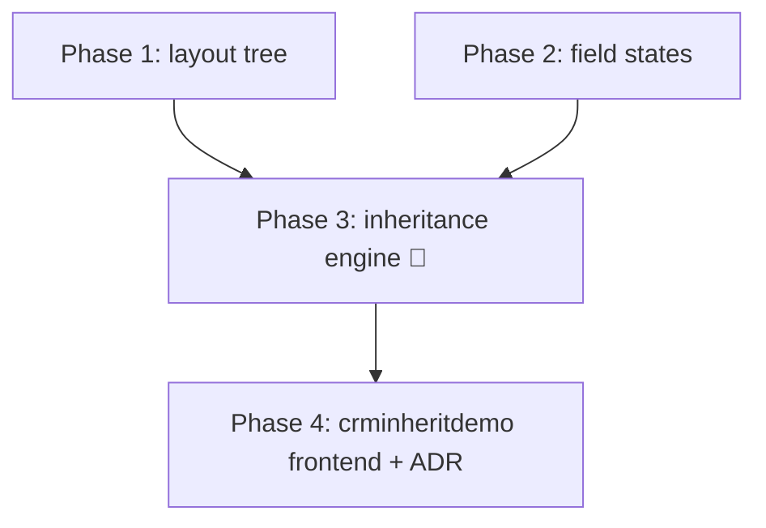

# View customization & inheritance — build roadmap

> **Goal:** make views a developer surface: a module's `.ts` view files can **create new
> views**, **inherit another module's view** to add fields or states, and **move elements**
> on it — all declaratively, without touching the base module's code. The reference model is
> Odoo's XML view inheritance, transposed to typed TS descriptors; see examples inline.

## Why it exists / what problem it solves

The backend already has this story: `crminheritdemo` embeds `crm.CRM`, re-registers the `crm`
table, and the generic API gains `date` and `comment` — the crm module is never touched. The
frontend has no equivalent: `ViewDescriptor.fields` is a flat, closed list, so today
crminheritdemo's extra columns can *exist* in the API but **cannot appear in the CRM views**
without editing `CrmViews.ts`. That breaks the module-isolation promise in the one place users
actually look. This roadmap closes the gap: view = data another module may extend, with the
same "declare, don't patch" discipline as the ORM side.

## Architecture decisions (read first)

1. **Everything stays JSON-serializable.** Descriptors cross the RSC boundary as props
   (`EntityViewServer` → client `EntityView`), so no functions, no component references —
   ever. This is the same constraint that pushed Odoo to declarative XML attributes instead
   of code: conditions and operations are **data**. States/modifiers are expression objects
   (`{ field, op, value }`), inheritance operations are tagged records.
2. **Layout becomes a tree with stable anchors.** You cannot "move an object" on a flat
   `fields[]`. The descriptor gains a layout tree (groups/rows/sections) whose nodes are
   addressed by **field name** or explicit **`id`** — the anchor an extension targets.
   Odoo's `<xpath expr="//field[@name='email']" position="after">` becomes
   `{ target: 'email', position: 'after', ... }`: same idea, no xpath — names are the paths.
3. **Inheritance resolves at registration time, renders as one plain descriptor.** The
   registry applies extensions when modules register; the catch-all route (and the client)
   only ever see a final, merged `ViewDescriptor`. Renderers, stores, and loaders need **zero**
   inheritance awareness — the refactor cost stays in the registry.
4. **Extension order = module dependency order, not luck.** Discovery currently sorts modules
   alphabetically (`crminheritdemo` > `crm` works by accident). The generated manifest must
   register modules in `module.json` `depends` topological order — the same rule the backend
   loader already implements. Deterministic, and a base is always registered before its
   extensions.
5. **Fail loud on broken anchors.** An extension targeting a field the base no longer has is
   a build-time error surfaced by the codegen/registry (with module + path + target), never a
   silently dropped operation. Odoo fails view resolution for the same reason.

## Contracts

| Concern | Contract |
| --- | --- |
| Layout | `ViewDescriptor.layout?: LayoutNode[]` — tree of `{ kind: 'group'\|'row'\|'section', id?, title?, children }` with leaf `{ kind: 'field', name }`. Omitted → the flat `fields` render as today (one implicit group): **full back-compat**. |
| Anchors | An operation targets a **field name** or a layout node **`id`**. Names are unique per view; duplicate ids are a registration error. |
| States / modifiers | `FieldDescriptor.states?: { visible?: Condition; readOnly?: Condition; required?: Condition }` with `Condition = { field, op: 'eq'\|'ne'\|'in'\|'set'\|'unset', value? }` (and `{ all: [...] } / { any: [...] }` combinators). Evaluated client-side against the draft/record. Serializable by construction. |
| View extension | `FrontModule.extends?: ViewExtension[]`; `ViewExtension = { path, operations: Operation[] }` — `path` is the base route's path (the registry's natural key). |
| Operations | `{ op: 'addField', field, target?, position?: 'before'\|'after'\|'first'\|'last' }` · `{ op: 'removeField', name }` · `{ op: 'setField', name, patch }` (label/type/required/readOnly/states) · `{ op: 'move', name\|id, target, position }` · `{ op: 'addNode', node, target, position }` · `{ op: 'setDescriptor', patch }` (formPath, createPermission, …). Applied in order, later modules after earlier ones. |
| New views | Unchanged: a route in `FrontModule.routes` (any path, any entity — including another module's). Last-wins on a duplicate path stays the **replace** escape hatch; `extends` is the surgical one. |
| Resolution | `ModuleRegistry` applies all extensions for a path at registration, memoized in `buildRegistry()`. Unknown path / unknown anchor / duplicate field ⇒ **error** naming module, path, target. |
| Ordering | Discovery emits registrations in `depends` topological order (name as tie-break). A module extending a view it doesn't `depends` on is a codegen warning. |
| i18n | New fields' labels are msgids like any other string — the extending module ships them in **its own** `i18n/*.po`. |

**Example — what crminheritdemo's views file will look like (the Odoo analogy):**

```ts
// Odoo:  <xpath expr="//field[@name='status']" position="after">
//          <field name="date"/><field name="comment"/>
//        </xpath>
const crmFormExtension: ViewExtension = {
  path: '/crm/:id',
  operations: [
    { op: 'addField', field: { name: 'date', label: 'Date', type: 'date' }, target: 'status', position: 'after' },
    { op: 'addField', field: { name: 'comment', label: 'Comment', type: 'text' } },
    { op: 'move', name: 'email', target: 'name', position: 'before' },
    { op: 'setField', name: 'comment',
      patch: { states: { visible: { field: 'status', op: 'ne', value: 'lead' } } } },
  ],
}
export default { name: 'crminheritdemo', routes: [], extends: [crmFormExtension] }
```

## Resolution flow



---

## Phase 1 — Layout tree + renderer refactor (`@eerp/core-front`)

The structural prerequisite: nothing can move until position exists.

**Claude Code prompt:**
```
In @eerp/core-front, evolve the view descriptor to a layout tree WITHOUT breaking any
existing descriptor:

descriptor.ts: LayoutNode = { kind:'group'|'row'|'section', id?, title?, children:
LayoutNode[] } | { kind:'field', name: string }. ViewDescriptor.layout?: LayoutNode[].
Everything stays JSON-serializable (RSC boundary) — enforce with a type test.
normalizeLayout(descriptor): missing layout -> one implicit group wrapping fields in
declaration order; validates every layout field name exists in fields, no duplicates,
unique node ids. Renderers (Form first, Tree columns keep using fields order) walk the
NORMALIZED tree: group -> fieldset/stack, row -> horizontal flex, section -> titled
block (titles are msgids). No renderer reads descriptor.fields directly anymore —
normalizeLayout is the single entry.
Tests: implicit-group back-compat (all current renderer tests pass untouched);
explicit layout renders grouped/row'd controls in order; validation errors name the
offending node.
```
**DoD:** every existing view (crm, contact, settings/users) renders pixel-equivalent with no
descriptor change; an explicit layout reorders/groups a form; validation messages are exact.

## Phase 2 — Declarative field states

**Claude Code prompt:**
```
In @eerp/core-front, add serializable field modifiers:
descriptor.ts: Condition = { field, op:'eq'|'ne'|'in'|'set'|'unset', value? } |
{ all: Condition[] } | { any: Condition[] }. FieldDescriptor.states?: { visible?;
readOnly?; required?: Condition }. evaluateCondition(cond, record) in a pure module —
no functions in descriptors (RSC serialization), mirror Odoo's attrs-as-data approach.
FormRenderer: visible false -> field unmounted (value preserved in draft); readOnly ->
disabled; required -> commit blocked with field error. Reevaluate on every draft
change (states react to the user's own edits, e.g. status flips comment visible).
Static FieldDescriptor.readOnly (app-store roadmap) stays and combines: static wins.
Tests: op/combinator matrix; a field toggling on a draft edit; required blocking commit.
```
**DoD:** a descriptor toggles visibility/readOnly/required off record state with zero code;
condition evaluation is pure and fully covered; serializability test guards the boundary.

## Phase 3 🔺 — Inheritance engine + dependency-ordered discovery

The core of the roadmap; registry-only (renderers untouched by design).

**Claude Code prompt:**
```
1. In @eerp/core-front src/registry/: ViewExtension { path, operations } with the
   Operation union from the contracts table (addField/removeField/setField/move/
   addNode/setDescriptor). FrontModule.extends?: ViewExtension[]. applyExtension
   (descriptor, ext) is a PURE function returning a new descriptor: operations run in
   order on the normalized layout + fields; unknown target/name/path or duplicate
   field -> throw with module, path, operation, target. registry.register applies
   extensions against already-registered routes; buildRegistry()/match() serve the
   merged result. Registration-order semantics: extensions apply after the base and
   after earlier modules' extensions.
2. In apps/shell scripts/module-discovery.mjs: order discovered modules by module.json
   `depends` topological order (cycle -> build error), name as tie-break — same rule
   as the Go loader. Emit a codegen WARNING when a module extends a path owned by a
   module it does not declare in depends.
Tests: each operation on a fixture view; op order matters; extension over an extended
view (A extends B extends base); every failure mode's message; discovery emits
dependency order for a diamond depends graph.
```
**DoD:** a second module reshapes a base view (add/move/patch/state) without the base
changing; broken anchors fail the build with actionable messages; manifest order is
dependency-driven and deterministic.

## Phase 4 — crminheritdemo frontend + docs (the proof)

**Claude Code prompt:**
```
Give core/modules/crminheritdemo a frontend, mirroring its backend inheritance:
- module.json: add static_files.views ["CrmInheritViews.ts"] (module already has
  depends: ["crm"]).
- package.json/tsconfig mirroring core/modules/contact.
- views/CrmInheritViews.ts: DESCRIPTORS ONLY — no routes; extends '/crm/:id' and
  '/crm/list' with: addField date (type 'date') after status; addField comment;
  move email before name; a state hiding comment while status == 'lead'
  (the example in docs/roadmaps/view-customization.md is normative).
- views/CrmInheritViews.test.ts: the extension wiring; plus a registry-level test
  asserting the RESOLVED '/crm/:id' descriptor contains date/comment at the right
  positions with the state attached.
Docs in the same task: core-front/CLAUDE.md — layout tree, states, extension contract
under the Module FE contract; new ADR "Frontend view inheritance" (why registration-
time resolution, why serializable operations instead of component overrides — the
Odoo-attrs analogy, why depends-ordered registration). Update CONVENTIONS.md.
```
**DoD:** with crminheritdemo active, CRM's form shows `date` + `comment` (backed by the
extended table — end-to-end module inheritance, Go to pixels) and `comment` hides on leads;
deactivating crminheritdemo restores the stock CRM view on rebuild; docs + ADR merged.

---

## Build order



Phases 1 and 2 parallelize. Phase 3 needs both (operations manipulate the layout; `setField`
patches states). Phase 4 is deliberately a descriptors-only folder — if it needs more, the
engine has a gap; fix it in Phases 1–3, not in the module.

## Coordination

- The **app-store roadmap** (`docs/roadmaps/app-store.md`) also touches `descriptor.ts`
  (static `readOnly`, `catalog` view type). Land whichever ships first; the other rebases —
  static `readOnly` composes with Phase 2 states (static wins), and `catalog` renderers adopt
  `normalizeLayout` like the others.
- V2 runtime module discovery (frontend CLAUDE.md) is unaffected: extensions are data on the
  same `FrontModule` contract, so runtime-loaded bundles inherit identically.

## Pitfalls (encode them)

- **No functions in descriptors, ever** — they cross the RSC boundary. Every "dynamic" need
  becomes a declarative expression (that is *the* lesson to copy from Odoo's XML, not its
  syntax).
- **Alphabetical registration order is a landmine** — `crminheritdemo` > `crm` only by
  coincidence. Dependency-ordered manifests (Phase 3.2) are a prerequisite for correctness,
  not polish.
- **Extension columns on another module's table must be nullable (pointer fields).** A
  non-pointer field registers and migrates as `NOT NULL`, which makes it *required on every
  create of the base table* — the generic handler 422s every writer that doesn't know the
  extension exists, the base module's own form included. Pinned by
  `crminheritdemo`'s `TestExtensionColumnsAreNullable`.
- **Extensions target paths, so path changes are breaking changes.** Renaming a base route
  breaks extenders at build time (loudly — that is the design); note it in the base module's
  changelog discipline.
- **Don't resolve inheritance in renderers.** The merged-descriptor invariant is what keeps
  stores/loaders/renderers simple; the moment a renderer inspects `extends`, the design has
  failed.
- Removing a field a state references must fail validation (dangling condition), same as a
  broken anchor.
