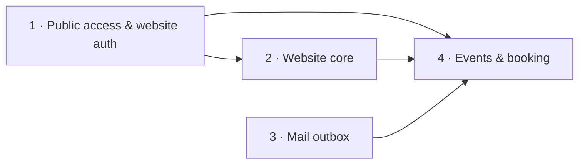

# Website — overview and decomposition

**Date:** 2026-09-29 · **Status:** draft, awaiting review

## Intent
Give an EERP workspace a public website served by default, while the ERP stays reachable.
Visitors browse published data (products from `product_variant`, events, any published
table › field), book event sessions or appointment slots with an email address, and may open a
website-only account that keeps their booking history. Staff build pages by drag and drop with
a live preview, and manage events, availability, bookings and website users from a **Website**
app inside the ERP.

## Decisions taken during brainstorming
| Question | Decision |
|---|---|
| Who decides what is public | Modules declare the public-capable fields, admins publish a subset; Go enforces the intersection |
| Page building | Page records with a closed set of block types, laid out in a drag-and-drop grid editor whose canvas is the live preview |
| Routing | Site at `/`, ERP at `/app` by default; an admin setting switches to host-based routing (`site_host` / `erp_host`) with nginx + certificates |
| Booking identity | Anonymous booking with a mandatory email; optional website-only account; roles `website_anonymous`, `website_user`, `website_admin` |
| Email | SMTP via `net/smtp` through a transactional outbox; Mailpit in dev |
| Bookable dates | Both: events with sessions (capacity) and appointment slots from weekly availability |

## Assumptions (correct in review if wrong)
- No cart or payment. Prices are displayed only if published; booking is free.
- One site per database; the site uses the workspace's i18n catalogs.
- One email cannot be both an ERP user and a website user in v1.

## Sub-projects, in build order

| # | Spec | Delivers |
|---|---|---|
| 1 | [public-access](2026-09-29-website-1-public-access-design.md) | `WithPublicFields`, published-data settings, `/api/v1/public/*`, JWT `aud`, website users, three roles — see [ADR-024](../../adr/ADR-024-public-access-and-website-identities.md) |
| 2 | [website-core](2026-09-29-website-2-core-design.md) | `website` module, pages + blocks, grid editor, public rendering, ERP under `/app`, path/host routing, nginx |
| 3 | [mail-outbox](2026-09-29-website-3-mail-outbox-design.md) | `internal/mail`, SMTP sender, Mailpit |
| 4 | [events-booking](2026-09-29-website-4-events-booking-design.md) | `event` module, sessions, appointments, public booking, confirmation/cancel/verification emails, "My bookings" |

The product catalog is not its own project: it is a `record_list`/`record_detail` block bound to
`product_variant` once `sale`/`warehouse` declare their public fields (spec 1, "Initial
declarations").

Each spec gets its own implementation plan. Specs 2 and 3 can run in parallel after spec 1.
