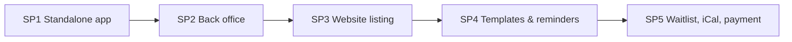

# Event v2 — overview and decomposition

**Date:** 2026-10-06 · **Status:** approved design · **Builds on:**
[Spec 4 — Events and booking](2026-09-29-website-4-events-booking-design.md) (v1, implemented),
[ADR-026](../../adr/ADR-026-booking-capacity.md)

## Intent
Events are managed from inside the ERP as an application of their own — the **Event app** —
rather than as a submenu of Website. On top of v1 (sessions, computed appointment slots,
overbooking-safe seat capture, confirmation emails, website booking blocks), v2 adds a real back
office (check-in, calendars, dashboard), a public event listing, translated and editable emails
with reminders, a waiting list, iCal export, and invoicing with optional online payment.

v1's data model, seat-capture logic and website booking blocks are kept and extended, never
rewritten.

## Decisions taken during brainstorming
| Topic | Decision |
|---|---|
| Website dependency | `event` keeps `depends: [website]` (public routes, blocks, visitor accounts live there); adds `sale` in SP5 |
| App shape | `app_mode: true`, icon `calendar-days`, routes under `/event…`; menus Events / Sessions / Bookings / Configuration → Availability |
| Old `/website/events…` pages | removed outright, no redirects (dev-stage project); Go API paths unchanged |
| Check-in | booking `status` gains `attended` / `no_show`; seat stays taken |
| Bookings calendar | stored `event_booking.starts_at`, kept in sync when a session moves, backfilled once |
| View modes | sessions calendar, bookings calendar, bookings kanban by status, events kanban by kind — preconfigured |
| Dashboard | seeded Graph-mode tiles (written only when absent); fill rate is plotted per week on sessions (a Graph tile can't group by an event's name) |
| Website listing | dedicated `event_list` block + `GET /api/v1/public/events/upcoming` |
| Event detail page | one generic `/<slug>/<id>` page; booking blocks read the event id from the URL when unset |
| Reminders | workspace setting `events.reminder_hours` (default 24, 0 = off), one reminder per booking |
| Email language | account `preferred_locale`, else workspace default, else English |
| Email texts | core `internal/mail` templates `(tenant, key, locale)`, editable in the ERP |
| Template format | `{{var}}` substitution only (declared variables), HTML body via a new `html` WYSIWYG widget, text part derived |
| Waiting list | sessions only; first in line gets a time-limited claim link |
| iCal | per-booking `.ics`, public event feed, private staff feed |
| Payment | Stripe Checkout through a separate `payment_stripe` module + Settings → Integrations; when not connected, bookings confirm immediately and are paid at the event |
| Invoicing | every priced booking creates a sale invoice at booking; price and tax from the event's sale product variant |

## Sub-projects, in build order
Each gets its own spec section below, its own plan, and is shippable alone.

### SP1 — Standalone Event app
- `module.json`: `app_mode: true`, `menu_icon: calendar-days`.
- Routes: `/event` (event list) → `/event/:id`, `/event/sessions` → `/event/sessions/:id`,
  `/event/bookings` → `/event/bookings/:id`, `/event/availability` → `/event/availability/:id`.
  Tree routes produce their top-bar menus automatically; Availability is `hideFromTopBar` and
  registered under the module's Configuration menu instead.
- The Website → Events menu and every `/website/events…` ERP page are removed.
- Frontend + `module.json` + docs only: Go routes and permissions don't change.

### SP2 — Back office
- `event_booking.status`: `confirmed` → `attended` | `no_show` | `cancelled` (PUT override
  accepts only these transitions; attended/no_show only from 1 h before the start). Header
  buttons "Check in" / "No show".
- `event_booking.starts_at` (timestamptz): written by the booking service (session start or
  `slot_start`); a session's start edit re-syncs its bookings right after the generic update
  commits; every boot's `Migrate` backfills and heals drift (a trigger would bypass the Redis
  cache invalidation — see ADR-026's addendum).
- Kanban/calendar/graph availability ships as the list descriptors' `viewModeDefaults` (no
  seeding). Graph layouts `views.event_booking.graph` (bookings, seats, seats per week by
  status, attendance pie) and `views.event_session.graph` (average and weekly fill rate via the
  `calc_fill_rate` calculated field) are seeded per company only where absent.
- Attendance statuses keep their seats; a checked-in booking can't be cancelled (409);
  attended ↔ no_show can be corrected.

### SP3 — Website listing
- `event` gets a `picture` (pictures widget), publishable.
- `GET /api/v1/public/events/upcoming` → published events with next session start, seats left,
  picture flag; appointment events flagged "book a slot".
- Block `event_list` (`display: list|cards`, `limit`, `detail_slug`), added to Go's
  `BlockTypes` and the site renderer/editor.
- `event_booking` / `appointment_booking` blocks: unset `event_id` = the id from `/<slug>/<id>`;
  each renders only for an event of its own kind.
- As built: the route takes the `event` table's public resolver, so it 404s while events are
  unpublished and returns only published columns; the editor previews a URL-driven booking block
  with the first published event of its kind; a Go test keeps `BlockTypes` equal to the
  frontend's `BLOCK_TYPES`.

### SP4 — Email templates, languages, reminders
- `internal/mail`: `mail_template` table `(tenant_id, key, locale)` unique; `subject`,
  `body_html` (sanitized allowlist); text part derived from the HTML at send time.
  `mail.RegisterTemplate(key, vars, defaults)` declares a key's variables and default texts per
  locale; `mail.Render(ctx, key, locale, vars)` falls back to the stored default, then English.
  Unknown `{{var}}` rejected on save; values HTML-escaped in the HTML part.
- Settings → Email templates (list/form), linked from Event → Configuration.
- New reusable `html` field widget (Tiptap), sanitized server-side.
- Keys: `event.booking_confirmed`, `event.booking_reminder`, `event.booking_cancelled`,
  `event.waitlist_offer` (SP5), and `website.verify_email` migrated onto templates.
- Locale: account `preferred_locale` → workspace `i18n.default_locale` → `en`.
- `events.reminder_hours` setting; a 5-minute sweep in `App.Run` enqueues reminders for
  confirmed bookings starting within the window and stamps `event_booking.reminder_sent_at`.
- New ADR: core mail templates ([ADR-027](../../adr/ADR-027-mail-templates.md)).
- As built: templates are edited on a hand-built Settings → Email templates page (catalog +
  overrides over `/api/v1/settings/mail_templates`), not the generic CRUD surface, since saves
  must be sanitized and validated; the reminder delay lives in `events.settings`
  (`/api/v1/settings/events`), shown on Settings → Apps → Events; emails stamp dates with
  built-in English/French day and month names.

### SP5 — Waiting list, iCal, invoicing, payment
- **Waiting list:** status `waitlisted` (no seat); on any seat release, the oldest fitting entry
  gets an offer email with a claim link valid `events.waitlist_claim_hours` (default 12); claim
  books through the service (409 if taken); expired offers pass on (sweep).
- **iCal:** `.ics` attached to confirmation (stable UID, updated/cancelled with the booking),
  downloadable from My bookings; `GET /api/v1/public/event/:id/calendar.ics`; staff feed by
  per-user secret token (regenerable in preferences).
- **Invoicing:** `event.product_variant_id`; session `price` becomes an optional unit-price
  override. A priced booking creates a sale invoice (one line, event × seats) in the booking
  transaction; cancelling cancels the unpaid invoice. `event` depends on `sale`.
- **Payment:** core `internal/payment` provider registry. Module `payment_stripe` registers
  Stripe; *connected* = module active AND keys set in Settings → Integrations → Stripe
  (`app_settings`, never sent to the browser). Connected: seat held as `pending_payment` for
  15 min, Stripe Checkout, webhook confirms + marks invoice paid, expiry releases the seat. Not
  connected: confirmed immediately, email says "pay at the event", invoice stays `sent`, check-in
  shows "unpaid". Refunds manual.
- New ADR: payment provider registry ([ADR-028](../../adr/ADR-028-payment-providers.md)).
- As built: the payment hold is **30 minutes** (Stripe's minimum Checkout expiry); "Mark paid"
  sets the booking's `paid_at` through its PUT (module header buttons can only change their own
  record); public sessions show the tax-included price and the workspace currency; the `.ics`
  uses PUBLISH/CANCEL (no organizer); the staff feed lives at `/api/v1/calendar/<token>.ics` and
  is managed from Settings → Account; mail attachments are a new `mail_outbox.attachments`
  column.

## Out of scope for v2
Automated refunds, waiting lists for appointment slots, staff assignment per appointment,
multiple reminders per booking.

## Changes after review
- **Every booking has a native contact** (supersedes v1's "contacts are accounts only"): the
  account's website contact, else one found or created by email, for anonymous and staff
  bookings too; the contact form shows the person's bookings (Bookings tab). The invoice's
  customer is that contact.
- **Check-in buttons show only once check-in is open** (1 h before the start), through a new
  generic `before_now`/`after_now` condition in the engine's states DSL.
- Saving an event with an empty buffer (sent as null) is accepted.

